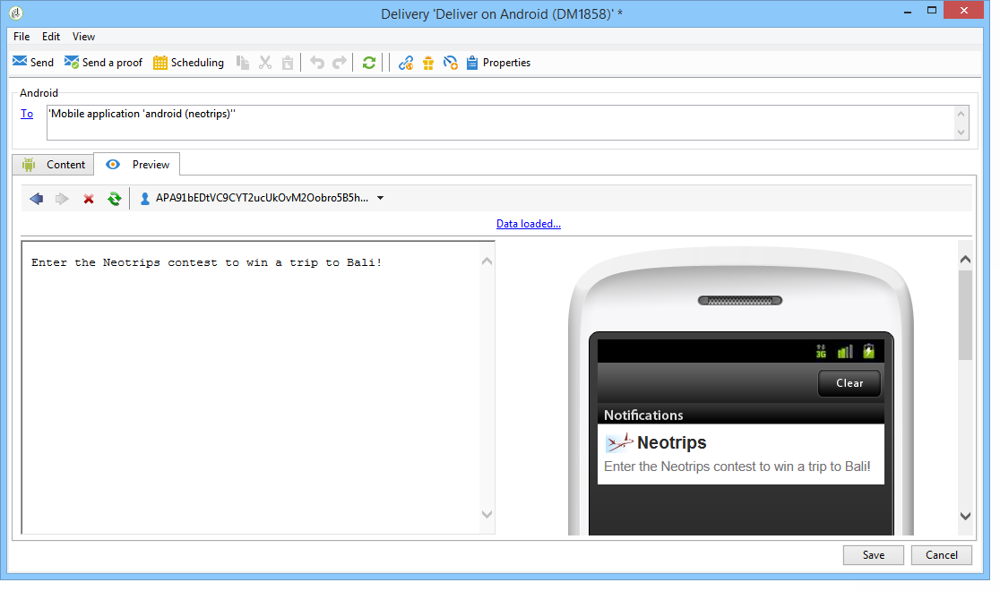
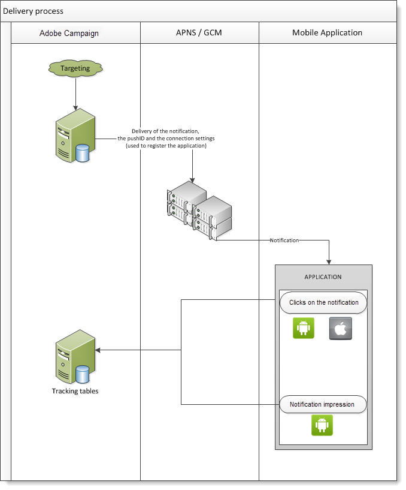

# Guida introduttiva al canale app mobile{#about-mobile-app-channel}

**Canale app mobile** consente di utilizzare la piattaforma Adobe Campaign per inviare notifiche push personalizzate ai terminali iOS e Android tramite app.

Sono disponibili due canali di consegna:

* Canale iOS che consente di inviare notifiche ai dispositivi mobili Apple.

  

* Canale Android che consente di inviare messaggi di dati a dispositivi mobili Android.

  

  >[!IMPORTANT]
  >
  >Alcune importanti modifiche al servizio Android Firebase Cloud Messaging (FCM) verranno rilasciate nel 2024 e potranno influenzare la tua implementazione di Adobe Campaign. Per supportare questa modifica, potrebbe essere necessario aggiornare la configurazione dei servizi di abbonamento per i messaggi push Android. Puoi già verificare ed eseguire azioni. Per ulteriori informazioni, consulta questa [nota tecnica su Adobe Campaign v8](https://experienceleague.adobe.com/docs/campaign/technotes-ac/tn-new/push-technote.html?lang=it){target="_blank"}.

Corrispondente a questi due canali, nei flussi di lavoro delle campagne sono presenti due attività di consegna. Per la messaggistica transazionale sono disponibili anche due modelli di messaggi transazionali.


È possibile definire il comportamento dell’applicazione per quando l’utente attiva la notifica per visualizzare la schermata che corrisponde al contesto dell’applicazione. Ad esempio:

* Al cliente viene inviata una notifica per comunicare che il pacco è uscito dal magazzino. L’attivazione della notifica apre una pagina contenente informazioni relative alla consegna.
* L’utente ha aggiunto degli articoli al carrello, ma ha lasciato l’applicazione senza completare l’acquisto. Viene inviata una notifica per informarli che il carrello è stato abbandonato. Quando viene attivata la notifica, l’elemento viene visualizzato sullo schermo.

>[!CAUTION]
>
>* È necessario assicurarsi che le notifiche inviate a un’app mobile siano conformi ai prerequisiti e alle condizioni specificati da Apple (Apple Push Notification Service) e Google (Firebase Cloud Messaging).
>* Avvertenza: in alcuni paesi, la legge richiede che tu informi gli utenti del tipo di dati raccolto dalle app mobili e dello scopo del loro trattamento. Dovete controllare la legislazione.

Il flusso di lavoro **[!UICONTROL NMAC opt-out management]** (mobileAppOptOutMgt) aggiorna gli annullamenti degli abbonamenti alle notifiche sui dispositivi mobili. Per ulteriori informazioni su questo flusso di lavoro, consulta [elenco dei flussi di lavoro tecnici](../../workflow/using/about-technical-workflows.md).

Adobe Campaign è compatibile con i numeri APN HTTP/2. Per ulteriori dettagli sui passaggi di configurazione, consulta la sezione [questa sezione](configuring-the-mobile-application.md).

Per informazioni globali su come creare una consegna, consulta [questa sezione](steps-about-delivery-creation-steps.md).


## Configurare il canale di notifica push {#push-notification-configuration}

Per inviare notifiche push con Adobe Campaign, devi prima configurare l’ambiente e l’app. Prima di iniziare a inviare notifiche push con Adobe Campaign, è necessario assicurarsi che le configurazioni e le integrazioni siano attive nell’app mobile e per i tag in Adobe Experience Platform. L’SDK di Adobe Experience Platform Mobile fornisce API di integrazione lato client per i dispositivi mobili tramite SDK compatibili con Android e iOS. La configurazione degli SDK viene gestita tramite l’interfaccia utente di raccolta dati, per un’impostazione flessibile e integrazioni estensibili basate su regole. Ulteriori informazioni sono disponibili nella [documentazione di Adobe Campaign v8](https://experienceleague.adobe.com/it/docs/campaign/campaign-v8/send/push/push-settings).


## Percorso dati {#data-path}

Gli schemi seguenti descrivono i passaggi che consentono a un’app mobile di scambiare dati con Adobe Campaign. Questo processo coinvolge tre entità:

* l&#39;app mobile
* il servizio di notifica: APN (Apple Push Notification Service) per Apple e FCM (Firebase Cloud Messaging) per Android
* Adobe Campaign

I tre passaggi principali del processo di notifica sono: registrazione dell’applicazione in Adobe Campaign (raccolta degli abbonamenti), consegne e tracciamento.

### Passaggio 1: raccolta di abbonamenti {#step-1--subscription-collection}

L’app mobile viene scaricata dall’utente da App Store o da Google Play. Questa applicazione contiene le impostazioni di connessione (certificato iOS e chiave di progetto per Android) e la chiave di integrazione. La prima volta che l’applicazione viene aperta (a seconda della configurazione), all’utente può essere richiesto di inserire le informazioni di registrazione (ad @userKey: e-mail o numero di account). Allo stesso tempo, l’applicazione richiede al servizio di notifica di raccogliere un ID di notifica (ID push). Tutte queste informazioni (impostazioni di connessione, chiave di integrazione, identificatore di notifica, userKey) vengono inviate ad Adobe Campaign.


### Passaggio 2: consegna {#step-2--delivery}

Gli addetti al marketing eseguono il targeting degli abbonati all’applicazione. Il processo di consegna invia le impostazioni di connessione al servizio di notifica (certificato iOS e chiave di progetto per Android), all’ID notifica (ID push) e al contenuto della notifica. Il servizio di notifica invia notifiche ai terminali di destinazione.

In Adobe Campaign sono disponibili le seguenti informazioni:

* Solo per Android: numero di dispositivi che hanno visualizzato la notifica (impression)
* Android e iOS: numero di clic sulla notifica



Il server Adobe Campaign deve essere in grado di contattare il server APNs sulla porta 443 per il connettore iOS HTTP/2.

Per verificare che funzioni correttamente, utilizza i seguenti comandi:

* Per i test:

  ```
  api.development.push.apple.com:443
  ```

* In produzione:

  ```
  api.push.apple.com:443
  ```

Con il connettore iOS HTTP/2, l’MTA e il server web devono essere in grado di contattare gli APN sulla porta 443.

Se devi utilizzare il connettore iOS HTTP/2 tramite un proxy, fai riferimento a questa [pagina](../../installation/using/file-res-management.md#proxy-connection-configuration).
