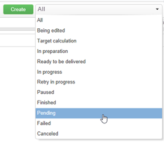
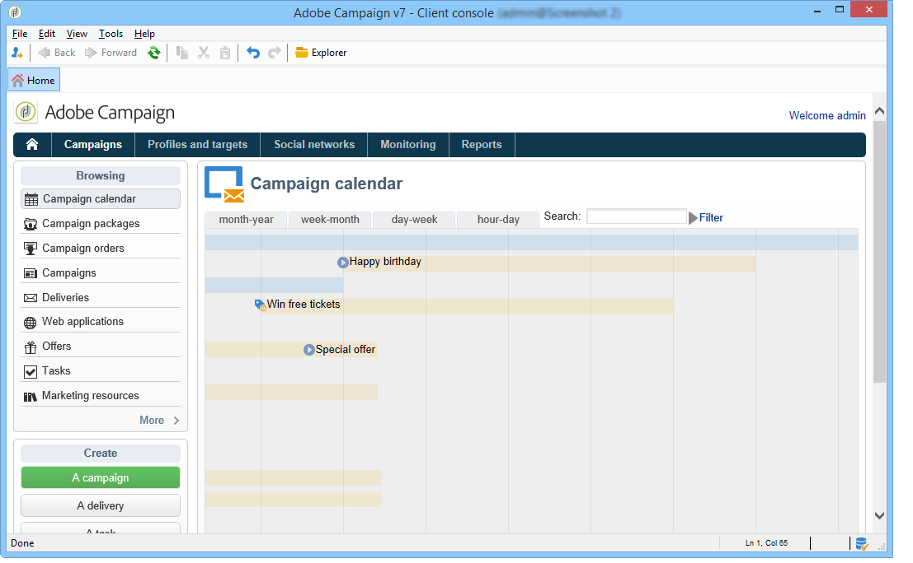
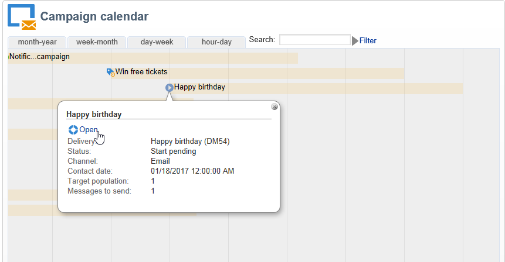

# Accesso alle informazioni sulle consegne{#accessing-deliveries-information}

## Accesso all&#39;elenco delle consegne {#accessing-the-list-of-deliveries}

Per accedere all&#39;elenco delle consegne, vai all&#39; **[!UICONTROL Campaigns]** universo e fai clic sul **[!UICONTROL Deliveries]** collegamento.

Se si utilizza [la visualizzazione](../../platform/using/adobe-campaign-workspace.md#about-adobe-campaign-explorer)Esplora risorse, è possibile accedere a tutte le consegne tramite il **[!UICONTROL Campaign management > Deliveries]** nodo nella struttura ad albero.

>[!NOTE]
>
>L&#39;area di lavoro di Adobe Campaign è presentata in [questa sezione](../../platform/using/adobe-campaign-workspace.md).

Questa pagina consente di accedere a una vista generale delle consegne: visualizza tutte le consegne nel database. Puoi visualizzarne lo stato, la percentuale di successo e le date di modifica.

>[!NOTE]
>
>Il filtraggio delle informazioni viene presentato in [questa sezione](../../platform/using/filtering-options.md).

La procedura guidata di consegna consente di configurare le consegne, avviare il processo di approvazione e inviare i messaggi. Il contenuto della procedura guidata dipende dal canale di comunicazione (e-mail, mobile, push, direct mail) e dai diritti dell&#39;operatore.

Per manipolare le consegne nell&#39;elenco, fare clic su una consegna. Si apre in una nuova finestra e potete confermare la consegna o mettere in pausa, ad esempio.

A seconda della fase del ciclo di consegna, i principali stati possibili sono:

* Annullato
* Operazione non riuscita
* In sospeso
* Completato
* In pausa
* Riprova in sospeso
* In corso
* Pronto per la consegna
* Preparazione in corso
* Calcolo di Target
* In corso di modifica

Ogni stato ha un proprio colore ed etichetta.

L&#39;elenco a discesa accanto al **[!UICONTROL Create]** pulsante consente di filtrare le consegne in base al loro stato.

## Accesso al calendario di consegna {#accessing-the-delivery-calendar}

Per accedere al calendario di consegna, vai all&#39; **[!UICONTROL Campaign]** universo e fai clic sul **[!UICONTROL Campaign calendar]** collegamento. Questo calendario visualizza la suddivisione delle campagne nel tempo. Potete personalizzare lo schermo per mese, settimana o giorno.

Fate clic sul nome di una consegna per visualizzarne le informazioni principali. Se necessario, potete anche aprire la campagna facendo clic su **[!UICONTROL Open]**.

## Accesso alle informazioni sul throughput delle consegne {#accessing-deliveries-throughput-information}

Le informazioni sulla **[!UICONTROL Delivery throughput]** pagina riguardano tutte le consegne della piattaforma. Per misurare la velocità di invio dei messaggi, i criteri sono il numero di messaggi inviati all&#39;ora e la dimensione dei messaggi (in bit al secondo). Nell&#39;esempio seguente, il primo grafico mostra le consegne riuscite in blu e il numero di consegne errate in arancione.

È possibile scegliere lo slot di tempo per il quale viene calcolata la velocità effettiva. A questo scopo, selezionare il valore dall&#39;elenco a discesa, quindi fare clic **[!UICONTROL Refresh]**.

>[!NOTE]
>
>Per le installazioni ospitate o ibride, se avete effettuato l’aggiornamento all’MTA avanzato, la **[!UICONTROL Delivery throughput]** pagina non visualizzerà più il throughput ai destinatari delle e-mail. Verrà mostrata la velocità effettiva per il inoltro dei messaggi da Campaign all&#39;MTA avanzato.
>
>Per ulteriori informazioni sull&#39;MTA avanzata di Adobe Campaign, consulta questo [documento](https://helpx.adobe.com/campaign/kb/acc-campaign-enhanced-mta.html).