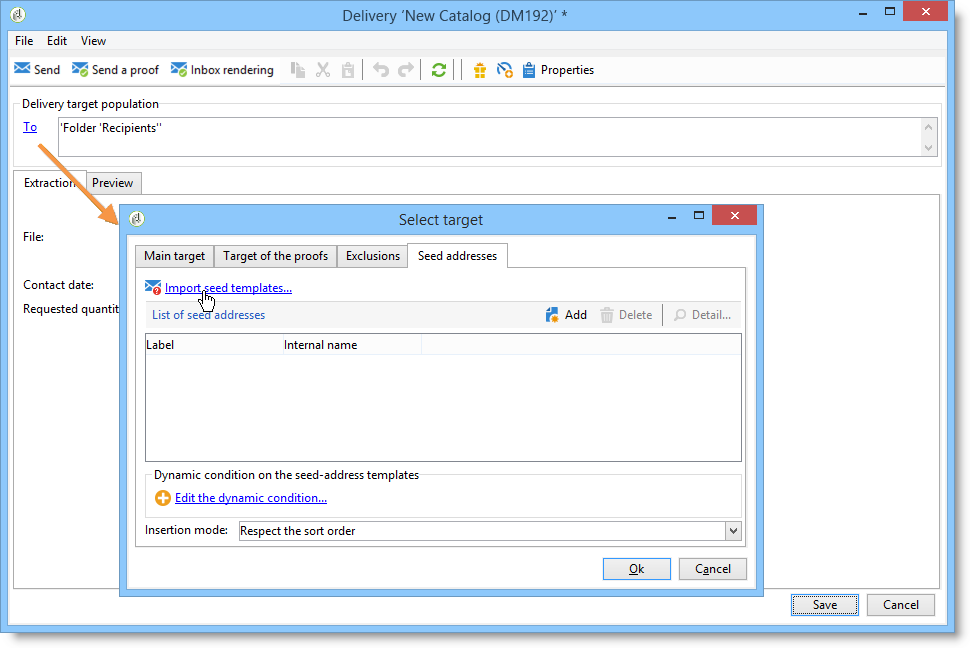

# Aggiungere indirizzi seed{#adding-seed-addresses}

## Indirizzi seed in una consegna {#seed-addresses-in-a-delivery}

Per aggiungere indirizzi di seed specifici per una consegna, fai clic sul collegamento **[!UICONTROL To]**, quindi seleziona la scheda **[!UICONTROL Seed addresses]**.

Sono disponibili tre modalità di inserimento:

1. Inserimento di indirizzi seed singoli.

   A tale scopo, fare clic sul pulsante **[!UICONTROL Add]** e definire il contenuto dei campi indirizzo. Ripeti per ogni indirizzo.

1. Importazione di modelli di indirizzo e loro adattamento in base alle esigenze.

   A tale scopo, fare clic sul collegamento **[!UICONTROL Import seed templates...]** e selezionare la cartella contenente i modelli di indirizzo. Per ulteriori informazioni al riguardo, consulta [questa sezione](creating-seed-addresses.md#creating-seed-address-templates).

   Se necessario, una volta aggiunti, è possibile fare doppio clic su di essi o fare clic sul pulsante **[!UICONTROL Detail...]** per adattare il contenuto di ciascun indirizzo.

1. Creazione di una condizione per la selezione dinamica degli indirizzi di controllo da inserire.

   A tale scopo, fare clic sul collegamento **[!UICONTROL Edit the dynamic condition...]**, quindi immettere i parametri di selezione dell&#39;indirizzo di seed. Ad esempio, puoi includere tutti gli indirizzi seed contenuti in una cartella specifica o gli indirizzi seed appartenenti a un reparto specifico della tua organizzazione.

   Un esempio è presentato in questa sezione: [Caso d&#39;uso: selezionare gli indirizzi seed in base ai criteri](use-case-selecting-seed-addresses-on-criteria.md).

>[!NOTE]
>
>Questa opzione viene utilizzata quando la tabella dei destinatari utilizzata non è la tabella predefinita **nms:recipient** e si utilizza la funzionalità di rendering della casella in entrata fornita con il modulo **[!UICONTROL Deliverability]** di Adobe Campaign.
>
>Per ulteriori informazioni, consulta [Utilizzare una tabella dei destinatari esterna](using-an-external-recipient-table.md) e la documentazione sul [rendering della casella in entrata](inbox-rendering.md).

Per le consegne, puoi anche personalizzare il modo in cui gli indirizzi vengono inseriti nel file di estrazione. Per impostazione predefinita, vengono inserite nell’ordine di ordinamento del file di output, ma puoi scegliere di inserirle alla fine o all’inizio del file oppure in modo casuale tra i destinatari del target principale.

## Indirizzi seed in una campagna {#seed-addresses-in-a-campaign}

Per aggiungere indirizzi di seed a una destinazione per una campagna, selezionare l&#39;operazione e fare clic sulla scheda **[!UICONTROL Edit]**.

Fare clic sul collegamento **[!UICONTROL Advanced campaign settings...]** e quindi sulla scheda **[!UICONTROL Seed addresses]**, come illustrato di seguito:

Gli indirizzi di seed inseriti dalla campagna verranno aggiunti al target di ogni consegna nella campagna.
