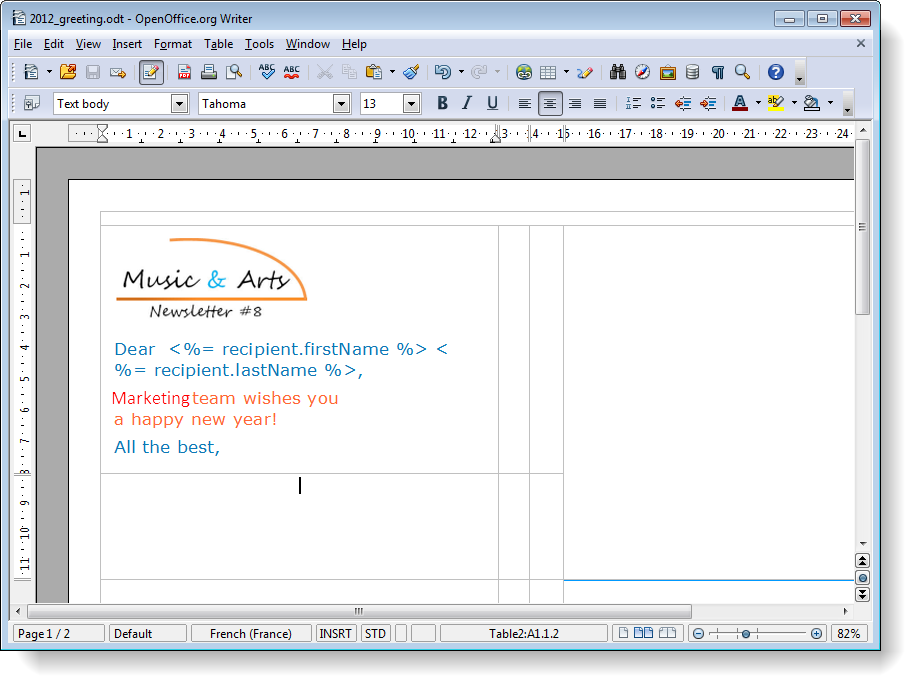

# Associazione di file{#attaching-files}

## Informazioni sugli allegati e-mail {#about-email-attachments}

Potete allegare uno o più file a una consegna e-mail. Esistono due casi possibili:

* Selezionare un file e allegarlo alla consegna così come è.
* Personalizza il contenuto dell&#39;allegato per ciascun destinatario. In questo caso, è necessario creare un allegato **** calcolato: il nome dell&#39;allegato viene calcolato al momento della consegna per ciascun messaggio, a seconda del destinatario. Se disponete dell&#39;opzione Stampa **digitale** variabile, i contenuti possono essere personalizzati e convertiti in formato PDF al momento della distribuzione.

>[!NOTE]
>
>Questo tipo di configurazione viene generalmente eseguito nei modelli di consegna. For more on this, refer to [About templates](../../delivery/using/about-templates.md).

## Collegamento di un file locale {#attaching-a-local-file}

Per allegare un file locale a una consegna, procedere come segue.

>[!NOTE]
>
>Potete allegare più file a una consegna. Gli allegati possono essere in qualsiasi formato, incluso in formato compresso.

1. Fate clic sul **[!UICONTROL Attachments]** collegamento.
1. Fate clic sul **[!UICONTROL Add]** pulsante.
1. Fare clic **[!UICONTROL File...]** per selezionare il file da allegare alla consegna.

   

È inoltre possibile trascinare e rilasciare il file direttamente nel **[!UICONTROL Attachments]** campo di consegna, oppure utilizzare l&#39; **[!UICONTROL Attach]** icona dalla barra degli strumenti della procedura guidata di consegna,

Una volta selezionato, il file viene caricato immediatamente sul server per essere disponibile al momento della consegna. È elencata nel **[!UICONTROL Attachments]** campo.

## Creazione di un allegato calcolato {#creating-a-calculated-attachment}

Quando si crea un allegato calcolato, il nome dell&#39;allegato può essere calcolato durante l&#39;analisi o la consegna di ciascun messaggio e può dipendere dal destinatario. Può anche essere personalizzato e convertito in PDF.

Per creare un allegato personalizzato, procedere come segue:

1. Fate clic sul **[!UICONTROL Attachments]** collegamento.
1. Fate clic sul **[!UICONTROL Add]** pulsante, quindi selezionate **[!UICONTROL Calculated attachment]**.
1. Selezionare il tipo di calcolo dall&#39;elenco a **[!UICONTROL Type]** discesa:

Sono disponibili le seguenti opzioni:

* **Nome file specificato durante la creazione del modello di consegna**
* **Il contenuto del file viene personalizzato e convertito in PDF durante la distribuzione di ciascun messaggio**
* **Il nome del file viene calcolato durante l&#39;analisi della consegna (non può dipendere dal profilo del destinatario)**
* **Il nome del file viene calcolato al momento della consegna per ciascun destinatario (può dipendere dal destinatario)**

### Collegamento di un file locale {#attach-a-local-file}

Se l&#39;allegato è un file locale, selezionare l&#39;opzione: **[!UICONTROL File name is specified when creating the delivery template]**. Il file viene selezionato localmente e caricato sul server. Effettuate le seguenti operazioni:

1. Selezionate il file da caricare nel **[!UICONTROL Local file]** campo.
1. Se necessario, specificate l’etichetta. L&#39;etichetta sostituisce il nome del file quando viene visualizzato nei sistemi di messaggistica. Se non viene specificato nulla, per impostazione predefinita viene utilizzato il nome del file.

   

1. Se necessario, selezionare **[!UICONTROL Upload file on the server]**, quindi fare clic **[!UICONTROL Update on server]** per avviare il trasferimento.

   

   Il file è quindi disponibile sul server per essere allegato alle diverse consegne create da questo modello.

### Collegamento di un messaggio personalizzato {#attach-a-personalized-message}

L’opzione **[!UICONTROL The file content is personalized and converted into PDF format at the time of delivery for each message]** consente di selezionare un file con campi di personalizzazione, ad esempio il cognome e il nome del destinatario desiderato.

Per questo tipo di allegato, eseguire i seguenti passaggi di configurazione:

1. Selezionate il file da caricare.

   >[!NOTE]
   >
   >Il file di origine deve essere creato in LibreOffice. L&#39;istanza deve essere configurata in base ai prerequisiti descritti in [questa sezione](../../installation/using/before-starting.md).

1. Se necessario, specificate l’etichetta.
1. Selezionare **[!UICONTROL Upload file on the server]**, quindi fare clic **[!UICONTROL Update on server]** per avviare il trasferimento.
1. Potete visualizzare un’anteprima. A tal fine, selezionare un destinatario.

   

1. Analizzare la consegna e avviarla.

   Ogni destinatario riceve un PDF personalizzato allegato alla consegna.

   

### Collegamento di un file calcolato {#attach-a-calculated-file}

È possibile calcolare il nome dell&#39;allegato durante la preparazione della consegna. A questo scopo, selezionare l&#39;opzione **[!UICONTROL The file name is calculated during delivery analysis (it cannot depend on the recipient)]**.

>[!NOTE]
>
>Questa opzione viene utilizzata solo quando la consegna viene inviata da un processo esterno o da un flusso di lavoro.

1. Specificare l&#39;etichetta da applicare all&#39;allegato.
1. Specificate il percorso di accesso del file e il nome esatto nella finestra di definizione.

   >[!CAUTION]
   >
   >Il file deve essere presente sul server.

   

1. Analizzare e avviare la consegna.

   Il calcolo del nome file è visibile nel registro di analisi.

   

### Collegamento di un file personalizzato {#attach-a-personalized-file}

Quando si seleziona l&#39;allegato, è possibile scegliere l&#39;opzione **[!UICONTROL The file name is calculated during delivery for each recipient (it can depend on the recipient)]**. Puoi quindi mappare i dati di personalizzazione dei destinatari con il nome del file da inviare.

>[!NOTE]
>
>Questa opzione viene utilizzata solo quando la consegna viene inviata da un processo esterno o da un flusso di lavoro.

1. Specificare l&#39;etichetta da applicare all&#39;allegato.
1. Specificate il percorso di accesso del file e il nome esatto nella finestra di definizione. Se il nome del file è personalizzato, puoi usare i campi Personalizzazione per i valori pertinenti.

   

   >[!CAUTION]
   >
   >Il file deve essere presente sul server.

1. Analizzare e avviare la consegna.

   Nell&#39;esempio seguente, il file allegato è stato scelto in base al nome definito utilizzando i campi di unione.

   

### Impostazioni degli allegati {#attachment-settings}

Per le prime due opzioni, potete scegliere **[!UICONTROL Upload file on the server]** l’opzione appropriata. Il **[!UICONTROL Update the file on the server]** collegamento consente di avviare il caricamento.

Un messaggio indica che il file è stato caricato sul server:

Per una modifica del file, viene visualizzato un messaggio di avviso:

La **[!UICONTROL Advanced]** scheda consente di definire opzioni avanzate sui file allegati:

* È possibile definire le opzioni del filtro per evitare di inviare il file allegato a tutti i destinatari. L&#39;opzione **[!UICONTROL Enable filtering of recipients who will receive the attachment]** attiva un campo di input utilizzato per definire uno script di selezione del destinatario, che deve essere immesso in JavaScript.
* È possibile creare uno script sul nome del file per personalizzarlo.

   Immettete il testo nella finestra e utilizzate i campi di personalizzazione disponibili nell’elenco a discesa. Nell&#39;esempio seguente, il nome del file è personalizzato per contenere la data odierna e il nome del destinatario.

   
