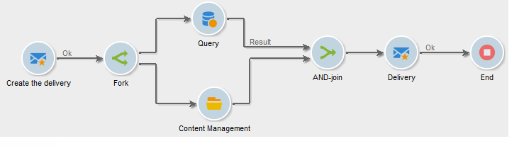

# Automazione tramite flussi di lavoro{#automating-via-workflows}

## Attività di gestione dei contenuti {#content-management-activity}

La creazione, la modifica e la pubblicazione di contenuti possono essere automatizzate utilizzando un flusso di lavoro configurato tramite l&#39;interfaccia client Adobe Campaign .

L&#39;attività **Content management** è accessibile tramite la barra degli strumenti **[!UICONTROL Tools]** del diagramma del flusso di lavoro.

Le proprietà dell&#39;attività sono suddivise in quattro fasi:

* **[!UICONTROL Content]** : consente di immettere contenuto esistente o di creare contenuto,
* **[!UICONTROL Update content]** : consente di modificare l&#39;oggetto del contenuto o di aggiornare il contenuto tramite un flusso di dati XML,
* **[!UICONTROL Action to execute]** : consente di salvare o generare contenuto,
* **[!UICONTROL Transition]** : consente di scegliere se generare o meno una transizione di output e di denominarla.


### Contenuto {#content}

* **Specificato dalla transizione**

   Il contenuto da utilizzare è stato creato in precedenza. I processi riguarderanno l&#39;istanza di contenuto propagata dall&#39;evento in arrivo. L&#39;accesso all&#39;identificatore di contenuto è effettuato tramite la variabile &quot;contentId&quot; dell&#39;evento.

* **Esplicito**

   Consente di scegliere il contenuto creato in precedenza.

* **Calcolato da uno script**

   Seleziona un&#39;istanza di contenuto basata su un modello JavaScript. Il codice da valutare consente di recuperare l’identificatore di contenuto.

* **Nuovo, creato tramite un modello di pubblicazione**

   Crea un nuovo contenuto tramite un modello di pubblicazione. L&#39;istanza di contenuto verrà salvata nella cartella &quot;String&quot; popolata.

### Aggiornare il contenuto {#update-the-content}

* **Oggetto**

   Consente di modificare l’oggetto dell’azione di consegna al momento della pubblicazione.

* **Accesso ai dati da un feed XML**

   Il contenuto viene aggiornato da un feed XML da un&#39;origine esterna. Affinché sia possibile scaricare i dati, è necessario inserire un URL.

   È possibile utilizzare un foglio di stile XSL per trasformare i dati XML in arrivo.

### Azione da eseguire {#action-to-execute}

* **Salva**

   Salva il contenuto creato o modificato. L&#39;identificatore del contenuto salvato viene propagato nella variabile &quot;contentId&quot; dell&#39;evento in uscita.

* **Genera**

   Genera i file di output per ciascuno dei modelli di trasformazione con pubblicazione di tipo &quot;File&quot;. La transizione in uscita viene attivata per ciascun file generato, con i seguenti parametri: l’identificatore del contenuto salvato nella variabile &quot;contentId&quot; e il nome del file nella variabile &quot;filename&quot;.

### Transition {#transition}

L&#39;opzione **Genera una transizione di output** consente di aggiungere una transizione di output all&#39;attività **[!UICONTROL Content management]** per collegare una nuova attività all&#39;esecuzione del flusso di lavoro. Dopo aver selezionato questa opzione, immettete un&#39;etichetta per la transizione.

## Esempi {#examples}

### Automazione della creazione e distribuzione dei contenuti {#automating-content-creation-and-delivery}

L&#39;esempio seguente automatizza la creazione e la distribuzione di un blocco di contenuto.


Il contenuto è configurato tramite l&#39;attività &quot;Gestione dei contenuti&quot;:


Una nuova istanza di contenuto viene creata tramite il modello di pubblicazione e la cartella della stringa di contenuto.

Nel nostro esempio, abbiamo sovraccaricato il soggetto di consegna. Verrà presa in considerazione al posto di quella inserita nel modello **[!UICONTROL Delivery]**.

Il contenuto viene compilato automaticamente da un feed XML proveniente dall’URL immesso:

```
<?xml version='1.0' encoding='ISO-8859-1'?>
<book name="Content automation test" date="2008/06/08" language="eng" computeString="Content automation test">
  <section id="1" name="Introduction">
    <page>Introduction to input forms.</page>
  </section>
</book>
```

Il formato dei dati non corrisponde allo schema di dati immesso nel modello di pubblicazione (**cus:book** nel nostro esempio); l&#39;elemento **`<section>`** deve essere sostituito con l&#39;elemento **`<chapter>`**. È necessario applicare il foglio di stile &quot;cus:book-workflow.xsl&quot; per apportare le modifiche necessarie.

Codice di origine del foglio di stile XSLT utilizzato:

```
<?xml version="1.0" encoding="utf-8"?>
<xsl:stylesheet version="1.0" xmlns:xsl="http://www.w3.org/1999/XSL/Transform">
 <xsl:output indent="yes" method="xml"  encoding="ISO-8859-1"/>

 <xsl:template match="text()|@*"/>

  <xsl:template match="*">
    <xsl:variable name="element.name" select="name(.)"/>
    <xsl:element name="{$element.name}">
      <xsl:copy-of select="text()|@*"/>
      <xsl:apply-templates/>
    </xsl:element>
  </xsl:template>

  <xsl:template match="book">
  <book name="test">
     <xsl:apply-templates/>
    <book>
 </xsl:template>

  <xsl:template match="section">
    <chapter>
      <xsl:for-each select="@*">
        <xsl:copy-of select="."/>
      </xsl:for-each>
       <xsl:apply-templates/>
    </chapter>
  </xsl:template>
  
</xsl:stylesheet>
```

L&#39;azione finale dell&#39;attività consiste nel salvare l&#39;istanza di contenuto e passare all&#39;attività successiva.

Il targeting viene eseguito tramite l&#39;attività **Query**.

È stata aggiunta un&#39;attività **AND-join** per fare in modo che la consegna venga avviata solo una volta completate le query di destinazione e gli aggiornamenti dei contenuti.

L&#39;azione di consegna è configurata tramite l&#39;attività **Delivery**:


Viene creata una nuova azione di consegna basata su un modello.

Il modello di consegna dell&#39;attività viene utilizzato per selezionare i modelli di trasformazione del modello di pubblicazione. La generazione di contenuto terrà conto di tutti i modelli HTML e di testo senza modelli di consegna o di quelli a cui viene fatto riferimento con lo stesso modello dell&#39;attività.

La destinazione da distribuire viene inserita tramite l&#39;evento in arrivo.

Il contenuto della distribuzione viene popolato tramite l&#39;evento in entrata.

L&#39;ultimo passaggio per completare l&#39;attività consiste nel preparare e avviare la consegna.

### Creazione di contenuti e pubblicazione in un secondo tempo {#creating-content-and-publishing-it-later}

In questo esempio viene creato un blocco di contenuto e viene avviata la pubblicazione del file dopo un ritardo specifico.


La prima attività **Gestione dei contenuti** crea un&#39;istanza di contenuto.


>[!NOTE]
>
>La scheda **[!UICONTROL Publication]** della finestra dei modelli di trasformazione deve essere compilata con la posizione della destinazione da generare.

Viene aggiunta un&#39;attività di attesa per mettere in pausa la transizione successiva per una settimana.


Il contenuto viene immesso manualmente durante questo periodo di tempo.

L&#39;attività successiva avvia la generazione del contenuto.


Il contenuto da pubblicare viene immesso tramite la transizione in entrata.

L&#39;azione finale consiste nel generare questo contenuto forzando la directory di pubblicazione.

L&#39;attività **codice JavaScript** recupera il nome completo di ciascun file generato.


### Creazione della consegna e del relativo contenuto {#creating-the-delivery-and-its-content}

In questo esempio viene utilizzato lo stesso concetto del primo esempio, ma viene creata solo l&#39;azione di consegna nel primo passaggio.



La prima attività **Crea consegna** crea l&#39;azione di consegna.

L&#39;attività fork consente di avviare il calcolo della destinazione e la creazione dell&#39;istanza di contenuto in parallelo.

Una volta eseguite le attività, la casella di partecipazione AND attiva l&#39;attività **Delivery** per avviare la consegna precedentemente creata su contenuto e targeting.


L&#39;azione di consegna da avviare viene compilata tramite la transizione.

La destinazione da distribuire viene inserita tramite l&#39;evento in arrivo.

Il contenuto della distribuzione viene popolato tramite l&#39;evento in entrata.

L&#39;azione finale dell&#39;attività consiste nel preparare e avviare la consegna.

### Importazione di contenuto dall&#39;FTP {#importing-content-from-ftp}

Se il contenuto di distribuzione è disponibile in un file HTML ubicato su server FTP o SFTP, potete facilmente caricare tale contenuto  consegne Adobe Campaign. Fare riferimento a [questo esempio](../../workflow/using/loading-delivery-content.md).

### Importazione di contenuti  connettore Amazon Simple Storage Service (S3) {#importing-content-from-amazon-simple-storage-service--s3--connector}

Se il contenuto di distribuzione si trova  bucket Amazon Simple Storage Service (S3), è possibile caricare facilmente tale contenuto  consegne Adobe Campaign. Fare riferimento a [questo esempio](../../workflow/using/loading-delivery-content.md).

## Aggiornamento semiautomatico {#semi-automatic-update}

I dati del contenuto possono essere aggiornati in modalità &quot;semi-automatica&quot;. I dati vengono recuperati da un feed XML tramite un URL.

L&#39;attivazione del recupero dei dati viene eseguita manualmente tramite il modulo di input.

L&#39;obiettivo è dichiarare un campo **editBtn** di tipo **`<input>`** nel modulo. Questo controllo comprende un&#39;area di modifica e un pulsante per avviare l&#39;elaborazione.

La zona di modifica consente di compilare i dati variabili utilizzati per creare l&#39;URL del feed XML dei dati da recuperare.

Il pulsante esegue il metodo SOAP **GetAndTransform** popolato sotto il tag **`<input>`**.

La dichiarazione di controllo nel modulo è la seguente:

```
<input type="editbtn" xpath="<path>">
  <enter>
    <soapCall name="GetAndTransform" service="ncm:content">
      <param exprIn="<url>" type="string"/>
      <param exprIn="'xtk:xslt|<style sheet>'" type="string"/>
      <param type="DOMElement" xpathOut="<output path>"/>
    </soapCall>
  </enter>
</input>
```

Il metodo **GetAndTransform** deve essere dichiarato sotto l&#39;elemento **`<enter>`** del tag **`<input>`**. Questo tag prende come parametri l&#39;URL del ripristino dei dati XML da un&#39;espressione costruita dinamicamente. Il secondo parametro della funzione è facoltativo e fa riferimento a un foglio di stile utilizzato per una trasformazione intermedia quando i dati XML in arrivo non sono nello stesso formato del contenuto.

L&#39;output aggiorna il contenuto in base al percorso immesso nell&#39;ultimo parametro.

**Esempio**: Per illustrare questo esempio, si parte dallo schema &quot;cus:book&quot;.

È stato aggiunto un modulo di input per il controllo delle modifiche semi-automatico:


```
<input label="File name" type="editbtn" xpath="/tmp/@name">
  <enter>
    <soapCall name="GetAndTransform" service="ncm:content">
      <param exprIn="'https://myserver.adobe.com/incoming/' + [/tmp/@name] + '.xml'" type="string"/>
      <param exprIn="'xtk:xslt|cus:book-workflow.xsl'" type="string"/>
      <param type="DOMElement" xpathOut="."/>
    </soapCall>
  </enter>
</input>
```

La zona di modifica consente di immettere il nome del file da recuperare. L’URL viene creato in base al nome, ad esempio: https://myserver.adobe.com/incomin/data.xml

Il formato dei dati da recuperare è lo stesso dell&#39;esempio 1 dell&#39;automazione del flusso di lavoro. In questo esempio verrà utilizzato il foglio di stile &quot;cus:book-workflow.xsl&quot;.

Il risultato dell&#39;esecuzione del processo aggiorna l&#39;istanza di contenuto dal percorso &#39;.&#39;.
