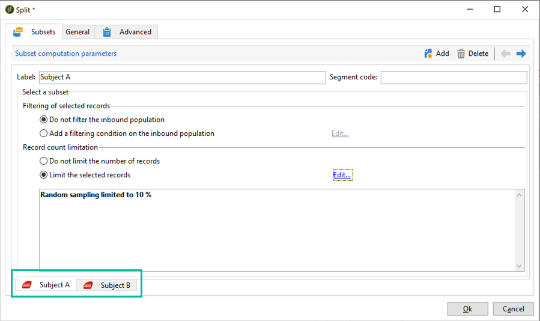
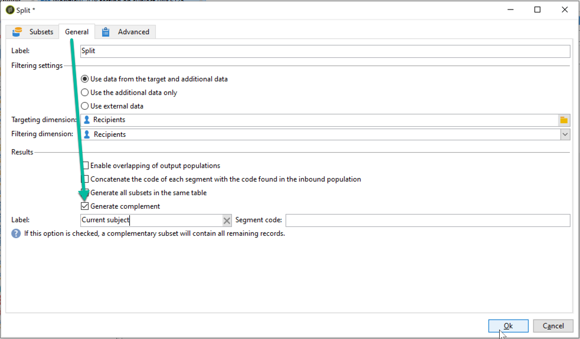

# Configurare il test A/B {#configuring-a-b-testing}

Questa sezione descrive come creare un flusso di lavoro per eseguire test A/B.

1. Crea un nuovo flusso di lavoro, quindi configura un [Query](../../workflow/using/query.md) attività per eseguire il targeting della popolazione desiderata.

1. Aggiungi un [Dividi](../../workflow/using/split.md) attività per suddividere la popolazione target in più sottoinsiemi.

1. Apri l’attività, quindi configura ogni sottoinsieme in base alle tue esigenze. Per ulteriori informazioni su come configurare un **[!UICONTROL Split]** attività, fare riferimento a [questa sezione](../../workflow/using/split.md).

   In questo esempio, vogliamo testare 2 nuovi argomenti per una newsletter presentandoli a ciascuno di loro al 10% della popolazione target.

   

1. Aggiungi una transizione per inviare alla popolazione rimanente la newsletter con l’oggetto corrente. A questo scopo, attiva il **[!UICONTROL Generate complement]** opzione dalla **[!UICONTROL General]** scheda.

   

1. Per ogni sottoinsieme, aggiungi la versione della consegna da testare.

   

Ora puoi avviare il flusso di lavoro. Una volta inviate le consegne, potrai tenere traccia del comportamento dei tre sottoinsiemi nei registri di consegna, per vedere quale soggetto ha ottenuto il maggior successo.

I flussi di lavoro consentono inoltre di automatizzare i processi identificando automaticamente la variante di consegna che ha registrato prestazioni migliori e inviandola alla popolazione rimanente. Per ulteriori informazioni, consulta questa pagina dedicata [caso d’uso](a-b-testing-use-case.md).
