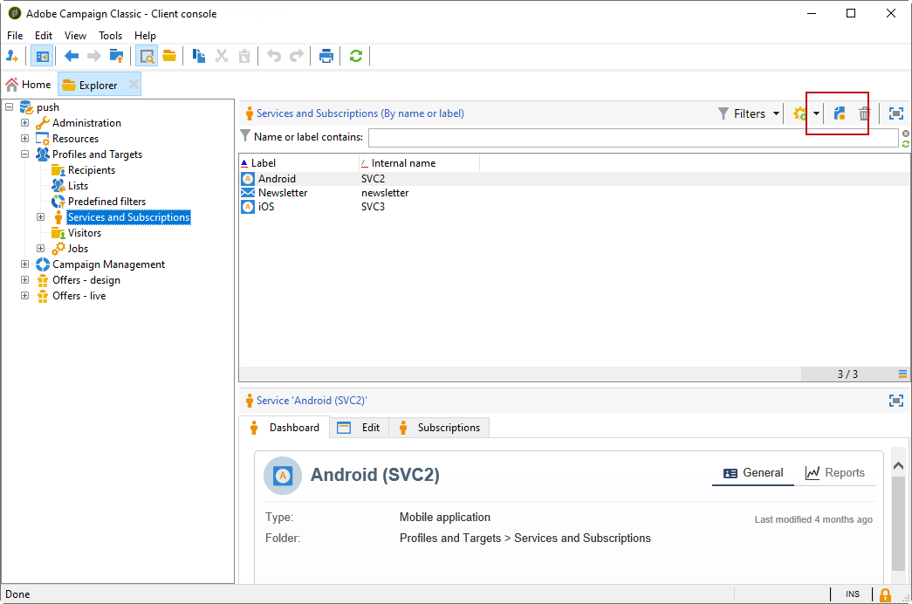
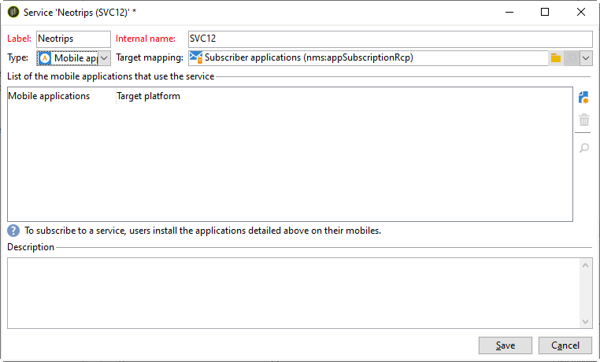

# Passaggi di configurazione per Android

Una volta installato il pacchetto, puoi definire le impostazioni dell’app Android in Adobe Campaign Classic.

I passaggi chiave sono i seguenti:

1. [Configurare l’account esterno Android](#configuring-external-account-android)
1. [Configurare il servizio Android](#configuring-android-service)
1. [Creare l’app mobile in Campaign](#creating-android-app)
1. [Estendere lo schema dell’app con dati aggiuntivi](#extend-subscription-schema)

Potrai quindi [creare una notifica Android potenziata](create-notifications-android.md).

>[!IMPORTANT]
>
>Alcune modifiche importanti al servizio Android Firebase Cloud Messaging (FCM) saranno rilasciate nel 2024 e potrebbero influire sull’implementazione di Adobe Campaign. Per supportare questa modifica, potrebbe essere necessario aggiornare la configurazione dei servizi di abbonamento per i messaggi push Android. Puoi già verificare ed eseguire azioni. Ulteriori informazioni [Nota tecnica su Adobe Campaign v8](https://experienceleague.corp.adobe.com/docs/campaign/technotes-ac/tn-new/push-technote.html){target="_blank"}.

## Configurare l’account esterno Android {#configuring-external-account-android}

Per Android sono disponibili due connettori:

* Il connettore V1 che consente una connessione per elemento secondario MTA.
* Il connettore V2 che consente connessioni simultanee al server FCM per migliorare il throughput.

Per scegliere il connettore da utilizzare, eseguire la procedura seguente:

1. Vai a **[!UICONTROL Administration > Platform > External accounts]**.
1. Seleziona la **[!UICONTROL Android routing]** account esterno.
1. In **[!UICONTROL Connector]** , compila la scheda **[!UICONTROL JavaScript used in the connector]** campo:

   Per Android V2: https://localhost:8080/nms/jsp/androidPushConnectorV2.js

   >[!NOTE]
   >
   > Puoi anche configurarlo come segue https://localhost:8080/nms/jsp/androidPushConnector.js, ma ti consigliamo di utilizzare la versione 2 del connettore.

   

1. Per Android V2, nel file di configurazione del server Adobe (serverConf.xml) è disponibile un parametro aggiuntivo:

   * **maxGCMConnectPerChild**: limite massimo di richieste HTTP parallele alla FCM avviate da ciascun server secondario (8 per impostazione predefinita).

## Configurare un servizio Android {#configuring-android-service}

 [Scopri come configurare un servizio Android in un video](https://experienceleague.adobe.com/docs/campaign-classic-learn/getting-started-with-push-notifications-for-android/configuring-an-android-service-in-campaign.html#configuring-an-android-service-and-creating-an-android-mobile-application-in-campaign){target="_blank"}.

1. Vai a **[!UICONTROL Profiles and Targets > Services and subscriptions]** e fai clic su **[!UICONTROL New]**.

   

1. Definisci un **[!UICONTROL Label]** e un **[!UICONTROL Internal name]**.
1. Vai a **[!UICONTROL Type]** e seleziona **[!UICONTROL Mobile application]**.

   >[!NOTE]
   >
   >Il valore predefinito **[!UICONTROL Subscriber applications (nms:appSubscriptionRcp)]** la mappatura di destinazione è collegata alla tabella dei destinatari. Se desideri utilizzare una mappatura di destinazione diversa, devi creare una nuova mappatura di destinazione e immetterla nella **[!UICONTROL Target mapping]** del servizio. Per ulteriori informazioni sulla creazione della mappatura di destinazione, consulta [questa sezione](../../configuration/using/about-custom-recipient-table.md).

   

1. Quindi fai clic su **[!UICONTROL Add]** per selezionare il tipo di applicazione.

   

1. Crea la tua applicazione Android. Per ulteriori informazioni al riguardo, consulta [questa sezione](configuring-the-mobile-application-android.md#creating-android-app).

## Creare l’app mobile Android {#creating-android-app}

Dopo aver creato il servizio, ora devi creare l’applicazione Android:

1. Dal servizio appena creato, fai clic su **[!UICONTROL Add]** per selezionare il tipo di applicazione.

   

1. Seleziona **[!UICONTROL Create an Android application]** e inserisci un **[!UICONTROL Label]**.

   

1. Assicurati che lo stesso **[!UICONTROL Integration key]** è definito in Adobe Campaign e nel codice dell’applicazione tramite l’SDK. Per ulteriori informazioni al riguardo, consulta [questa sezione](integrating-campaign-sdk-into-the-mobile-application.md).

   >[!NOTE]
   >
   > Il **[!UICONTROL Integration key]** è completamente personalizzabile con un valore stringa, ma deve essere esattamente lo stesso specificato nell’SDK.

1. Seleziona la **[!UICONTROL API version]**: HTTP v1 o HTTP (legacy). Queste configurazioni sono descritte in dettaglio [questa sezione](#select-api-version)

1. Compila il **[!UICONTROL Firebase Cloud Messaging the Android connection settings]** campi.

1. Clic **[!UICONTROL Finish]** allora **[!UICONTROL Save]**. L’applicazione Android è ora pronta per essere utilizzata in Campaign Classic.

Per impostazione predefinita, Adobe Campaign salva una chiave nel **[!UICONTROL User identifier]** (@userKey) campo di applicazione **[!UICONTROL Subscriber applications (nms:appSubscriptionRcp)]** tabella. Questa chiave consente di collegare una sottoscrizione a un destinatario. Per raccogliere dati aggiuntivi (ad esempio una chiave di riconciliazione complessa), è necessario applicare la seguente configurazione:

### Configurare la versione API{#select-api-version}

>[!IMPORTANT]
>
>Alcune modifiche importanti al servizio Android Firebase Cloud Messaging (FCM) saranno rilasciate nel 2024 e potrebbero influire sull’implementazione di Adobe Campaign. Come parte del continuo sforzo di Google per migliorare i suoi servizi, le API FCM legacy saranno interrotte il **20 giugno 2024**. Ulteriori informazioni [Nota tecnica su Adobe Campaign v8](https://experienceleague.corp.adobe.com/docs/campaign/technotes-ac/tn-new/push-technote.html){target="_blank"}.

Dopo aver creato il servizio e una nuova app mobile, è necessario configurare l’app mobile. Il **HTTP (legacy)** L’API non deve essere selezionata perché è stata dichiarata obsoleta da Google.

Per configurare la versione API HTTP v1, segui i passaggi seguenti:

1. Nel tuo **[!UICONTROL Mobile application creation wizard]** finestra, seleziona **[!UICONTROL HTTPV1]** nel **[!UICONTROL API version]** a discesa.

1. Clic **[!UICONTROL Load project json file to extract project details...]** per caricare direttamente il file di chiave JSON. Per ulteriori informazioni su come estrarre il file JSON, consulta [questa pagina](https://firebase.google.com/docs/admin/setup#initialize-sdk).

   È inoltre possibile immettere manualmente i seguenti dettagli:
   * **[!UICONTROL Project Id]**
   * **[!UICONTROL Private Key]**
   * **[!UICONTROL Client Email]**

   

1. Clic **[!UICONTROL Test the connection]** per verificare che la configurazione sia corretta e che il server di marketing abbia accesso a FCM.

   >[!CAUTION]
   >
   >Per l&#39;implementazione mid-sourcing, **[!UICONTROL Test connection]** non verifica se il server MID ha accesso al server FCM.

   

1. Come opzione, puoi arricchire il contenuto di un messaggio push con **[!UICONTROL Application variables]** se necessario. Questi sono completamente personalizzabili e fanno parte del payload del messaggio inviato al dispositivo mobile.

1. Clic **[!UICONTROL Finish]** allora **[!UICONTROL Save]**. L’applicazione Android è ora pronta per essere utilizzata in Campaign Classic.

Di seguito sono riportati i nomi del payload FCM per personalizzare ulteriormente la notifica push:

| Tipo di messaggio | Elemento del messaggio configurabile (nome del payload FCM) | Opzioni configurabili (nome payload FCM) |
|:-:|:-:|:-:|
| messaggio dati | N/D | validate_only |
| messaggio di notifica | titolo, corpo, android_channel_id, icona, suono, tag, colore, click_action, immagine, ticker, fisso, visibilità, notification_priority, notification_count   | validate_only |

## Estendere lo schema appsubscriptionRcp {#extend-subscription-schema}

 [Scopri come estendere lo schema appsubscriptionRcp nel video](https://experienceleague.adobe.com/docs/campaign-classic-learn/getting-started-with-push-notifications-for-android/extending-the-app-subscription-schema.html#extending-the-app-subscription-schema-to-personalize-push-notifications)

È necessario estendere **appsubscriptionRcp** per definire nuovi campi aggiuntivi per archiviare i parametri dell’app nel database di Campaign. Questi campi vengono utilizzati per la personalizzazione, ad esempio. Per eseguire questa operazione:

1. Crea un&#39;estensione del **[!UICONTROL Subscriber applications (nms:appsubscriptionRcp)]** e definiscono i nuovi campi. Ulteriori informazioni sull’estensione dello schema in [questa pagina](../../configuration/using/about-schema-edition.md)

1. Definisci la mappatura in **[!UICONTROL Subscription parameters]** scheda.

   >[!CAUTION]
   >
   >Assicurati che i nomi delle configurazioni in **[!UICONTROL Subscription parameters]** sono le stesse del codice dell’app mobile. Fai riferimento a [questa sezione](integrating-campaign-sdk-into-the-mobile-application.md).
