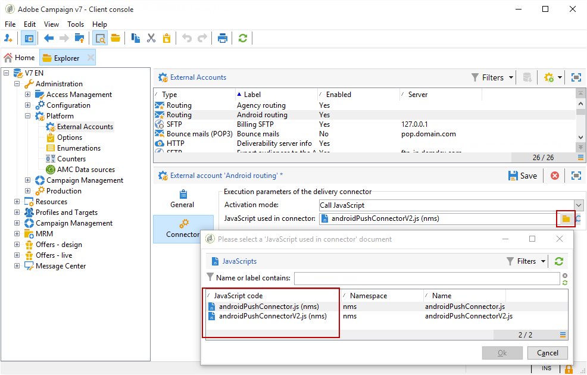

# Passaggi di configurazione per Android

Una volta installato il pacchetto, potete definire le impostazioni dell&#39;app Android in Adobe Campaign Classic.

>[!NOTE]
>
>Per informazioni su come configurare l&#39;app per iOS e su come creare una consegna per iOS, consulta questa [sezione](../../delivery/using/configuring-the-mobile-application.md).

I passaggi chiave sono:

1. [Configurare l&#39;account esterno Android](#configuring-external-account-android)
1. [Configurare il servizio Android](#configuring-android-service)
1. [Creare l&#39;app mobile in Campaign](#creating-android-app)
1. [Estendi lo schema dell&#39;app con dati aggiuntivi](#extend-subscription-schema)

Potrete quindi [creare una notifica](#creating-android-delivery)Android avanzata.

## Configurazione dell&#39;account esterno Android {#configuring-external-account-android}

Per Android sono disponibili due connettori:

* Connettore V1 che consente una connessione per MTA figlio.
* Connettore V2 che consente connessioni simultanee al server FCM per migliorare il throughput.

Per scegliere quale connettore utilizzare, procedere come segue:

1. Vai a **[!UICONTROL Administration > Platform > External accounts]**.
1. Select the **[!UICONTROL Android routing]** external account.
1. Nella **[!UICONTROL Connector]** scheda, compila il **[!UICONTROL JavaScript used in the connector]** campo:

   Per Android V2: https://localhost:8080/nms/jsp/androidPushConnectorV2.js

   >[!NOTE]
   >
   > È inoltre possibile configurarlo come segue https://localhost:8080/nms/jsp/androidPushConnector.js, ma si consiglia di utilizzare la versione 2 del connettore.

   

1. Per Android V2, un parametro aggiuntivo è disponibile nel file di configurazione del server di Adobe  (serverConf.xml):

   * **maxGCMConnectPerChild**: Limite massimo di richieste HTTP parallele a FCM avviate da ciascun server figlio (per impostazione predefinita, 8).

## Configurazione del servizio Android {#configuring-android-service}

1. Vai al **[!UICONTROL Profiles and Targets > Services and subscriptions]** nodo e fai clic su **[!UICONTROL New]**.

   

1. Define a **[!UICONTROL Label]** and an **[!UICONTROL Internal name]**.
1. Vai al **[!UICONTROL Type]** campo e seleziona **[!UICONTROL Mobile application]**.

   >[!NOTE]
   >
   >Il mapping di **[!UICONTROL Subscriber applications (nms:appSubscriptionRcp)]** destinazione predefinito è collegato alla tabella dei destinatari. Se desiderate utilizzare un mapping di destinazione diverso, dovete creare un nuovo mapping di destinazione e immetterlo nel **[!UICONTROL Target mapping]** campo del servizio. Per ulteriori informazioni sulla creazione della mappatura di destinazione, consulta la guida [alla](../../configuration/using/about-custom-recipient-table.md)configurazione.

   

1. Quindi fate clic sul **[!UICONTROL Add]** pulsante per selezionare il tipo di applicazione.

   

1. Create la vostra applicazione Android. Per ulteriori informazioni, consulta questa [sezione](../../delivery/using/configuring-the-mobile-application-android.md#creating-android-app).

## Creazione di un’applicazione mobile Android {#creating-android-app}

Dopo aver creato il servizio, è ora necessario creare l&#39;applicazione Android:

1. Dal servizio appena creato, fate clic sul **[!UICONTROL Add]** pulsante per selezionare il tipo di applicazione.

   

1. Selezionate **[!UICONTROL Create an Android application]** e immettete un **[!UICONTROL Label]**.

   

1. Assicurati che lo stesso **[!UICONTROL Integration key]** sia definito in  Adobe Campaign e nel codice dell’applicazione tramite l’SDK. Per ulteriori informazioni, consulta: [Integrazione di Campaign SDK nell&#39;applicazione](../../delivery/using/integrating-campaign-sdk-into-the-mobile-application.md)mobile.

   >[!NOTE]
   >
   > L’ **[!UICONTROL Integration key]** impostazione è completamente personalizzabile con il valore stringa, ma deve corrispondere esattamente a quella specificata nell’SDK.

1. Seleziona **[!UICONTROL API version]**:

   * HTTPV1. La configurazione è dettagliata in questa [sezione](../../delivery/using/configuring-the-mobile-application-android.md#android-service-httpv1).
   * HTTP (precedente). La configurazione è dettagliata in questa [sezione](../../delivery/using/configuring-the-mobile-application-android.md#android-service-http).

1. Fill in the **[!UICONTROL Firebase Cloud Messaging the Android connection settings]** fields.

1. Fai clic su **[!UICONTROL Finish]**, quindi su **[!UICONTROL Save]**. L&#39;applicazione Android ora è pronta per essere utilizzata in Campaign Classic.

Per impostazione predefinita,  Adobe Campaign salva una chiave nel campo **[!UICONTROL User identifier]** (@userKey) della **[!UICONTROL Subscriber applications (nms:appSubscriptionRcp)]** tabella. Questa chiave consente di collegare un&#39;iscrizione a un destinatario. Per raccogliere dati aggiuntivi (ad esempio una chiave di riconciliazione complessa), è necessario applicare la seguente configurazione:

### Selezionate la versione API{#select-api-version}

Dopo aver creato un servizio e una nuova applicazione mobile, è necessario configurare l&#39;applicazione mobile in base alla versione API scelta.

Per ulteriori informazioni sulle creazioni di servizi e applicazioni mobili, consulta questa [sezione](../../delivery/using/configuring-the-mobile-application-android.md#configuring-android-service)

#### Usa versione API HTTP v1{#android-service-httpv1}

Per configurare la versione dell&#39;API HTTP v1, attenetevi alla seguente procedura:

1. Nella **[!UICONTROL Mobile application creation wizard]** finestra, selezionate **[!UICONTROL HTTPV1]** nel **[!UICONTROL API version]** menu a discesa.

1. Fai clic **[!UICONTROL Load project json file to extract projet details...]** per caricare direttamente il file della chiave JSON. Per ulteriori informazioni su come estrarre il file JSON, consulta questa [pagina](https://firebase.google.com/docs/admin/setup#initialize-sdk).

   Potete anche immettere manualmente i seguenti dettagli:
   * **[!UICONTROL Project Id]**
   * **[!UICONTROL Private Key]**
   * **[!UICONTROL Client Email]**

   

1. Fate clic **[!UICONTROL Test the connection]** per verificare che la configurazione sia corretta e che il server di marketing abbia accesso al MCM.

   >[!CAUTION]
   >
   >Per la distribuzione di origine media, il **[!UICONTROL Test connection]** pulsante non verifica se il server MID ha accesso al server FCM.

   

1. Come opzione, puoi arricchire il contenuto di un messaggio push con alcuni **[!UICONTROL Application variables]** se necessario. Sono completamente personalizzabili e una parte del payload di messaggi inviato al dispositivo mobile.

1. Fai clic su **[!UICONTROL Finish]**, quindi su **[!UICONTROL Save]**. L&#39;applicazione Android ora è pronta per essere utilizzata in Campaign Classic.

Di seguito sono riportati i nomi dei payload FCM per personalizzare ulteriormente la notifica push:

| Tipo di messaggio | Elemento messaggio configurabile (nome payload FCM) | Opzioni configurabili (nome payload FCM) |
|:-:|:-:|:-:|
| messaggio dati | N/D | validate_only |
| messaggio di notifica | titolo, corpo, android_channel_id, icona, suono, tag, colore, click_action, immagine, ticker, persistente, visibilità, notification_priority, notification_count   | validate_only |

 
 

#### Versione API HTTP{#android-service-http}

Per configurare la versione API HTTP (precedente), attenetevi alla procedura seguente:

1. Nella **[!UICONTROL Mobile application creation wizard]** finestra, selezionate **[!UICONTROL HTTP (legacy)]** nel **[!UICONTROL API version]** menu a discesa.

1. Immettere **[!UICONTROL Project key]** quello fornito dallo sviluppatore dell&#39;applicazione mobile.

1. Come opzione, puoi arricchire il contenuto di un messaggio push con alcuni **[!UICONTROL Application variables]** se necessario. Sono completamente personalizzabili e una parte del payload di messaggi inviato al dispositivo mobile.

   Nell&#39;esempio seguente, aggiungiamo **titolo**, **imageURL** e **iconURL** per creare una notifica push potenziata e quindi fornisce all&#39;applicazione l&#39;immagine, il titolo e l&#39;icona da visualizzare all&#39;interno della notifica.

   

1. Fai clic su **[!UICONTROL Finish]**, quindi su **[!UICONTROL Save]**. L&#39;applicazione Android ora è pronta per essere utilizzata in Campaign Classic.

Di seguito sono riportati i nomi dei payload FCM per personalizzare ulteriormente la notifica push:

| Tipo di messaggio | Elemento messaggio configurabile (nome payload FCM) | Opzioni configurabili (nome payload FCM) |
|:-:|:-:|:-:|
| messaggio dati | N/D | dryRun |
| messaggio di notifica | titolo, corpo, android_channel_id, icona, suono, tag, colore, click_action   | dryRun |

 

## Estendi lo schema appsubscriptionRcp {#extend-subscription-schema}

È necessario estendere **appsubscriptionRcp** per definire nuovi campi aggiuntivi per memorizzare i parametri dall&#39;app nel database di Campaign. Questi campi verranno utilizzati ad esempio per la personalizzazione. Per eseguire questa operazione:

1. Create un&#39;estensione dello **[!UICONTROL Subscriber applications (nms:appsubscriptionRcp)]** schema e definite i nuovi campi. Ulteriori informazioni sull&#39;estensione dello schema in [questa pagina](../../configuration/using/about-schema-edition.md)

1. Definite la mappatura nella **[!UICONTROL Subscription parameters]** scheda.

   >[!CAUTION]
   >
   >Accertatevi che i nomi di configurazione nella **[!UICONTROL Subscription parameters]** scheda siano identici a quelli nel codice dell&#39;applicazione mobile. Fai riferimento all&#39;SDK [Integrating Campaign nella sezione dell&#39;applicazione](../../delivery/using/integrating-campaign-sdk-into-the-mobile-application.md) mobile.

## Creazione di una notifica Android rich {#creating-android-delivery}

Con Firebase Cloud Messaging, puoi scegliere tra due tipi di messaggi:

* **[!UICONTROL Data message]**, gestito dall&#39;app client.
    I messaggi vengono inviati direttamente all&#39;applicazione mobile che genererà e visualizzerà la notifica android al dispositivo. I messaggi di dati contengono solo le variabili di applicazione personalizzate.

* **[!UICONTROL Notification message]**, gestito automaticamente da FCM SDK.
     FCM visualizza automaticamente il messaggio sui dispositivi degli utenti per conto dell&#39;app client. I messaggi di notifica contengono un set predefinito di parametri e opzioni, ma possono essere ulteriormente personalizzati con variabili di applicazione personalizzate.

Per ulteriori informazioni sui tipi di messaggi di Firebase Cloud Messaging, consulta la documentazione FCM.

### Creazione di un messaggio dati {#creating-data-message}

1. Vai a **[!UICONTROL Campaign management]** > **[!UICONTROL Deliveries]**.

1. Fai clic su **[!UICONTROL New]**.

   

1. Seleziona **[!UICONTROL Deliver on Android (android)]** nell’ **[!UICONTROL Delivery template]** elenco a discesa. Aggiungi un **[!UICONTROL Label]** biglietto alla consegna.

1. Fare clic **[!UICONTROL To]** per definire la popolazione di destinazione. Per impostazione predefinita, viene applicata la mappatura della **[!UICONTROL Subscriber application]** destinazione. Fate clic **[!UICONTROL Add]** per selezionare il servizio.

   

1. Nella **[!UICONTROL Target type]** finestra, selezionare **[!UICONTROL Subscribers of an Android mobile application]** e fare clic su **[!UICONTROL Next]**.

1. Nell&#39; **[!UICONTROL Service]** elenco a discesa, seleziona il servizio creato in precedenza, quindi l&#39;applicazione e fai clic su **[!UICONTROL Finish]**.
Le **[!UICONTROL Application variables]** vengono aggiunte automaticamente in base a quanto è stato aggiunto durante i passaggi di configurazione.

   

1. Selezionare **[!UICONTROL data message]** come **[!UICONTROL Message Type]**.

1. Modificate la notifica RTF.

   

1. Se necessario, puoi aggiungere informazioni nella configurazione **[!UICONTROL Application variables]** precedente. **[!UICONTROL Application variables]** deve essere configurato nel servizio Android e fa parte del payload di messaggi inviato al dispositivo mobile.

1. Fai clic su **[!UICONTROL Save]** e invia la consegna.

L&#39;immagine e la pagina Web devono essere visualizzate nella notifica push quando vengono ricevute sui dispositivi mobili Android degli abbonati.

### Creazione di un messaggio di notifica {#creating-notification-message}

>[!NOTE]
>
>Ulteriori opzioni per il messaggio di notifica sono disponibili solo con la configurazione dell&#39;API HTTP v1. Per ulteriori informazioni, consulta questa [sezione](../../delivery/using/configuring-the-mobile-application-android.md#android-service-httpv1).

1. Vai a **[!UICONTROL Campaign management]** > **[!UICONTROL Deliveries]**.

1. Fai clic su **[!UICONTROL New]**.

   

1. Seleziona **[!UICONTROL Deliver on Android (android)]** nell’ **[!UICONTROL Delivery template]** elenco a discesa. Aggiungi un **[!UICONTROL Label]** biglietto alla consegna.

1. Fare clic **[!UICONTROL To]** per definire la popolazione di destinazione. Per impostazione predefinita, viene applicata la mappatura della **[!UICONTROL Subscriber application]** destinazione. Fate clic **[!UICONTROL Add]** per selezionare il servizio.

   

1. Nella **[!UICONTROL Target type]** finestra, selezionare **[!UICONTROL Subscribers of an Android mobile application]** e fare clic su **[!UICONTROL Next]**.

1. Nell&#39; **[!UICONTROL Service]** elenco a discesa, seleziona il servizio creato in precedenza, quindi l&#39;applicazione e fai clic su **[!UICONTROL Finish]**.

   

1. Selezionare **[!UICONTROL notification message]** come **[!UICONTROL Message Type]**.

1. Aggiungi un titolo e modifica il messaggio. Personalizza la notifica push con **[!UICONTROL Notification options]**:

   * **[!UICONTROL Channel ID]**: Impostate l&#39;ID canale della notifica. L&#39;app deve creare un canale con questo ID canale prima di ricevere qualsiasi notifica con questo ID canale.
   * **[!UICONTROL Sound]**: Impostate l&#39;audio in modo che venga riprodotto quando il dispositivo riceve la notifica.
   * **[!UICONTROL Color]**: Impostate il colore dell&#39;icona della notifica.
   * **[!UICONTROL Icon]**: Impostate l&#39;icona della notifica per visualizzarla sui dispositivi dei profili.
   * **[!UICONTROL Tag]**: Impostate l&#39;identificatore utilizzato per sostituire le notifiche esistenti nel cassetto delle notifiche.
   * **[!UICONTROL Click action]**: Impostate l&#39;azione associata a un clic utente sulla notifica.

   Per ulteriori informazioni su come **[!UICONTROL Notification options]** e come compilare questi campi, consulta la documentazione FCM.

   

1. Se l&#39;applicazione è configurata con il protocollo HTTP v1 API, puoi personalizzare ulteriormente la notifica push con i seguenti elementi **[!UICONTROL HTTPV1 additional options]**:

   * **[!UICONTROL Ticker]**: Impostate il testo della ticker della notifica. Disponibile solo per i dispositivi impostati su Android 5.0 Lollipop.
   * **[!UICONTROL Image]**: Impostate l’URL dell’immagine da visualizzare nella notifica.
   * **[!UICONTROL Notification Count]**: Impostate il numero di nuove informazioni non lette da visualizzare direttamente sull&#39;icona dell&#39;applicazione.
   * **[!UICONTROL Sticky]**: Impostate su true o false. Se è impostata su false, la notifica viene chiusa automaticamente quando l&#39;utente fa clic su di essa. Se è impostata su true, la notifica continua a essere visualizzata anche quando l&#39;utente fa clic su di essa.
   * **[!UICONTROL Notification Priority]**: Impostate i livelli di priorità della notifica su valori predefiniti, minimi, bassi o alti. For more on this, refer to [FCM documentation](https://firebase.google.com/docs/reference/fcm/rest/v1/projects.messages#NotificationPriority).
   * **[!UICONTROL Visibility]**: Impostate i livelli di visibilità della notifica su pubblico, privato o segreto. For more on this, refer to [FCM documentation](https://firebase.google.com/docs/reference/fcm/rest/v1/projects.messages#visibility).

   Per ulteriori informazioni su come **[!UICONTROL HTTP v1 additional options]** e come compilare questi campi, consulta la documentazione FCM.

   

1. Se necessario, puoi aggiungere informazioni nella configurazione **[!UICONTROL Application variables]** precedente. **[!UICONTROL Application variables]** deve essere configurato nel servizio Android e fa parte del payload di messaggi inviato al dispositivo mobile.

1. Fai clic su **[!UICONTROL Save]** e invia la consegna.

L&#39;immagine e la pagina Web devono essere visualizzate nella notifica push quando vengono ricevute sui dispositivi mobili Android degli abbonati.
