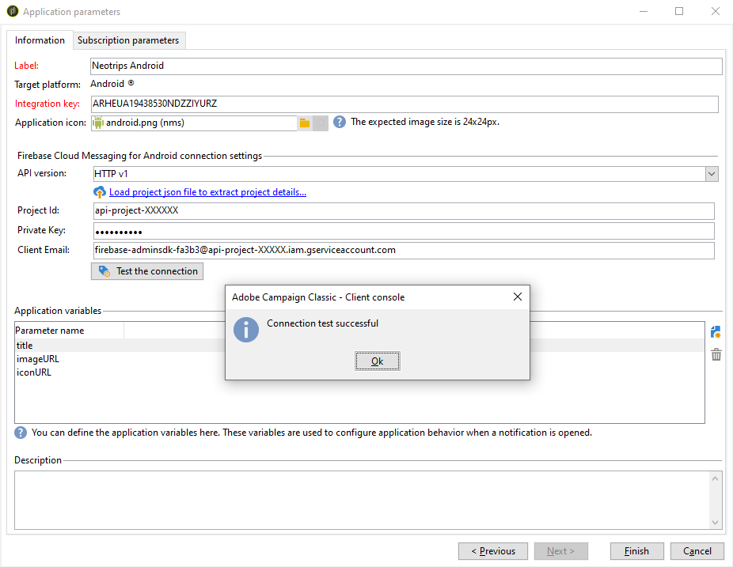

# Passaggi di configurazione per Android

Una volta installato il pacchetto, puoi definire le impostazioni dell’app Android in Adobe Campaign Classic.

>[!NOTE]
>
>Per scoprire come configurare l’app per iOS e come creare una consegna per iOS, consulta questa [sezione](configuring-the-mobile-application.md) .

I passaggi chiave sono i seguenti:

1. [Configurare l’account esterno Android](#configuring-external-account-android)
1. [Configurare il servizio Android](#configuring-android-service)
1. [Creare l’app mobile in Campaign](#creating-android-app)
1. [Estendi lo schema dell’app con dati aggiuntivi](#extend-subscription-schema)

Potrai quindi [creare una notifica avanzata Android](create-notifications-android.md).

## Configurare l’account esterno Android {#configuring-external-account-android}

Per Android sono disponibili due connettori:

* Connettore V1 che consente una connessione per figlio MTA.
* Connettore V2 che consente connessioni simultanee al server FCM per migliorare il throughput.

Per scegliere il connettore da utilizzare, effettua le seguenti operazioni:

1. Vai a **[!UICONTROL Administration > Platform > External accounts]**.
1. Seleziona l’account esterno **[!UICONTROL Android routing]**.
1. Nella scheda **[!UICONTROL Connector]** , compila il campo **[!UICONTROL JavaScript used in the connector]** :

   Per Android V2: https://localhost:8080/nms/jsp/androidPushConnectorV2.js

   >[!NOTE]
   >
   > Puoi anche configurarlo come segue https://localhost:8080/nms/jsp/androidPushConnector.js ma ti consigliamo di utilizzare la versione 2 del connettore.

   

1. Per Android V2, è disponibile un parametro aggiuntivo nel file di configurazione di Adobe Server (serverConf.xml):

   * **maxGCMConnectPerChild**: Limite massimo di richieste HTTP parallele all&#39;FCM avviato da ogni server figlio (8 per impostazione predefinita).

## Configurare un servizio Android {#configuring-android-service}

 [Scopri come configurare un servizio Android nel video](https://experienceleague.adobe.com/docs/campaign-classic-learn/getting-started-with-push-notifications-for-android/configuring-an-android-service-in-campaign.html?lang=en#configuring-an-android-service-and-creating-an-android-mobile-application-in-campaign)

1. Vai al nodo **[!UICONTROL Profiles and Targets > Services and subscriptions]** e fai clic su **[!UICONTROL New]**.

   

1. Definisci un **[!UICONTROL Label]** e un **[!UICONTROL Internal name]**.
1. Vai al campo **[!UICONTROL Type]** e seleziona **[!UICONTROL Mobile application]**.

   >[!NOTE]
   >
   >La mappatura di destinazione predefinita **[!UICONTROL Subscriber applications (nms:appSubscriptionRcp)]** è collegata alla tabella dei destinatari. Se desideri utilizzare una mappatura di destinazione diversa, devi creare una nuova mappatura di destinazione e immetterla nel campo **[!UICONTROL Target mapping]** del servizio. Per ulteriori informazioni sulla creazione della mappatura di destinazione, consulta [questa sezione](../../configuration/using/about-custom-recipient-table.md).

   

1. Quindi fai clic sul pulsante **[!UICONTROL Add]** per selezionare il tipo di applicazione.

   

1. Crea la tua applicazione Android. Per ulteriori informazioni al riguardo, consulta [questa sezione](configuring-the-mobile-application-android.md#creating-android-app).

## Creare l’app mobile Android {#creating-android-app}

Dopo aver creato il servizio, è ora necessario creare l&#39;applicazione Android:

1. Dal servizio appena creato, fai clic sul pulsante **[!UICONTROL Add]** per selezionare il tipo di applicazione.

   

1. Seleziona **[!UICONTROL Create an Android application]** e immetti un **[!UICONTROL Label]**.

   

1. Assicurati che lo stesso **[!UICONTROL Integration key]** sia definito in Adobe Campaign e nel codice dell&#39;applicazione tramite l&#39;SDK. Per ulteriori informazioni al riguardo, consulta [questa sezione](integrating-campaign-sdk-into-the-mobile-application.md).

   >[!NOTE]
   >
   > Il **[!UICONTROL Integration key]** è completamente personalizzabile con il valore stringa, ma deve essere esattamente lo stesso specificato nell&#39;SDK.

1. Seleziona il **[!UICONTROL API version]**: HTTP v1 o HTTP (legacy). Queste configurazioni sono descritte in [questa sezione](#select-api-version)

1. Compila i campi **[!UICONTROL Firebase Cloud Messaging the Android connection settings]** .

1. Fai clic su **[!UICONTROL Finish]**, quindi su **[!UICONTROL Save]**. L’applicazione Android è ora pronta per essere utilizzata in Campaign Classic.

Per impostazione predefinita, Adobe Campaign salva una chiave nel campo **[!UICONTROL User identifier]** (@userKey) della tabella **[!UICONTROL Subscriber applications (nms:appSubscriptionRcp)]** . Questa chiave consente di collegare un abbonamento a un destinatario. Per raccogliere dati aggiuntivi (ad esempio una chiave di riconciliazione complessa), devi applicare la seguente configurazione:

### Seleziona la versione API{#select-api-version}

Dopo aver creato un servizio e una nuova app mobile, devi configurare la tua app mobile in base alla versione API selezionata.

* **La** configurazione HTTP v1 è descritta in  [questa sezione](configuring-the-mobile-application-android.md#android-service-httpv1).
* **La configurazione HTTP (legacy)** è descritta in  [questa sezione](configuring-the-mobile-application-android.md#android-service-http).

#### Configurare l’API HTTP v1{#android-service-httpv1}

Per configurare la versione dell’API HTTP v1, segui i passaggi seguenti:

1. Nella finestra **[!UICONTROL Mobile application creation wizard]**, seleziona **[!UICONTROL HTTPV1]** nel menu a discesa **[!UICONTROL API version]**.

1. Fai clic su **[!UICONTROL Load project json file to extract projet details...]** per caricare direttamente il file della chiave JSON. Per ulteriori informazioni su come estrarre il file JSON, consulta [questa pagina](https://firebase.google.com/docs/admin/setup#initialize-sdk).

   Puoi anche immettere manualmente i seguenti dettagli:
   * **[!UICONTROL Project Id]**
   * **[!UICONTROL Private Key]**
   * **[!UICONTROL Client Email]**

   

1. Fai clic su **[!UICONTROL Test the connection]** per verificare che la configurazione sia corretta e che il server di marketing abbia accesso a FCM.

   >[!CAUTION]
   >
   >Per la distribuzione mid-sourcing, il pulsante **[!UICONTROL Test connection]** non controlla se il server MID ha accesso al server FCM.

   

1. Puoi anche arricchire il contenuto di un messaggio push con alcuni **[!UICONTROL Application variables]** se necessario. Sono completamente personalizzabili e una parte del payload del messaggio inviato al dispositivo mobile.

1. Fai clic su **[!UICONTROL Finish]**, quindi su **[!UICONTROL Save]**. L’applicazione Android è ora pronta per essere utilizzata in Campaign Classic.

Di seguito sono riportati i nomi dei payload FCM per personalizzare ulteriormente la notifica push:

| Tipo di messaggio | Elemento messaggio configurabile (nome payload FCM) | Opzioni configurabili (nome payload FCM) |
|:-:|:-:|:-:|
| messaggio dati | N/D | validate_only |
| messaggio di notifica | titolo, corpo, android_channel_id, icona, suono, tag, colore, click_action, immagine, ticker, persistente, visibilità, notification_priority, notification_count   | validate_only |

 
 

#### Configurare l’API HTTP (legacy){#android-service-http}

Per configurare la versione dell’API HTTP (legacy), segui la procedura seguente:

1. Nella finestra **[!UICONTROL Mobile application creation wizard]**, seleziona **[!UICONTROL HTTP (legacy)]** nel menu a discesa **[!UICONTROL API version]**.

1. Immetti il **[!UICONTROL Project key]** fornito dallo sviluppatore dell’app mobile.

1. Puoi anche arricchire il contenuto di un messaggio push con alcuni **[!UICONTROL Application variables]** se necessario. Sono completamente personalizzabili e una parte del payload del messaggio inviato al dispositivo mobile.

   Nell&#39;esempio seguente, aggiungiamo **title**, **imageURL** e **iconURL** per creare una notifica push potenziata e quindi fornisce all&#39;applicazione l&#39;immagine, il titolo e l&#39;icona da visualizzare all&#39;interno della notifica.

   

1. Fai clic su **[!UICONTROL Finish]**, quindi su **[!UICONTROL Save]**. L’applicazione Android è ora pronta per essere utilizzata in Campaign Classic.

Di seguito sono riportati i nomi dei payload FCM per personalizzare ulteriormente la notifica push:

| Tipo di messaggio | Elemento messaggio configurabile (nome payload FCM) | Opzioni configurabili (nome payload FCM) |
|:-:|:-:|:-:|
| messaggio dati | N/D | dryRun |
| messaggio di notifica | titolo, corpo, android_channel_id, icona, suono, tag, colore, click_action   | dryRun |

 

## Estendere lo schema appsubscriptionRcp {#extend-subscription-schema}

 [Scopri come estendere lo schema appsubscriptionRcp nel video](https://experienceleague.adobe.com/docs/campaign-classic-learn/getting-started-with-push-notifications-for-android/extending-the-app-subscription-schema.html?lang=en#extending-the-app-subscription-schema-to-personalize-push-notifications)

È necessario estendere **appsubscriptionRcp** per definire nuovi campi aggiuntivi per memorizzare i parametri dall’app nel database di Campaign . Questi campi verranno ad esempio utilizzati per la personalizzazione. Per eseguire questa operazione:

1. Crea un&#39;estensione dello schema **[!UICONTROL Subscriber applications (nms:appsubscriptionRcp)]** e definisci i nuovi campi. Ulteriori informazioni sull&#39;estensione dello schema in [questa pagina](../../configuration/using/about-schema-edition.md)

1. Definisci la mappatura nella scheda **[!UICONTROL Subscription parameters]** .

   >[!CAUTION]
   >
   >Assicurati che i nomi di configurazione nella scheda **[!UICONTROL Subscription parameters]** siano gli stessi nel codice dell&#39;applicazione mobile. Fai riferimento a [questa sezione](integrating-campaign-sdk-into-the-mobile-application.md).
