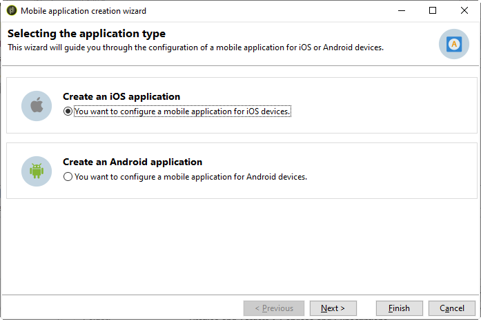

# Passaggi di configurazione per iOS {#configuring-the-mobile-application-in-adobe-campaign-ios}

Una volta installato il pacchetto, puoi definire le impostazioni dell’app iOS in Adobe Campaign Classic.

I passaggi chiave sono i seguenti:

1. [Configurare l’account esterno di iOS](#configuring-external-account-ios)
1. [Configurare il servizio iOS](#configuring-ios-service)
1. [Integrare l’app mobile iOS in Campaign](#creating-ios-app)

Potrai quindi [creare una notifica push per dispositivi iOS](create-notifications-ios.md).

## Configurare l’account esterno di iOS {#configuring-external-account-ios}

Per iOS, il connettore iOS HTTP/2 invia notifiche all’APN HTTP/2.

Per configurare questo connettore, effettua le seguenti operazioni:

1. Vai a **[!UICONTROL Administration > Platform > External accounts]**.
1. Selezionare l&#39;account esterno **[!UICONTROL iOS routing]**.
1. Nella scheda **[!UICONTROL Connector]**, compila il campo **[!UICONTROL Access URL of the connector]** con il seguente URL: ```http://localhost:8080/nms/jsp/iosHTTP2.jsp```

   

1. Fai clic su **[!UICONTROL Save]**.

Il connettore iOS è ora configurato. Puoi iniziare a creare il servizio.

## Configurare il servizio iOS {#configuring-ios-service}

>[!CAUTION]
>
>L’applicazione deve essere stata configurata per le azioni push PRIMA di qualsiasi integrazione con l’SDK Adobe.
>
>In caso contrario, consultare [questa pagina](https://developer.apple.com/documentation/usernotifications).

1. Passare al nodo **[!UICONTROL Profiles and Targets > Services and subscriptions]** e fare clic su **[!UICONTROL New]**.

   

1. Definisci **[!UICONTROL Label]** e **[!UICONTROL Internal name]**.
1. Vai al campo **[!UICONTROL Type]** e seleziona **[!UICONTROL Mobile application]**.

   >[!NOTE]
   >
   >Il mapping di destinazione predefinito **[!UICONTROL Subscriber applications (nms:appSubscriptionRcp)]** è collegato alla tabella dei destinatari. Se si desidera utilizzare una mappatura di destinazione diversa, è necessario creare una nuova mappatura di destinazione e immetterla nel campo **[!UICONTROL Target mapping]** del servizio. Per ulteriori informazioni sulla creazione della mappatura di destinazione, consulta la [Guida alla configurazione](../../configuration/using/about-custom-recipient-table.md).

   

1. Quindi fare clic sul pulsante **[!UICONTROL Add]** per selezionare il tipo di applicazione.

   

1. Crea le tue applicazioni di sviluppo e produzione per iOS. Per ulteriori informazioni, consulta questa [sezione](configuring-the-mobile-application.md#creating-ios-app).

## Creare un’app mobile di iOS {#creating-ios-app}

Dopo aver creato il servizio, crea l’applicazione iOS in Campaign. Segui i passaggi seguenti:

1. Dal servizio appena creato, fare clic sul pulsante **[!UICONTROL Add]** per selezionare il tipo di applicazione.

   

1. Viene visualizzata la seguente finestra. Selezionare **[!UICONTROL Create an iOS application]** e iniziare immettendo **[!UICONTROL Label]**.

   

1. Se necessario, puoi arricchire il contenuto di un messaggio push con alcuni **[!UICONTROL Application variables]**. Questi sono completamente personalizzabili e fanno parte del payload del messaggio inviato al dispositivo mobile.
Nell&#39;esempio seguente vengono aggiunti **mediaURl** e **mediaExt** per creare una notifica push potenziata e quindi viene fornita all&#39;applicazione l&#39;immagine da visualizzare all&#39;interno della notifica.

   

1. La scheda **[!UICONTROL Subscription parameters]** consente di definire il mapping con un&#39;estensione dello schema **[!UICONTROL Subscriber applications (nms:appsubscriptionRcp)]**.

   >[!NOTE]
   >
   >Assicurati di non utilizzare lo stesso certificato per la versione di sviluppo (sandbox) e la versione di produzione dell’applicazione.

1. La scheda **[!UICONTROL Sounds]** consente di specificare un suono da riprodurre. Fare clic su **[!UICONTROL Add]** e compilare il campo **[!UICONTROL Internal name]** che deve contenere il nome del file incorporato nell&#39;applicazione o il nome del suono di sistema.

1. Fare clic su **[!UICONTROL Next]** per avviare la configurazione dell&#39;applicazione di sviluppo.

1. Assicurati che lo stesso **[!UICONTROL Integration key]** sia definito in Adobe Campaign e nel codice dell&#39;applicazione tramite l&#39;SDK. <!--For more on this, refer to [this page](integrating-campaign-sdk-into-the-mobile-application.md).--> Questa chiave di integrazione, specifica per ogni applicazione, consente di collegare l&#39;applicazione mobile alla piattaforma Adobe Campaign.

   >[!NOTE]
   >
   > **[!UICONTROL Integration key]** è completamente personalizzabile con valore stringa, ma deve essere esattamente lo stesso specificato nell&#39;SDK.

1. Seleziona una delle icone predefinite nel campo **[!UICONTROL Application icon]** per personalizzare l&#39;app mobile nel servizio.

1. Seleziona **[!UICONTROL Authentication mode]**.

   

   Sono disponibili due modalità:

   * (Consigliato) **[!UICONTROL Token-based authentication]**: inserisci le impostazioni di connessione APNs **[!UICONTROL Key Id]**, **[!UICONTROL Team Id]** e **[!UICONTROL Bundle Id]**, quindi seleziona il certificato p8 facendo clic su **[!UICONTROL Enter the private key...]**. Per ulteriori informazioni su **[!UICONTROL Token-based authentication]**, consulta la [documentazione di Apple](https://developer.apple.com/documentation/usernotifications/setting_up_a_remote_notification_server/establishing_a_token-based_connection_to_apns){target="_blank"}.

   * **[!UICONTROL Certificate-based authentication]**: fare clic su **[!UICONTROL Enter the certificate...]**, quindi selezionare la chiave p12 e immettere la password fornita dallo sviluppatore dell&#39;app mobile.

   >[!NOTE]
   >
   > L&#39;Adobe consiglia di utilizzare **[!UICONTROL Token-based authentication]** per la configurazione di iOS, in quanto le chiavi di autenticazione P8 sono più recenti e più sicure.

1. Utilizza il pulsante **[!UICONTROL Test the connection]** per convalidare la configurazione.

1. Fare clic su **[!UICONTROL Next]** per avviare la configurazione dell&#39;applicazione di produzione e seguire gli stessi passaggi descritti in precedenza.


1. Fai clic su **[!UICONTROL Finish]**.

L’applicazione iOS è ora pronta per essere utilizzata in Campaign Classic.
