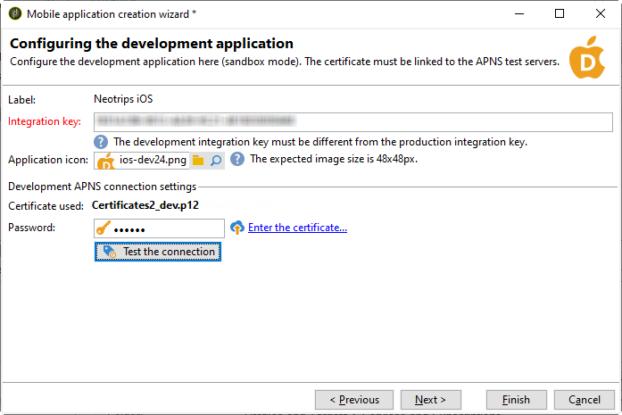

# Passaggi di configurazione per iOS {#configuring-the-mobile-application-in-adobe-campaign-ios}

Una volta installato il pacchetto, puoi definire le impostazioni dell’app iOS in Adobe Campaign Classic.

I passaggi chiave sono i seguenti:

1. [Configurare l’account esterno di iOS](#configuring-external-account-ios)
1. [Configurare il servizio iOS](#configuring-ios-service)
1. [Integrare l’app mobile iOS in Campaign](#creating-ios-app)

Potrai quindi [creare una notifica push per dispositivi iOS](create-notifications-ios.md).

## Configurare l’account esterno di iOS {#configuring-external-account-ios}

Per iOS, il connettore iOS HTTP/2 invia notifiche all’APN HTTP/2.

Per configurare questo connettore, effettua le seguenti operazioni:

1. Vai a **[!UICONTROL Administration > Platform > External accounts]**.
1. Seleziona la **[!UICONTROL iOS routing]** account esterno.
1. In **[!UICONTROL Connector]** , compila la scheda **[!UICONTROL Access URL of the connector]** con il seguente URL: ```http://localhost:8080/nms/jsp/iosHTTP2.jsp```

   

1. Fai clic su **[!UICONTROL Save]**.

Il connettore iOS è ora configurato. Puoi iniziare a creare il servizio.

## Configurare il servizio iOS {#configuring-ios-service}

>[!CAUTION]
>
>L’applicazione deve essere stata configurata per le azioni push PRIMA di qualsiasi integrazione con l’SDK Adobe.
>
>In caso contrario, consultare [questa pagina](https://developer.apple.com/documentation/usernotifications).

1. Vai a **[!UICONTROL Profiles and Targets > Services and subscriptions]** e fai clic su **[!UICONTROL New]**.

   

1. Definisci un **[!UICONTROL Label]** e un **[!UICONTROL Internal name]**.
1. Vai a **[!UICONTROL Type]** e seleziona **[!UICONTROL Mobile application]**.

   >[!NOTE]
   >
   >Il valore predefinito **[!UICONTROL Subscriber applications (nms:appSubscriptionRcp)]** la mappatura di destinazione è collegata alla tabella dei destinatari. Se desideri utilizzare una mappatura di destinazione diversa, devi creare una nuova mappatura di destinazione e immetterla nella **[!UICONTROL Target mapping]** del servizio. Per ulteriori informazioni sulla creazione della mappatura di destinazione, consulta [Guida alla configurazione](../../configuration/using/about-custom-recipient-table.md).

   

1. Quindi fai clic su **[!UICONTROL Add]** per selezionare il tipo di applicazione.

   

1. Crea le tue applicazioni di sviluppo e produzione per iOS. Per ulteriori informazioni, consulta questa [sezione](configuring-the-mobile-application.md#creating-ios-app).

## Creare un’app mobile di iOS {#creating-ios-app}

Dopo aver creato il servizio, crea l’applicazione iOS in Campaign. Segui i passaggi seguenti:

1. Dal servizio appena creato, fai clic su **[!UICONTROL Add]** per selezionare il tipo di applicazione.

   

1. Viene visualizzata la seguente finestra. Seleziona **[!UICONTROL Create an iOS application]** e inizia immettendo il **[!UICONTROL Label]**.

   

1. Come opzione, puoi arricchire il contenuto di un messaggio push con **[!UICONTROL Application variables]** se necessario. Questi sono completamente personalizzabili e fanno parte del payload del messaggio inviato al dispositivo mobile.
Nell’esempio seguente, aggiungiamo **mediaURl** e **mediaExt** per creare una notifica push potenziata e quindi fornire all’applicazione l’immagine da visualizzare all’interno della notifica.

   

1. Il **[!UICONTROL Subscription parameters]** consente di definire la mappatura con un’estensione del **[!UICONTROL Subscriber applications (nms:appsubscriptionRcp)]** schema.

   >[!NOTE]
   >
   >Assicurati di non utilizzare lo stesso certificato per la versione di sviluppo (sandbox) e la versione di produzione dell’applicazione.

1. Il **[!UICONTROL Sounds]** consente di specificare un suono da riprodurre. Clic **[!UICONTROL Add]** e riempimento **[!UICONTROL Internal name]** che deve contenere il nome del file incorporato nell&#39;applicazione o il nome del suono di sistema.

1. Clic **[!UICONTROL Next]** per avviare la configurazione dell&#39;applicazione di sviluppo.

1. Assicurati che lo stesso **[!UICONTROL Integration key]** è definito in Adobe Campaign e nel codice dell’applicazione tramite l’SDK. Per ulteriori informazioni, consulta [questa pagina](integrating-campaign-sdk-into-the-mobile-application.md). Questa chiave di integrazione, specifica per ogni applicazione, consente di collegare l’app mobile alla piattaforma Adobe Campaign.

   >[!NOTE]
   >
   > Il **[!UICONTROL Integration key]** è completamente personalizzabile con un valore stringa, ma deve essere esattamente lo stesso specificato nell’SDK.

1. Seleziona una delle icone pronte all’uso dal menu **[!UICONTROL Application icon]** per personalizzare l’app mobile nel servizio.

1. Seleziona **[!UICONTROL Authentication mode]**. Puoi sempre modificare la modalità di autenticazione in un secondo momento nella sezione **[!UICONTROL Certificate]** della tua app mobile.
   * **[!UICONTROL Certificate-based authentication]**: fai clic **[!UICONTROL Enter the certificate...]**  quindi seleziona la chiave p12 e immetti la password fornita dallo sviluppatore dell’app mobile.
   * **[!UICONTROL Token-based authentication]**: specifica le impostazioni di connessione **[!UICONTROL Key ID]**, **[!UICONTROL Team ID]** e **[!UICONTROL Bundle ID]** quindi seleziona il certificato p8 facendo clic su **[!UICONTROL Enter the private key]**. Per ulteriori informazioni su **[!UICONTROL Token-based authentication]**, fare riferimento a [Documentazione di Apple](https://developer.apple.com/documentation/usernotifications/setting_up_a_remote_notification_server/establishing_a_token-based_connection_to_apns).

   >[!NOTE]
   >
   > L’Adobe consiglia di utilizzare **[!UICONTROL Token-based authentication]** per la configurazione di iOS, in quanto questa modalità di autenticazione è più protetta e non è associata alla scadenza del certificato.

   

1. Puoi fare clic su **[!UICONTROL Test the connection]** per essere sicuro che abbia successo.

1. Clic **[!UICONTROL Next]** per iniziare a configurare l’applicazione di produzione e seguire gli stessi passaggi descritti in precedenza.

   

1. Fai clic su **[!UICONTROL Finish]**.

L’applicazione iOS è ora pronta per essere utilizzata in Campaign Classic.
