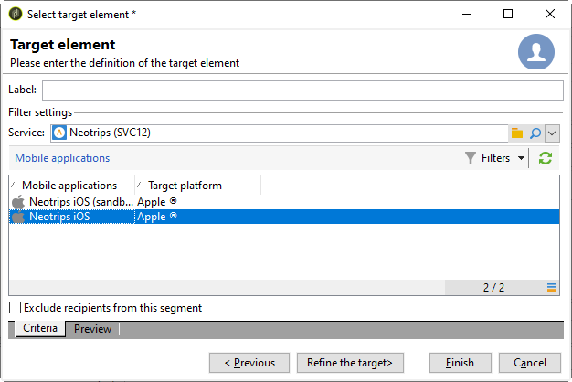

# Configurazione dell’app mobile in Adobe Campaign {#configuring-the-mobile-application-in-adobe-campaign}

Di seguito è riportato un esempio di configurazione basato su una società che vende pacchetti per le vacanze online. La sua applicazione mobile (Neotrips) è disponibile ai suoi clienti in due versioni: Neotrips per Android e Neotrips per iOS. Per configurare l’applicazione mobile in  Adobe Campaign, è necessario:

* Crea un servizio di informazioni sui **[!UICONTROL Mobile application]** tipi per l’applicazione mobile Neotrips.
* Aggiungete al servizio le versioni iOS e Android dell&#39;applicazione.
* Create una consegna sia per iOS che per Android.

>[!NOTE]
>
>Passate alla **[!UICONTROL Subscriptions]** scheda del servizio per visualizzare l’elenco degli utenti iscritti al servizio, ovvero tutti gli utenti che hanno installato l’applicazione sul proprio dispositivo mobile e hanno accettato di ricevere le notifiche.

## Configurazione dell’applicazione mobile con iOS {#configuring-the-mobile-application-ios}

>[!CAUTION]
>
>L&#39;applicazione deve essere stata configurata per le azioni push PRIMA di qualsiasi integrazione  Adobe Campaign SDK.
>
>In caso contrario, fare riferimento a [questa pagina](https://developer.apple.com/library/archive/documentation/NetworkingInternet/Conceptual/RemoteNotificationsPG/).

### Passaggio 1: Installazione del pacchetto {#installing-package-ios}

1. Accedete alla procedura guidata di importazione dei pacchetti **[!UICONTROL Tools > Advanced > Package import...]** nella console client Adobe Campaign .

   

1. Seleziona **[!UICONTROL Install a standard package]**.

1. Nell&#39;elenco visualizzato, selezionare **[!UICONTROL Mobile App Channel]**.

   

1. Fate clic **[!UICONTROL Next]**, quindi **[!UICONTROL Start]** per avviare l&#39;installazione del pacchetto.

   Una volta installati i pacchetti, la barra di avanzamento mostra il **100%** ed è possibile visualizzare il seguente messaggio nei registri di installazione: **[!UICONTROL Installation of packages successful]**.

   

1. **[!UICONTROL Close]** la finestra di installazione.

### Passaggio 2: Configurazione dell&#39;account esterno iOS {#configuring-external-account-ios}

Per iOS, sono disponibili due connettori:

* Il connettore binario iOS invia le notifiche sul server binario precedente APNS.
* Il connettore iOS HTTP/2 invia le notifiche all&#39;APNS HTTP/2.

Per scegliere quale connettore utilizzare, procedere come segue:

1. Vai a **[!UICONTROL Administration > Platform > External accounts]**.
1. Select the **[!UICONTROL iOS routing]** external account.
1. Nella **[!UICONTROL Connector]** scheda, compila il **[!UICONTROL Access URL of the connector]** campo:

   Per iOS HTTP2: http://localhost:8080/nms/jsp/iosHTTP2.jsp

   

   >[!NOTE]
   >
   > È inoltre possibile configurarlo come segue https://localhost:8080/nms/jsp/ios.jsp, ma si consiglia di utilizzare la versione 2 del connettore.

1. Fai clic su **[!UICONTROL Save]**.

Il connettore iOS è ora configurato. Potete iniziare a creare il servizio.

### Passaggio 3: Configurazione del servizio iOS {#configuring-ios-service}

1. Vai al **[!UICONTROL Profiles and Targets > Services and subscriptions]** nodo e fai clic su **[!UICONTROL New]**.

   

1. Define a **[!UICONTROL Label]** and an **[!UICONTROL Internal name]**.
1. Vai al **[!UICONTROL Type]** campo e seleziona **[!UICONTROL Mobile application]**.

   >[!NOTE]
   >
   >Il mapping di **[!UICONTROL Subscriber applications (nms:appSubscriptionRcp)]** destinazione predefinito è collegato alla tabella dei destinatari. Se desiderate utilizzare un mapping di destinazione diverso, dovete creare un nuovo mapping di destinazione e immetterlo nel **[!UICONTROL Target mapping]** campo del servizio. Per ulteriori informazioni sulla creazione della mappatura di destinazione, consulta la guida [alla](../../configuration/using/about-custom-recipient-table.md)configurazione.

   

1. Quindi fate clic sul **[!UICONTROL Add]** pulsante per selezionare il tipo di applicazione.

   

1. Viene visualizzata la finestra seguente. Seleziona **[!UICONTROL Create an iOS application]** e inizia inserendo il **[!UICONTROL Label]**.

   

1. Come opzione, puoi arricchire il contenuto di un messaggio push con alcuni **[!UICONTROL Application variables]** se necessario. Sono completamente personalizzabili e una parte del payload di messaggi inviato al dispositivo mobile.
Nell&#39;esempio seguente, aggiungiamo **mediaURl** e **mediaExt** per creare una notifica push potenziata e quindi fornisce all&#39;applicazione l&#39;immagine da visualizzare all&#39;interno della notifica.

   

1. La **[!UICONTROL Subscription parameters]** scheda consente di definire la mappatura con un&#39;estensione dello **[!UICONTROL Subscriber applications (nms:appsubscriptionRcp)]** schema.

   >[!NOTE]
   >
   >Accertatevi di non utilizzare lo stesso certificato per la versione di sviluppo (sandbox) e per la versione di produzione dell&#39;applicazione.

1. La **[!UICONTROL Sounds]** scheda consente di specificare un suono da riprodurre. Fare clic **[!UICONTROL Add]** e compilare il **[!UICONTROL Internal name]** campo che deve contenere il nome del file incorporato nell&#39;applicazione o il nome dell&#39;audio di sistema.

1. Fare clic **[!UICONTROL Next]** per avviare la configurazione dell&#39;applicazione di sviluppo.

1. Assicurati che lo stesso **[!UICONTROL Integration key]** sia definito in  Adobe Campaign e nel codice dell’applicazione tramite l’SDK. Per ulteriori informazioni, consulta: [Integrazione di Campaign SDK nell&#39;applicazione](../../delivery/using/integrating-campaign-sdk-into-the-mobile-application.md)mobile. Questa chiave di integrazione, specifica per ogni applicazione, consente di collegare l’applicazione mobile alla piattaforma Adobe Campaign .

   >[!NOTE]
   >
   > L’ **[!UICONTROL Integration key]** impostazione è completamente personalizzabile con il valore stringa, ma deve corrispondere esattamente a quella specificata nell’SDK.

1. Seleziona una delle icone predefinite dal **[!UICONTROL Application icon]** campo per personalizzare l’applicazione mobile nel servizio.

1. Fate clic sul **[!UICONTROL Enter the certificate...]** collegamento, quindi selezionate il certificato di autenticazione e immettete la password fornita dallo sviluppatore di applicazioni mobili. Potete fare clic **[!UICONTROL Test the connection]** per verificare che abbia esito positivo.

   >[!NOTE]
   >
   >Apple richiede certificati diversi per le versioni Sviluppo e Produzione di una stessa applicazione mobile. Dovrete configurare le due applicazioni separate in  Adobe Campaign.

   

1. Fare clic **[!UICONTROL Next]** per avviare la configurazione dell&#39;applicazione di produzione e seguire gli stessi passaggi descritti in precedenza.

   

1. Fai clic su **[!UICONTROL Finish]**. L&#39;applicazione iOS è ora pronta per essere utilizzata in Campaign Classic.

### Passaggio 4: Creazione di una notifica iOS RTF {#creating-ios-delivery}

Con iOS 10 o versione successiva, è possibile generare notifiche avanzate.  Adobe Campaign può inviare notifiche utilizzando variabili che consentiranno al dispositivo di visualizzare una notifica RTF.

È ora necessario creare una nuova consegna e collegarla all’applicazione mobile creata.

1. Vai a **[!UICONTROL Campaign management]** > **[!UICONTROL Deliveries]**.

1. Fai clic su **[!UICONTROL New]**.

   

1. Seleziona **[!UICONTROL Deliver on iOS (ios)]** nell’ **[!UICONTROL Delivery template]** elenco a discesa. Aggiungi un **[!UICONTROL Label]** biglietto alla consegna.

1. Fare clic **[!UICONTROL To]** per definire la popolazione di destinazione. Per impostazione predefinita, viene applicata la mappatura della **[!UICONTROL Subscriber application]** destinazione. Fate clic **[!UICONTROL Add]** per selezionare il servizio creato in precedenza.

   

1. Nella **[!UICONTROL Target type]** finestra, selezionare **[!UICONTROL Subscribers of an iOS mobile application (iPhone, iPad)]** e fare clic su **[!UICONTROL Next]**.

1. Nell&#39; **[!UICONTROL Service]** elenco a discesa, selezionate il servizio creato in precedenza e quindi l&#39;applicazione di destinazione e fate clic su **[!UICONTROL Finish]**.
Le **[!UICONTROL Application variables]** vengono aggiunte automaticamente in base a quanto è stato aggiunto durante i passaggi di configurazione.

   

1. Modificate la notifica RTF.

   

1. Selezionate la **[!UICONTROL Mutable content]** casella nella finestra di notifica di modifica per consentire all’applicazione mobile di scaricare il contenuto multimediale.

1. Fai clic su **[!UICONTROL Save]** e invia la consegna.

L&#39;immagine e la pagina Web devono essere visualizzate nella notifica push quando vengono ricevute sui dispositivi iOS mobili degli abbonati.

## Configurazione dell’applicazione mobile con Android {#configuring-the-mobile-application-android}

### Passaggio 1: Installazione del pacchetto {#installing-package-android}

1. Accedete alla procedura guidata di importazione dei pacchetti **[!UICONTROL Tools > Advanced > Package import...]** nella console client Adobe Campaign .

   

1. Seleziona **[!UICONTROL Install a standard package]**.

1. Nell&#39;elenco visualizzato, selezionare **[!UICONTROL Mobile App Channel]**.

   

1. Fate clic **[!UICONTROL Next]**, quindi **[!UICONTROL Start]** per avviare l&#39;installazione del pacchetto.

   Una volta installati i pacchetti, la barra di avanzamento mostra il **100%** ed è possibile visualizzare il seguente messaggio nei registri di installazione: **[!UICONTROL Installation of packages successful]**.

   

1. **[!UICONTROL Close]** la finestra di installazione.

### Passaggio 2: Configurazione dell&#39;account esterno Android {#configuring-external-account-android}

Per Android sono disponibili due connettori:

* Connettore V1 che consente una connessione per MTA figlio.
* Connettore V2 che consente connessioni simultanee al server FCM per migliorare il throughput.

Per scegliere quale connettore utilizzare, procedere come segue:

1. Vai a **[!UICONTROL Administration > Platform > External accounts]**.
1. Select the **[!UICONTROL Android routing]** external account.
1. Nella **[!UICONTROL Connector]** scheda, compila il **[!UICONTROL JavaScript used in the connector]** campo:

   Per Android V2: https://localhost:8080/nms/jsp/androidPushConnectorV2.js

   >[!NOTE]
   >
   > È inoltre possibile configurarlo come segue https://localhost:8080/nms/jsp/androidPushConnector.js, ma si consiglia di utilizzare la versione 2 del connettore.

   

1. Per Android V2, un parametro aggiuntivo è disponibile nel file di configurazione del server di Adobe  (serverConf.xml):

   * **maxGCMConnectPerChild**: Limite massimo di richieste HTTP parallele a FCM avviate da ciascun server figlio (per impostazione predefinita, 8).

### Passaggio 3: Configurazione del servizio Android {#configuring-android-service}

1. Vai al **[!UICONTROL Profiles and Targets > Services and subscriptions]** nodo e fai clic su **[!UICONTROL New]**.

   

1. Define a **[!UICONTROL Label]** and an **[!UICONTROL Internal name]**.
1. Vai al **[!UICONTROL Type]** campo e seleziona **[!UICONTROL Mobile application]**.

   >[!NOTE]
   >
   >Il mapping di **[!UICONTROL Subscriber applications (nms:appSubscriptionRcp)]** destinazione predefinito è collegato alla tabella dei destinatari. Se desiderate utilizzare un mapping di destinazione diverso, dovete creare un nuovo mapping di destinazione e immetterlo nel **[!UICONTROL Target mapping]** campo del servizio. Per ulteriori informazioni sulla creazione della mappatura di destinazione, consulta la guida [alla](../../configuration/using/about-custom-recipient-table.md)configurazione.

   

1. Quindi fate clic sul **[!UICONTROL Add]** pulsante per selezionare il tipo di applicazione.

   

1. Seleziona **[!UICONTROL Create an Android application]**.

   

1. Immettete un **[!UICONTROL Label]**.

1. Assicurati che lo stesso **[!UICONTROL Integration key]** sia definito in  Adobe Campaign e nel codice dell’applicazione tramite l’SDK. Per ulteriori informazioni, consulta: [Integrazione di Campaign SDK nell&#39;applicazione](../../delivery/using/integrating-campaign-sdk-into-the-mobile-application.md)mobile.

   >[!NOTE]
   >
   > L’ **[!UICONTROL Integration key]** impostazione è completamente personalizzabile con il valore stringa, ma deve corrispondere esattamente a quella specificata nell’SDK.

1. Seleziona una delle icone predefinite dal **[!UICONTROL Application icon]** campo per personalizzare l’applicazione mobile nel servizio.

1. Immettere le impostazioni di connessione dell&#39;applicazione: immettete la chiave di progetto fornita dallo sviluppatore dell’applicazione mobile.

1. Come opzione, puoi arricchire il contenuto di un messaggio push con alcuni **[!UICONTROL Application variables]** se necessario. Sono completamente personalizzabili e una parte del payload di messaggi inviato al dispositivo mobile.

   Nell&#39;esempio seguente, aggiungiamo **titolo**, **imageURL** e **iconURL** per creare una notifica push potenziata e quindi fornisce all&#39;applicazione l&#39;immagine, il titolo e l&#39;icona da visualizzare all&#39;interno della notifica.

   

1. Fai clic su **[!UICONTROL Finish]**, quindi su **[!UICONTROL Save]**. L&#39;applicazione Android ora è pronta per essere utilizzata in Campaign Classic.

Per impostazione predefinita,  Adobe Campaign salva una chiave nel campo **[!UICONTROL User identifier]** (@userKey) della **[!UICONTROL Subscriber applications (nms:appSubscriptionRcp)]** tabella. Questa chiave consente di collegare un&#39;iscrizione a un destinatario. Per raccogliere dati aggiuntivi (ad esempio una chiave di riconciliazione complessa), è necessario applicare la seguente configurazione:

1. Create un&#39;estensione dello **[!UICONTROL Subscriber applications (nms:appsubscriptionRcp)]** schema e definite i nuovi campi.
1. Definite la mappatura nella **[!UICONTROL Subscription parameters]** scheda.
   >[!CAUTION]
   >
   >Accertatevi che i nomi di configurazione nella **[!UICONTROL Subscription parameters]** scheda siano identici a quelli nel codice dell&#39;applicazione mobile. Fai riferimento all&#39;SDK [Integrating Campaign nella sezione dell&#39;applicazione](../../delivery/using/integrating-campaign-sdk-into-the-mobile-application.md) mobile.

### Passaggio 4: Creazione di una notifica Android rich {#creating-android-delivery}

È ora necessario creare una nuova consegna e collegarla all’applicazione mobile creata.

1. Vai a **[!UICONTROL Campaign management]** > **[!UICONTROL Deliveries]**.

1. Fai clic su **[!UICONTROL New]**.

   

1. Seleziona **[!UICONTROL Deliver on Android (android)]** nell’ **[!UICONTROL Delivery template]** elenco a discesa. Aggiungi un **[!UICONTROL Label]** biglietto alla consegna.

1. Fare clic **[!UICONTROL To]** per definire la popolazione di destinazione. Per impostazione predefinita, viene applicata la mappatura della **[!UICONTROL Subscriber application]** destinazione. Fate clic **[!UICONTROL Add]** per selezionare il servizio creato in precedenza.

   

1. Nella **[!UICONTROL Target type]** finestra, selezionate Sottoscrittori di un’applicazione mobile Android e fate clic su **[!UICONTROL Next]**.

1. Nell&#39; **[!UICONTROL Service]** elenco a discesa, seleziona il servizio creato in precedenza, quindi l&#39;applicazione e fai clic su **[!UICONTROL Finish]**.
Le **[!UICONTROL Application variables]** vengono aggiunte automaticamente in base a quanto è stato aggiunto durante i passaggi di configurazione.

   

1. Modificate la notifica RTF.

   

1. Fai clic su **[!UICONTROL Save]** e invia la consegna.

L&#39;immagine e la pagina Web devono essere visualizzate nella notifica push quando vengono ricevute sui dispositivi mobili Android degli abbonati.

