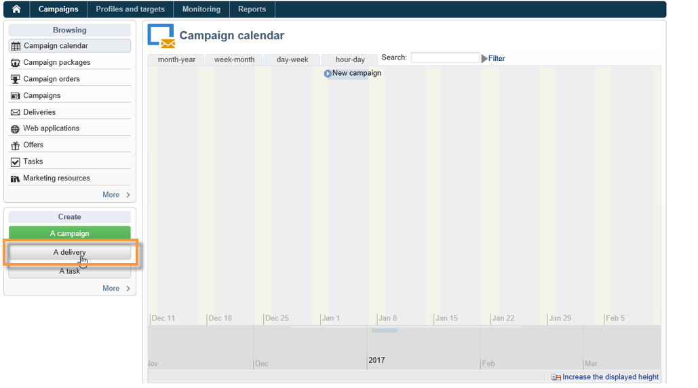

# Creare notifiche per Android{#create-notificaations-android}

Utilizza Adobe Campaign per inviare notifiche push su dispositivi Android. I concetti globali sulla creazione della consegna sono presentati in [questa sezione](steps-about-delivery-creation-steps.md).

Inizia creando una nuova consegna.

Con Firebase Cloud Messaging puoi scegliere tra due tipi di messaggi:

* **[!UICONTROL Data message]**, gestito dall&#39;app client.
   I messaggi vengono inviati direttamente all&#39;app mobile che genererà e visualizzerà la notifica Android al dispositivo. I messaggi di dati contengono solo variabili dell’applicazione personalizzate.

* **[!UICONTROL Notification message]**, gestito automaticamente da FCM SDK.
    FCM visualizza automaticamente il messaggio sui dispositivi degli utenti per conto dell&#39;app client. I messaggi di notifica contengono un set preimpostato di parametri e opzioni, ma possono ancora essere personalizzati con variabili personalizzate dell’applicazione.

Per ulteriori informazioni sui tipi di messaggi Firebase Cloud Messaging, consulta la [documentazione FCM](https://firebase.google.com/docs/cloud-messaging/concept-options#notifications_and_data_messages){target="_blank"}.

## Creare un messaggio dati {#creating-data-message}

1. Vai a **[!UICONTROL Campaign management]** > **[!UICONTROL Deliveries]**.

1. Fai clic su **[!UICONTROL New]**.

   

1. Selezionare **[!UICONTROL Deliver on Android (android)]** nel menu a discesa **[!UICONTROL Delivery template]**. Aggiungi **[!UICONTROL Label]** alla consegna.

1. Fare clic su **[!UICONTROL To]** per definire la popolazione di destinazione. Per impostazione predefinita, viene applicata la mappatura di destinazione **[!UICONTROL Subscriber application]**. Fare clic su **[!UICONTROL Add]** per selezionare il servizio.

   

1. Nella finestra **[!UICONTROL Target type]**, selezionare **[!UICONTROL Subscribers of an Android mobile application]** e fare clic su **[!UICONTROL Next]**.

1. Nel menu a discesa **[!UICONTROL Service]**, seleziona il servizio creato in precedenza, quindi l&#39;applicazione e fai clic su **[!UICONTROL Finish]**.
I **[!UICONTROL Application variables]** vengono aggiunti automaticamente a seconda di ciò che è stato aggiunto durante i passaggi di configurazione.

   

1. Seleziona **[!UICONTROL data message]** come **[!UICONTROL Message Type]**.

1. Modifica la notifica avanzata.

   

1. Se necessario, puoi aggiungere informazioni in **[!UICONTROL Application variables]** configurato in precedenza. **[!UICONTROL Application variables]** deve essere configurato nel servizio Android e fa parte del payload del messaggio inviato al dispositivo mobile.

1. Fai clic su **[!UICONTROL Save]** e invia la consegna.

L’immagine e la pagina web devono essere visualizzate nella notifica push quando vengono ricevute sui dispositivi mobili Android degli abbonati.

## Creare un messaggio di notifica {#creating-notification-message}

 [Scopri come creare una notifica push di Android in un video](https://experienceleague.adobe.com/docs/campaign-classic-learn/getting-started-with-push-notifications-for-android/configuring-and-sending-push-notifications.html#additional-resources){target="_blank"}.

1. Vai a **[!UICONTROL Campaign management]** > **[!UICONTROL Deliveries]**.

1. Fai clic su **[!UICONTROL New]**.

   

1. Selezionare **[!UICONTROL Deliver on Android (android)]** nel menu a discesa **[!UICONTROL Delivery template]**. Aggiungi **[!UICONTROL Label]** alla consegna.

1. Fare clic su **[!UICONTROL To]** per definire la popolazione di destinazione. Per impostazione predefinita, viene applicata la mappatura di destinazione **[!UICONTROL Subscriber application]**. Fare clic su **[!UICONTROL Add]** per selezionare il servizio.

   

1. Nella finestra **[!UICONTROL Target type]**, selezionare **[!UICONTROL Subscribers of an Android mobile application]** e fare clic su **[!UICONTROL Next]**.

1. Nel menu a discesa **[!UICONTROL Service]**, seleziona il servizio creato in precedenza, quindi l&#39;applicazione e fai clic su **[!UICONTROL Finish]**.

   

1. Seleziona **[!UICONTROL notification message]** come **[!UICONTROL Message Type]**.

1. Aggiungi un titolo e modifica il messaggio. Personalizza la notifica push con **[!UICONTROL Notification options]**:

   * **[!UICONTROL Channel ID]**: imposta l&#39;ID canale della notifica. L’app deve creare un canale con questo ID canale prima di ricevere qualsiasi notifica con questo ID canale.
   * **[!UICONTROL Sound]**: impostare l&#39;audio da riprodurre quando il dispositivo riceve la notifica.
   * **[!UICONTROL Color]**: imposta il colore dell&#39;icona della notifica.
   * **[!UICONTROL Icon]**: imposta l&#39;icona della notifica in modo che venga visualizzata sui dispositivi dei profili.
   * **[!UICONTROL Tag]**: impostare l&#39;identificatore utilizzato per sostituire le notifiche esistenti nel cassetto delle notifiche.
   * **[!UICONTROL Click action]**: imposta l&#39;azione associata a un utente che fa clic sulla notifica.

   Per ulteriori informazioni su **[!UICONTROL Notification options]** e su come compilare questi campi, consulta la [documentazione FCM](https://firebase.google.com/docs/reference/fcm/rest/v1/projects.messages#androidnotification){target="_blank"}.

   

1. Se l&#39;applicazione è configurata con il protocollo API HTTP v1, è possibile personalizzare ulteriormente la notifica push con **[!UICONTROL HTTPV1 additional options]** seguente:

   * **[!UICONTROL Ticker]**: imposta il testo del ticker della notifica. Disponibile solo per i dispositivi impostati su Android 5.0 Lollipop.
   * **[!UICONTROL Image]**: imposta l&#39;URL dell&#39;immagine da visualizzare nella notifica.
   * **[!UICONTROL Notification Count]**: impostare il numero di nuove informazioni non lette da visualizzare direttamente sull&#39;icona dell&#39;applicazione.
   * **[!UICONTROL Sticky]**: Impostare su true o false. Se impostato su false, la notifica viene automaticamente ignorata quando l’utente fa clic su di essa. Se impostato su true, la notifica viene comunque visualizzata anche quando l’utente fa clic su di essa.
   * **[!UICONTROL Notification Priority]**: impostare i livelli di priorità della notifica su predefinito, minimo, minimo o massimo. Per ulteriori informazioni, consulta la [documentazione FCM &#x200B;](https://firebase.google.com/docs/reference/fcm/rest/v1/projects.messages#NotificationPriority).
   * **[!UICONTROL Visibility]**: impostare i livelli di visibilità della notifica su public, private o secret. Per ulteriori informazioni, consulta la [documentazione FCM &#x200B;](https://firebase.google.com/docs/reference/fcm/rest/v1/projects.messages#visibility).

   Per ulteriori informazioni su **[!UICONTROL HTTP v1 additional options]** e su come compilare questi campi, consulta la [documentazione FCM](https://firebase.google.com/docs/reference/fcm/rest/v1/projects.messages#androidnotification){target="_blank"}.

   

1. Se necessario, puoi aggiungere informazioni in **[!UICONTROL Application variables]** configurato in precedenza. **[!UICONTROL Application variables]** deve essere configurato nel servizio Android e fa parte del payload del messaggio inviato al dispositivo mobile.

1. Fai clic su **[!UICONTROL Save]** e invia la consegna.

L’immagine e la pagina web devono essere visualizzate nella notifica push quando vengono ricevute sui dispositivi mobili Android degli abbonati.
