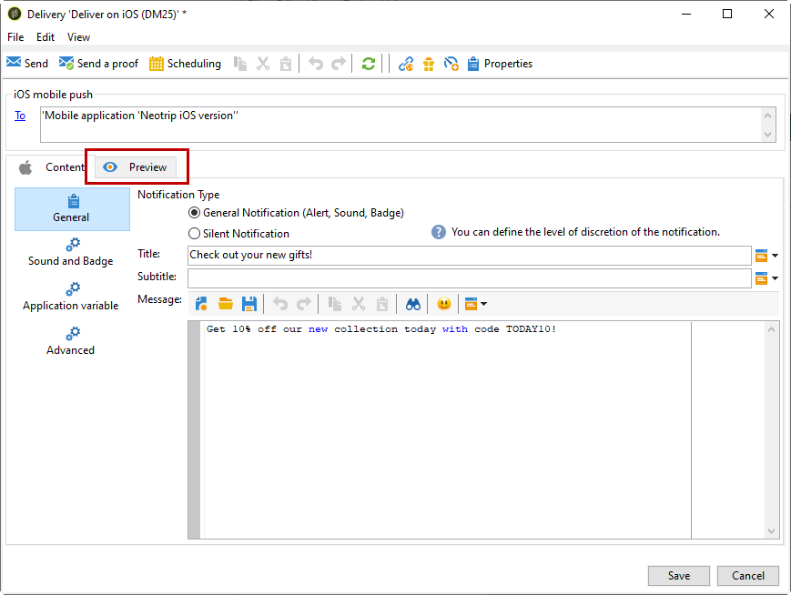

# Creare notifiche per iOS{#create-notifications-ios}

Questa sezione descrive gli elementi specifici per la consegna delle notifiche iOS. I concetti globali sulla creazione delle consegne sono descritti in [questa sezione](steps-about-delivery-creation-steps.md).

Inizia creando una nuova consegna.

Per creare una notifica push per i dispositivi iOS, segui la procedura seguente:

1. Seleziona la **[!UICONTROL Deliver on iOS]** modello di consegna.

   

1. Per definire il target della notifica, fai clic sul pulsante **[!UICONTROL To]** collegamento, quindi fai clic su **[!UICONTROL Add]**.

   

   >[!NOTE]
   >
   >Il processo dettagliato durante la selezione della popolazione target di una consegna viene presentato in [questa sezione](steps-defining-the-target-population.md).
   >
   >Per ulteriori informazioni sull’utilizzo dei campi di personalizzazione, consulta [questa sezione](about-personalization.md).
   >
   >Per ulteriori informazioni sull’inclusione di un elenco di sementi, consulta [Informazioni sugli indirizzi di seed](about-seed-addresses.md).

1. Seleziona **[!UICONTROL Subscribers of an iOS mobile application (iPhone, iPad)]**, seleziona il servizio relativo all’app mobile (in questo caso Neotrips), quindi seleziona la versione iOS dell’applicazione.

   

1. Seleziona il tipo di notifica: **[!UICONTROL Alert]**, **[!UICONTROL Badge]** oppure **[!UICONTROL Alert and badge]** o **[!UICONTROL Silent Push]**.

   

   >[!NOTE]
   >
   >La **Push silenzioso** consente di inviare una notifica &quot;silenziosa&quot; a un’app mobile. L&#39;utente non viene informato dell&#39;arrivo della notifica. Viene trasferito direttamente all&#39;applicazione.

1. In **[!UICONTROL Title]** , immetti l’etichetta del titolo che desideri visualizzare nella notifica. Viene visualizzato solo nell’elenco delle notifiche disponibili dal centro notifiche. Questo campo ti consente di definire il valore del **title** del payload di notifica iOS.

1. Se utilizzi il connettore HTTP/2, puoi aggiungere un sottotitolo (valore del **sottotitolo** del payload di notifica iOS). Fai riferimento a [questa sezione](configuring-the-mobile-application.md).

1. Quindi inserisci il **[!UICONTROL Message]** e **[!UICONTROL Value of the badge]** in base al tipo di notifica scelto.

   

   >[!NOTE]
   >
   >**[!UICONTROL Badge]** e **[!UICONTROL Alert and badge]** le notifiche di tipo ti consentono di modificare il valore del badge (il numero sopra il logo dell’app mobile). Per aggiornare il badge, è sufficiente immettere 0 come valore. Se il campo è vuoto, il valore del badge non viene modificato.

1. Fai clic sul pulsante **[!UICONTROL Insert emoticon]** per inserire gli emoticon nella notifica push. Per personalizzare l’elenco degli emoticon, consulta [questa sezione](customizing-emoticon-list.md)

1. La **[!UICONTROL Action button]** consente di definire un’etichetta per il pulsante di azione visualizzato nelle notifiche di avviso (**action_loc_key** campo del payload). Se l&#39;applicazione iOS gestisce stringhe localizzabili (**Localizable.strings**), immetti la chiave corrispondente in questo campo. Se l&#39;applicazione non gestisce il testo localizzabile, immettere l&#39;etichetta che si desidera visualizzare sul pulsante dell&#39;azione. Per ulteriori informazioni sulle stringhe localizzabili, consulta la sezione [Documentazione di Apple](https://developer.apple.com/library/archive/documentation/NetworkingInternet/Conceptual/RemoteNotificationsPG/CreatingtheNotificationPayload.html#//apple_ref/doc/uid/TP40008194-CH10-SW1) .
1. In **[!UICONTROL Play a sound]** selezionare il suono che deve essere riprodotto dal terminale mobile quando viene ricevuta la notifica.

   >[!NOTE]
   >
   >I suoni devono essere inclusi nell&#39;applicazione e definiti al momento della creazione del servizio. Fai riferimento a [questa sezione](configuring-the-mobile-application.md#configuring-external-account-ios).

1. In **[!UICONTROL Application variables]** immettere il valore di ciascuna variabile. Le variabili di applicazione consentono di definire il comportamento di notifica: ad esempio, puoi configurare una schermata specifica dell’applicazione da visualizzare quando l’utente attiva la notifica.

   >[!NOTE]
   >
   >Le variabili di applicazione devono essere definite nel codice dell’app mobile e immesse durante la creazione del servizio. Per ulteriori informazioni al riguardo, consulta [questa sezione](configuring-the-mobile-application.md).

1. Una volta configurata la notifica, fai clic sul pulsante **[!UICONTROL Preview]** per visualizzare in anteprima la notifica.

   

   >[!NOTE]
   >
   >Lo stile della notifica (banner o avviso) non è definito in Adobe Campaign. Dipende dalla configurazione selezionata dall’utente nelle relative impostazioni iOS. Tuttavia, Adobe Campaign ti consente di visualizzare in anteprima ogni tipo di stile di notifica. Fare clic sulla freccia in basso a destra per passare da uno stile all’altro.
   >
   >L’anteprima utilizza l’aspetto e il comportamento di iOS 10.

Per inviare una bozza e la consegna finale, utilizza lo stesso processo delle consegne e-mail.

Dopo aver inviato i messaggi, puoi monitorare e tenere traccia delle consegne. Per ulteriori informazioni, consulta queste sezioni:

* [quarantene di notifiche push](understanding-quarantine-management.md#push-notification-quarantines)
* [Monitoraggio di una consegna](about-delivery-monitoring.md)
* [Informazioni sugli errori di consegna](understanding-delivery-failures.md)

## Creare una notifica potenziata iOS {#creating-ios-delivery}

Con iOS 10 o versioni successive, è possibile generare notifiche potenziate. Adobe Campaign può inviare notifiche utilizzando variabili che consentiranno al dispositivo di visualizzare una notifica potenziata.

Ora devi creare una nuova consegna e collegarla all’app mobile creata.

1. Vai a **[!UICONTROL Campaign management]** > **[!UICONTROL Deliveries]**.

1. Fai clic su **[!UICONTROL New]**.

   

1. Seleziona **[!UICONTROL Deliver on iOS (ios)]** in **[!UICONTROL Delivery template]** a discesa. Aggiungi un **[!UICONTROL Label]** alla consegna.

1. Fai clic su **[!UICONTROL To]** per definire la popolazione di cui eseguire il targeting. Per impostazione predefinita, la **[!UICONTROL Subscriber application]** viene applicata la mappatura del target. Fai clic su **[!UICONTROL Add]** per selezionare il servizio creato in precedenza.

   

1. In **[!UICONTROL Target type]** finestra, seleziona **[!UICONTROL Subscribers of an iOS mobile application (iPhone, iPad)]** e fai clic su **[!UICONTROL Next]**.

1. In **[!UICONTROL Service]** a discesa, seleziona il servizio creato in precedenza, quindi l’applicazione di destinazione e fai clic su **[!UICONTROL Finish]**.
La **[!UICONTROL Application variables]** vengono aggiunti automaticamente in base a ciò che è stato aggiunto durante i passaggi di configurazione.

   

1. Modifica le notifiche potenziate.

   

1. Controlla la **[!UICONTROL Mutable content]** nella finestra di notifica di modifica per consentire all’app mobile di scaricare contenuti multimediali.

1. Fai clic su **[!UICONTROL Save]** e invia la tua consegna.

L’immagine e la pagina web devono essere visualizzati nella notifica push quando vengono ricevuti sui dispositivi mobili iOS degli abbonati.

