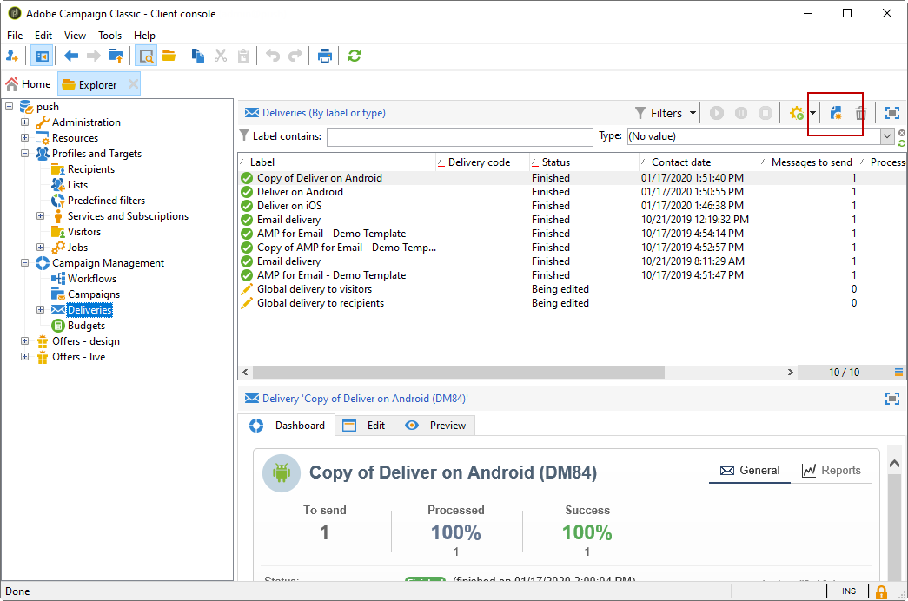

# Creare notifiche per iOS{#create-notifications-ios}

Questa sezione descrive gli elementi specifici per la consegna delle notifiche iOS. I concetti globali sulla creazione delle consegne sono descritti in [questa sezione](steps-about-delivery-creation-steps.md).

Inizia creando una nuova consegna.

Per creare una notifica push per i dispositivi iOS, segui la procedura seguente:

1. Seleziona la **[!UICONTROL Deliver on iOS]** modello di consegna.

   

1. Per definire il target della notifica, fai clic sul pulsante **[!UICONTROL To]** collegamento, quindi fai clic su **[!UICONTROL Add]**.

   

   >[!NOTE]
   >
   >Il processo dettagliato durante la selezione della popolazione target di una consegna viene presentato in [questa sezione](steps-defining-the-target-population.md).
   >
   >Per ulteriori informazioni sull’utilizzo dei campi di personalizzazione, consulta [questa sezione](about-personalization.md).
   >
   >Per ulteriori informazioni sull’inclusione di un elenco di sementi, consulta [Informazioni sugli indirizzi di seed](about-seed-addresses.md).

1. Seleziona **[!UICONTROL Subscribers of an iOS mobile application (iPhone, iPad)]**, seleziona il servizio relativo all’app mobile (in questo caso Neotrips), quindi seleziona la versione iOS dell’applicazione.

   

1. Scegli la tua **[!UICONTROL Notification type]** tra **[!UICONTROL General notification (Alert, Sound, Badge)]** o **[!UICONTROL Silent notification]**.

   

   >[!NOTE]
   >
   >La **Push silenzioso** consente di inviare una notifica &quot;silenziosa&quot; a un’app mobile. L&#39;utente non viene informato dell&#39;arrivo della notifica. Viene trasferito direttamente all&#39;applicazione.

1. In **[!UICONTROL Title]** immettere l&#39;etichetta del titolo che si desidera visualizzare nell&#39;elenco delle notifiche disponibili dal centro notifiche.

   Questo campo ti consente di definire il valore del **title** del payload di notifica iOS.

1. Puoi aggiungere una **[!UICONTROL Subtitle]**, valore del parametro del sottotitolo del payload di notifica di iOS. Fai riferimento a [questa sezione](configuring-the-mobile-application.md).

1. Immetti il contenuto del messaggio nel **[!UICONTROL Message content]** della procedura guidata. L’utilizzo dei campi di personalizzazione è presentato nella sezione [Informazioni sulla personalizzazione](about-personalization.md) sezione .

   

1. Fai clic sul pulsante **[!UICONTROL Insert emoticon]** per inserire gli emoticon nella notifica push. Per personalizzare l’elenco degli emoticon, consulta [questa sezione](customizing-emoticon-list.md)

1. Da **[!UICONTROL Sound and Badge]** è possibile modificare le seguenti opzioni:

   * **[!UICONTROL Clean Badge]**: abilita queste opzioni per aggiornare il valore del badge.

   * **[!UICONTROL Value]**: imposta un numero che verrà utilizzato per visualizzare direttamente sull&#39;icona dell&#39;applicazione il numero di nuove informazioni non lette.

   * **[!UICONTROL Critical alert mode]**: abilitare questa opzione per aggiungere l&#39;audio alla notifica anche se il telefono dell&#39;utente è impostato in modalità di attivazione o se l&#39;iPhone è disattivato.

   * **[!UICONTROL Name]**: selezionare l&#39;audio che deve essere riprodotto dal terminale mobile quando viene ricevuta la notifica.

   * **[!UICONTROL Volume]**: volume del suono da 0 a 100.
   >[!NOTE]
   >
   >I suoni devono essere inclusi nell&#39;applicazione e definiti al momento della creazione del servizio. Fai riferimento a [questa sezione](configuring-the-mobile-application.md#configuring-external-account-ios).

   

1. Da **[!UICONTROL Application variables]** scheda **[!UICONTROL Application variables]** vengono aggiunti automaticamente. Consentono di definire il comportamento di notifica, ad esempio, di configurare una schermata specifica dell’applicazione da visualizzare quando l’utente attiva la notifica.

   Per ulteriori informazioni al riguardo, consulta [questa sezione](configuring-the-mobile-application.md).

1. Da **[!UICONTROL Advanced]** è possibile modificare le seguenti opzioni generali:

   * **[!UICONTROL Mutable content]**: abilita questa opzione per consentire all’app mobile di scaricare contenuti multimediali.

   * **[!UICONTROL Thread-id]**: identificatore utilizzato per raggruppare le notifiche correlate.

   * **[!UICONTROL Category]**: nome dell’ID categoria che mostrerà i pulsanti di azione. Queste notifiche forniscono all’utente un modo più rapido per eseguire diverse attività in risposta a una notifica senza aprire o esplorare l’applicazione.

   

1. Per le notifiche sensibili al tempo, puoi specificare le seguenti opzioni:

   * **[!UICONTROL Target content ID]**: identificatore utilizzato per individuare la finestra dell&#39;applicazione da inoltrare all&#39;apertura della notifica.

   * **[!UICONTROL Launch image]**: nome del file immagine di lancio da visualizzare. Se l&#39;utente sceglie di avviare l&#39;applicazione, l&#39;immagine selezionata verrà visualizzata al posto della schermata di avvio dell&#39;applicazione.

   * **[!UICONTROL Interruption level]**:

      * **[!UICONTROL Active]**: Impostato per impostazione predefinita, il sistema presenta immediatamente la notifica, accende lo schermo e può riprodurre un suono. Le notifiche non si interrompono tra le modalità di messa a fuoco.

      * **[!UICONTROL Passive]**: Il sistema aggiunge la notifica all&#39;elenco delle notifiche senza accendere lo schermo o riprodurre un suono. Le notifiche non si interrompono tra le modalità di messa a fuoco.

      * **[!UICONTROL Time sensitive]**: Il sistema presenta immediatamente la notifica, si accende lo schermo, può riprodurre un suono e rompere le modalità di messa a fuoco. Questo livello non richiede un&#39;autorizzazione speciale da parte di Apple.

      * **[!UICONTROL Critical]**: Il sistema presenta immediatamente la notifica, accende lo schermo e bypassa l&#39;interruttore muto o le modalità di messa a fuoco. Tieni presente che questo livello richiede un’autorizzazione speciale da parte di Apple.
   * **[!UICONTROL Relevance score]**: imposta un punteggio di rilevanza da 0 a 100. Il sistema utilizza questo per ordinare le notifiche nel riepilogo delle notifiche.

   

1. Una volta configurata la notifica, fai clic sul pulsante **[!UICONTROL Preview]** per visualizzare in anteprima la notifica.

   

   >[!NOTE]
   >
   >Lo stile della notifica (banner o avviso) non è definito in Adobe Campaign. Dipende dalla configurazione selezionata dall’utente nelle relative impostazioni iOS. Tuttavia, Adobe Campaign ti consente di visualizzare in anteprima ogni tipo di stile di notifica. Fare clic sulla freccia in basso a destra per passare da uno stile all’altro.
   >
   >L’anteprima utilizza l’aspetto e il comportamento di iOS 10.

Per inviare una bozza e la consegna finale, utilizza lo stesso processo delle consegne e-mail. [Ulteriori informazioni](steps-validating-the-delivery.md)

Dopo aver inviato i messaggi, puoi monitorare e tenere traccia delle consegne. Per ulteriori informazioni, consulta queste sezioni:

* [quarantene di notifiche push](understanding-quarantine-management.md#push-notification-quarantines)
* [Monitoraggio di una consegna](about-delivery-monitoring.md)
* [Informazioni sugli errori di consegna](understanding-delivery-failures.md)

## Creare una notifica potenziata iOS {#creating-ios-delivery}

Con iOS 10 o versioni successive, è possibile generare notifiche potenziate. Adobe Campaign può inviare notifiche utilizzando variabili che consentiranno al dispositivo di visualizzare una notifica potenziata.

Ora devi creare una nuova consegna e collegarla all’app mobile creata.

1. Vai a **[!UICONTROL Campaign management]** > **[!UICONTROL Deliveries]**.

1. Fai clic su **[!UICONTROL New]**.

   

1. Seleziona **[!UICONTROL Deliver on iOS (ios)]** in **[!UICONTROL Delivery template]** a discesa. Aggiungi un **[!UICONTROL Label]** alla consegna.

1. Fai clic su **[!UICONTROL To]** per definire la popolazione di cui eseguire il targeting. Per impostazione predefinita, la **[!UICONTROL Subscriber application]** viene applicata la mappatura del target. Fai clic su **[!UICONTROL Add]** per selezionare il servizio creato in precedenza.

   

1. In **[!UICONTROL Target type]** finestra, seleziona **[!UICONTROL Subscribers of an iOS mobile application (iPhone, iPad)]** e fai clic su **[!UICONTROL Next]**.

1. In **[!UICONTROL Service]** a discesa, seleziona il servizio creato in precedenza, quindi l’applicazione di destinazione e fai clic su **[!UICONTROL Finish]**.

   

1. Modifica le notifiche potenziate.

   

1. Da **[!UICONTROL Application variables]** scheda **[!UICONTROL Application variables]** vengono aggiunti automaticamente in base a ciò che è stato aggiunto durante i passaggi di configurazione.

   >[!NOTE]
   >
   >Le variabili di applicazione devono essere definite nel codice dell’app mobile e immesse durante la creazione del servizio. Per ulteriori informazioni al riguardo, consulta [questa sezione](configuring-the-mobile-application.md).

   

1. Da **[!UICONTROL Advanced]** controlla la **[!UICONTROL Mutable content]** per consentire all’app mobile di scaricare contenuti multimediali.

1. Fai clic su **[!UICONTROL Save]** e invia la tua consegna.

L’immagine e la pagina web devono essere visualizzati nella notifica push quando vengono ricevuti sui dispositivi mobili iOS degli abbonati.

