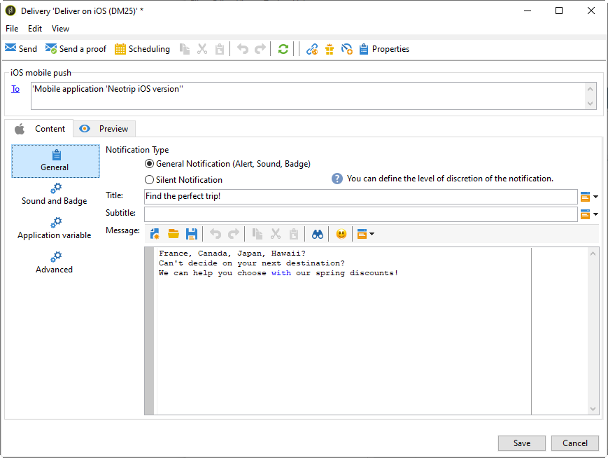

# Creare notifiche per iOS{#create-notifications-ios}

Questa sezione descrive gli elementi specifici per la consegna delle notifiche iOS. I concetti globali sulla creazione della consegna sono presentati in [questa sezione](steps-about-delivery-creation-steps.md).

Inizia creando una nuova consegna.

Per creare una notifica push per dispositivi iOS, segui i passaggi seguenti:

1. Seleziona la **[!UICONTROL Deliver on iOS]** modello di consegna.

   

1. Per definire il target della notifica, fai clic sul pulsante **[!UICONTROL To]** , quindi fai clic su **[!UICONTROL Add]**.

   

   >[!NOTE]
   >
   >Il processo dettagliato durante la selezione della popolazione target di una consegna è presentato in [questa sezione](steps-defining-the-target-population.md).
   >
   >Per ulteriori informazioni sull’utilizzo dei campi di personalizzazione, consulta [questa sezione](about-personalization.md).
   >
   >Per ulteriori informazioni sull’inclusione di un elenco di seed, consulta [Informazioni sugli indirizzi di seed](about-seed-addresses.md).

1. Seleziona **[!UICONTROL Subscribers of an iOS mobile application (iPhone, iPad)]**, seleziona il servizio relativo all’app mobile (in questo caso Neotrips), quindi seleziona la versione iOS dell’applicazione.

   

1. Scegli il tuo **[!UICONTROL Notification type]** tra **[!UICONTROL General notification (Alert, Sound, Badge)]** o **[!UICONTROL Silent notification]**.

   

   >[!NOTE]
   >
   >Il **Push silenzioso** La modalità consente di inviare una notifica &quot;invisibile all’utente&quot; a un’app mobile. L’utente non viene informato dell’arrivo della notifica. Viene trasferita direttamente all’applicazione.

1. In **[!UICONTROL Title]** immettere l&#39;etichetta del titolo che si desidera visualizzare nell&#39;elenco delle notifiche disponibili dal centro notifiche.

   Questo campo ti consente di definire il valore del **titolo** parametro del payload di notifica di iOS.

1. Puoi aggiungere una **[!UICONTROL Subtitle]**, valore del parametro dei sottotitoli del payload di notifica di iOS. Consulta la sezione [questa sezione](configuring-the-mobile-application.md).

1. Inserisci il contenuto del messaggio in **[!UICONTROL Message content]** sezione della procedura guidata. L’utilizzo dei campi di personalizzazione è presentato nel [Informazioni sulla personalizzazione](about-personalization.md) sezione.

   

1. Fai clic su **[!UICONTROL Insert emoticon]** per inserire emoticon nella notifica push. Per personalizzare l’elenco delle emoticon, consulta [questa sezione](customizing-emoticon-list.md)

1. Dalla sezione **[!UICONTROL Sound and Badge]** , è possibile modificare le seguenti opzioni:

   * **[!UICONTROL Clean Badge]**: abilita queste opzioni per aggiornare il valore del badge.

   * **[!UICONTROL Value]**: imposta un numero che verrà utilizzato per visualizzare direttamente sull’icona dell’applicazione il numero di nuove informazioni non lette.

   * **[!UICONTROL Critical alert mode]**: abilita questa opzione per aggiungere un suono alla notifica anche se il telefono dell’utente è impostato sulla modalità di attivazione o se l’iPhone è disattivato.

   * **[!UICONTROL Name]**: seleziona il suono che deve essere riprodotto dal terminale mobile quando viene ricevuta la notifica.

   * **[!UICONTROL Volume]**: volume del suono da 0 a 100.

   >[!NOTE]
   >
   >I suoni devono essere inclusi nell&#39;applicazione e definiti al momento della creazione del servizio. Fai riferimento a [questa sezione](configuring-the-mobile-application.md#configuring-external-account-ios).

   

1. Dalla sezione **[!UICONTROL Application variables]** , il tuo **[!UICONTROL Application variables]** vengono aggiunti automaticamente. Consentono di definire il comportamento di notifica; ad esempio, puoi configurare una schermata di un’applicazione specifica da visualizzare quando l’utente attiva la notifica.

   Per ulteriori informazioni al riguardo, consulta [questa sezione](configuring-the-mobile-application.md).

1. Dalla sezione **[!UICONTROL Advanced]** , è possibile modificare le seguenti opzioni generali:

   * **[!UICONTROL Mutable content]**: abilita questa opzione per consentire all’app mobile di scaricare contenuti multimediali.

   * **[!UICONTROL Thread-id]**: identificatore utilizzato per raggruppare le notifiche correlate.

   * **[!UICONTROL Category]**: nome dell’ID categoria che visualizzerà i pulsanti di azione. Queste notifiche forniscono all’utente un modo più rapido per eseguire diverse attività in risposta a una notifica senza aprire o esplorare l’applicazione.

   

1. Per le notifiche sensibili all’ora, puoi specificare le seguenti opzioni:

   * **[!UICONTROL Target content ID]**: identificatore utilizzato per individuare la finestra dell’applicazione da inoltrare quando viene aperta la notifica.

   * **[!UICONTROL Launch image]**: nome del file dell&#39;immagine di avvio da visualizzare. Se l’utente sceglie di avviare l’applicazione, viene visualizzata l’immagine selezionata invece della schermata di avvio dell’applicazione.

   * **[!UICONTROL Interruption level]**:

      * **[!UICONTROL Active]**: per impostazione predefinita, il sistema visualizza immediatamente la notifica, illumina lo schermo e può riprodurre un suono. Le notifiche non interrompono le modalità Focus.

      * **[!UICONTROL Passive]**: il sistema aggiunge la notifica all’elenco delle notifiche senza accendere lo schermo o riprodurre un suono. Le notifiche non interrompono le modalità Focus.

      * **[!UICONTROL Time sensitive]**: il sistema presenta immediatamente la notifica, accende lo schermo, può riprodurre un suono e interrompere le modalità di messa a fuoco. Questo livello non richiede un’autorizzazione speciale da Apple.

      * **[!UICONTROL Critical]**: il sistema presenta immediatamente la notifica, accende lo schermo e ignora le modalità di disattivazione audio o di messa a fuoco. Tieni presente che questo livello richiede un’autorizzazione speciale da parte di Apple.

   * **[!UICONTROL Relevance score]**: imposta un punteggio di rilevanza da 0 a 100. Il sistema utilizza questa funzione per ordinare le notifiche nel riepilogo delle notifiche.

   

1. Una volta configurata la notifica, fai clic su **[!UICONTROL Preview]** per visualizzare l’anteprima della notifica.

   

   >[!NOTE]
   >
   >Lo stile della notifica (banner o avviso) non è definito in Adobe Campaign. Dipende dalla configurazione selezionata dall’utente nelle impostazioni di iOS. Tuttavia, Adobe Campaign ti consente di visualizzare in anteprima ogni tipo di stile di notifica. Fare clic sulla freccia in basso a destra per passare da uno stile all&#39;altro.
   >
   >L’anteprima utilizza l’aspetto di iOS 10.

Per inviare una bozza e la consegna finale, utilizza lo stesso processo delle consegne e-mail. [Ulteriori informazioni](steps-validating-the-delivery.md)

Dopo aver inviato i messaggi, puoi monitorare e tenere traccia delle consegne. Per ulteriori informazioni, consulta queste sezioni:

* [Quarantene di notifica push](understanding-quarantine-management.md#push-notification-quarantines)
* [Monitoraggio di una consegna](about-delivery-monitoring.md)
* [Informazioni sugli errori di consegna](understanding-delivery-failures.md)

## Creare una notifica avanzata di iOS {#creating-ios-delivery}

Con iOS 10 o versione successiva, è possibile generare notifiche potenziate. Adobe Campaign può inviare notifiche utilizzando variabili che consentiranno al dispositivo di visualizzare una notifica potenziata.

Ora devi creare una nuova consegna e collegarla all’app mobile creata.

1. Vai a **[!UICONTROL Campaign management]** > **[!UICONTROL Deliveries]**.

1. Fai clic su **[!UICONTROL New]**.

   

1. Seleziona **[!UICONTROL Deliver on iOS (ios)]** nel **[!UICONTROL Delivery template]** a discesa. Aggiungi un **[!UICONTROL Label]** alla consegna.

1. Clic **[!UICONTROL To]** per definire la popolazione target. Per impostazione predefinita, il **[!UICONTROL Subscriber application]** viene applicata la mappatura target. Clic **[!UICONTROL Add]** per selezionare il servizio creato in precedenza.

   

1. In **[!UICONTROL Target type]** finestra, seleziona **[!UICONTROL Subscribers of an iOS mobile application (iPhone, iPad)]** e fai clic su **[!UICONTROL Next]**.

1. In **[!UICONTROL Service]** , selezionare il servizio creato in precedenza, quindi l&#39;applicazione di destinazione e fare clic su **[!UICONTROL Finish]**.

   

1. Modifica la notifica avanzata.

   

1. Dalla sezione **[!UICONTROL Application variables]** , il tuo **[!UICONTROL Application variables]** vengono aggiunte automaticamente in base a ciò che è stato aggiunto durante i passaggi di configurazione.

   >[!NOTE]
   >
   >Le variabili dell’applicazione devono essere definite nel codice dell’app mobile e immesse durante la creazione del servizio. Per ulteriori informazioni al riguardo, consulta [questa sezione](configuring-the-mobile-application.md).

   

1. Dalla sezione **[!UICONTROL Advanced]** , selezionare la scheda **[!UICONTROL Mutable content]** per consentire all’app mobile di scaricare contenuti multimediali.

1. Clic **[!UICONTROL Save]** e invia la consegna.

L’immagine e la pagina web devono essere visualizzate nella notifica push quando vengono ricevute sui dispositivi mobili iOS degli abbonati.

