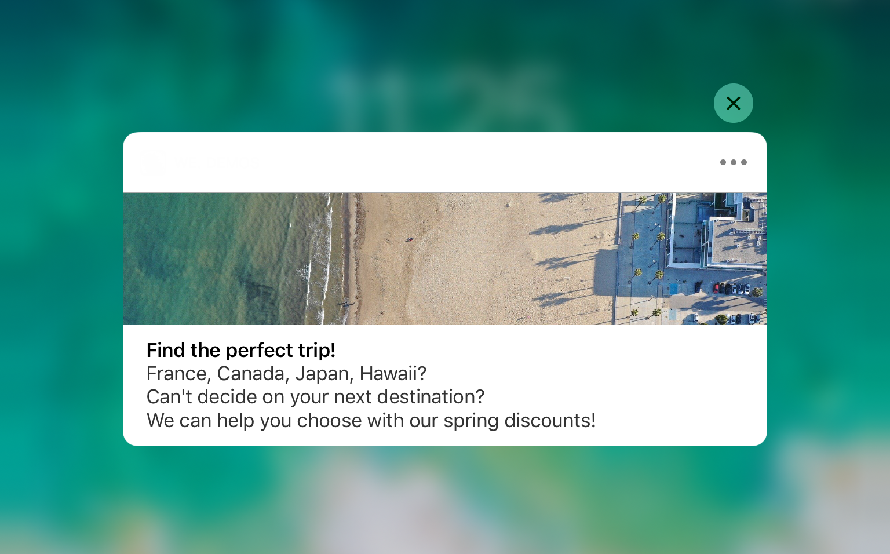

# Creare notifiche per iOS{#create-notifications-ios}

Questa sezione descrive gli elementi specifici per la consegna delle notifiche iOS. I concetti globali sulla creazione della consegna sono descritti nella [documentazione di Campaign v8](https://experienceleague.adobe.com/docs/campaign/campaign-v8/send/create-message.html?lang=it){target="_blank"}.

Inizia creando una nuova consegna.

Per creare una notifica push per dispositivi iOS, segui i passaggi seguenti:

1. Selezionare il modello di consegna **[!UICONTROL Deliver on iOS]**.

   

1. Per definire la destinazione della notifica, fare clic sul collegamento **[!UICONTROL To]**, quindi su **[!UICONTROL Add]**.

   

   >[!NOTE]
   >
   >Il processo dettagliato durante la selezione della popolazione target di una consegna è presentato in questa sezione nella [documentazione di Campaign v8](https://experienceleague.adobe.com/docs/campaign/campaign-v8/send/create-message.html#target-population.){target="_blank"}.
   >
   >Per ulteriori informazioni sull&#39;utilizzo dei campi di personalizzazione, consulta [questa sezione](about-personalization.md).
   >
   >Per ulteriori informazioni sull&#39;inclusione di un elenco di seed, fare riferimento a [Informazioni sugli indirizzi di seed](about-seed-addresses.md).

1. Selezionare **[!UICONTROL Subscribers of an iOS mobile application (iPhone, iPad)]**, selezionare il servizio relativo all&#39;app mobile (in questo caso Neotrips), quindi selezionare la versione iOS dell&#39;applicazione.

   

1. Scegli **[!UICONTROL Notification type]** tra **[!UICONTROL General notification (Alert, Sound, Badge)]** o **[!UICONTROL Silent notification]**.

   

   >[!NOTE]
   >
   >La modalità **Invio automatico** consente di inviare una notifica &quot;invisibile all&#39;utente&quot; a un&#39;app mobile. L’utente non viene informato dell’arrivo della notifica. Viene trasferita direttamente all’applicazione.

1. Nel campo **[!UICONTROL Title]**, immettere l&#39;etichetta del titolo che si desidera visualizzare nell&#39;elenco delle notifiche disponibili dal centro notifiche.

   Questo campo consente di definire il valore del parametro **title** del payload di notifica iOS.

1. Puoi aggiungere **[!UICONTROL Subtitle]**, valore del parametro subtitle del payload di notifica iOS. Consulta la [sezione](configuring-the-mobile-application.md).

1. Immettere il contenuto del messaggio nella sezione **[!UICONTROL Message content]** dell&#39;assistente. L&#39;utilizzo dei campi di personalizzazione è presentato nella sezione [Informazioni sulla personalizzazione](about-personalization.md).

   

1. Fai clic sull&#39;icona **[!UICONTROL Insert emoticon]** per inserire gli emoticon nella notifica push. Per personalizzare l&#39;elenco delle emoticon, fare riferimento a [questa sezione](customizing-emoticon-list.md)

1. Dalla scheda **[!UICONTROL Sound and Badge]**, è possibile modificare le opzioni seguenti:

   * **[!UICONTROL Clean Badge]**: abilitare queste opzioni per aggiornare il valore del badge.

   * **[!UICONTROL Value]**: impostare un numero che verrà utilizzato per visualizzare direttamente sull&#39;icona dell&#39;applicazione il numero di nuove informazioni non lette.

   * **[!UICONTROL Critical alert mode]**: abilita questa opzione per aggiungere un suono alla notifica anche se il telefono dell&#39;utente è impostato sulla modalità di attivazione o se l&#39;iPhone è disattivato.

   * **[!UICONTROL Name]**: selezionare il suono che verrà riprodotto dal terminale mobile alla ricezione della notifica.

   * **[!UICONTROL Volume]**: volume dell&#39;audio da 0 a 100.

   >[!NOTE]
   >
   >I suoni devono essere inclusi nell&#39;applicazione e definiti al momento della creazione del servizio. Fai riferimento a [questa sezione](configuring-the-mobile-application.md#configuring-external-account-ios).

   

1. Dalla scheda **[!UICONTROL Application variables]**, **[!UICONTROL Application variables]** viene aggiunto automaticamente. Consentono di definire il comportamento di notifica; ad esempio, puoi configurare una schermata di un’applicazione specifica da visualizzare quando l’utente attiva la notifica.

   Per ulteriori informazioni al riguardo, consulta [questa sezione](configuring-the-mobile-application.md).

1. Dalla scheda **[!UICONTROL Advanced]**, è possibile modificare le seguenti opzioni generali:

   * **[!UICONTROL Mutable content]**: abilitare questa opzione per consentire all&#39;app mobile di scaricare contenuti multimediali.

   * **[!UICONTROL Thread-id]**: identificatore utilizzato per raggruppare le notifiche correlate.

   * **[!UICONTROL Category]**: nome dell&#39;ID categoria che visualizzerà i pulsanti di azione. Queste notifiche forniscono all’utente un modo più rapido per eseguire diverse attività in risposta a una notifica senza aprire o esplorare l’applicazione.

   

1. Per le notifiche sensibili all’ora, puoi specificare le seguenti opzioni:

   * **[!UICONTROL Target content ID]**: identificatore utilizzato per individuare la finestra dell&#39;applicazione da portare avanti quando viene aperta la notifica.

   * **[!UICONTROL Launch image]**: nome del file dell&#39;immagine di avvio da visualizzare. Se l’utente sceglie di avviare l’applicazione, viene visualizzata l’immagine selezionata invece della schermata di avvio dell’applicazione.

   * **[!UICONTROL Interruption level]**:

      * **[!UICONTROL Active]**: per impostazione predefinita, il sistema visualizza immediatamente la notifica, illumina lo schermo e può riprodurre un suono. Le notifiche non interrompono le modalità Focus.

      * **[!UICONTROL Passive]**: il sistema aggiunge la notifica all&#39;elenco delle notifiche senza accendere lo schermo o riprodurre un suono. Le notifiche non interrompono le modalità Focus.

      * **[!UICONTROL Time sensitive]**: il sistema presenta immediatamente la notifica, accende lo schermo, può riprodurre un suono e interrompere le modalità di messa a fuoco. Questo livello non richiede un’autorizzazione speciale da Apple.

      * **[!UICONTROL Critical]**: il sistema visualizza immediatamente la notifica, illumina lo schermo e ignora le modalità di disattivazione audio o di attivazione. Tieni presente che questo livello richiede un’autorizzazione speciale da parte di Apple.

   * **[!UICONTROL Relevance score]**: impostare un punteggio di rilevanza da 0 a 100. Il sistema utilizza questa funzione per ordinare le notifiche nel riepilogo delle notifiche.

   

1. Una volta configurata la notifica, fare clic sulla scheda **[!UICONTROL Preview]** per visualizzare l&#39;anteprima della notifica.

   

   >[!NOTE]
   >
   >Lo stile della notifica (banner o avviso) non è definito in Adobe Campaign. Dipende dalla configurazione selezionata dall’utente nelle impostazioni di iOS. Tuttavia, Adobe Campaign ti consente di visualizzare in anteprima ogni tipo di stile di notifica. Fare clic sulla freccia in basso a destra per passare da uno stile all&#39;altro.
   >
   >L’anteprima utilizza l’aspetto di iOS 10.

Per inviare una bozza e la consegna finale, utilizza lo stesso processo delle consegne e-mail. [Ulteriori informazioni](steps-validating-the-delivery.md)

Dopo aver inviato i messaggi, puoi monitorare e tenere traccia delle consegne. Per ulteriori informazioni, consulta queste sezioni:

* [Quarantene di notifica push](understanding-quarantine-management.md#push-notification-quarantines)
* [Monitoraggio di una consegna](about-delivery-monitoring.md)
* [Informazioni sugli errori di consegna](understanding-delivery-failures.md)

## Creare una notifica avanzata di iOS {#creating-ios-delivery}

Con iOS 10 o versione successiva, è possibile generare notifiche potenziate. Adobe Campaign può inviare notifiche utilizzando variabili che consentiranno al dispositivo di visualizzare una notifica potenziata.

Ora devi creare una nuova consegna e collegarla all’app mobile creata.

1. Vai a **[!UICONTROL Campaign management]** > **[!UICONTROL Deliveries]**.

1. Fai clic su **[!UICONTROL New]**.

   

1. Selezionare **[!UICONTROL Deliver on iOS (ios)]** nel menu a discesa **[!UICONTROL Delivery template]**. Aggiungi **[!UICONTROL Label]** alla consegna.

1. Fare clic su **[!UICONTROL To]** per definire la popolazione di destinazione. Per impostazione predefinita, viene applicata la mappatura di destinazione **[!UICONTROL Subscriber application]**. Fai clic su **[!UICONTROL Add]** per selezionare il servizio creato in precedenza.

   

1. Nella finestra **[!UICONTROL Target type]**, selezionare **[!UICONTROL Subscribers of an iOS mobile application (iPhone, iPad)]** e fare clic su **[!UICONTROL Next]**.

1. Nel menu a discesa **[!UICONTROL Service]**, seleziona il servizio creato in precedenza, quindi l&#39;applicazione di destinazione e fai clic su **[!UICONTROL Finish]**.

   

1. Modifica la notifica avanzata.

   

1. Dalla scheda **[!UICONTROL Application variables]**, i tuoi **[!UICONTROL Application variables]** vengono aggiunti automaticamente a seconda di ciò che è stato aggiunto durante i passaggi di configurazione.

   >[!NOTE]
   >
   >Le variabili dell’applicazione devono essere definite nel codice dell’app mobile e immesse durante la creazione del servizio. Per ulteriori informazioni al riguardo, consulta [questa sezione](configuring-the-mobile-application.md).

   

1. Dalla scheda **[!UICONTROL Advanced]**, seleziona la casella **[!UICONTROL Mutable content]** per consentire all&#39;app mobile di scaricare contenuti multimediali.

1. Fai clic su **[!UICONTROL Save]** e invia la consegna.

L’immagine e la pagina web devono essere visualizzate nella notifica push quando vengono ricevute sui dispositivi mobili iOS degli abbonati.

