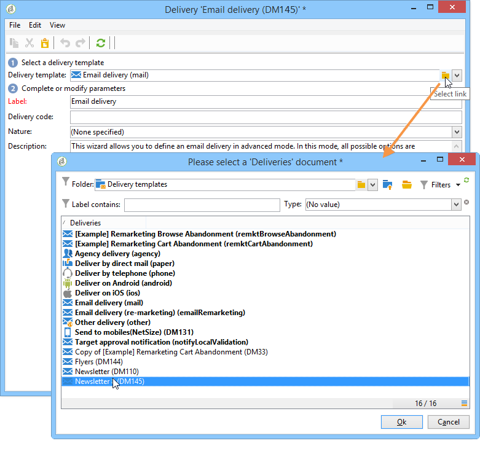

# Creare una consegna da un modello{#creating-a-delivery-from-a-template}

## Collegare il modello a una consegna {#linking-the-template-to-a-delivery}

Per creare una consegna basata su un modello esistente, seleziona il modello dall’elenco dei modelli di consegna disponibili.

In caso contrario, fare clic sulla cartella **[!UICONTROL Select link]** a destra del campo per sfogliare la struttura.

Selezionare la directory desiderata dal campo **[!UICONTROL Folder]** oppure fare clic sull&#39;icona **[!UICONTROL Display sub-levels]** per visualizzare il contenuto delle directory nelle sottostrutture della directory corrente.

Selezionare il modello di consegna da utilizzare e fare clic su **[!UICONTROL Ok]**.

## Eseguire il modello {#executing-the-template}

Puoi avviare l’esecuzione di un modello direttamente dall’elenco dei modelli senza prima creare una consegna. A questo scopo, seleziona il modello da eseguire e fai clic con il pulsante destro del mouse. Seleziona **[!UICONTROL Actions>Execute the delivery template...]**.

È inoltre possibile utilizzare **[!UICONTROL File>Actions>Execute the delivery template...]**.

Immettere i parametri di consegna e fare clic su **[!UICONTROL Send]**.

Questa azione genera una consegna nella cartella associata al modello. Il nome di questa consegna è il nome del modello di consegna da cui è stata creata.

>[!NOTE]
>
>Per ulteriori informazioni sulla configurazione di una consegna, vedere [Definire il contenuto dell&#39;e-mail](defining-the-email-content.md).
