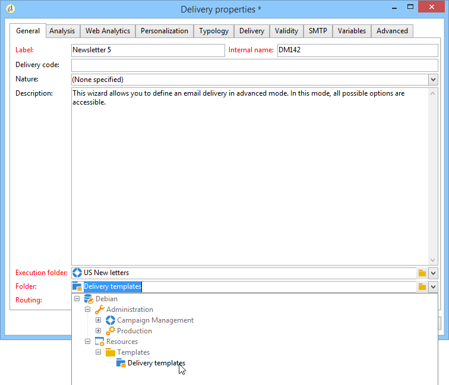
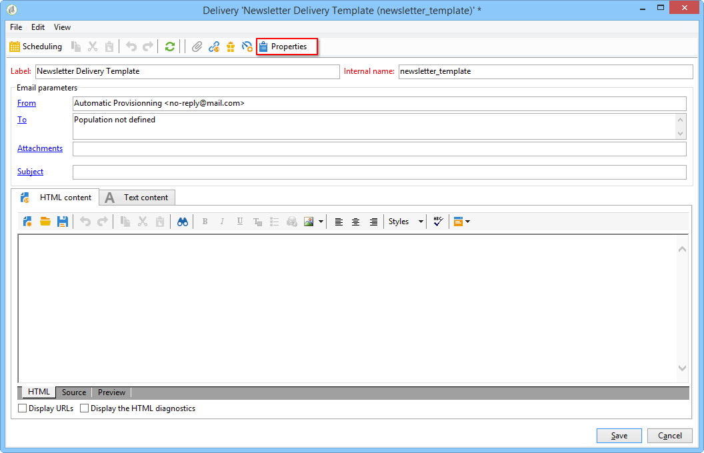

# Creazione di un modello di consegna{#creating-a-delivery-template}

 [Guarda il video su questa funzione](#delivery-template-video)

## Conversione di una consegna esistente in un modello {#converting-an-existing-delivery-to-a-template}

Una consegna può essere convertita in un modello per nuove azioni di consegna ripetute. Per convertire una consegna in un modello, selezionarla dall&#39;elenco di consegna, accessibile tramite il nodo **[!UICONTROL Campaign management]** della struttura.

Fare clic con il pulsante destro del mouse e selezionare **[!UICONTROL Actions > Save as template...]**.

Crea un modello di consegna dalla consegna selezionata. È necessario immettere la cartella in cui viene salvato (nel campo **[!UICONTROL Folder]**) e la cartella in cui vengono create le consegne create in base a questo modello (nel campo **[!UICONTROL Execution folder]**).

Per ulteriori informazioni sulla modalità di configurazione, consulta [Collegamento del modello a una consegna](creating-a-delivery-from-a-template.md#linking-the-template-to-a-delivery).

## Creazione di un nuovo modello {#creating-a-new-template}

>[!NOTE]
>
>Per evitare errori di configurazione, Adobe consiglia di duplicare un modello nativo e di personalizzarne le impostazioni anziché crearne uno nuovo.

Per configurare un modello di consegna, effettua le seguenti operazioni:

1. Apri Campaign Explorer.
1. Nella cartella **Resources**, seleziona **Templates** e quindi **Delivery templates**.

   

1. Fai clic su **Nuovo** nella barra degli strumenti per creare un nuovo modello di consegna oppure su **Duplica** un modello esistente.

   

1. Modifica l&#39;**etichetta** e il **nome interno** della cartella.
1. Salva il modello e riaprilo.
1. Fare clic sul pulsante **Proprietà** e quindi modificare i valori in base alle proprie esigenze.

   

1. Nella scheda **Generale**, confermare o modificare i percorsi selezionati nei menu a discesa **Cartella di esecuzione**, **Cartella** e **Indirizzamento**.

   

1. Completa la categoria **Parametri e-mail** con l&#39;oggetto dell&#39;e-mail e la popolazione di destinazione.
1. Aggiungi il tuo contenuto di **HTML** per personalizzare il modello. Puoi visualizzare un collegamento a una pagina speculare e un collegamento per annullare l&#39;abbonamento.
1. Selezionare la scheda **Anteprima**. Nel menu a discesa **Prova personalizzazione**, seleziona **Destinatario** per visualizzare in anteprima il modello come profilo scelto.

   

1. Fai clic su **Salva**. Il modello è ora pronto per essere utilizzato in una consegna.

## Video tutorial {#delivery-template-video}

### Come configurare un modello di consegna

Il video seguente illustra come configurare un modello per una consegna ad hoc.

>[!VIDEO](https://video.tv.adobe.com/v/329665?quality=12&captions=ita)

### Impostare le proprietà dei modelli di consegna

Il video seguente mostra come impostare le proprietà del modello di consegna e spiega in dettaglio ciascuna proprietà.

>[!VIDEO](https://video.tv.adobe.com/v/41723?quality=12&captions=ita)

### Come distribuire un modello di consegna ad hoc

Questo video spiega come distribuire un modello di consegna e-mail ad hoc e la differenza tra una consegna e-mail e un flusso di lavoro di consegna.

>[!VIDEO](https://video.tv.adobe.com/v/329668?quality=12&captions=ita)

Ulteriori video dimostrativi di Campaign Classic sono disponibili [qui](https://experienceleague.adobe.com/docs/campaign-classic-learn/tutorials/overview.html?lang=it).
