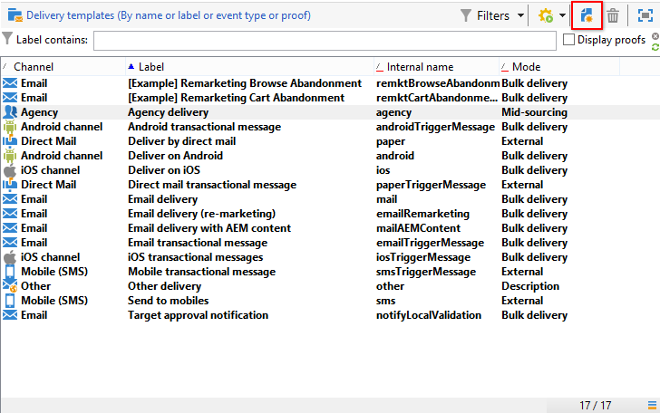

# Creazione di un modello di consegna{#creating-a-delivery-template}

 [Scopri questa funzione nel video](#delivery-template-video)

## Conversione di una consegna esistente in un modello {#converting-an-existing-delivery-to-a-template}

Una consegna può essere convertita in un modello per nuove azioni di consegna ripetute. Per convertire una consegna in un modello, selezionala dall’elenco di consegna, accessibile tramite il nodo **[!UICONTROL Campaign management]** della struttura.

Fai clic con il pulsante destro del mouse e seleziona **[!UICONTROL Actions > Save as template...]**.

Questa azione crea un modello di consegna dalla consegna selezionata. Immetti la cartella in cui viene salvato (nel campo **[!UICONTROL Folder]** ) e la cartella in cui vengono create le consegne create in base a questo modello (nel campo **[!UICONTROL Execution folder]** ).

Per ulteriori informazioni sulla modalità di configurazione, consulta [Collegamento del modello a una consegna](../../delivery/using/creating-a-delivery-from-a-template.md#linking-the-template-to-a-delivery).

## Creazione di un nuovo modello {#creating-a-new-template}

Per configurare un modello di consegna, esegui i seguenti passaggi:

1. Apri Campaign Explorer.
1. Nella cartella **Risorse**, seleziona **Modelli** e quindi **Modelli di consegna**.

   

1. Fai clic su **Nuovo** nella barra degli strumenti per creare un nuovo modello di consegna.

   

1. Modifica il **Etichetta** e il **Nome interno** della cartella.
1. Salva il modello e riaprilo.
1. Fai clic sul pulsante **Proprietà**, quindi modifica i valori in base alle tue esigenze.

   

1. Nella scheda **Generale**, confermare o modificare le posizioni selezionate nei menu a discesa **Cartella di esecuzione**, **Cartella** e **Indirizzamento**.

   

1. Completa la categoria **Parametri e-mail** con l’oggetto dell’e-mail e la popolazione target.
1. Aggiungi il **contenuto HTML** per personalizzare il modello, puoi visualizzare un collegamento a una pagina speculare e un collegamento di annullamento all’abbonamento.
1. Selezionare la scheda **Anteprima**. Nel menu a discesa **Test personalization** , seleziona **Recipient** per visualizzare in anteprima il modello come profilo scelto.

   

1. Fai clic su **Salva**. Il modello è ora pronto per essere utilizzato in una consegna.

>[!NOTE]
>
>Per evitare errori di configurazione, è consigliabile duplicare un modello nativo e modificarne le proprietà anziché creare un nuovo modello.

## Video tutorial {#delivery-template-video}

### Come configurare un modello di consegna

Il video seguente illustra come configurare un modello per una consegna ad hoc.

>[!VIDEO](https://video.tv.adobe.com/v/24066?quality=12)

### Come impostare le proprietà dei modelli di consegna

Il video seguente mostra come impostare le proprietà del modello di consegna e spiega in dettaglio ciascuna proprietà .

>[!VIDEO](https://video.tv.adobe.com/v/24067?quality=12)

### Come distribuire un modello di consegna ad hoc

Questo video spiega come distribuire un modello di consegna e-mail ad hoc e spiega la differenza tra una consegna e-mail e un flusso di lavoro di consegna.

>[!VIDEO](https://video.tv.adobe.com/v/24065?quality=12)

Sono disponibili ulteriori video dimostrativi su Campaign Classic [qui](https://experienceleague.adobe.com/docs/campaign-classic-learn/tutorials/overview.html?lang=it).
