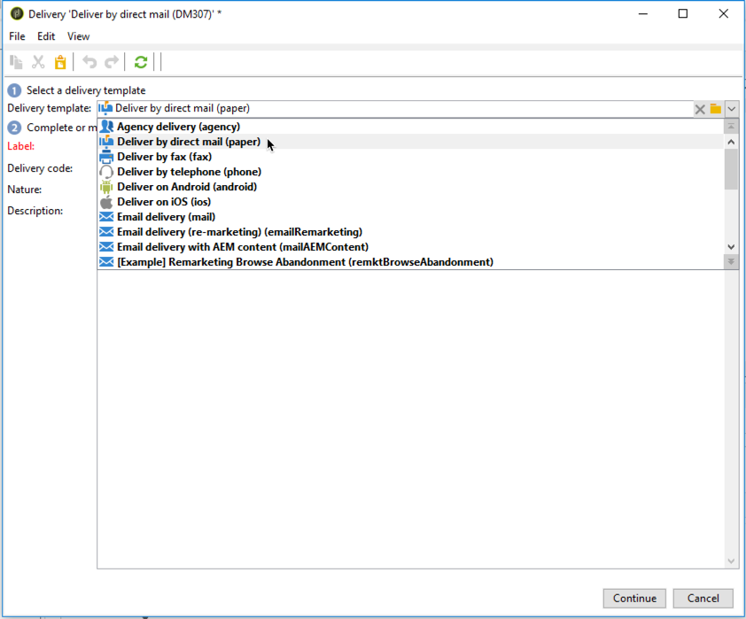

# Creare una consegna direct mail{#creating-a-direct-mail-delivery}

Per creare una nuova consegna di direct mailing, segui i passaggi seguenti:

>[!NOTE]
>
>I concetti globali sulla creazione della consegna sono descritti nella [documentazione di Campaign v8](https://experienceleague.adobe.com/docs/campaign/campaign-v8/send/create-message.html?lang=it){target="_blank"}.

1. Crea una nuova consegna, ad esempio dal dashboard Consegna.
1. Selezionare il modello di consegna **Consegna tramite direct mailing (carta)**.

   

1. Identifica la consegna con un’etichetta, un codice e una descrizione. Per ulteriori informazioni, consulta questa sezione nella [documentazione di Campaign v8](https://experienceleague.adobe.com/docs/campaign/campaign-v8/send/create-message.html#create-the-delivery){target="_blank"}.
1. Fai clic su **Continua** per confermare queste informazioni e visualizzare la finestra di configurazione del messaggio.
