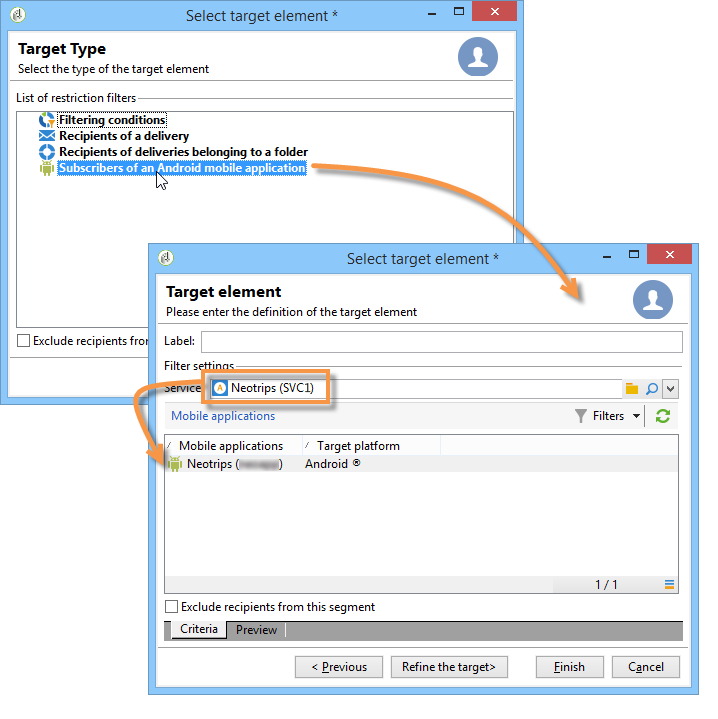

# Creazione di notifiche{#creating-notifications}

Questa sezione descrive gli elementi specifici per la distribuzione delle notifiche iOS e Android. I concetti globali sulla creazione della consegna sono presentati in [questa sezione](../../delivery/using/steps-about-delivery-creation-steps.md).

Iniziate creando una nuova consegna.

## Invio di notifiche su iOS {#sending-notifications-on-ios}

1. Selezionare il modello di consegna **[!UICONTROL Deliver on iOS]**.

   

1. Per definire la destinazione della notifica, fate clic sul collegamento **[!UICONTROL To]**, quindi fate clic su **[!UICONTROL Add]**.

   

   >[!NOTE]
   >
   >Il processo dettagliato per la selezione della popolazione di destinazione di una consegna è presentato in [questa sezione](../../delivery/using/steps-defining-the-target-population.md).
   >
   >Per ulteriori informazioni sull&#39;uso dei campi di personalizzazione, fare riferimento a [Informazioni sulla personalizzazione](../../delivery/using/about-personalization.md).
   >
   >Per ulteriori informazioni sull&#39;inclusione di un elenco di sementi, fare riferimento a [Informazioni sugli indirizzi di sementi](../../delivery/using/about-seed-addresses.md).

1. Seleziona **[!UICONTROL Subscribers of an iOS mobile application (iPhone, iPad)]**, seleziona il servizio relativo all&#39;applicazione mobile (in questo caso Neotrips), quindi seleziona la versione iOS dell&#39;applicazione.

   

1. Selezionate il tipo di notifica: **[!UICONTROL Alert]**, **[!UICONTROL Badge]**, **[!UICONTROL Alert and badge]** o **[!UICONTROL Silent Push]**.

   

   >[!NOTE]
   >
   >La modalità **Silent Push** è disponibile da iOS 7. Questo consente di inviare una notifica &quot;silenziosa&quot; a un’applicazione mobile. L&#39;utente non viene informato dell&#39;arrivo della notifica. Viene trasferito direttamente all&#39;applicazione.

1. Nel campo **[!UICONTROL Title]**, inserite l&#39;etichetta del titolo che desiderate visualizzare nella notifica. Verrà visualizzato solo nell&#39;elenco delle notifiche disponibili dal Centro notifiche. Questo campo consente di definire il valore del parametro **title** del payload di notifica iOS.

1. Se utilizzate il connettore HTTP/2, potete aggiungere un sottotitolo (valore del parametro **subtitle** del payload di notifica iOS). Fare riferimento alla sezione [Configurazione dell&#39;applicazione mobile  Adobe Campaign](../../delivery/using/configuring-the-mobile-application.md).

1. Quindi immettete il **[!UICONTROL Message]** e il **[!UICONTROL Value of the badge]** in base al tipo di notifica scelto.

   

   >[!NOTE]
   >
   >**[!UICONTROL Badge]** e le notifiche  **[!UICONTROL Alert and badge]** tipo consentono di modificare il valore del contrassegno (il numero sopra il logo dell’applicazione mobile). Per aggiornare il contrassegno, è sufficiente immettere 0 come valore. Se il campo è vuoto, il valore del contrassegno non viene modificato.

1. Fate clic sull&#39;icona **[!UICONTROL Insert emoticon]** per inserire le icone nella notifica push. Per personalizzare l&#39;elenco delle icone, consultate [personalizzazione dell&#39;elenco delle icone](../../delivery/using/customizing-emoticon-list.md)

1. **[!UICONTROL Action button]** consente di definire un&#39;etichetta per il pulsante di azione visualizzato nel campo delle notifiche di avviso (**action_loc_key** del payload). Se l&#39;applicazione iOS gestisce stringhe localizzabili (**Localizable.strings**), immettere la chiave corrispondente in questo campo. Se l&#39;applicazione non gestisce il testo localizzabile, immettere l&#39;etichetta che si desidera visualizzare sul pulsante dell&#39;azione. Per ulteriori informazioni sulle stringhe localizzabili, consultare la [documentazione Apple](https://developer.apple.com/library/archive/documentation/NetworkingInternet/Conceptual/RemoteNotificationsPG/CreatingtheNotificationPayload.html#//apple_ref/doc/uid/TP40008194-CH10-SW1) .
1. Nel campo **[!UICONTROL Play a sound]**, selezionate l&#39;audio che deve essere riprodotto dal terminale mobile al ricevimento della notifica.

   >[!NOTE]
   >
   >I suoni devono essere inclusi nell&#39;applicazione e definiti al momento della creazione del servizio. Fare riferimento a [Configurazione dell&#39;account esterno iOS](../../delivery/using/configuring-the-mobile-application.md#configuring-external-account-ios).

1. Nel campo **[!UICONTROL Application variables]**, immettere il valore di ogni variabile. Le variabili di applicazione consentono di definire il comportamento di notifica: ad esempio, potete configurare una schermata specifica dell&#39;applicazione da visualizzare quando l&#39;utente attiva la notifica.

   >[!NOTE]
   >
   >Le variabili di applicazione devono essere definite nel codice dell’applicazione mobile e immesse durante la creazione del servizio. Per ulteriori informazioni, consulta: [Configurazione di un&#39;applicazione mobile in  Adobe Campaign](../../delivery/using/configuring-the-mobile-application.md).

1. Una volta configurata la notifica, fate clic sulla scheda **[!UICONTROL Preview]** per visualizzare l&#39;anteprima della notifica.

   

   >[!NOTE]
   >
   >Lo stile di notifica (banner o avviso) non è definito in  Adobe Campaign. Dipende dalla configurazione selezionata dall&#39;utente nelle relative impostazioni iOS. Tuttavia,  Adobe Campaign consente di visualizzare in anteprima ogni tipo di stile di notifica. Fare clic sulla freccia in basso a destra per passare da uno stile all&#39;altro.
   >
   >L&#39;anteprima utilizza l&#39;aspetto e il comportamento di iOS 10.

Per inviare una prova e inviare la consegna finale, utilizzate la stessa procedura utilizzata per le consegne tramite e-mail.

Dopo aver inviato i messaggi, puoi monitorare e tenere traccia delle consegne. Per ulteriori informazioni, consulta queste sezioni:

* [quarantena delle notifiche push](../../delivery/using/understanding-quarantine-management.md#push-notification-quarantines)
* [Monitoraggio di una consegna](../../delivery/using/about-delivery-monitoring.md)
* [Informazioni sugli errori di consegna](../../delivery/using/understanding-delivery-failures.md)

## Invio di notifiche su Android {#sending-notifications-on-android}

1. Per iniziare, seleziona il modello di consegna **[!UICONTROL Deliver on Android (android)]**.

   

1. Per definire la destinazione della notifica, fate clic sul collegamento **[!UICONTROL To]**, quindi fate clic su **[!UICONTROL Add]**.

   

1. Selezionare **[!UICONTROL Subscribers of an Android mobile application]**, scegliere il servizio relativo all&#39;applicazione mobile (in questo caso Neotrips), quindi selezionare la versione Android dell&#39;applicazione.

   

1. Quindi immettete il contenuto per la notifica.

   

1. Fate clic sull&#39;icona **[!UICONTROL Insert emoticon]** per inserire le icone nella notifica push. Per personalizzare l&#39;elenco delle icone, consultate [personalizzazione dell&#39;elenco delle icone](../../delivery/using/defining-interactive-content.md)

1. Nel campo **[!UICONTROL Application variables]**, immettere il valore di ogni variabile. Le variabili di applicazione consentono di definire il comportamento di notifica: ad esempio, potete configurare una schermata specifica dell&#39;applicazione da visualizzare quando l&#39;utente attiva la notifica.

   >[!NOTE]
   >
   >Le variabili di applicazione devono essere definite nel codice dell’applicazione mobile e immesse durante la creazione del servizio. Per ulteriori informazioni, consulta: [Configurazione di un&#39;applicazione mobile in  Adobe Campaign](../../delivery/using/configuring-the-mobile-application.md).

1. Una volta configurata la notifica, fate clic sulla scheda **[!UICONTROL Preview]** per visualizzare l&#39;anteprima della notifica.

   

Per inviare una prova e inviare la consegna finale, utilizzate la stessa procedura utilizzata per le consegne tramite e-mail.

La procedura dettagliata per la convalida e l&#39;invio di una consegna è descritta nelle sezioni seguenti:

* [Convalida della consegna](../../delivery/using/steps-validating-the-delivery.md)
* [Invio della consegna](../../delivery/using/steps-sending-the-delivery.md)

Dopo aver inviato i messaggi, puoi monitorare e tenere traccia delle consegne. Per ulteriori informazioni, consulta queste sezioni:

* [quarantena delle notifiche push](../../delivery/using/understanding-quarantine-management.md#push-notification-quarantines)
* [Monitoraggio di una consegna](../../delivery/using/about-delivery-monitoring.md)
* [Informazioni sugli errori di consegna](../../delivery/using/understanding-delivery-failures.md)
