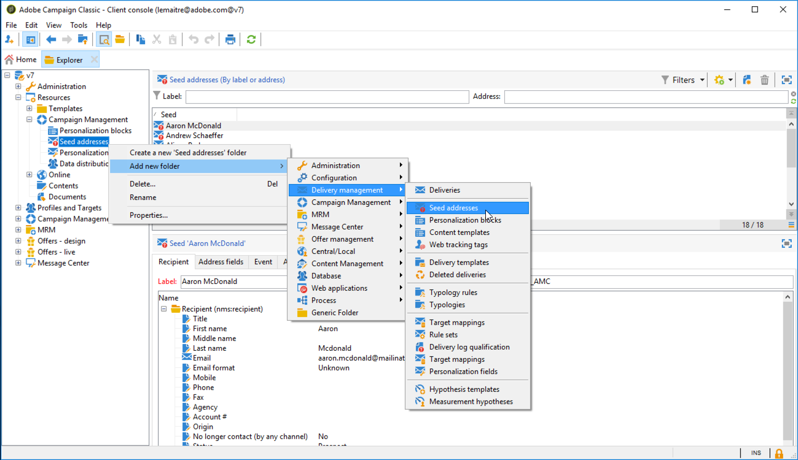

# Creare indirizzi seed{#creating-seed-addresses}

Gli indirizzi di seed non vengono gestiti tramite profili e destinazioni standard, ma in un nodo dedicato della gerarchia Adobe Campaign **[!UICONTROL Resources > Campaign management > Seed addresses]**.

Puoi creare sottocartelle per organizzare gli indirizzi di seed. A tale scopo, fare clic con il pulsante destro del mouse sul nodo **[!UICONTROL Seed addresses]** e selezionare **[!UICONTROL Create a new 'Seed addresses' folder]**. Assegnare un nome alla sottocartella, quindi premere **[!UICONTROL Enter]** per confermare. Ora puoi creare o copiare gli indirizzi di seed in questa sottocartella. Per ulteriori informazioni, consulta [Definire gli indirizzi](#defining-addresses).

Adobe Campaign consente inoltre di creare modelli di indirizzi seed importati in consegne o campagne e adattati in base alle esigenze specifiche delle consegne e delle campagne in questione. Consulta [Creare modelli di indirizzi seed](#creating-seed-address-templates).

## Definire gli indirizzi {#defining-addresses}

Per creare indirizzi seed, effettua le seguenti operazioni:

1. Fare clic sul pulsante **[!UICONTROL New]** sopra l&#39;elenco degli indirizzi di seed.
1. Immettere i dati collegati all&#39;indirizzo nei campi corrispondenti della scheda **[!UICONTROL Recipient]**. I campi disponibili corrispondono ai campi standard nei profili dei destinatari della consegna (tabella nms:recipient): nome, nome, e-mail, ecc.

   >[!NOTE]
   >
   >L’etichetta dell’indirizzo viene automaticamente compilata con il cognome e il nome definiti.
   >
   >Non è necessario immettere tutti i campi di ciascuna scheda durante la creazione di un indirizzo di seed. Gli elementi di personalizzazione mancanti vengono inseriti in modo casuale durante l’analisi della consegna.

   

1. Nella scheda **[!UICONTROL Address fields]**, immetti i valori che verranno inseriti nei registri di consegna durante la fase di analisi (nella tabella **[!UICONTROL nms:broadLog]**).

1. Nella scheda **[!UICONTROL Additional data]**, immetti i dati di personalizzazione utilizzati per le consegne create nei flussi di lavoro di gestione dati e a cui desideri assegnare un valore specifico.

   >[!NOTE]
   >
   >Verificare che siano stati definiti dati di destinazione aggiuntivi con un alias che inizia con &#39;@&#39; nell&#39;attività **[!UICONTROL Enrichment]**. In caso contrario, non potrai utilizzarli correttamente con gli indirizzi seed nell’attività di consegna.

## Creazione di modelli di indirizzi seed {#creating-seed-address-templates}

Per creare modelli di indirizzo che verranno importati e che potranno essere modificati per ogni consegna, il processo è lo stesso utilizzato per definire un nuovo indirizzo di seed. L&#39;unica differenza consiste nel fatto che gli indirizzi dei modelli di indirizzi seed devono essere memorizzati in una cartella di tipo &quot;Modello&quot;.

Per definire una cartella di modelli, attenersi alla procedura descritta di seguito.

1. Creare una nuova cartella di tipo **[!UICONTROL Seed addresses]**, fare clic con il pulsante destro del mouse sulla cartella e selezionare **[!UICONTROL Properties...]**.

   

1. Fare clic sulla scheda **[!UICONTROL Restriction]** e aggiungere la seguente condizione di filtro: **@isModel = true**.

   

   Gli indirizzi memorizzati in questa cartella possono ora essere utilizzati come modelli di indirizzi. Puoi importarli in consegne o campagne e adattarli in base alle esigenze specifiche delle consegne e campagne interessate (consulta [Aggiungi indirizzi seed](adding-seed-addresses.md)).
