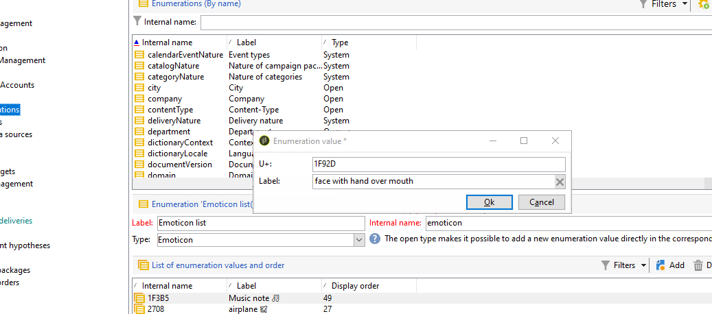

# Personalizzare l’elenco delle emoticon {#customize-emoticons}

L&#39;elenco di emoticon visualizzato nel pop-up è governato da un&#39;enumerazione che consente di visualizzare i valori in un elenco per limitare le scelte dell&#39;utente per un determinato campo.
L’ordine dell’elenco delle emoticon può essere personalizzato, puoi anche aggiungere altre emoticon all’elenco.
Le emoticon sono disponibili per e-mail e push per ulteriori informazioni, consulta questa pagina [pagina](defining-the-email-content.md#inserting-emoticons).

## Aggiunta di una nuova emoticon {#add-new-emoticon}

>[!CAUTION]
>
>L’elenco delle emoticon non può visualizzare più di 81 voci.

1. Scegli la nuova emoticon da aggiungere da questo [pagina](https://unicode.org/emoji/charts/full-emoji-list.html). Si noti che deve essere compatibile con le diverse piattaforme come browser e sistema operativo.

1. Dalla sezione **[!UICONTROL Explorer]**, seleziona **[!UICONTROL Administration]** > **[!UICONTROL Platform]** > **[!UICONTROL Enumerations]** e fai clic su **[!UICONTROL Emoticon list]** enumerazione predefinita.

   >[!NOTE]
   >
   >Le enumerazioni predefinite possono essere gestite solo da un amministratore della console Adobe Campaign Classic.

   

1. Fai clic su **[!UICONTROL Add]**.

1. Compila i campi:

   * **[!UICONTROL U+]**: codice del nuovo emoticon. Puoi trovare l’elenco dei codici degli emoticon in questo articolo [pagina](https://unicode.org/emoji/charts/full-emoji-list.html).
Per evitare problemi di compatibilità, ti consigliamo di scegliere gli emoticon supportati sui browser e su ogni sistema operativo.

   * **[!UICONTROL Label]**: etichetta della nuova emoticon.

   

1. Clic **[!UICONTROL Ok]** allora **[!UICONTROL Save]** al termine della configurazione.
La nuova emoticon verrà automaticamente inserita nel negozio.

1. Per visualizzarlo in **[!UICONTROL Insert emoticon]** finestra delle consegne, seleziona l’emoticon appena creata facendo doppio clic su di essa.

1. Scegli in **[!UICONTROL Display order]** elenco a discesa in cui viene visualizzato il nuovo emoticon. Tieni presente che selezionando un ordine di visualizzazione già assegnato, l’emoticon esistente verrà automaticamente spostata nello store.

    In questo esempio, abbiamo scelto il numero di ordine di visualizzazione 61, il che significa che se una voce aveva già questo ordine verrà automaticamente spostata nello store e la nostra nuova voce avrà il suo posto nell’elenco di enumerazione.

   

1. La nuova emoticon è stata aggiunta al **[!UICONTROL Insert emoticon list]** enumerazione predefinita. È possibile modificare i **[!UICONTROL Display order]** in qualsiasi momento o trasferirlo al negozio se non ne ha più bisogno.

1. Affinché le modifiche vengano prese in considerazione, disconnettiti e riconnettiti da Adobe Campaign Classic. Se la nuova emoticon non viene ancora visualizzata in **[!UICONTROL Insert emoticon]** finestra pop-up, potrebbe essere necessario cancellare la cache. Per ulteriori informazioni, consulta questa [sezione](../../platform/using/faq-campaign-config.md#perform-soft-cache-clear).

1. La nuova emoticon si trova ora nelle consegne in **[!UICONTROL Insert emoticon]** finestra a comparsa nella 61a posizione come configurato nei passaggi precedenti. Per ulteriori informazioni su come utilizzare gli emoticon nelle consegne, consulta questa [pagina](defining-the-email-content.md#inserting-emoticons).

   

1. Se le seguenti emoticon compaiono nel **[!UICONTROL Insert emoticon]** finestra pop-up, significa che non sono stati configurati correttamente. Controlla se **[!UICONTROL U+]** codice o **[!UICONTROL Display order]** è corretto in **[!UICONTROL Emoticon list]**.

   
