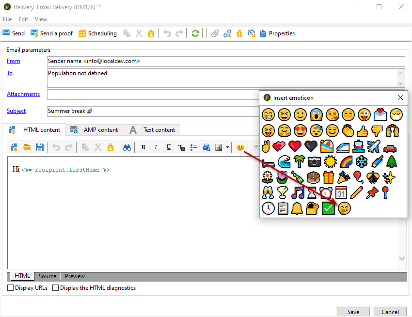

# Personalizzazione dell’elenco delle emoticon {#customize-emoticons}

L&#39;elenco di icone visualizzato nella finestra a comparsa è controllato da un&#39;enumerazione che consente di visualizzare i valori in un elenco per limitare le scelte che l&#39;utente ha per un dato campo.
Potete personalizzare l’ordine degli elenchi di icone e aggiungere altre icone all’elenco.
Le icone sono disponibili per le e-mail e per il push per ulteriori informazioni su questo riferimento a questa [pagina](../../delivery/using/defining-the-email-content.md#inserting-emoticons).

## Aggiunta di una nuova icona {#add-new-emoticon}

>[!CAUTION]
>
>L’elenco delle icone non può contenere più di 81 voci.

1. Scegliete la nuova icona da aggiungere da questa [pagina](https://unicode.org/emoji/charts/full-emoji-list.html). Tieni presente che deve essere compatibile con le diverse piattaforme come browser e sistema operativo.

1. In **[!UICONTROL Explorer]**, selezionare **[!UICONTROL Administration]** > **[!UICONTROL Platform]** > **[!UICONTROL Enumerations]** e fare clic sull&#39;enumerazione **[!UICONTROL Emoticon list]** out-of-the-box.

   >[!NOTE]
   >
   >Le enumerazioni pronte all’uso possono essere gestite solo da un amministratore della console Adobe Campaign Classic.

   

1. Fai clic su **[!UICONTROL Add]**.

1. Compila i campi:

   * **[!UICONTROL U+]**: Codice della tua nuova icona. Potete trovare l&#39;elenco dei codici delle icone in questa [pagina](https://unicode.org/emoji/charts/full-emoji-list.html).
Per evitare problemi di compatibilità, consigliamo di scegliere le icone supportate sui browser e su ogni sistema operativo.

   * **[!UICONTROL Label]**: Etichetta della nuova icona.

   

1. Fate clic **[!UICONTROL Ok]** quindi **[!UICONTROL Save]** al termine della configurazione.
La nuova icona verrà automaticamente inserita nel negozio.

1. Per visualizzarlo nella **[!UICONTROL Insert emoticon]** finestra delle consegne, selezionate l’icona appena creata facendo doppio clic su di essa.

1. Scegliete nell’ **[!UICONTROL Display order]** elenco a discesa in cui verrà visualizzata la nuova icona. Selezionando un ordine di visualizzazione già assegnato, l&#39;icona esistente verrà automaticamente spostata nello store.

    In questo esempio, abbiamo scelto l&#39;ordine di visualizzazione numero 61, il che significa che se una voce aveva già questo ordine sarà automaticamente spostata nello store e la nostra nuova voce avrà il suo posto nell&#39;elenco di enumerazione.

   

1. La nuova icona è stata aggiunta all’enumerazione **[!UICONTROL Insert emoticon list]** out-of-the-box. È possibile cambiare la sua **[!UICONTROL Display order]** in qualsiasi momento o spostarla nel negozio se non ne ha più bisogno.

1. Per tenere conto delle modifiche, disconnettetevi e ricollegatevi da Adobe Campaign Classic. Se la nuova icona non viene visualizzata nella finestra a **[!UICONTROL Insert emoticon]** comparsa, potrebbe essere necessario cancellare la cache. Per ulteriori informazioni, consulta questa [sezione](../../platform/using/faq-campaign-config.md#perform-soft-cache-clear).

1. La nuova icona si trova ora nelle consegne nella finestra a **[!UICONTROL Insert emoticon]** comparsa nella 61° posizione, come configurato nei passaggi precedenti. Per ulteriori informazioni sull’utilizzo delle icone nelle distribuzioni, consultate questa [pagina](../../delivery/using/defining-the-email-content.md#inserting-emoticons).

   

1. Se nella finestra a **[!UICONTROL Insert emoticon]** comparsa sono visualizzate le icone seguenti, significa che non erano configurate correttamente. Controlla se il **[!UICONTROL U+]** codice o **[!UICONTROL Display order]** è corretto nella **[!UICONTROL Emoticon list]**.

   
