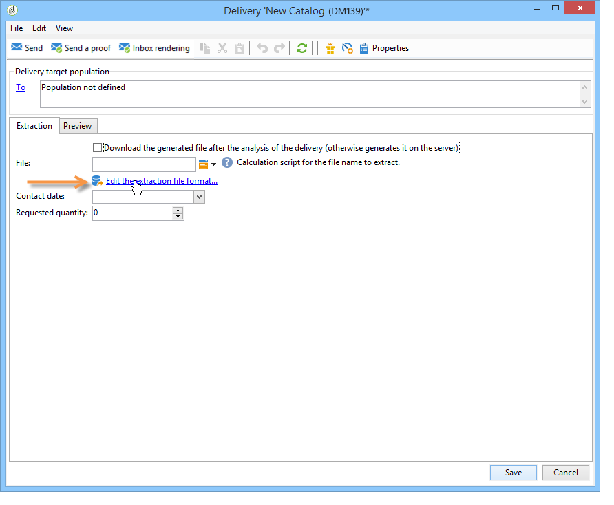

# Definizione del contenuto della direct mailing{#defining-the-direct-mail-content}

## File di estrazione {#extraction-file}

Il nome del file che contiene i dati estratti è definito nel **[!UICONTROL File]** campo. Il pulsante a destra del campo consente di utilizzare i campi di personalizzazione per creare il nome del file.

Per impostazione predefinita, il file di estrazione viene creato e memorizzato sul server. Puoi salvarlo sul tuo computer. Per fare questo, controlla il **[!UICONTROL Download the generated file after the analysis of the delivery]**. In questo caso, è necessario indicare il percorso di accesso alla directory di memorizzazione locale e il nome del file.

Per la consegna diretta per posta, il contenuto dell&#39;estrazione è definito in **[!UICONTROL Edit the extraction file format...]** collegamento.

Questo collegamento consente di accedere alla procedura guidata di estrazione e definire le informazioni (colonne) da esportare nel file di output.

È possibile inserire un URL personalizzato nel file di estrazione. For more on this, refer to [Web functionality](../../web/using/publishing-a-web-form.md).

>[!NOTE]
>
>Questa procedura guidata include i passaggi della procedura guidata di esportazione descritti in dettaglio nella sezione [Guida introduttiva](../../platform/using/exporting-data.md#export-wizard) .
