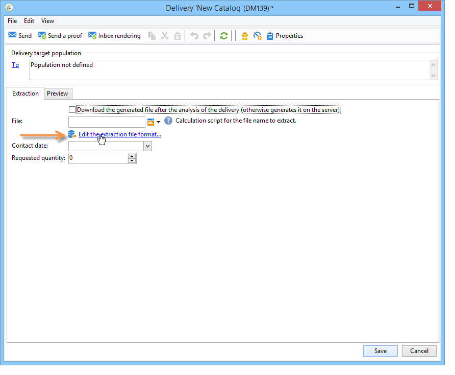

# Definire il contenuto delle direct mail{#defining-the-direct-mail-content}

## File di estrazione {#extraction-file}

Il nome del file che contiene i dati estratti è definito nel campo **[!UICONTROL File]**. Il pulsante a destra del campo consente di utilizzare i campi di personalizzazione per creare il nome del file.

Per impostazione predefinita, il file di estrazione viene creato e memorizzato sul server. È possibile salvarlo nel computer. Per eseguire questa operazione, controllare **[!UICONTROL Download the generated file after the analysis of the delivery]**. In questo caso, è necessario indicare il percorso di accesso alla directory di archiviazione locale e il nome del file.

Per una consegna direct mailing, il contenuto dell&#39;estrazione è definito nel collegamento **[!UICONTROL Edit the extraction file format...]**.

Questo collegamento ti consente di accedere all’assistente per l’estrazione e definire le informazioni (colonne) da esportare nel file di output.

È possibile inserire un URL personalizzato nel file di estrazione. Per ulteriori informazioni al riguardo, consulta [questa sezione](../../web/using/publishing-a-web-form.md).

>[!NOTE]
>
>L&#39;assistente include i passaggi dell&#39;assistente all&#39;esportazione descritti nella sezione [Guida introduttiva](../../platform/using/executing-export-jobs.md).
