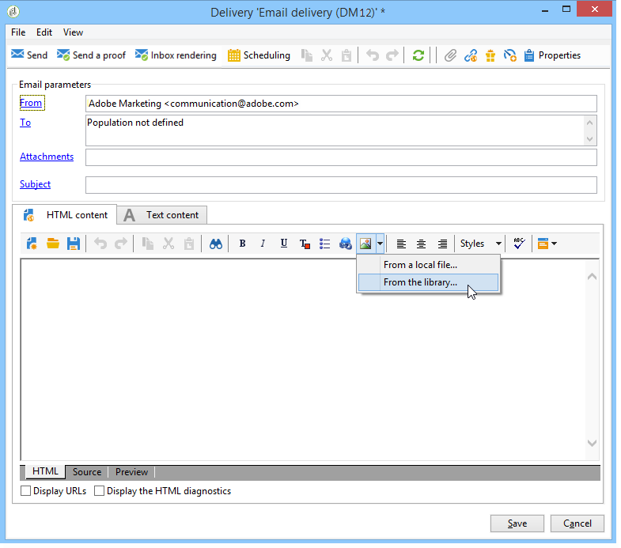
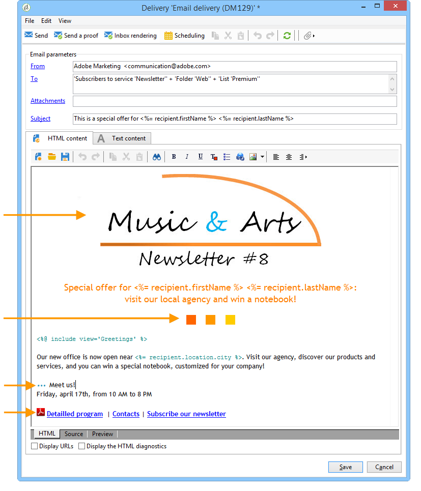
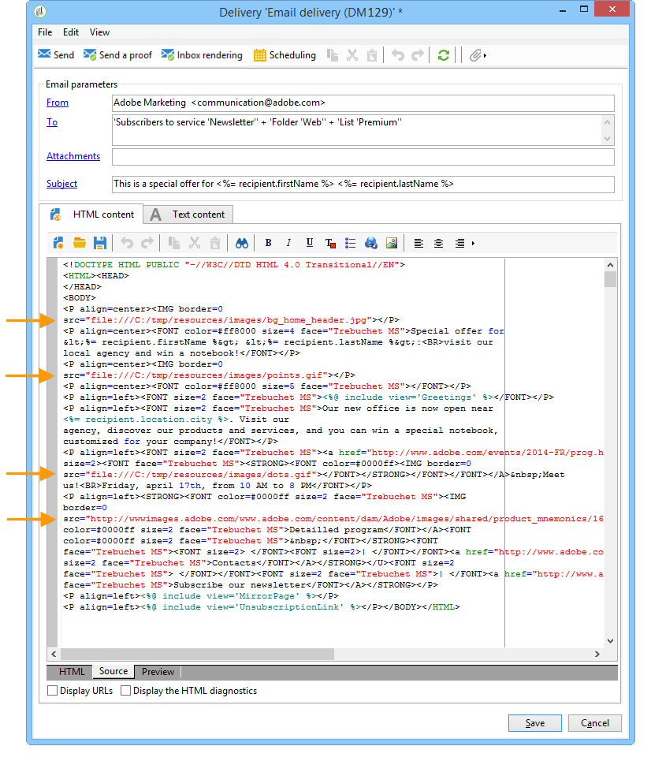

# Definizione del contenuto dell’e-mail{#defining-the-email-content}

## Mittente {#sender}

Per definire il nome e l&#39;indirizzo del mittente che verrà visualizzato nell&#39;intestazione dei messaggi inviati, fai clic sul **[!UICONTROL From]** collegamento.

Questa finestra consente di immettere tutte le informazioni necessarie per creare le intestazioni dei messaggi e-mail. Queste informazioni possono essere personalizzate. A tal fine, utilizzate i pulsanti a destra dei campi di input per inserire i campi di personalizzazione.

Per informazioni su come inserire e utilizzare i campi di personalizzazione, consulta la sezione [Informazioni sulla personalizzazione](../../delivery/using/about-personalization.md) .

>[!NOTE]
>
>* L&#39;indirizzo del mittente verrà utilizzato per le risposte per impostazione predefinita.
>* I parametri dell&#39;intestazione non devono essere vuoti. Per impostazione predefinita, contengono i valori immessi durante la configurazione della procedura guidata di distribuzione. Per ulteriori informazioni, consultare la Guida all&#39; [installazione](../../installation/using/deploying-an-instance.md).
>* L&#39;indirizzo del mittente è obbligatorio per consentire l&#39;invio di un&#39;e-mail (standard RFC).
>*  Adobe Campaign controlla la sintassi degli indirizzi e-mail immessi.

>[!IMPORTANT]
>
>Nel contesto dei controlli implementati dai provider di accesso a Internet (ISP) per combattere le e-mail non richieste (spam),  Adobe raccomanda di creare account di posta elettronica che corrispondano agli indirizzi specificati per le consegne e le risposte. Consultate l’amministratore del sistema di messaggistica.

## Oggetto del messaggio {#message-subject}

L&#39;oggetto del messaggio è configurato nel campo corrispondente. È possibile immetterlo direttamente nel campo o fare clic sul **[!UICONTROL Subject]** collegamento per immettere uno script. Il collegamento di personalizzazione consente di inserire i campi del database nell&#39;oggetto.

>[!IMPORTANT]
>
>L&#39;oggetto del messaggio è obbligatorio.

Il contenuto del campo verrà sostituito dal valore nel profilo del destinatario al momento dell&#39;invio del messaggio.

Ad esempio, nel messaggio precedente, l&#39;oggetto del messaggio è personalizzato per ciascun destinatario con i dati del proprio profilo.

>[!NOTE]
>
>L’uso dei campi di personalizzazione è presentato in [Informazioni sulla personalizzazione](../../delivery/using/about-personalization.md).

È inoltre possibile inserire icone sulla linea dell’oggetto mediante la finestra a **[!UICONTROL Insert emoticon]** comparsa.

## Contenuto del messaggio {#message-content}

>[!IMPORTANT]
>
>Per motivi di privacy, si consiglia di utilizzare HTTPS per tutte le risorse esterne.

Il contenuto del messaggio è definito nella sezione inferiore della finestra di configurazione della consegna.

I messaggi vengono inviati in formato HTML o testo per impostazione predefinita, in base alle preferenze del destinatario. È consigliabile creare contenuto in entrambi i formati per garantire che i messaggi possano essere visualizzati correttamente in qualsiasi sistema di posta elettronica. Per ulteriori informazioni, consulta [Selezione dei formati](#selecting-message-formats)dei messaggi.

* Per importare un contenuto HTML, utilizzate il **[!UICONTROL Open]** pulsante . È inoltre possibile incollare il codice sorgente direttamente nella **[!UICONTROL Source]** sottoscheda.

   Se utilizzate [Digital Content Editor](../../web/using/about-campaign-html-editor.md) (DCE), consultate [Selezione di un modello](../../web/using/use-case--creating-an-email-delivery.md#step-3---selecting-a-content)di contenuto.

   >[!IMPORTANT]
   >
   >Il contenuto HTML deve essere creato in anticipo e quindi importato in  Adobe Campaign. L&#39;editor HTML non è progettato per la creazione di contenuto.

   La **[!UICONTROL Preview]** sottoscheda consente di visualizzare il rendering di ciascun contenuto per un destinatario. I campi di personalizzazione e gli elementi condizionali del contenuto vengono sostituiti con le informazioni corrispondenti per il profilo selezionato.

   I pulsanti della barra degli strumenti consentono di accedere alle azioni standard e ai parametri di formattazione per la pagina HTML.

   

   È possibile inserire immagini nei messaggi da un file locale o da una libreria di immagini in  Adobe Campaign. A questo scopo, fate clic sull&#39; **[!UICONTROL Image]** icona e selezionate l&#39;opzione appropriata.

   

   Per accedere alle immagini della libreria, usate la **[!UICONTROL Resources>Online>Public resources]** cartella nella struttura delle cartelle. Consultare anche [Aggiunta di immagini](#adding-images).

   L’ultimo pulsante nella barra degli strumenti consente di inserire campi di personalizzazione.

   >[!NOTE]
   >
   >L’uso dei campi di personalizzazione è presentato in [Informazioni sulla personalizzazione](../../delivery/using/about-personalization.md).

   Le schede nella parte inferiore della pagina consentono di visualizzare il codice HTML della pagina che si sta creando e di visualizzare il rendering del messaggio con la relativa personalizzazione. Per avviare questa visualizzazione, fai clic **[!UICONTROL Preview]** e seleziona un destinatario utilizzando il **[!UICONTROL Test personalization]** pulsante nella barra degli strumenti. Puoi selezionare un destinatario dalle destinazioni definite o scegliere un altro destinatario.

   

   Potete convalidare il messaggio HTML. Potete anche visualizzare il contenuto dell’intestazione dell’e-mail.

   

* Per importare un contenuto di testo, utilizzate il **[!UICONTROL Open]** pulsante o la **[!UICONTROL Text Content]** scheda per immettere il contenuto del messaggio quando viene visualizzato in formato testo. Utilizzare i pulsanti della barra degli strumenti per accedere alle azioni relative al contenuto. L’ultimo pulsante consente di inserire campi di personalizzazione.

   

   Per quanto riguarda il formato HTML, fai clic sulla **[!UICONTROL Preview]** scheda nella parte inferiore della pagina per visualizzare il rendering del messaggio con la relativa personalizzazione.

   

### Inserimento di icone in un messaggio e-mail {#inserting-emoticons}

Potete inserire icone nel contenuto dell’e-mail.

1. Fate clic sull&#39; **[!UICONTROL Insert emoticon]** icona.
1. Selezionate un’icona dalla finestra a comparsa.

   

1. Al termine, fate clic sul **[!UICONTROL Close]** pulsante.

Per personalizzare l’elenco delle icone, consultate questa [pagina](../../delivery/using/customizing-emoticon-list.md).

## Selezione dei formati dei messaggi {#selecting-message-formats}

Potete modificare il formato dei messaggi e-mail inviati. A questo scopo, modificate le proprietà di consegna e fate clic sulla **[!UICONTROL Delivery]** scheda.

Selezionate il formato del messaggio e-mail nella sezione inferiore della finestra:

* **[!UICONTROL Use recipient preferences]** (modalità predefinita)

   The message format is defined according to the data stored in the recipient profile and stored by default in the **[!UICONTROL email format]** field (@emailFormat). Se un destinatario desidera ricevere i messaggi in un determinato formato, questo sarà il formato inviato. Se il campo non è compilato, viene inviato un messaggio alternativo multiparte (vedi sotto).

* **[!UICONTROL Let recipient mail client choose the most appropriate format]**

   Il messaggio contiene entrambi i formati: text e HTML. Il formato visualizzato in base alla ricezione dipende dalla configurazione del software di posta del destinatario (multipart-alternative).

   >[!IMPORTANT]
   >
   >Questa opzione include entrambe le versioni del documento. Di conseguenza, influisce sulla frequenza di consegna, poiché la dimensione del messaggio è maggiore.

* **[!UICONTROL Send all messages in text format]**

   Il messaggio viene inviato in formato testo. Il formato HTML non verrà inviato, ma utilizzato per la pagina mirror solo quando il destinatario fa clic sul messaggio.

## Definizione del contenuto interattivo {#amp-for-email-format}

 Adobe Campaign consente di provare il nuovo formato [AMP per e-mail](https://amp.dev/about/email/) interattivo, che consente di inviare e-mail dinamiche, a determinate condizioni.

Per ulteriori informazioni, consulta [questa sezione](../../delivery/using/defining-interactive-content.md).

## Utilizzo della gestione dei contenuti {#using-content-management}

È possibile definire il contenuto della distribuzione utilizzando i moduli di gestione del contenuto, direttamente nella procedura guidata di consegna. A tal fine, è necessario fare riferimento al modello di pubblicazione della gestione del contenuto da utilizzare, nella **[!UICONTROL Advanced]** scheda delle proprietà di consegna.

Una scheda aggiuntiva consente di inserire il contenuto che verrà integrato e formattato automaticamente in base alle regole di gestione del contenuto.

>[!NOTE]
>
>Per ulteriori informazioni sulla gestione dei contenuti in  Adobe Campaign, consultate [questa sezione](../../delivery/using/about-content-management.md).

## Aggiunta di immagini {#adding-images}

Le comunicazioni e-mail in formato HTML possono contenere immagini. Dalla procedura guidata di distribuzione, potete importare una pagina HTML contenente immagini o inserire immagini direttamente mediante l’editor HTML tramite l’ **[!UICONTROL Image]** icona .

Le immagini possono essere:

* Un&#39;immagine locale o un&#39;immagine richiamata da un server
* Immagine memorizzata nella libreria  risorse pubbliche Adobe Campaign

   Le risorse pubbliche sono accessibili tramite il **[!UICONTROL Resources > Online]** nodo della gerarchia Adobe Campaign . Sono raggruppati in una libreria e possono essere inclusi nei messaggi e-mail, ma possono essere utilizzati anche per campagne o attività o per la gestione dei contenuti.

* Una risorsa condivisa con Adobe Experience Cloud. Fai riferimento a [questa sezione](../../integrations/using/sharing-assets-with-adobe-experience-cloud.md).

>[!IMPORTANT]
>
>Per includere immagini nei messaggi e-mail mediante la procedura guidata di consegna, è necessario configurare l’istanza di Adobe Campaign  per abilitare la gestione delle risorse pubbliche. Questa procedura può essere eseguita dalla procedura guidata di distribuzione. Per ulteriori informazioni sulla configurazione, consulta [questa sezione](../../installation/using/deploying-an-instance.md) .

La procedura guidata di consegna consente di aggiungere al contenuto dei messaggi immagini locali o immagini memorizzate nella libreria. A questo scopo, fate clic sul **[!UICONTROL Image]** pulsante nella barra degli strumenti del contenuto HTML.

>[!IMPORTANT]
>
>Affinché i destinatari possano visualizzare le immagini incluse nei messaggi ricevuti, questi messaggi devono essere disponibili su un server accessibile dall&#39;esterno.

Per gestire le immagini tramite la procedura guidata di distribuzione:

1. Fate clic sull’ **[!UICONTROL Tracking & Images]** icona nella barra degli strumenti.
   

1. Selezionare **[!UICONTROL Upload images]** nella **[!UICONTROL Images]** scheda.
1. Potete quindi scegliere se includere o meno le immagini nel messaggio e-mail.
   

* Potete caricare manualmente le immagini senza attendere la fase di analisi della distribuzione. A tale scopo, fare clic sul **[!UICONTROL Upload the images straightaway...]** collegamento.
* Potete specificare un altro percorso per l’accesso alle immagini sul server di tracciamento. A questo scopo, immettetela nel **[!UICONTROL Images URL]** campo. Questo valore sostituisce il valore definito nei parametri della procedura guidata di installazione.

Quando aprite contenuto HTML con immagini incluse nella procedura guidata di consegna, viene visualizzato un messaggio che consente di caricare le immagini immediatamente, in base ai parametri di consegna.

>[!IMPORTANT]
>
>I percorsi di accesso alle immagini vengono modificati durante il caricamento manuale o durante l’invio dei messaggi.

### Invio di un messaggio con immagini {#sending-a-message-with-images}

>[!NOTE]
>
>Per evitare problemi di prestazioni, se includete al volo immagini scaricate da un URL personalizzato come [allegato](../../delivery/using/attaching-files.md), per impostazione predefinita ciascuna dimensione non deve superare i 100.000 byte. Questa soglia consigliata può essere configurata dall&#39;elenco [delle opzioni](../../installation/using/configuring-campaign-options.md#delivery)Campaign Classic.

Esempio di distribuzione con quattro immagini:

Queste immagini provengono da una directory locale o da un sito Web, come è possibile verificare dalla **[!UICONTROL Source]** scheda.

Fate clic sull&#39; **[!UICONTROL Tracking & Images]** icona, quindi sulla **[!UICONTROL Images]** scheda per iniziare a rilevare le immagini nel messaggio.

Per ogni immagine rilevata, potete visualizzarne lo stato:

* Se un&#39;immagine viene memorizzata localmente o in un altro server, anche se è visibile dall&#39;esterno (ad esempio su un sito Internet), verrà rilevata come **[!UICONTROL Not yet online]**.
* Le immagini vengono rilevate come **[!UICONTROL Already online]** se fossero state caricate in precedenza durante la creazione di un’altra distribuzione.
* Nella procedura guidata di distribuzione, potete definire gli URL per i quali il rilevamento delle immagini non è attivato: il caricamento di queste immagini sarà **[!UICONTROL Skipped]**.

>[!NOTE]
>
>Le immagini sono identificate dal relativo contenuto e non dai percorsi di accesso. Ciò significa che un&#39;immagine caricata in precedenza con un nome diverso o in una directory diversa verrà rilevata come **[!UICONTROL Already online]**.

Durante la fase di analisi, le immagini vengono caricate automaticamente sul server in modo che siano accessibili dall&#39;esterno, fatta eccezione per le immagini locali che devono essere caricate prima.

Potete lavorare avanti e caricare le immagini in modo che possano essere visualizzate da altri operatori  Adobe Campaign. Questo può essere utile se lavorate in collaborazione. A questo scopo, fate clic **[!UICONTROL Upload the images straightaway...]** per caricare le immagini sul server.

>[!NOTE]
>
>Gli URL delle immagini del messaggio e-mail e i relativi nomi in particolare vengono modificati.

Una volta che le immagini sono online, è possibile visualizzare le modifiche ai relativi nomi e percorsi dalla **[!UICONTROL Source]** scheda del messaggio.

Se selezionate **[!UICONTROL Include the images in the email]**, potete scegliere quali immagini includere nella colonna corrispondente.

>[!NOTE]
>
>Se nel messaggio sono incluse immagini locali, è necessario confermare le modifiche apportate al codice sorgente del messaggio.

## Inserimento di codici a barre in un messaggio e-mail{#inserting-a-barcode-in-an-email}

Il modulo di generazione dei codici a barre consente di creare diversi tipi di codici a barre conformi a molti standard comuni, inclusi i codici a barre 2D.

È possibile generare in modo dinamico un codice a barre come bitmap utilizzando un valore definito utilizzando i criteri del cliente. I codici a barre personalizzati possono essere inclusi nelle campagne e-mail. Il destinatario può stampare il messaggio e mostrarlo alla società emittente per la scansione (ad esempio durante il check-out).

Per inserire un codice a barre in un messaggio e-mail, posizionate il cursore nel contenuto in cui desiderate visualizzarlo, quindi fate clic sul pulsante di personalizzazione. Seleziona **[!UICONTROL Include > Barcode...]**.

Quindi configurate i seguenti elementi in base alle vostre esigenze:

1. Selezionare il tipo di codice a barre.

   * Per il formato 1D, in  Adobe Campaign sono disponibili i seguenti tipi: Codabar, Codice 128, GS1-128 (ex EAN-128), UPC-A, UPC-E, ISBN, EAN-8, Code39, Interleaved 2 di 5, POSTNET e Royal Mail (RM4SCC).

      Esempio di codice a barre 1D:

      

   * I tipi DataMatrix e PDF417 riguardano il formato 2D.

      Esempio di codice a barre 2D:

      

   * Per inserire un codice QR, selezionare questo tipo e immettere il tasso di correzione errori da applicare. Questo tasso definisce la quantità di informazioni ripetute e la tolleranza al deterioramento.

      

      Esempio di codice QR:

      

1. Immettere la dimensione del codice a barre che si desidera inserire nell&#39;e-mail: la configurazione della scala consente di aumentare o ridurre la dimensione del codice a barre, da x1 a x10.
1. Il **[!UICONTROL Value]** campo consente di definire il valore del codice a barre. Un valore può corrispondere a un&#39;offerta speciale e può essere la funzione di un criterio, può essere il valore di un campo di database collegato ai clienti.

   Questo esempio mostra un codice a barre di tipo EAN-8 a cui è stato aggiunto il numero di account di un destinatario. Per aggiungere questo numero di account, fate clic sul pulsante di personalizzazione a destra del **[!UICONTROL Value]** campo e selezionate **[!UICONTROL Recipient > Account number]**.

   

1. Il **[!UICONTROL Height]** campo consente di configurare l&#39;altezza del codice a barre senza modificarne la larghezza, modificando la quantità di spazio tra ciascuna barra.

   Non esiste alcun controllo di immissione restrittivo a seconda del tipo di codice a barre. Se il valore di un codice a barre non è corretto, sarà visibile solo in modalità **Anteprima** , dove il codice a barre verrà barrato in rosso.

   >[!NOTE]
   >
   >Il valore assegnato a un codice a barre dipende dal tipo. Ad esempio, un tipo EAN-8 deve avere esattamente 8 numeri.
   >
   >Il pulsante di personalizzazione a destra del **[!UICONTROL Value]** campo consente di aggiungere dati oltre al valore stesso. Questo arricchisce i codici a barre, purché siano accettati dallo standard.
   >
   >Ad esempio, se si utilizza un codice a barre di tipo GS1-128 e si desidera immettere il numero di conto di un destinatario oltre al valore, fare clic sul pulsante di personalizzazione e selezionare **[!UICONTROL Recipient > Account number]**. Se il numero di conto del destinatario selezionato viene immesso correttamente, il codice a barre ne tiene conto.

Una volta configurati questi elementi, potete finalizzare l’e-mail e inviarla. Per evitare errori, fate sempre clic sulla **[!UICONTROL Preview]** scheda per verificare che il contenuto sia visualizzato correttamente prima di eseguire una consegna.

>[!NOTE]
>
>Se il valore di un codice a barre non è corretto, l&#39;elemento bitmap viene evidenziato in rosso.

## Invio di e-mail su cellulari giapponesi {#sending-emails-on-japanese-mobiles}

### Formati e-mail per cellulari giapponesi {#email-formats-for-japanese-mobiles}

 Adobe Campaign gestisce tre formati specifici per le e-mail sui dispositivi mobili: **Deco-mail** (DoCoMo mobiles), **Decore Mail** (Softbank mobiles) e **Decoration Mail** (KDDI AU mobiles). Questi formati impongono particolari vincoli di codifica, struttura e dimensione. Ulteriori informazioni sulle limitazioni e sulle raccomandazioni in [questa sezione](#limitations-and-recommendations).

Per consentire al destinatario di ricevere correttamente i messaggi in uno di questi formati, si consiglia di selezionare **[!UICONTROL Deco-mail (DoCoMo)]**, **[!UICONTROL Decore Mail (Softbank)]** o **[!UICONTROL Decoration Mail (KDDI AU)]** nel profilo corrispondente:

Tuttavia, se lasciate l&#39; **[!UICONTROL Email format]** opzione come **[!UICONTROL Unknown]**, **[!UICONTROL HTML]** o **[!UICONTROL Text]**,  Adobe Campaign rileverà automaticamente (al momento dell&#39;invio dell&#39;e-mail) il formato giapponese da utilizzare in modo che il messaggio venga visualizzato correttamente.

Questo sistema di rilevamento automatico si basa sull&#39;elenco dei domini predefiniti definiti nel set di regole di **[!UICONTROL Management of Email Formats]** posta. For more on managing email formats, refer to [this page](../../installation/using/email-deliverability.md#managing-email-formats).

### Limitazioni e raccomandazioni {#limitations-and-recommendations}

Per l&#39;invio di e-mail che verranno lette su un cellulare gestito da un provider giapponese (Softbank, DoCoMo, KDDI AU) si applicano alcuni vincoli.

È pertanto necessario:

* Usare solo immagini in formato JPEG o GIF
* Create una distribuzione con sezioni di testo e HTML rigorosamente inferiori a 10 000 byte (per KDDI AU e DoCoMo)
* Usate immagini con una dimensione totale (prima della codifica) inferiore a 100 KB
* Non utilizzare più di 20 immagini per messaggio
* Utilizzate un formato HTML di dimensioni ridotte (per ogni operatore è disponibile un numero limitato di tag)

>[!NOTE]
>
>Durante la creazione del messaggio è necessario tenere conto delle limitazioni specifiche di ciascun operatore. Fai riferimento a:
>
>* Per DoCoMo, fai riferimento a [questa pagina](https://www.nttdocomo.co.jp/service/developer/make/content/deco_mail/index.html)
>* Per KDDI AU, fai riferimento a [questa pagina](https://www.au.com/ezfactory/tec/spec/decorations/template.html)
>* Per Softbank, fai riferimento a [questa pagina](https://www.support.softbankmobile.co.jp/partner/home_tech3/index.cfm)

### Verifica del contenuto delle e-mail {#testing-the-email-content}

#### Previewing the message {#previewing-the-message}

 Adobe Campaign consente di verificare che il formato del messaggio sia adattato per essere inviato a un dispositivo mobile giapponese.

Una volta definito il contenuto e inserito l’oggetto dell’e-mail, potete controllare la visualizzazione e la formattazione al momento della creazione del messaggio.

Nella **[!UICONTROL Preview]** scheda della finestra di modifica del contenuto, facendo clic **[!UICONTROL More... > Deco-mail diagnostic]** è possibile:

* Verificate che i tag di contenuto HTML siano conformi alle restrizioni di formato giapponesi
* Verificare che il numero di immagini nel messaggio non superi il limite imposto dal formato (20 immagini)
* Controlla la dimensione totale del messaggio (inferiore a 100 kB)

   

#### Esecuzione della regola di tipologia {#running-typology-rule}

Oltre alla diagnosi di anteprima, durante l&#39;invio di una prova o una consegna viene effettuato un secondo controllo: durante l&#39;analisi viene avviata una regola di tipologia specifica **[!UICONTROL Deco-mail check]**.

>[!IMPORTANT]
>
>Questa regola di tipologia viene eseguita solo se almeno uno dei destinatari è configurato per ricevere e-mail in **[!UICONTROL Deco-mail (DoCoMo)]**, **[!UICONTROL Decore Mail (Softbank)]** o **[!UICONTROL Decoration Mail (KDDI AU)]** formato.

Questa regola di tipologia consente di garantire che la consegna rispetti i vincoli [di](#limitations-and-recommendations) formato definiti dagli operatori giapponesi, in particolare in relazione alle dimensioni totali dell&#39;e-mail, alle dimensioni delle sezioni HTML e di testo, al numero di immagini nei messaggi e ai tag nel contenuto HTML.

#### Invio di bozze {#sending-proofs}

Potete inviare prove per verificare la consegna. Quando si invia la prova, se si utilizzano gli indirizzi di sostituzione, immettere gli indirizzi che corrispondono al formato e-mail del profilo utilizzato.

Ad esempio, potete sostituire l&#39;indirizzo di un profilo con test@softbank.ne.jp se il formato e-mail per questo profilo è stato definito in anticipo **[!UICONTROL Decore Mail (Softbank)]**.

### Invio di messaggi {#sending-messages}

Per inviare un&#39;e-mail ai destinatari con formati e-mail giapponesi con Campaign, sono possibili due opzioni:

* Create due consegne: uno solo per i destinatari giapponesi e un altro per gli altri destinatari - fare riferimento a [questa sezione](#designing-a-specific-delivery-for-japanese-formats).
* Crea una singola consegna e  Adobe Campaign rileverà automaticamente il formato da utilizzare - consulta [questa sezione](#designing-a-delivery-for-all-formats).

#### Progettazione di una distribuzione specifica per i formati giapponesi {#designing-a-specific-delivery-for-japanese-formats}

Potete creare un flusso di lavoro contenente due consegne: uno da leggere su un dispositivo mobile giapponese e un altro per i destinatari con un formato e-mail standard.

A tal fine, utilizzate l&#39; **[!UICONTROL Split]** attività nel flusso di lavoro e definite i formati di posta elettronica giapponesi (Deco-mail, Decoration Mail e Decore Mail) come condizioni di filtraggio.

#### Progettazione di una distribuzione per tutti i formati {#designing-a-delivery-for-all-formats}

Quando  Adobe Campaign gestisce in modo dinamico i formati in base al dominio (profili con formati e-mail definiti come **[!UICONTROL Unknown]**, **[!UICONTROL HTML]** o **[!UICONTROL Text]** ), puoi inviare la stessa consegna a tutti i destinatari.

Il contatto del messaggio verrà visualizzato correttamente per gli utenti su dispositivi mobili giapponesi, come per i destinatari standard.

>[!IMPORTANT]
>
>Assicuratevi di rispettare le funzioni speciali associate a ciascun formato di posta elettronica giapponese (Deco-mail, Decoration Mail e Decore Mail). For more information on limitations, refer to [this section](#limitations-and-recommendations).
