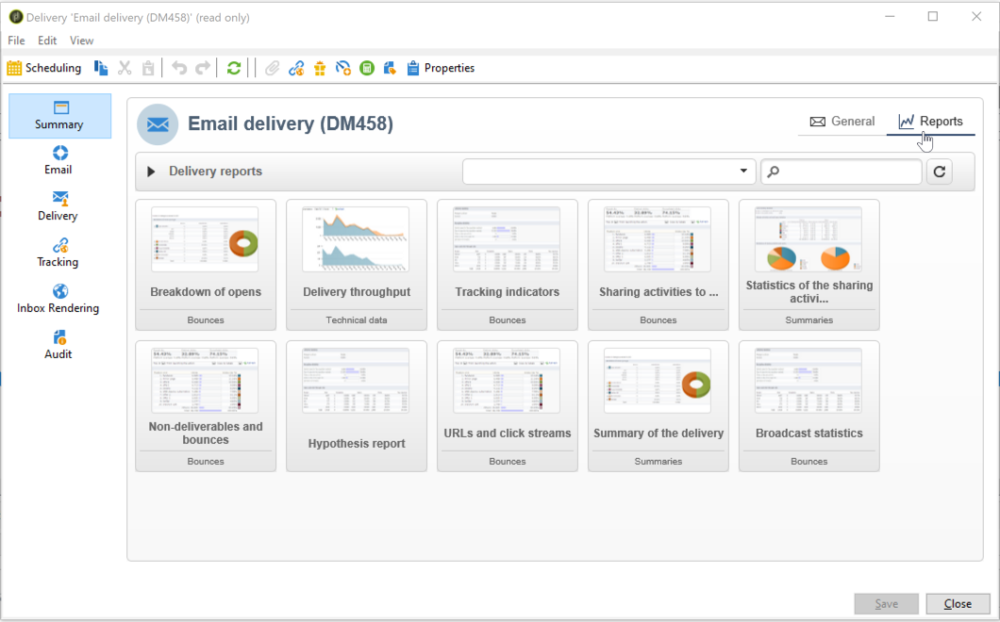

# Dashboard delle consegne {#delivery-dashboard}


La **dashboard di consegna** è fondamentale per monitorare le consegne e gli eventuali problemi riscontrati durante l’invio dei messaggi.

Ti consente di recuperare informazioni su una consegna e modificarle, se necessario. Tieni presente che il contenuto delle schede potrebbe non essere più modificato dopo l’invio della consegna.

Di seguito sono riportate le informazioni che è possibile monitorare utilizzando le diverse schede disponibili nel dashboard:

* [Riepilogo consegne](#delivery-summary)
* [Rapporti di consegna](#delivery-reports)
* [Log di consegna, pagine mirror, esclusioni](#delivery-logs-and-history)
* [Log e cronologia di tracciamento delle consegne](#tracking-logs)
* [Rendering di consegna](#delivery-rendering)
* [Audit di consegna](#delivery-audit-)


**Argomenti correlati:**

* [Informazioni sugli errori di consegna](understanding-delivery-failures.md)
* [Informazioni sulla gestione della quarantena](understanding-quarantine-management.md)
* [Best practice per la consegna](delivery-best-practices.md)
* [Gestione delle consegne](about-deliverability.md)

## Riepilogo consegne {#delivery-summary}

La **[!UICONTROL Summary]** La scheda contiene le caratteristiche della consegna: stato della consegna, canale utilizzato, informazioni sul mittente, oggetto, informazioni relative all’esecuzione.

## Rapporti di consegna {#delivery-reports}

La **[!UICONTROL Reports]** , accessibile dal **[!UICONTROL Summary]** consente di esaminare un set di rapporti relativi all’azione di consegna: rapporto generale di consegna, rapporto dettagliato, rapporto di consegna, distribuzione di messaggi non riusciti, tasso di apertura, clic e transazioni, ecc.

Il contenuto di questa scheda può essere configurato in base alle tue esigenze. Per ulteriori informazioni sui rapporti di consegna, consulta [questa sezione](../../reporting/using/delivery-reports.md).



## Log di consegna, cronologia ed esclusioni {#delivery-logs-and-history}

La **[!UICONTROL Delivery]** fornisce una cronologia delle occorrenze nella consegna. Contiene i registri di consegna, ovvero l’elenco dei messaggi inviati e il loro stato e i messaggi associati.

Per una consegna, puoi visualizzare (ad esempio) solo i destinatari con una consegna non riuscita o un indirizzo in quarantena. A questo scopo, fai clic sul pulsante **[!UICONTROL Filters]** e seleziona **[!UICONTROL By state]**. Quindi seleziona lo stato nell’elenco a discesa. Vari stati sono elencati in [questa pagina](delivery-statuses.md).

>[!NOTE]
>
>È possibile personalizzare l’elenco dei registri di consegna, come qualsiasi elenco in Campaign Classic. Ad esempio, puoi aggiungere una colonna per sapere quale indirizzo IP ha inviato ogni e-mail in una consegna. Per ulteriori informazioni, consulta il caso d’uso descritto in [questa sezione](#use-case).


La **[!UICONTROL Display the mirror page for this message...]** link ti consente di visualizzare la pagina speculare per il contenuto della consegna selezionata dall’elenco in una nuova finestra.

La pagina speculare è disponibile solo per le consegne per le quali è stato definito il contenuto di HTML. Per ulteriori informazioni, consulta [Generazione della pagina speculare](sending-messages.md#generating-the-mirror-page).


## Log e cronologia di tracciamento delle consegne {#tracking-logs}

La **[!UICONTROL Tracking]** elenca la cronologia di tracciamento per la consegna. In questa scheda vengono visualizzati i dati di tracciamento per i messaggi inviati, ovvero tutti gli URL soggetti al tracciamento da parte di Adobe Campaign. I dati di tracciamento vengono aggiornati ogni ora.

>[!NOTE]
>
>Se il tracciamento non è abilitato per una consegna, questa scheda non viene visualizzata.

La configurazione del tracciamento viene eseguita nella fase appropriata della procedura guidata di consegna. Vedi [Come configurare i collegamenti tracciati](how-to-configure-tracked-links.md).

**[!UICONTROL Tracking]** i dati vengono interpretati nei rapporti di consegna. Vedi [questa sezione](../../reporting/using/delivery-reports.md).


## Rendering della casella in entrata {#delivery-rendering}

La **[!UICONTROL Inbox rendering]** La scheda ti consente di visualizzare in anteprima il messaggio nei diversi contesti in cui può essere ricevuto e di verificare la compatibilità nei principali desktop e applicazioni.

In questo modo, puoi assicurarti che il messaggio venga visualizzato ai destinatari in modo ottimale su diversi client web, e-mail e dispositivi web.

Per ulteriori informazioni sul rendering della casella in entrata, consulta [questa pagina](inbox-rendering.md)


## Audit di consegna {#delivery-audit-}

La **[!UICONTROL Audit]** contiene il registro di consegna e tutti i messaggi relativi alle bozze.

La **[!UICONTROL Refresh]** consente di aggiornare i dati. Utilizza la **[!UICONTROL Filters]** per definire un filtro per i dati.

Le icone speciali consentono di identificare errori o avvisi. Vedi [Analisi della consegna](steps-validating-the-delivery.md#analyzing-the-delivery).

La **[!UICONTROL Proofs]** la sottoscheda ti consente di visualizzare l’elenco delle bozze inviate.


Puoi modificare le informazioni visualizzate in questa finestra (e nella **[!UICONTROL Delivery]** e **[!UICONTROL Tracking]** selezionando le colonne da visualizzare. A questo scopo, fai clic sul pulsante **[!UICONTROL Configure list]** nell&#39;angolo in basso a destra. Per ulteriori informazioni sulla configurazione della visualizzazione dell’elenco, consulta [questa sezione](../../platform/using/adobe-campaign-workspace.md#configuring-lists).

## Sincronizzazione del dashboard di consegna {#delivery-dashboard-synchronization}

Dal dashboard di consegna, desideri controllare i messaggi elaborati e i registri di consegna per assicurarti che la consegna sia stata inviata correttamente.

Alcuni indicatori o stato possono essere errati o non aggiornati, questo può essere risolto con le seguenti soluzioni:

* Se lo stato di consegna non è corretto, verifica che siano state eseguite tutte le approvazioni necessarie per questa consegna o che il **[!UICONTROL operationMgt]** e **[!UICONTROL deliveryMgt]** i flussi di lavoro sono in esecuzione senza errori. Questo può anche essere dovuto alla consegna utilizzando un’affinità non configurata sull’istanza di invio.

* Se gli indicatori di consegna sono ancora a zero e se sei in una configurazione di mid-sourcing, controlla il **[!UICONTROL Mid-sourcing (delivery counters)]** flusso di lavoro tecnico. Inizialo se il suo stato non è **[!UICONTROL Started]**. Puoi quindi provare a calcolare gli indicatori facendo clic con il pulsante destro del mouse sulla consegna desiderata in Adobe Campaign Explorer e selezionando **[!UICONTROL Actions]** > **[!UICONTROL Recompute delivery and tracking indicators]**. Per ulteriori informazioni sugli indicatori di tracciamento, consulta questo [sezione](../../reporting/using/delivery-reports.md#tracking-indicators).

* Se il contatore di consegna non corrisponde alla consegna, prova a calcolare gli indicatori facendo clic con il pulsante destro del mouse sulla consegna corrispondente in Adobe Campaign Explorer e selezionando **[!UICONTROL Actions]** > **[!UICONTROL Recompute delivery and tracking indicators]** per eseguire nuovamente la sincronizzazione. Per ulteriori informazioni sugli indicatori di tracciamento, consulta questo [sezione](../../reporting/using/delivery-reports.md#tracking-indicators).

* Se il contatore di consegna non è aggiornato per le distribuzioni di mid-sourcing, controlla che il **[!UICONTROL Mid-Sourcing (Delivery counters)]** flusso di lavoro tecnico in esecuzione. Per ulteriori informazioni, consulta questa [pagina](../../installation/using/mid-sourcing-deployment.md).

Puoi anche tenere traccia delle consegne con diversi rapporti tramite il dashboard di consegna. Per ulteriori informazioni, consulta questa [sezione](../../reporting/using/delivery-reports.md).

## Caso di utilizzo: Aggiunta di indirizzi IP dei mittenti ai registri {#use-case}

In questa sezione imparerai come aggiungere ai registri di consegna le informazioni relative all’indirizzo IP che ha inviato ogni e-mail in una consegna.

>[!NOTE]
>
>Questa modifica è diversa se utilizzi una singola istanza o un’istanza di mid-sourcing. Prima di apportare la modifica, assicurati di essere connesso all’istanza di invio dell’e-mail.

### Passaggio 1: Estendere lo schema

Per aggiungere **publicID** nei registri di consegna devi prima estendere lo schema. Potete procedere come segue.

1. Crea un&#39;estensione dello schema, in **[!UICONTROL Administration]** > **[!UICONTROL Configuration]** > **[!UICONTROL Data Schemas]** > **[!UICONTROL New]**.

   Per ulteriori informazioni sulle estensioni dello schema, consulta [questa pagina](../../configuration/using/extending-a-schema.md).

1. Seleziona **[!UICONTROL broadLogRcp]** estendere i registri di consegna dei destinatari (nms) e definire un namespace personalizzato. In questo caso sarà &quot;cus&quot;:

   

   >[!NOTE]
   >
   >Se l&#39;istanza è in mid-sourcing, è necessario utilizzare lo schema wideLogMid.

1. Aggiungi il nuovo campo nell&#39;estensione . In questo esempio, devi sostituire:

   ```
   <element img="nms:broadLog.png" label="Recipient delivery logs" labelSingular="Recipient delivery log" name="broadLogRcp"/>
   ```

   da:

   ```
   <element img="nms:broadLog.png" label="Recipient delivery logs" labelSingular="Recipient delivery log" name="broadLogRcp">
   <attribute desc="Outbound IP identifier" label="IP identifier"
   name="publicId" type="long"/>
   </element>
   ```

   

### Passaggio 2: Aggiorna struttura del database

Una volta apportate le modifiche, devi aggiornare la struttura del database in modo che sia allineata alla relativa descrizione logica.

Per farlo, segui la procedura indicata di seguito:

1. Fai clic sul pulsante **[!UICONTROL Tools]** > **[!UICONTROL Advanced]** > **[!UICONTROL Update database structure...]** menu.

   

1. In **[!UICONTROL Edit tables]** la finestra **[!UICONTROL NmsBroadLogRcp]** (o **[!UICONTROL broadLogMid]** tabella se ti trovi in un ambiente di mid-sourcing), come segue:

   

   >[!IMPORTANT]
   >
   >Assicurati sempre che non ci siano altre modifiche, tranne il **[!UICONTROL NmsBroadLoGRcp]** (o **[!UICONTROL broadLogMid]** se si trovano in un ambiente di mid-sourcing). In tal caso, deselezionare altre tabelle.

1. Fai clic su **[!UICONTROL Next]** da convalidare. Viene visualizzata la seguente schermata:

   

1. Fai clic su **[!UICONTROL Next]**, quindi **[!UICONTROL Start]** per avviare l&#39;aggiornamento della struttura del database. Avvio della creazione dell&#39;indice. Questo passaggio può essere lungo, a seconda del numero di righe nel **[!UICONTROL NmsBroadLogRcp]** tabella.

   

>[!NOTE]
>
>Una volta completato l&#39;aggiornamento della struttura fisica del database, è necessario disconnettersi e riconnettersi in modo che le modifiche vengano prese in considerazione.

### Passaggio 3: Convalida la modifica

Per confermare il corretto funzionamento di tutto, devi aggiornare la schermata dei registri di consegna.

A questo scopo, accedi ai registri di consegna e aggiungi la colonna &quot;ID IP&quot;.


>[!NOTE]
>
>Per informazioni su come configurare gli elenchi nell’interfaccia di Campaign Classic, consulta [questa pagina](../../platform/using/adobe-campaign-workspace.md).

Di seguito è riportato ciò che dovresti vedere nel **[!UICONTROL Delivery]** dopo le modifiche:


