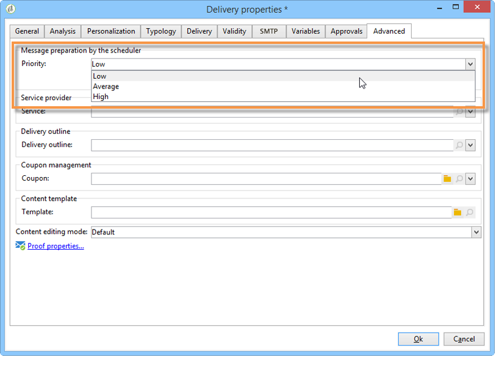
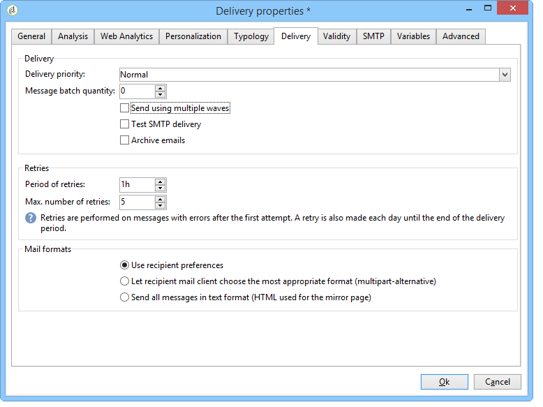
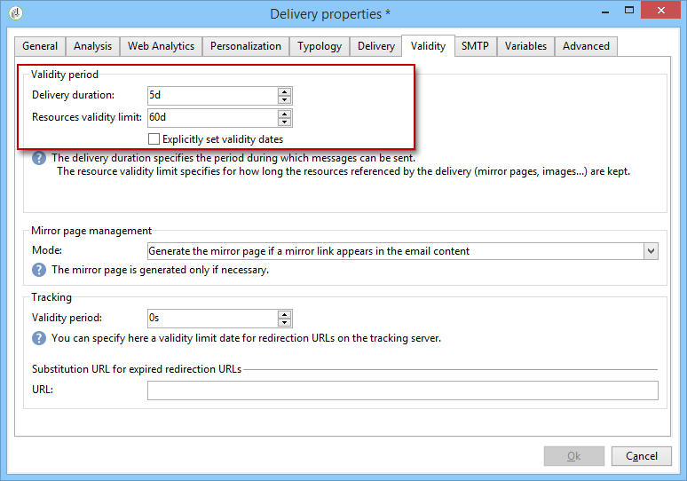

# Impostazioni consegna {#about-delivery-settings}

Le seguenti impostazioni sono specifiche di Campaign Classic. Per altre impostazioni di consegna, consulta la [documentazione di Campaign v8](https://experienceleague.adobe.com/docs/campaign/campaign-v8/send/gs-message.html){target="_blank"}.

## Analisi della consegna {#delivery-analysis}

### Migliorare le prestazioni di analisi della consegna {#improving-delivery-analysis}

Per accelerare la preparazione della consegna, è possibile selezionare l&#39;opzione **[!UICONTROL Prepare the delivery parts in the database]** prima di avviare l&#39;analisi.

Quando questa opzione è abilitata, la preparazione della consegna viene eseguita direttamente all’interno del database, il che può accelerare notevolmente l’analisi.

Attualmente, questa opzione è disponibile solo quando sono soddisfatte le seguenti condizioni:

* La consegna deve essere un’e-mail. Al momento gli altri canali non sono supportati.
* Non utilizzare il mid-sourcing o il ciclo esterno, ma solo il tipo di ciclo di consegna in blocco. È possibile controllare il routing utilizzato nella scheda **[!UICONTROL General]** di **[!UICONTROL Delivery properties]**.
* Non è possibile eseguire il targeting di una popolazione proveniente da un file esterno. Per una singola consegna, fare clic sul collegamento **[!UICONTROL To]** da **[!UICONTROL Email parameters]** e verificare che l&#39;opzione **[!UICONTROL Defined in the database]** sia selezionata. Per una consegna utilizzata in un flusso di lavoro, verifica che i destinatari siano **[!UICONTROL Specified by the inbound event(s)]** nella scheda **[!UICONTROL Delivery]**.
* Utilizzare un database PostgreSQL.

### Configurare la priorità di analisi {#analysis-priority-}

Quando la consegna fa parte di una campagna, la scheda **[!UICONTROL Advanced]** offre un&#39;opzione aggiuntiva. Questo consente di organizzare l’ordine di elaborazione per le consegne nella stessa campagna.

Prima dell’invio, ogni consegna viene analizzata. La durata dell’analisi dipende dal file di estrazione della consegna. Maggiore è la dimensione del file, più lunga sarà l’analisi, più attenderanno le consegne seguenti.

Le opzioni per **[!UICONTROL Message preparation by the scheduler]** ti consentono di assegnare la priorità all&#39;analisi della consegna in un flusso di lavoro della campagna.

Se una consegna è troppo grande, è meglio assegnarvi una priorità bassa per evitare di rallentare l’analisi delle altre consegne del flusso di lavoro.

>[!NOTE]
>
>Per evitare che le analisi di consegna più grandi rallentino l&#39;avanzamento dei flussi di lavoro, puoi pianificare le loro esecuzioni facendo clic su **[!UICONTROL Schedule execution for a time of low activity]**.

## Invio consegna {#delivery-sending}

### Configurare nuovi tentativi {#configuring-retries}

I messaggi temporaneamente non recapitati a causa di un errore **Morbido** o **Ignorato** sono soggetti a un nuovo tentativo automatico. I tipi e i motivi degli errori di consegna sono presentati in questa [sezione](delivery-failures-quarantine.md#delivery-failure-types-and-reasons).

>[!IMPORTANT]
>
>Per le installazioni in hosting o ibride, se hai eseguito l&#39;aggiornamento all&#39;[MTA avanzato](sending-with-enhanced-mta.md), le impostazioni dei nuovi tentativi nella consegna non vengono più utilizzate da Campaign. I nuovi tentativi di mancato recapito non permanenti e il periodo di tempo che intercorre tra di essi sono determinati dall’MTA avanzato in base al tipo e alla gravità delle risposte di mancato recapito provenienti dal dominio e-mail del messaggio.

Per le installazioni on-premise e le installazioni in hosting/ibride che utilizzano l’MTA di Campaign legacy, la sezione centrale della scheda **[!UICONTROL Delivery]** per i parametri di consegna indica quanti tentativi devono essere eseguiti il giorno successivo alla consegna e il ritardo minimo tra i nuovi tentativi.

Per impostazione predefinita, per il primo giorno della consegna sono pianificati cinque nuovi tentativi con un intervallo minimo di un’ora distribuiti nelle 24 ore del giorno. Un nuovo tentativo al giorno è programmato dopo tale e fino alla scadenza della consegna, definita nella scheda **[!UICONTROL Validity]**. Consulta [Definire il periodo di validità](#defining-validity-period).

### Definire il periodo di validità {#defining-validity-period}

Una volta avviata la consegna, i messaggi (ed eventuali nuovi tentativi) possono essere inviati fino alla scadenza della consegna. Questo è indicato nelle proprietà di consegna tramite la scheda **[!UICONTROL Validity]**.

* Il campo **[!UICONTROL Delivery duration]** consente di immettere il limite per i nuovi tentativi di consegna globali. Questo significa che Adobe Campaign invia i messaggi a partire dalla data di inizio e quindi, per i messaggi che restituiscono un errore, vengono eseguiti nuovi tentativi regolari e configurabili fino al raggiungimento del limite di validità.

  Puoi anche scegliere di specificare le date. A tale scopo, selezionare **[!UICONTROL Explicitly set validity dates]**. In questo caso, per le date di consegna e del limite validità puoi anche specificare l’ora. Per impostazione predefinita viene utilizzata l’ora corrente, ma puoi modificarla direttamente nel campo di input.

  >[!IMPORTANT]
  >
  >Per le installazioni in hosting o ibride, se hai effettuato l&#39;aggiornamento all&#39;[MTA avanzato](sending-with-enhanced-mta.md), l&#39;impostazione **[!UICONTROL Delivery duration]** nelle consegne e-mail di Campaign verrà utilizzata solo se impostata su **3,5 giorni o meno**. Se definisci un valore superiore a 3,5 giorni, questo non verrà preso in considerazione.

* **Limite di validità delle risorse**: il campo **[!UICONTROL Validity limit]** viene utilizzato per le risorse caricate, principalmente per la pagina speculare e per le immagini. Le risorse presenti in questa pagina sono valide per un periodo di tempo limitato (per risparmiare spazio su disco).

  I valori in questo campo possono essere espressi nelle seguenti unità: **s** per secondi, **m** per minuti, **h** per ore, **d** per giorni (impostazione predefinita), **y** per anni.
