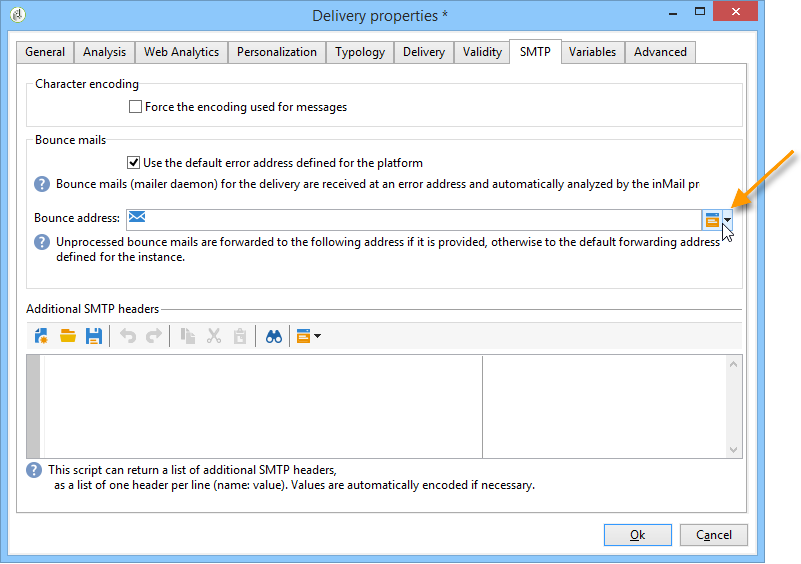

# Parametri e-mail {#email-parameters}

Questa sezione presenta le opzioni e i parametri specifici per la consegna e-mail.

## Invia e-mail in Ccn {#email-bcc}

Adobe Campaign consente di memorizzare le e-mail su un sistema esterno tramite Ccn semplicemente aggiungendo un indirizzo e-mail Ccn alla destinazione del messaggio.

Una volta attivata l’opzione, per questa consegna verrà conservata una copia esatta di tutti i messaggi inviati.

Per ulteriori informazioni sulla configurazione del Ccn e-mail e sulle best practice, consulta [questa sezione](../../installation/using/email-archiving.md).

>[!NOTE]
>
>CCN e-mail è una funzionalità opzionale. Controlla il contratto di licenza e contatta il responsabile dell’account per attivarla.

Per impostazione predefinita, quando si crea un nuovo modello di consegna o consegna, il campo CCN e-mail non è abilitato. Devi abilitarla manualmente a livello di consegna e-mail o modello di consegna.

>[!NOTE]
>
>Se utilizzi Ccn e-mail con MTA avanzato, questa opzione viene abilitata automaticamente per tutte le consegne.

Per abilitare Ccn e-mail per un modello di consegna e-mail, effettua le seguenti operazioni:

1. Vai a **[!UICONTROL Campaign Management]** > **[!UICONTROL Deliveries]** o **[!UICONTROL Resources]** > **[!UICONTROL Templates]** > **[!UICONTROL Delivery templates]**.
1. Seleziona la consegna desiderata o duplica il modello predefinito **Email delivery**, quindi seleziona il modello duplicato.
1. Fare clic sul pulsante **Proprietà**.
1. Seleziona la scheda **[!UICONTROL Delivery]**.
1. Selezionare l&#39;opzione **Invia e-mail a Ccn**. Una copia di tutti i messaggi inviati per ogni consegna basata su questo modello verrà inviata all’indirizzo e-mail Ccn configurato.

   

>[!NOTE]
>
>Se le e-mail inviate all&#39;indirizzo Ccn vengono aperte e cliccate tramite, questo verrà preso in considerazione nelle **[!UICONTROL Total opens]** e **[!UICONTROL Clicks]** dell&#39;analisi di invio, il che potrebbe causare alcuni errori di calcolo.

## Selezione dei formati dei messaggi {#selecting-message-formats}

Puoi modificare il formato dei messaggi e-mail inviati. A tale scopo, modificare le proprietà di consegna e fare clic sulla scheda **[!UICONTROL Delivery]**.

Seleziona il formato dell’e-mail nella sezione inferiore della finestra:

* **[!UICONTROL Use recipient preferences]** (modalità predefinita)

  Il formato del messaggio è definito in base ai dati memorizzati nel profilo del destinatario e archiviato per impostazione predefinita nel campo **[!UICONTROL email format]** (@emailFormat). Se un destinatario desidera ricevere i messaggi in un determinato formato, questo sarà il formato inviato. Se il campo non è compilato, viene inviato un messaggio multipart-alternative (vedi sotto).

* **[!UICONTROL Let recipient mail client choose the most appropriate format]**

  Il messaggio contiene entrambi i formati: testo e HTML. Il formato visualizzato sulla ricezione dipende dalla configurazione del software di posta del destinatario (multipart-alternative).

  >[!IMPORTANT]
  >
  >Questa opzione include entrambe le versioni del documento. Di conseguenza, influisce sulla velocità di consegna, perché la dimensione del messaggio è maggiore.

* **[!UICONTROL Send all messages in text format]**

  Il messaggio viene inviato in formato testo. Il formato HTML non verrà inviato, ma verrà utilizzato per la pagina speculare solo quando il destinatario farà clic sul messaggio.

>[!NOTE]
>
>Per ulteriori informazioni sulla definizione del contenuto dell&#39;e-mail, vedere [questa sezione](defining-the-email-content.md).

## Generazione della pagina mirror {#generating-mirror-page}

La pagina mirror è una pagina HTML accessibile online tramite un browser web. Il contenuto è identico a quello dell’e-mail.

Per impostazione predefinita, la pagina speculare viene generata se il collegamento viene inserito nel contenuto dell’e-mail. Per ulteriori informazioni sull&#39;inserimento di blocchi di personalizzazione, consulta [Blocchi di personalizzazione](personalization-blocks.md).

Nelle proprietà di consegna, il campo **[!UICONTROL Mode]** della scheda **[!UICONTROL Validity]** ti consente di modificare la modalità di generazione per questa pagina.

>[!IMPORTANT]
>
>Per poter creare la pagina speculare, è necessario che sia stato definito un contenuto HTML per la consegna.

Oltre alla modalità predefinita, sono disponibili anche le seguenti opzioni:

* **[!UICONTROL Force the generation of the mirror page]**: anche se nella consegna non viene inserito alcun collegamento alla pagina speculare, verrà creata la pagina speculare.
* **[!UICONTROL Do not generate the mirror page]**: non viene generata alcuna pagina mirror, anche se il collegamento è presente nella consegna.
* **[!UICONTROL Generates a mirror page accessible using only the message identifier]**: questa opzione ti consente di accedere al contenuto della pagina speculare, con le informazioni sulla personalizzazione, nella finestra del registro di consegna. A questo scopo, dopo la fine della consegna, fai clic sulla scheda **[!UICONTROL Delivery]** e seleziona la riga del destinatario di cui desideri visualizzare la pagina speculare. Fai clic sul collegamento **[!UICONTROL Display the mirror page for this message...]**.

  

## Codifica caratteri {#character-encoding}

Nella scheda **[!UICONTROL SMTP]** dei parametri di consegna, la sezione **[!UICONTROL Character encoding]** ti consente di impostare una codifica specifica.

La codifica predefinita è UTF-8. Se alcuni provider di posta elettronica dei destinatari non supportano la codifica standard UTF-8, è possibile impostare una codifica specifica per visualizzare correttamente i caratteri speciali per i destinatari delle e-mail.

Ad esempio, desideri inviare un’e-mail contenente caratteri giapponesi. Per garantire che tutti i caratteri vengano visualizzati correttamente ai destinatari in Giappone, è possibile utilizzare una codifica che supporti i caratteri giapponesi anziché il formato UTF-8 standard.

A tale scopo, selezionare l&#39;opzione **[!UICONTROL Force the encoding used for messages]** nella sezione **[!UICONTROL Character encoding]** e scegliere una codifica dall&#39;elenco a discesa visualizzato.

## Gestione delle e-mail non recapitate {#managing-bounce-emails}

La scheda **[!UICONTROL SMTP]** dei parametri di consegna ti consente di configurare la gestione dei messaggi non recapitati.

Per impostazione predefinita, le e-mail non recapitate vengono ricevute nella [casella di errore predefinita della piattaforma](../../installation/using/deploying-an-instance.md#parameters-for-delivered-emails-parameters-for-delivered-emails), ma puoi definire un indirizzo di errore specifico per una consegna.

Puoi anche definire un indirizzo specifico da questa schermata per indagare i motivi dei messaggi non recapitati quando l’applicazione non è in grado di qualificarli automaticamente. Per ciascuno di questi campi, l&#39;icona **Aggiungi campi personalizzati** consente di aggiungere parametri di personalizzazione.

Per ulteriori informazioni sulla gestione della posta non recapitata, consulta [questa sezione](understanding-delivery-failures.md#bounce-mail-management).

## Aggiunta di intestazioni SMTP {#adding-smtp-headers}

È possibile aggiungere intestazioni SMTP alle consegne. A questo scopo, utilizza la sezione pertinente della scheda **[!UICONTROL SMTP]** nella consegna.

Lo script immesso in questa finestra deve fare riferimento a un&#39;intestazione per riga nel seguente formato: **nome:valore**.

Se necessario, i valori vengono codificati automaticamente.

>[!IMPORTANT]
>
>L’aggiunta di uno script per l’inserimento di intestazioni SMTP aggiuntive è riservata agli utenti avanzati.
>
>La sintassi di questo script deve essere conforme ai requisiti di questo tipo di contenuto: nessuno spazio inutilizzato, nessuna linea vuota e così via.
