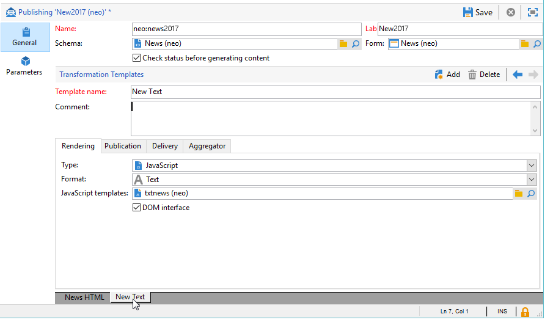

# Formattazione{#formatting}

## Modelli JavaScript {#javascript-templates}

Un modello JavaScript è un HTML o un documento di testo che include codice JavaScript. Viene costruito allo stesso modo del contenuto di un’e-mail in un’azione di consegna.

### Identificazione di un modello JavaScript {#identification-of-a-javascript-template}

Un modello di JavaScript è identificato dal nome e dallo spazio dei nomi, proprio come gli schemi e i moduli. Si consiglia tuttavia di aggiungere l&#39;opzione **.js** al nome del modello.

### Struttura di un modello JavaScript {#structure-of-a-javascript-template}

Esempio di modello di formattazione di JavaScript HTML basato sullo schema &quot;cus:book&quot;:

```
<html>
  <body>
    <!-- Title of book -->
    <h1><%= content.@name %></h1>
    <ul>
      <% for each(var chapter in content.chapter) { %>
        <li><%= chapter.@name %></li>
      <% }%>
    </ul>
  </body>
</html>
```

Le varie direttive di JavaScript vengono visualizzate nel seguente formato:

* Unisci campi: visualizza il contenuto dei dati con la sintassi **`<%= <source> %>`**, dove `<source>` è il campo di origine dei dati da visualizzare.
* Blocchi di istruzioni: esegue una serie di istruzioni JavaScript incluse tra i tag &lt;% e %>.

L&#39;oggetto **content** rappresenta l&#39;elemento principale del documento XML di input.

Nel nostro esempio, la riga seguente mostra il contenuto del nome del registro:

```
<h1><%= content.@name %></h1>
```

Il codice seguente esegue iterazioni sull&#39;elemento della raccolta `<chapter>`:

```
<% for each(var chapter in content.chapter) { %>
  <li><%= chapter.@name %></li>
<% }%>
```

Gli attributi e gli elementi del contenuto vengono rappresentati come oggetti di JavaScript e rispettano la struttura del documento di origine.

**Esempio**:

* **contenuto.@name**: recupera il valore dell&#39;attributo &quot;name&quot; dell&#39;elemento principale
* **contenuto.@`['name']`**: identico al contenuto **.Sintassi @name**
* **content.chapter.length**: restituisce il numero di elementi nell&#39;elemento della raccolta `<chapter`
* **content.chapter`[0]`.@name**: recupera il nome del primo elemento `<chapter>`
* **chapter.name()**: restituisce il nome dell&#39;elemento `<chapter>`
* **chapter.parent().name()**: restituisce il nome dell&#39;elemento padre di `<chapter>`

>[!CAUTION]
>
>Poiché il carattere &#39;-&#39; è riservato nel linguaggio JavaScript, il recupero del valore di qualsiasi attributo o elemento contenente questo carattere deve essere eseguito tramite la sintassi `['<field>']`.
>
>Esempio: `content.@['offer-id']`.

Tutta la potenza di un linguaggio di programmazione (variabili, cicli, test condizionali, funzioni, ecc.) ) è disponibile per creare il documento di output. Le API SOAP sono accessibili per arricchire il documento di output.

Esempi:

* Prova condizionale:

  ```
  <% if (content.@number == 1 || content.@language == 'en') { %>
  <!-- Content to be displayed if test is true--> 
  <% } %>
  ```

* Chiamata di funzione:

  ```
  <!-- Displays a horizontal bar -->
  ;<% function DisplayHorizontalBar() { %>
    <hr/>
  <% } %> 
  
  <!-- The same function in a block  -->
  <% 
  function DisplayHorizontalBar2()
  {
    document.write('<hr/>');
  }
  %> 
  
  <!-- Returns the value in uppercase -->
  <% 
  function formatName(value)
  { 
    return value.toUpperCase(); 
  }
  %>
  
  <!-- Call functions -->
  <%= DisplayHorizontalBar1() %>
  <%= DisplayHorizontalBar2() %>
  <%= formatName(content.@name) %>
  ```

* Dichiarazioni e chiamata di variabile:

  ```
  <%  var counter = 0; %>
  
  <%= counter += 10 %>
  ```

* Recupero e visualizzazione di un nome di destinatario con metodi statici:

  ```
  <% var recipient = nms.recipient.get(1246); %>
  <%= recipient.lastName %>
  ```

* Recupero e visualizzazione del nome di un destinatario con metodi non statici:

  ```
  <% var query = xtk.queryDef.create(
    <queryDef schema="nms:recipient" operation="get">
      <select>
        <node expr="@lastName"/>
      </select>
      <where>
        <condition expr="@id=1246"/>
      </where>
    </queryDef>);
  
    var recipient = query.ExecuteQuery();
  %>
  
  <%= recipient.@lastName %>
  ```

### Inclusione di un modello JavaScript {#including-a-javascript-template}

Puoi creare una libreria di funzioni o variabili da utilizzare in un secondo momento. A tale scopo, importare il modello JavaScript con la funzione **eval**. Questo consente di arricchire i contesti con funzioni aggiuntive dichiarate in altri modelli di JavaScript.

**Esempio**: importazione del modello **common.jsp**.

```
<% eval(xtk.javascript.get("cus:common.js").data);  %>
```

### Modifica di un modello di JavaScript {#editing-a-javascript-template}

L’area di modifica consente di popolare il contenuto del modello JavaScript:


>[!NOTE]
>
>Lo schema del modello dati associato deve essere compilato per l’inizializzazione degli oggetti JavaScript.

Per generare l&#39;anteprima del documento di output in qualsiasi momento, selezionare un contenuto e un formato di output (HTML, Text, XML), quindi fare clic su **[!UICONTROL Generate]**:


>[!NOTE]
>
>Non è necessario salvare le modifiche per visualizzare in anteprima il documento di output.

### Esempio di creazione e utilizzo di un modello di JavaScript {#example-of-how-to-create-and-use-a-javascript-template}

Di seguito è riportata la configurazione necessaria per implementare la seguente gestione dei contenuti utilizzando un modello di JavaScript:


Questo esempio prevede i seguenti passaggi:

1. Crea il seguente schema (in questo caso: **neo:news**):

   ```
   <srcSchema _cs="Invitation (neo)"   entitySchema="xtk:srcSchema" img="xtk:schema.png" label="Invitation" mappingType="sql" name="news" namespace="neo" xtkschema="xtk:srcSchema">
   
     <enumeration basetype="string" default="en" name="language">
       <value label="Français" name="fr" value="fr"/>
       <value label="English" name="gb" value="gb"/>
     </enumeration>
   
     <enumeration basetype="string" name="css">
       <value label="Blue" name="bl" value="blue"/>
       <value label="Orange" name="or" value="orange"/>
     </enumeration>
   
     <element label="Intervenants" name="attendee">
       <key internal="true" name="id">
         <keyfield xpath="@id"/>
       </key>
       <attribute label="Name" name="name" type="string"/>
       <element label="Image" name="image" target="xtk:fileRes" type="link"/>
       <attribute label="Description" name="description" type="string"/>
       <attribute default="Gid()" label="Id" name="id" type="long"/>
     </element>
   
     <element label="Invitation" name="news" template="ncm:content" xmlChildren="true">
   
       <compute-string expr="@name"/>
       <attribute enum="language" label="Language" name="language" type="string"/>
       <attribute enum="css" label="Stylesheet" name="css" type="string"/>
       <attribute label="Title" name="title" type="string"/>
       <element label="Presentation" name="presentation" type="html"/>
       <attribute label="Date" name="date" type="date"/>
       <element label="Attendees list" name="attendeesList" ordered="true" ref="attendee" unbound="true"/>
   
     </element>
   </srcSchema>
   ```

1. Crea il modulo di tipo **[!UICONTROL Content management]** collegato (**neo:news**)

   ```
   <form _cs="News (neo)" entitySchema="xtk:form"  img="xtk:form.png" label="News"  name="news" namespace="neo" type="contentForm" xtkschema="xtk:form">
   
     <container type="iconbox">
       <container label="Invitation">
         <input xpath="@langue"/>
         <input xpath="@css"/>
         <input xpath="@title"/>
         <input xpath="@date"/>
         <input xpath="presentation"/>
       </container>
   
       <container label="Intervenants">
         <container toolbarCaption="Liste des intervenants" type="notebooklist" xpath="attendeesList" xpath-label="@nom">
           <container>
             <input xpath="@nom"/>
             <input img="nl:sryimage.png" newEntityFormChoice="true" xpath="image">
               <sysFilter>
                 <condition expr="@isImage = true"/>
               </sysFilter>
             </input>
             <input xpath="@description"/>
           </container>
         </container>
       </container>
     </container>
   
   </form>
   ```

1. Creare i modelli di JavaScript con il contenuto del messaggio per i formati HTML e Text.

   * Nel nostro esempio, per HTML:

     ```
     <html>     
       <head>         
         <title>Newsletter</title>
          <style type="text/css">
           .body {font-family:Verdana, Arial, Helvetica, sans-serif; font-size:10px; color:#514c48; margin-left: auto; margin-right: auto;}
           .body table {width:748; border: solid 1px; cellpadding:0; cellspacing:0"}
          </style>
       </head>     
       <body>
         <p><center><%= mirrorPage %></center></p>
         <center>
           <table>      
            <tr>
             <td>                                                         
                                                  
             </td>
             <td>
               <h1><%= content.@title %></h1>
             </td>
            </tr>
            <tr>
     
            <td>
             <div >                                    
               <h0><%= hello,</h0>                              
               <p><%= content.presentation %></p>                                          
     
               <h0>Useful information</h0>                              
               <p>                                  
                 When? <br/><%= formatDate(content.@date, "%2D %Bl %4Y") %> From 10 AM in your bookshop.</p><br/>                                       
               <p>                                  
                 Who? <br>Meet our favorite authors and illustrators and get a signed copy of their book.</p><br/>                                                         
               <p>                                  
                 Attendance is free but there is a limited number of seats: sign up now!</p>
           </div>
           </td>
     
             <td>                                                    
              <div style="text-align:left; width:210; height:400px; background:url([IMAGE DE FOND])">
     
                 <h0><%= participant %></h0>
                 <%
                 var i
                 var iLength = content.attendeesList.length()
                 for (i=0; i<iLength; i++)
                 { %>
                 <p>
                   <%= generateImgTag(content.attendeesList[i].@["image-id"]) %>  <%= content.attendeesList[i].@description %>
                 </p>  
                 <% }  
                 %>                              
              </div2>
             </td>
         </tr>
       </table>
     </center>
     </body>    
     </html>
     ```

   * Per il testo:

     ```
     <%= content.@title %>
     <%= content.presentation %>
     
     *** When? On <%= formatDate(content.@date, "%2D %Bl %4Y") %> From 10 AM in your bookshop.
     
     *** Who? Come and meet our favorite authors and illustrators and get a signed copy of their books. 
     
     *** Attendance is free but there is a limited number of seats: sign up now!
     
     Guests:
     ******************
     <%
     var i
     var iLength = content.attendeesList.length()
     //for (i=(iLength-1); i>-1; i--)
     for( i=0 ; i<iLength ; i++ )
       { %>
       Description <%= i %> : <%= content.attendeesList[i].@description %>
       <% }  
     %>
     ```

1. Ora crea il modello di pubblicazione utilizzato per entrambi i formati:

   * Per HTML:

     

   * Per il testo:

     

1. Puoi quindi utilizzare questo modello di contenuto nelle consegne.

   Per ulteriori informazioni, consulta [Utilizzo di un modello di contenuto](using-a-content-template.md).

## Fogli di stile XSL {#xsl-stylesheets}

Il linguaggio XSLT consente di trasformare un documento XML in un documento di output. A seconda del metodo di output del foglio di stile, il documento risultante può essere generato in HTML, in testo normale o in un&#39;altra struttura XML.

Questa trasformazione viene a sua volta descritta in XML in un documento noto come foglio di stile.

### Identificazione di un foglio di stile {#identifying-a-stylesheet}

Un foglio di stile è identificato dal nome e dallo spazio dei nomi, proprio come gli schemi e le maschere. Si consiglia tuttavia di aggiungere l&#39;estensione **.xsl** al nome del foglio di stile.

La chiave di identificazione di un foglio di stile è una stringa formata dallo spazio dei nomi e dal nome separati da due punti, ad esempio: **cus:book.xsl**.

### Struttura di un foglio di stile {#structure-of-a-stylesheet}

Esempio di un foglio di stile di formattazione HTML basato sullo schema di esempio &quot;cus:book&quot;:

```
<?xml version="1.0" encoding="ISO-8859-1" ?>
<xsl:stylesheet xmlns:xsl="http://www.w3.org/1999/XSL/Transform" version="1.0">
  <xsl:output encoding="ISO-8859-1" method="html"/>
  <!-- Point of entry of the stylesheet -->
  <xsl:template match="/book">
    <html>
      <body>
        <!-- Book title -->
        <h1><xsl:value-of select="@name"/></h1>
        <lu>
          <!-- List of chapters -->
          <xsl:for-each select="child::chapter">
            <li><xsl:value-of select="@name"/></li>
          </xsl:for-each>
       </lu>
      </body>
    </html>
   </xsl:template>
</xsl:stylesheet>
```

Un foglio di stile è un documento XML che rispetta le regole seguenti:

* i valori degli attributi sono tra virgolette,
* un elemento deve avere un marcatore di apertura e un marcatore di chiusura,
* sostituire i caratteri &#39;&lt;&#39; o &#39;&amp;&#39; con le entità **&#39;&lt;&#39;** o **&#39;&amp;&#39;**,
* ogni elemento XSL deve utilizzare lo spazio dei nomi **xsl**.

Un foglio di stile deve iniziare con l&#39;indicatore dell&#39;elemento radice XSL **`<xsl:stylesheet>`** e terminare con l&#39;indicatore **`</xsl:stylesheet>`**. Lo spazio dei nomi XSL deve essere definito nel marcatore di apertura come segue:

```
<xsl:stylesheet xmlns:xsl="http://www.w3.org/1999/XSL/Transform" version="1.0">
```

L&#39;elemento **`<xsl:output>`** specifica il formato del documento generato. Specifica il set di caratteri desiderato e il formato di output.

```
<xsl:output encoding="ISO-8859-1" method="html"/>
```

Le istruzioni seguenti descrivono la configurazione del foglio di stile per la formattazione del documento di output.

```
<xsl:template match="/book">
  <html>
    <body>
      <!-- Book title -->
      <h1><xsl:value-of select="@name"/></h1>
      <lu>
        <!-- List of chapters -->
        <xsl:for-each select="child::chapter">
          <li><xsl:value-of select="@name"/></li>
        </xsl:for-each>
      </lu>
    </body>
  </html>
</xsl:template>
```

Per impostazione predefinita, il processore XSLT cerca il **modello** che si applica al nodo principale o principale del documento XML di input. La costruzione del documento di output inizia con questo **modello**.

Nel nostro esempio, una pagina HTML viene generata dallo schema &quot;cus:book&quot; visualizzando il nome del libro e l’elenco dei capitoli.

>[!NOTE]
>
>Per ulteriori informazioni sul linguaggio XSLT, consultare un documento di riferimento XSLT.

### Visualizzazione di HTML/XML {#displaying-html-xml}

Per visualizzare un campo **html**, utilizzare l&#39;opzione **disable-output-escape=&quot;yes&quot;** della direttiva **`<xsl:value-of>`**. Questo consente di evitare la sostituzione dei caratteri con la relativa entità XML (ad esempio &lt; con &lt;).

La direttiva **`<xsl:text>`** con l&#39;opzione **disable-output-escape=&quot;yes&quot;** consente di inserire i tag JavaScript per i campi di personalizzazione o i test condizionali.

Esempi:

* Visualizzazione del contenuto di un campo di tipo html:

  ```
  <xsl:value-of select="summary" disable-output-escaping="yes"/>
  ```

* Inserimento del campo di personalizzazione **&lt;%= recipient.email %>**:

  ```
  <xsl:text disable-output-escaping="yes"><%= recipient.email %></xsl:text>
  ```

* Aggiunta del test condizionale **&lt;% se (recipient.language == &#39;en&#39;) `{` %>**:

  ```
  <xsl:text disable-output-escaping="yes"><% if (recipient.language == 'en') { %></xsl:text>
  ```

### Inclusione dei fogli di stile {#including-stylesheets}

È possibile creare una libreria di modelli o variabili da condividere tra più fogli di stile. Il modello **template** &quot;longMonth&quot;, presentato in precedenza, è un tipico esempio del vantaggio di individuare un modello in remoto in un foglio di stile in modo che possa essere riutilizzato in un secondo momento.

La direttiva **`<xsl:include>`** indica il nome del foglio di stile da includere nel documento.

**Esempio**: incluso il foglio di stile &quot;common.xsl&quot;.

```
<? xml version="1.0" encoding="ISO-8859-1" ?>
<xsl:stylesheet xmlns:xsl="http://www.w3.org/1999/XSL/Transform" version="1.0">
  <xsl:include href="common.xsl"/> 
  <xsl:output encoding="ISO-8859-1" method="jsp" indent="yes"/>
  ...
</xsl:stylesheet>
```

>[!NOTE]
>
>Il nome dello spazio dei nomi non deve essere inserito nel riferimento del foglio di stile da includere. Come standard, questo foglio di stile viene creato con lo spazio dei nomi utente.

### Modifica di un foglio di stile {#editing-a-stylesheet}

La zona di modifica consente di popolare il contenuto del foglio di stile:


Per generare un&#39;anteprima del documento di output in qualsiasi momento, selezionare un&#39;istanza di contenuto e il formato (HTML, Text, XML), quindi fare clic su **[!UICONTROL Generate]**:


>[!NOTE]
>
>Non è necessario salvare le modifiche nel foglio di stile per visualizzare l&#39;anteprima del documento di output.

## Gestione delle immagini {#image-management}

### Immagine con riferimento {#image-referencing}

È possibile fare riferimento alle immagini immesse nel documento di output di HTML con riferimenti assoluti o relativi.

Il riferimento relativo consente di immettere l&#39;URL del server contenente le immagini nelle opzioni **NcmRessourcesDir** e **NcmRessourcesDirPreview**. Queste opzioni contengono la posizione delle immagini da pubblicare e visualizzare in anteprima nella console client di Adobe Campaign.

Queste due opzioni sono accessibili tramite la schermata Gestione opzioni nella cartella **[!UICONTROL Administration > Platform > Options]**.

**Esempio**:

* NcmResourcesDir = &quot;https://server/images/&quot;
* NcmResourcesDirPreview = &quot;x:/images/&quot;

Durante l&#39;elaborazione del foglio di stile, l&#39;attributo **_resPath** dell&#39;elemento principale del documento XML di input viene automaticamente compilato con una o più opzioni a seconda del contesto (anteprima o pubblicazione).

Esempio di come utilizzare l’opzione di posizionamento immagine e il relativo utilizzo con un’immagine:

```
/newsletter/image.png"/>
```

>[!NOTE]
>
>È consigliabile dichiarare una variabile contenente il riferimento del server in cui sono memorizzate le immagini (&quot;resPath&quot; nel nostro esempio).

### Utilizzo di risorse pubbliche {#using-public-resources}

È inoltre possibile utilizzare **[!UICONTROL Public resources]** per dichiarare le immagini e caricarle sul server a seconda delle impostazioni di istanza immesse nella procedura guidata di distribuzione.

Puoi quindi richiamare queste immagini nel contenuto. a questo scopo, utilizza la seguente sintassi nello schema di gestione dei contenuti:

```
<element label="Image" name="image" target="xtk:fileRes" type="link"/>
```

Nel modulo, il campo per la selezione dell’immagine viene aggiunto con la seguente sintassi:

```
<input img="nl:sryimage.png" newEntityFormChoice="true" xpath="image">
    <sysFilter>
      <condition expr="@isImage = true"/>
    </sysFilter>
  </input>
```

>[!NOTE]
>
>Per ulteriori informazioni su **[!UICONTROL Public resources]** e su come configurarle e utilizzarle, fare riferimento a [questa sezione](../../installation/using/deploying-an-instance.md#managing-public-resources).

## Visualizzazione data {#date-display}

Nel documento di input XML le date sono memorizzate nel formato XML interno: **`YYYY/MM/DD HH:MM:SS`** (esempio: `2018/10/01 12:23:30`).

Adobe Campaign fornisce funzioni di formattazione della data per i modelli JavaScript e i fogli di stile XSL descritti di seguito.

### Formattazione data JavaScript {#javascript-date-formatting}

Per visualizzare una data nel formato desiderato, Adobe Campaign fornisce la funzione **formatDate** che accetta come input il contenuto della data e una stringa che specifica il formato di output con la seguente sintassi: **%4Y/%2M/%2D %2H%2N%2S**

Esempi:

* Visualizza la data nel formato **31/10/2018**:

  ```
   <%= formatDate(content.@date, "%2D/%2M/%4Y") %>
  ```

* Visualizza la data nel formato **luglio 2018**:

  ```
  <%
   function displayDate(date)
    {
      var aMonth = 
      [ 'January', 'February', 'March', 'April', 'May', 'June', 'July', 'August', 'September', 'October', 'November', 'December' ];
  
      var month = formatDate(content.@date, "%2M")
      var year = formatDate(content.@date, "%4Y")
  
      return aMonth[month-1]+" "+year;
    }
  %>
  
  <%= displayDate(content.@date) %>
  ```

### Formattazione data XSL {#xsl-date-formatting}

La sintassi XSLT non contiene funzioni standard di gestione delle date. Per visualizzare una data nel formato desiderato, Adobe Campaign fornisce la funzione esterna **formato data**. Questa funzione considera come input il contenuto della data e una stringa che specifica il formato di output con la seguente sintassi: **%4Y/%2M/%2D %2H%2N%2S**

Esempi:

* Per visualizzare la data nel formato **01/10/2018**:

  ```
  <xsl:value-of select="external:date-format(@date, '%2D/%2M/%4Y')"/>
  ```

* Per visualizzare la data nel formato **luglio 2018**:

  ```
  <!-- Returns the month in the form of a string with the month number as input -->
  <xsl:template name="longMonth">
    <xsl:param name="monthNumber"/>
  
    <xsl:choose>
      <xsl:when test="$monthNumber = 1">January</xsl:when>
      <xsl:when test="$monthNumber = 2">February</xsl:when>
      <xsl:when test="$monthNumber = 3">March</xsl:when>
      <xsl:when test="$monthNumber = 4">April</xsl:when>
      <xsl:when test="$monthNumber = 5">May</xsl:when>
      <xsl:when test="$monthNumber = 6">June</xsl:when>
      <xsl:when test="$monthNumber = 7">July</xsl:when>
      <xsl:when test="$monthNumber = 8">August</xsl:when>
      <xsl:when test="$monthNumber = 9">September</xsl:when>
      <xsl:when test="$monthNumber = 10">October</xsl:when>
      <xsl:when test="$monthNumber = 11">November</xsl:when>
      <xsl:when test="$monthNumber = 12">December</xsl:when>
    </xsl:choose>
  </xsl:template> 
  
  <!-- Display date -->
  <xsl:call-template name="longMonth">
    <xsl:with-param name="monthNumber">
      <xsl:value-of select="external:date-format(@date, '%2M')"/>
    </xsl:with-param>
  </xsl:call-template>
   <xsl:value-of select="external:date-format(@date, '%4y')"/>
  ```
