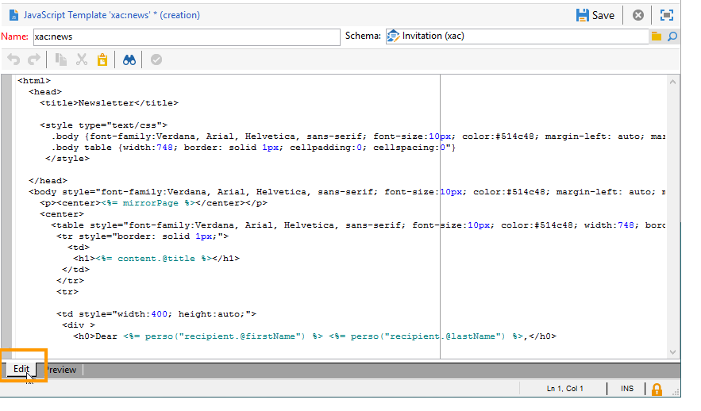

# Formattazione{#formatting}

## Modelli JavaScript {#javascript-templates}

Un modello JavaScript è un documento HTML o di testo che include codice JavaScript. Viene costruito allo stesso modo di un contenuto e-mail in un&#39;azione di consegna.

### Identificazione di un modello JavaScript {#identification-of-a-javascript-template}

Un modello JavaScript è identificato dal nome e dallo spazio dei nomi come schemi e moduli. Si consiglia tuttavia di aggiungere l&#39;opzione **.js** al nome del modello.

### Struttura di un modello JavaScript {#structure-of-a-javascript-template}

Esempio di modello di formattazione HTML JavaScript basato sullo schema &quot;cus:book&quot;:

```
<html>
  <body>
    <!-- Title of book -->
    <h1><%= content.@name %></h1>
    <ul>
      <% for each(var chapter in content.chapter) { %>
        <li><%= chapter.@name %></li>
      <% }%>
    </ul>
  </body>
</html>
```

Le varie direttive JavaScript vengono visualizzate nel seguente modulo:

* Unisci campi: visualizza il contenuto dei dati con la **`<%= <source> %>`** sintassi in cui `<source>`è il campo di origine dei dati da visualizzare.
* Blocchi istruzioni: esegue una serie di istruzioni JavaScript incluse tra i tag &lt;% e %>.

L&#39;oggetto **content** rappresenta l&#39;elemento principale del documento XML di input.

Nel nostro esempio, la riga seguente visualizza il contenuto del nome della rubrica:

```
<h1><%= content.@name %></h1>
```

Il codice seguente si ripete sull&#39;elemento `<chapter>` collection:

```
<% for each(var chapter in content.chapter) { %>
  <li><%= chapter.@name %></li>
<% }%>
```

Gli attributi e gli elementi del contenuto sono rappresentati come oggetti JavaScript e rispettano la struttura del documento di origine.

**Esempio**:

* **content.@name**: recupera il valore dell&#39;attributo &quot;name&quot; dell&#39;elemento principale
* **content.@`['name']`**: identico al **contenuto.Sintassi di @name**
* **content.Chapter.length**: restituisce il numero di elementi nell&#39;elemento `<chapter` di raccolta
* **content.Chapter`[0]`.@name**: recupera il nome del primo `<chapter>` elemento
* **Chapter.name()**: restituisce il nome dell&#39; `<chapter>` elemento
* **Chapter.parent().name()**: restituisce il nome dell&#39;elemento padre di `<chapter>`

>[!CAUTION]
>
>Poiché il carattere &#39;-&#39; è riservato nel linguaggio JavaScript, il recupero del valore di qualsiasi attributo o elemento contenente questo carattere deve essere eseguito tramite la `['<field>']` sintassi.
>
>Ad esempio: `content.@['offer-id']`.

Tutta la potenza di un linguaggio di programmazione (variabili, loop, test condizionali, funzioni, ecc.) ) è disponibile per creare il documento di output. Le API SOAP sono accessibili per arricchire il documento di output.

Esempi:

* Prova condizionale:

   ```
   <% if (content.@number == 1 || content.@language == 'en') { %>
   <!-- Content to be displayed if test is true--> 
   <% } %>
   ```

* Chiamata di funzione:

   ```
   <!-- Displays a horizontal bar -->
   ;<% function DisplayHorizontalBar() { %>
     <hr/>
   <% } %> 
   
   <!-- The same function in a block  -->
   <% 
   function DisplayHorizontalBar2()
   {
     document.write('<hr/>');
   }
   %> 
   
   <!-- Returns the value in uppercase -->
   <% 
   function formatName(value)
   { 
     return value.toUpperCase(); 
   }
   %>
   
   <!-- Call functions -->
   <%= DisplayHorizontalBar1() %>
   <%= DisplayHorizontalBar2() %>
   <%= formatName(content.@name) %>
   ```

* Dichiarazioni e chiamata variabile:

   ```
   <%  var counter = 0; %>
   
   <%= counter += 10 %>
   ```

* Recupero e visualizzazione di un nome di destinatario con metodi statici:

   ```
   <% var recipient = nms.recipient.get(1246); %>
   <%= recipient.lastName %>
   ```

* Recupero e visualizzazione di un nome di destinatario con metodi non statici:

   ```
   <% var query = xtk.queryDef.create(
     <queryDef schema="nms:recipient" operation="get">
       <select>
         <node expr="@lastName"/>
       </select>
       <where>
         <condition expr="@id=1246"/>
       </where>
     </queryDef>);
   
     var recipient = query.ExecuteQuery();
   %>
   
   <%= recipient.@lastName %>
   ```

### Inclusione di un modello JavaScript {#including-a-javascript-template}

È possibile creare una libreria di funzioni o variabili da utilizzare successivamente. A questo scopo, importate il modello JavaScript con la funzione **eval** . Questo consente di arricchire i contesti con funzioni aggiuntive dichiarate in altri modelli JavaScript.

**Esempio**: importazione del modello **common.jsp** .

```
<% eval(xtk.javascript.get("cus:common.js").data);  %>
```

### Modifica di un modello JavaScript {#editing-a-javascript-template}

La zona di modifica consente di compilare il contenuto del modello JavaScript:



>[!NOTE]
>
>Lo schema del modello dati associato deve essere popolato per l&#39;inizializzazione degli oggetti JavaScript.

Per generare l&#39;anteprima del documento di output in qualsiasi momento, selezionare un contenuto e un formato di output (HTML, testo, XML), quindi fare clic su **[!UICONTROL Generate]** :


>[!NOTE]
>
>Non è necessario salvare le modifiche per visualizzare l&#39;anteprima del documento di output.

### Esempio di creazione e utilizzo di un modello JavaScript {#example-of-how-to-create-and-use-a-javascript-template}

Di seguito viene riportata la configurazione necessaria per implementare la seguente gestione dei contenuti utilizzando un modello JavaScript:


Questo esempio include i seguenti passaggi:

1. Create lo schema seguente (in questo caso: **neo:news**):

   ```
   <srcSchema _cs="Invitation (neo)"   entitySchema="xtk:srcSchema" img="xtk:schema.png" label="Invitation" mappingType="sql" name="news" namespace="neo" xtkschema="xtk:srcSchema">
   
     <enumeration basetype="string" default="en" name="language">
       <value label="Français" name="fr" value="fr"/>
       <value label="English" name="gb" value="gb"/>
     </enumeration>
   
     <enumeration basetype="string" name="css">
       <value label="Blue" name="bl" value="blue"/>
       <value label="Orange" name="or" value="orange"/>
     </enumeration>
   
     <element label="Intervenants" name="attendee">
       <key internal="true" name="id">
         <keyfield xpath="@id"/>
       </key>
       <attribute label="Name" name="name" type="string"/>
       <element label="Image" name="image" target="xtk:fileRes" type="link"/>
       <attribute label="Description" name="description" type="string"/>
       <attribute default="Gid()" label="Id" name="id" type="long"/>
     </element>
   
     <element label="Invitation" name="news" template="ncm:content" xmlChildren="true">
   
       <compute-string expr="@name"/>
       <attribute enum="language" label="Language" name="language" type="string"/>
       <attribute enum="css" label="Stylesheet" name="css" type="string"/>
       <attribute label="Title" name="title" type="string"/>
       <element label="Presentation" name="presentation" type="html"/>
       <attribute label="Date" name="date" type="date"/>
       <element label="Attendees list" name="attendeesList" ordered="true" ref="attendee" unbound="true"/>
   
     </element>
   </srcSchema>
   ```

1. Creare il modulo **[!UICONTROL Content management]** di tipo collegato (**neo:news**)

   ```
   <form _cs="News (neo)" entitySchema="xtk:form"  img="xtk:form.png" label="News"  name="news" namespace="neo" type="contentForm" xtkschema="xtk:form">
   
     <container type="iconbox">
       <container label="Invitation">
         <input xpath="@langue"/>
         <input xpath="@css"/>
         <input xpath="@title"/>
         <input xpath="@date"/>
         <input xpath="presentation"/>
       </container>
   
       <container label="Intervenants">
         <container toolbarCaption="Liste des intervenants" type="notebooklist" xpath="attendeesList" xpath-label="@nom">
           <container>
             <input xpath="@nom"/>
             <input img="nl:sryimage.png" newEntityFormChoice="true" xpath="image">
               <sysFilter>
                 <condition expr="@isImage = true"/>
               </sysFilter>
             </input>
             <input xpath="@description"/>
           </container>
         </container>
       </container>
     </container>
   
   </form>
   ```

1. Create i modelli JavaScript con il contenuto dei messaggi per i formati HTML e Testo.

   * Nel nostro esempio, per HTML:

      ```
      <html>     
        <head>         
          <title>Newsletter</title>
           <style type="text/css">
            .body {font-family:Verdana, Arial, Helvetica, sans-serif; font-size:10px; color:#514c48; margin-left: auto; margin-right: auto;}
            .body table {width:748; border: solid 1px; cellpadding:0; cellspacing:0"}
           </style>
        </head>     
        <body>
          <p><center><%= mirrorPage %></center></p>
          <center>
            <table>      
             <tr>
              <td>                                                         
                                                   
              </td>
              <td>
                <h1><%= content.@title %></h1>
              </td>
             </tr>
             <tr>
      
             <td>
              <div >                                    
                <h0><%= hello,</h0>                              
                <p><%= content.presentation %></p>                                          
      
                <h0>Useful information</h0>                              
                <p>                                  
                  When? <br/><%= formatDate(content.@date, "%2D %Bl %4Y") %> From 10 AM in your bookshop.</p><br/>                                       
                <p>                                  
                  Who? <br>Meet our favorite authors and illustrators and get a signed copy of their book.</p><br/>                                                         
                <p>                                  
                  Attendance is free but there is a limited number of seats: sign up now!</p>
            </div>
            </td>
      
              <td>                                                    
               <div style="text-align:left; width:210; height:400px; background:url([IMAGE DE FOND])">
      
                  <h0><%= participant %></h0>
                  <%
                  var i
                  var iLength = content.attendeesList.length()
                  for (i=0; i<iLength; i++)
                  { %>
                  <p>
                    <%= generateImgTag(content.attendeesList[i].@["image-id"]) %>  <%= content.attendeesList[i].@description %>
                  </p>  
                  <% }  
                  %>                              
               </div2>
              </td>
          </tr>
        </table>
      </center>
      </body>    
      </html>
      ```

   * Per il testo:

      ```
      <%= content.@title %>
      <%= content.presentation %>
      
      *** When? On <%= formatDate(content.@date, "%2D %Bl %4Y") %> From 10 AM in your bookshop.
      
      *** Who? Come and meet our favorite authors and illustrators and get a signed copy of their books. 
      
      *** Attendance is free but there is a limited number of seats: sign up now!
      
      Guests:
      ******************
      <%
      var i
      var iLength = content.attendeesList.length()
      //for (i=(iLength-1); i>-1; i--)
      for( i=0 ; i<iLength ; i++ )
        { %>
        Description <%= i %> : <%= content.attendeesList[i].@description %>
        <% }  
      %>
      ```

1. Create ora il modello di pubblicazione utilizzato per entrambi i formati:

   * Per HTML:

      

   * Per il testo:

      

1. Potete quindi utilizzare questo modello di contenuto nelle consegne.

   Per ulteriori informazioni, consultate [Utilizzo di un modello](../../delivery/using/using-a-content-template.md)di contenuto.

## Fogli di stile XSL {#xsl-stylesheets}

Il linguaggio XSLT consente di convertire un documento XML in un documento di output. A seconda del metodo di output del foglio di stile, il documento risultante può essere generato in HTML, testo normale o in un&#39;altra struttura XML.

Questa trasformazione è a sua volta dettagliata in XML in un documento noto come foglio di stile.

### Identificazione di un foglio di stile {#identifying-a-stylesheet}

Un foglio di stile è identificato dal nome e dallo spazio dei nomi, come schemi e moduli. Tuttavia, si consiglia di aggiungere l&#39;estensione **.xsl** al nome del foglio di stile.

La chiave di identificazione di un foglio di stile è una stringa formata dallo spazio dei nomi e dal nome separato da due punti; ad esempio: **cus:book.xsl**.

### Struttura di un foglio di stile {#structure-of-a-stylesheet}

Esempio di un foglio di stile di formattazione HTML basato sullo schema di esempio &quot;cus:book&quot;:

```
<?xml version="1.0" encoding="ISO-8859-1" ?>
<xsl:stylesheet xmlns:xsl="http://www.w3.org/1999/XSL/Transform" version="1.0">
  <xsl:output encoding="ISO-8859-1" method="html"/>
  <!-- Point of entry of the stylesheet -->
  <xsl:template match="/book">
    <html>
      <body>
        <!-- Book title -->
        <h1><xsl:value-of select="@name"/></h1>
        <lu>
          <!-- List of chapters -->
          <xsl:for-each select="child::chapter">
            <li><xsl:value-of select="@name"/></li>
          </xsl:for-each>
       </lu>
      </body>
    </html>
   </xsl:template>
</xsl:stylesheet>
```

Un foglio di stile è un documento XML che rispetta le regole seguenti:

* i valori degli attributi sono compresi tra virgolette,
* un elemento deve avere un indicatore di apertura e un indicatore di chiusura,
* sostituire i caratteri &#39;&lt;&#39; o &#39;&amp;&#39; con le entità **&#39;&lt;&#39;** o **&#39;&amp;&#39;** ,
* ogni elemento XSL deve utilizzare lo spazio dei nomi **xsl** .

Un foglio di stile deve iniziare con il marcatore dell&#39;elemento principale XSL **`<xsl:stylesheet>`** e terminare con il **`</xsl:stylesheet>`** marcatore. Lo spazio nomi XSL deve essere definito nel marcatore di apertura come segue:

```
<xsl:stylesheet xmlns:xsl="http://www.w3.org/1999/XSL/Transform" version="1.0">
```

L&#39; **`<xsl:output>`** elemento specifica il formato del documento generato. Specificate il set di caratteri desiderato e il formato di output.

```
<xsl:output encoding="ISO-8859-1" method="html"/>
```

Le istruzioni seguenti descrivono la configurazione del foglio di stile per la formattazione del documento di output.

```
<xsl:template match="/book">
  <html>
    <body>
      <!-- Book title -->
      <h1><xsl:value-of select="@name"/></h1>
      <lu>
        <!-- List of chapters -->
        <xsl:for-each select="child::chapter">
          <li><xsl:value-of select="@name"/></li>
        </xsl:for-each>
      </lu>
    </body>
  </html>
</xsl:template>
```

Per impostazione predefinita, il processore XSLT cerca il **modello** che si applica al nodo principale o principale del documento XML di input. La costruzione del documento di output inizia con questo **modello**.

Nel nostro esempio, una pagina HTML viene generata dallo schema &quot;cus:book&quot; mostrando il nome del libro e l&#39;elenco dei capitoli.

>[!NOTE]
>
>Per ulteriori informazioni sul linguaggio XSLT, fare riferimento a un documento di riferimento XSLT.

### Visualizzazione di HTML/XML {#displaying-html-xml}

Per visualizzare un campo **html** , utilizzate l&#39;opzione **disable-output-escape=&quot;yes&quot;** dalla **`<xsl:value-of>`** direttiva. Questo consente di evitare la sostituzione dei caratteri con la relativa entità XML (ad esempio &lt; con &lt;).

La **`<xsl:text>`** direttiva con l&#39;opzione **disable-output-escape=&quot;yes&quot;** consente di inserire tag JavaScript per campi di personalizzazione o test condizionali.

Esempi:

* Visualizzazione del contenuto di un campo di tipo &quot;html&quot;:

   ```
   <xsl:value-of select="summary" disable-output-escaping="yes"/>
   ```

* Inserimento del campo di personalizzazione **&lt;%= Recipiente.email %>**:

   ```
   <xsl:text disable-output-escaping="yes"><%= recipient.email %></xsl:text>
   ```

* Aggiunta del test condizionale **&lt;% if (Recipient.language == &#39;en&#39;) `{` %>**:

   ```
   <xsl:text disable-output-escaping="yes"><% if (recipient.language == 'en') { %></xsl:text>
   ```

### Inclusi fogli di stile {#including-stylesheets}

È possibile creare una libreria di modelli o variabili da condividere tra diversi fogli di stile. Il **modello**&quot;longMonth&quot;, presentato sopra, è un esempio tipico del vantaggio di individuare un modello in remoto in un foglio di stile in modo che possa essere riutilizzato in un secondo momento.

La **`<xsl:include>`** direttiva indica il nome del foglio di stile da includere nel documento.

**Esempio**: incluso il foglio di stile &quot;common.xsl&quot;.

```
<? xml version="1.0" encoding="ISO-8859-1" ?>
<xsl:stylesheet xmlns:xsl="http://www.w3.org/1999/XSL/Transform" version="1.0">
  <xsl:include href="common.xsl"/> 
  <xsl:output encoding="ISO-8859-1" method="jsp" indent="yes"/>
  ...
</xsl:stylesheet>
```

>[!NOTE]
>
>Il nome dello spazio nomi non deve essere immesso nel riferimento del foglio di stile da includere. Come standard, questo foglio di stile viene creato con lo spazio dei nomi utente.

### Modifica di un foglio di stile {#editing-a-stylesheet}

L&#39;area di modifica consente di compilare il contenuto del foglio di stile:


Per generare un&#39;anteprima del documento di output in qualsiasi momento, selezionate un&#39;istanza di contenuto e il formato (HTML, Testo, XML), quindi fate clic su **[!UICONTROL Generate]** :


>[!NOTE]
>
>Non è necessario salvare le modifiche nel foglio di stile per visualizzare l&#39;anteprima del documento di output.

## Gestione delle immagini {#image-management}

### Riferimento immagine {#image-referencing}

Alle immagini inserite nel documento di output HTML è possibile fare riferimento con riferimenti assoluti o relativi.

Il riferimento relativo consente di inserire l’URL del server contenente le immagini nelle opzioni **NcmRessourcesDir** e **NcmRessourcesDirPreview** . Queste opzioni contengono il percorso delle immagini per la pubblicazione e l’anteprima nella console client Adobe Campaign .

Queste due opzioni sono accessibili tramite la schermata di gestione delle opzioni nella **[!UICONTROL Administration > Platform > Options]** cartella.

**Esempio**:

* NcmResourcesDir = &quot;https://server/images/&quot;
* NcmResourcesDirPreview = &quot;x:/images/&quot;

Durante l&#39;elaborazione dei fogli di stile, l&#39;attributo **_resPath** sull&#39;elemento principale del documento XML di input viene compilato automaticamente con una o più opzioni a seconda del contesto (anteprima o pubblicazione).

Esempio di utilizzo dell’opzione di posizionamento dell’immagine e del relativo utilizzo con un’immagine:

```
/newsletter/image.png"/>
```

>[!NOTE]
>
>È consigliabile dichiarare una variabile contenente il riferimento del server in cui sono memorizzate le immagini (&quot;resPath&quot; nel nostro esempio).

### Utilizzo delle risorse pubbliche {#using-public-resources}

Potete inoltre utilizzare **[!UICONTROL Public resources]** per dichiarare le immagini e caricarle sul server in base alle impostazioni dell&#39;istanza immesse nella procedura guidata di distribuzione.

Potete quindi richiamare queste immagini nel contenuto. a tal fine, utilizzate la seguente sintassi nello schema di gestione del contenuto:

```
<element label="Image" name="image" target="xtk:fileRes" type="link"/>
```

Nel modulo, il campo per la selezione dell&#39;immagine verrà aggiunto tramite la sintassi seguente:

```
<input img="nl:sryimage.png" newEntityFormChoice="true" xpath="image">
    <sysFilter>
      <condition expr="@isImage = true"/>
    </sysFilter>
  </input>
```

>[!NOTE]
>
>Per ulteriori informazioni su come **[!UICONTROL Public resources]** configurarli e utilizzarli, consulta [questa sezione](../../installation/using/deploying-an-instance.md#managing-public-resources).

## Visualizzazione data {#date-display}

Nel documento di input XML, le date sono memorizzate nel formato XML interno: **AAAA/MM/GG HH:MM:SS** (esempio 2018/10/01 12:23:30).

 Adobe Campaign fornisce funzioni di formattazione delle date per i modelli JavaScript e i fogli di stile XSL descritti di seguito.

### Formattazione data JavaScript {#javascript-date-formatting}

Per visualizzare una data nel formato desiderato,  Adobe Campaign fornisce la funzione **formatDate** che prende come input il contenuto della data e una stringa che specifica il formato di output con la sintassi seguente: **%4Y/%2M/%2D %2H%2N%2S**

Esempi:

* Visualizza la data nel formato **31/10/2018** :

   ```
    <%= formatDate(content.@date, "%2D/%2M/%4Y") %>
   ```

* Visualizza la data nel formato **luglio 2018** :

   ```
   <%
    function displayDate(date)
     {
       var aMonth = 
       [ 'January', 'February', 'March', 'April', 'May', 'June', 'July', 'August', 'September', 'October', 'November', 'December' ];
   
       var month = formatDate(content.@date, "%2M")
       var year = formatDate(content.@date, "%4Y")
   
       return aMonth[month-1]+" "+year;
     }
   %>
   
   <%= displayDate(content.@date) %>
   ```

### Formattazione data XSL {#xsl-date-formatting}

Nella sintassi XSLT non è disponibile alcuna funzione di gestione data standard. Per visualizzare una data nel formato desiderato,  Adobe Campaign fornisce il formato **** data della funzione esterna. Questa funzione utilizza come input il contenuto della data e una stringa che specifica il formato di output con la sintassi seguente: **%4Y/%2M/%2D %2H%2N%2S**

Esempi:

* Per visualizzare la data nel formato **01/10/2018** :

   ```
   <xsl:value-of select="external:date-format(@date, '%2D/%2M/%4Y')"/>
   ```

* Per visualizzare la data nel formato **luglio 2018** :

   ```
   <!-- Returns the month in the form of a string with the month number as input -->
   <xsl:template name="longMonth">
     <xsl:param name="monthNumber"/>
   
     <xsl:choose>
       <xsl:when test="$monthNumber = 1">January</xsl:when>
       <xsl:when test="$monthNumber = 2">February</xsl:when>
       <xsl:when test="$monthNumber = 3">March</xsl:when>
       <xsl:when test="$monthNumber = 4">April</xsl:when>
       <xsl:when test="$monthNumber = 5">May</xsl:when>
       <xsl:when test="$monthNumber = 6">June</xsl:when>
       <xsl:when test="$monthNumber = 7">July</xsl:when>
       <xsl:when test="$monthNumber = 8">August</xsl:when>
       <xsl:when test="$monthNumber = 9">September</xsl:when>
       <xsl:when test="$monthNumber = 10">October</xsl:when>
       <xsl:when test="$monthNumber = 11">November</xsl:when>
       <xsl:when test="$monthNumber = 12">December</xsl:when>
     </xsl:choose>
   </xsl:template> 
   
   <!-- Display date -->
   <xsl:call-template name="longMonth">
     <xsl:with-param name="monthNumber">
       <xsl:value-of select="external:date-format(@date, '%2M')"/>
     </xsl:with-param>
   </xsl:call-template>
    <xsl:value-of select="external:date-format(@date, '%4y')"/>
   ```
