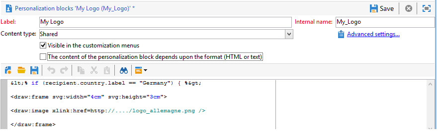

# Generare documenti PDF personalizzati{#generating-personalized-pdf-documents}

## Informazioni sui documenti PDF variabili {#about-variable-pdf-documents}

Adobe Campaign consente di generare documenti PDF variabili per gli allegati e-mail da documenti LibreOffice o Microsoft Word.

Sono supportate le seguenti estensioni: &quot;.docx&quot;, &quot;.doc&quot; e &quot;.odt&quot;.

Per personalizzare i documenti, sono disponibili le stesse funzionalità JavaScript disponibili per la personalizzazione e-mail.

È necessario attivare **[!UICONTROL "The content of the file is personalized and converted to PDF during the delivery of each message"]** opzione. Questa opzione è accessibile quando alleghi il file all’e-mail di consegna. Per ulteriori informazioni su come allegare un file calcolato, consulta [Allega file](attaching-files.md) sezione.

Esempio di personalizzazione dell&#39;intestazione di una fattura:


Per generare tabelle dinamiche o includere immagini tramite un URL, devi seguire un processo specifico.

## Generare tabelle dinamiche {#generating-dynamic-tables}

La procedura per la generazione di tabelle dinamiche è la seguente:

* Crea una tabella con tre righe e tutte le colonne necessarie, quindi configurane il layout (bordi, ecc.).
* Posizionare il cursore sulla tabella e fare clic su **[!UICONTROL Table > Table properties]** menu. Vai a **[!UICONTROL Table]** e inserisci un nome che inizi con **NlJsTable**.
* Nella prima cella della prima riga, definisci un loop (&quot;for&quot;, ad esempio) che consenta l’iterazione dei valori che desideri visualizzare nella tabella.
* In ogni cella della seconda riga della tabella, inserire gli script che restituiscono i valori da visualizzare.
* Chiudete il loop nella terza e ultima riga della tabella.

  Esempio di definizione di una tabella dinamica:

  

## Inserisci immagini esterne {#inserting-external-images}

L’inserimento di immagini esterne è utile, ad esempio, se desideri personalizzare un documento con un’immagine il cui URL viene inserito in un campo del destinatario.

A questo scopo, devi configurare un blocco di personalizzazione, quindi includere nell’allegato una chiamata al blocco di personalizzazione.

**Esempio: inserisci un logo personalizzato a seconda del paese del destinatario**

**Passaggio 1: creare l&#39;allegato:**

* Inserisci la chiamata al blocco di personalizzazione: **&lt;%@ include view=&quot;blockname&quot; %>**.
* Inserisci il contenuto (personalizzato o meno) nel corpo del file.


**Passaggio 2: creare il blocco di personalizzazione:**

* Vai a **[!UICONTROL Resources > Campaign management > Personalization blocks]** della console Adobe Campaign.
* Crea un nuovo blocco di personalizzazione &quot;Il mio logo&quot; con &quot;Il mio_logo&quot; come nome interno.
* Fai clic sul pulsante **[!UICONTROL Advanced parameters...]** quindi controlla il **[!UICONTROL "The content of the block is included in an attachment"]** opzione. Questo consente di copiare la definizione del blocco di personalizzazione direttamente nel contenuto del file OpenOffice.

  

  Devi distinguere due tipi di dichiarazioni all’interno del blocco di personalizzazione:

   * Il codice Adobe Campaign dei campi di personalizzazione per i quali le virgolette &quot;aperta&quot; e &quot;chiusa&quot; devono essere sostituite da caratteri di escape (rispettivamente `&lt;` e `&gt;`).
   * L&#39;intero codice XML OpenOffice verrà copiato nel documento OpenOffice.

Nell’esempio, il blocco di personalizzazione si presenta così:

```
<% if (recipient.country.label == "Germany") { %>
<draw:frame svg:width="4cm" svg:height="3cm">
<draw:image xlink:href=https://..../logo_germany.png />
</draw:frame>
<% } else
if (recipient.country.label == "USA")
{ %>
<draw:frame svg:width="4cm" svg:height="3cm">
<draw:image xlink:href=https://..../logo_USA.png />
</draw:frame>
<% } %>
```

A seconda del paese del destinatario, la personalizzazione è visibile nel documento collegato alla consegna:


