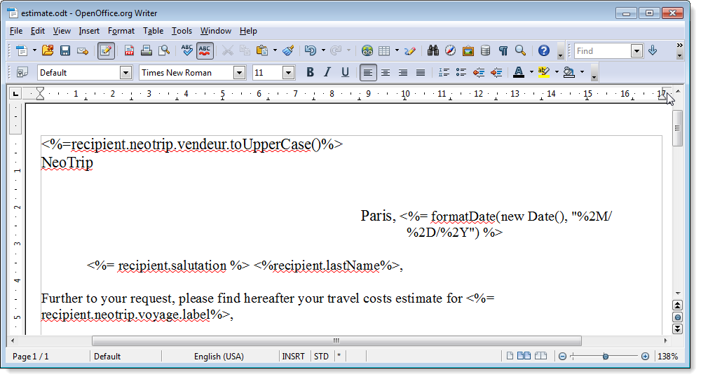
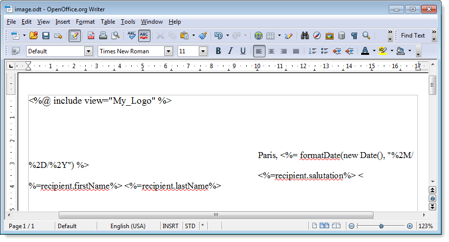

# Generazione di documenti PDF personalizzati{#generating-personalized-pdf-documents}


## Informazioni sui documenti PDF variabili {#about-variable-pdf-documents}

Adobe Campaign consente di generare documenti PDF variabili per allegati e-mail da LibreOffice o documenti Microsoft Word.

Sono supportate le seguenti estensioni: &quot;.docx&quot;, &quot;.doc&quot; e &quot;.odt&quot;.

Per personalizzare i documenti, sono disponibili le stesse funzionalità JavaScript utilizzate per la personalizzazione delle e-mail.

È necessario attivare l&#39;opzione **[!UICONTROL "The content of the file is personalized and converted to PDF during the delivery of each message"]**. Questa opzione è accessibile quando alleghi il file all’e-mail di consegna. Per ulteriori informazioni sull&#39;aggiunta di un file calcolato, consulta la sezione [File allegati](attaching-files.md) .

Esempio di personalizzazione dell&#39;intestazione di una fattura:



Per generare tabelle dinamiche o includere immagini tramite un URL, è necessario seguire un processo specifico.

## Generazione di tabelle dinamiche {#generating-dynamic-tables}

La procedura per la generazione di tabelle dinamiche è la seguente:

* Crea una tabella con tre righe e tutte le colonne necessarie, quindi configurane il layout (bordi, ecc.).
* Posiziona il cursore sulla tabella e fai clic sul menu **[!UICONTROL Table > Table properties]** . Vai alla scheda **[!UICONTROL Table]** e immetti un nome che inizia con **NlJsTable**.
* Nella prima cella della prima riga, definire un ciclo (&quot;for&quot;, ad esempio) che abilita l’iterazione sui valori che si desidera visualizzare nella tabella.
* In ogni cella della seconda riga della tabella, inserire gli script che restituiscono i valori da visualizzare.
* Chiudere il loop nella terza e ultima riga della tabella.

   Esempio di definizione di una tabella dinamica:

   

## Inserimento di immagini esterne {#inserting-external-images}

L’inserimento di immagini esterne è utile se, ad esempio, desideri personalizzare un documento con un’immagine il cui URL è inserito in un campo del destinatario.

A questo scopo, devi configurare un blocco di personalizzazione, quindi includere una chiamata al blocco di personalizzazione nell’allegato.

**Esempio: inserimento di un logo personalizzato in base al paese del destinatario**

**Passaggio 1: creare l&#39;allegato:**

* Inserisci la chiamata al blocco di personalizzazione: **&lt;%@ include view=&quot;blockname&quot; %>**.
* Inserisci il contenuto (personalizzato o meno) nel corpo del file.



**Passaggio 2: crea il blocco di personalizzazione:**

* Vai al menu **[!UICONTROL Resources > Campaign management > Personalization blocks]** della console Adobe Campaign.
* Crea un nuovo blocco di personalizzazione &quot;My Logo&quot; con &quot;My_Logo&quot; come nome interno.
* Fai clic sul collegamento **[!UICONTROL Advanced parameters...]**, quindi seleziona l’opzione **[!UICONTROL "The content of the block is included in an attachment"]** . Questo consente di copiare la definizione del blocco di personalizzazione direttamente nel contenuto del file OpenOffice.

   

   È necessario differenziare due tipi di dichiarazioni all’interno del blocco di personalizzazione:

   * Il codice Adobe Campaign dei campi di personalizzazione per i quali i caratteri &quot;open&quot; e &quot;closed&quot; devono essere sostituiti da caratteri di escape (rispettivamente `&lt;` e `&gt;`).
   * L&#39;intero codice XML di OpenOffice verrà copiato nel documento OpenOffice.

Nell’esempio, il blocco di personalizzazione si presenta così:

```
<% if (recipient.country.label == "Germany") { %>
<draw:frame svg:width="4cm" svg:height="3cm">
<draw:image xlink:href=https://..../logo_germany.png />
</draw:frame>
<% } else
if (recipient.country.label == "USA")
{ %>
<draw:frame svg:width="4cm" svg:height="3cm">
<draw:image xlink:href=https://..../logo_USA.png />
</draw:frame>
<% } %>
```

A seconda del paese del destinatario, la personalizzazione è visibile nel documento collegato alla consegna:


