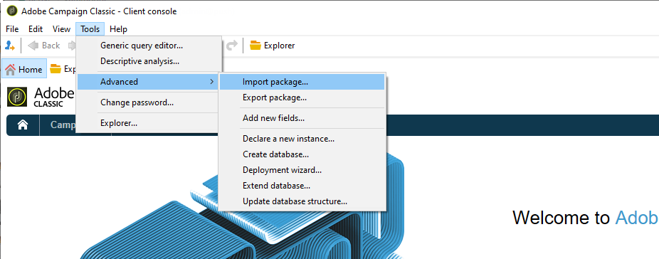
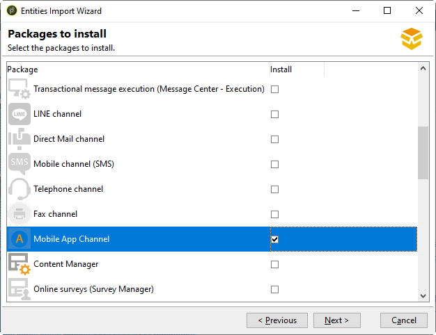

# Introduzione alla configurazione dell’app

Puoi trovare in questa sezione un esempio di configurazione basato su un’azienda che vende pacchetti vacanza online. La sua app mobile (Neotrips) è disponibile per i suoi clienti in due versioni: Neotrips per Android e Neotrips per iOS.

Per inviare notifiche push in Adobe Campaign, devi:

* Creare un servizio informazioni di tipo **[!UICONTROL Mobile application]** per l&#39;app mobile Neotrips. Consulta [questa sezione per iOS](configuring-the-mobile-application.md#configuring-ios-service). e [questa sezione per Android](configuring-the-mobile-application-android.md#configuring-android-service).
* Aggiungi le versioni iOS e Android dell’applicazione a questo servizio.
* Crea una consegna per [iOS](create-notifications-ios.md) e [Android](create-notifications-android.md).

>[!NOTE]
>
>Passa alla scheda **[!UICONTROL Subscriptions]** del servizio per visualizzare l&#39;elenco degli abbonati al servizio, ovvero tutte le persone che hanno installato l&#39;applicazione sul proprio cellulare e hanno accettato di ricevere notifiche.

## Installare il pacchetto {#installing-package-ios}

[!BADGE On-Premise e ibrido]{type=Caution url="https://experienceleague.adobe.com/docs/campaign-classic/using/installing-campaign-classic/architecture-and-hosting-models/hosting-models-lp/hosting-models.html?lang=it" tooltip="Applicabile solo alle distribuzioni on-premise e ibride"}

 [Scopri come installare il pacchetto per app mobile nel video](https://experienceleague.adobe.com/docs/campaign-classic-learn/tutorials/sending-messages/push-channel/installing-the-mobile-app-channel.html#sending-messages)

In qualità di cliente ibrido/in hosting, contatta il team [Assistenza clienti Adobe](https://helpx.adobe.com/it/enterprise/admin-guide.html/enterprise/using/support-for-experience-cloud.ug.html) per accedere al canale di notifica push in Campaign.

In qualità di cliente on-premise, devi installare un pacchetto integrato.

>[!CAUTION]
>
>Ulteriori informazioni sui pacchetti incorporati, sulle best practice e sui consigli di Campaign in [questa pagina](../../installation/using/installing-campaign-standard-packages.md).

I passaggi di installazione sono i seguenti:

1. Accedere all&#39;Assistente all&#39;importazione del pacchetto da **[!UICONTROL Tools > Advanced > Import package]** nella console client di Adobe Campaign.

   

1. Seleziona **[!UICONTROL Install a standard package]**.

1. Nell&#39;elenco visualizzato, selezionare **[!UICONTROL Mobile App Channel]**.

   

1. Fare clic su **[!UICONTROL Next]**, quindi su **[!UICONTROL Start]** per avviare l&#39;installazione del pacchetto.

   Una volta installati i pacchetti, la barra di avanzamento mostra **100%** ed è possibile visualizzare il seguente messaggio nei registri di installazione: **[!UICONTROL Installation of packages successful]**.

   

1. **[!UICONTROL Close]** la finestra di installazione.

Al termine di questo passaggio, puoi configurare le app Android e iOS.
Consulta queste sezioni:

* [Passaggi di configurazione per iOS](configuring-the-mobile-application.md)

* [Passaggi di configurazione per Android](configuring-the-mobile-application-android.md)
