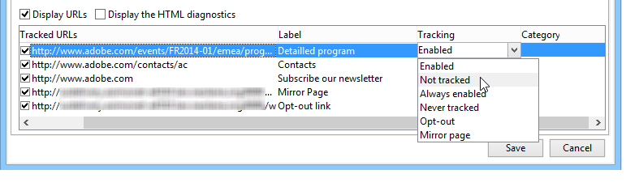

# Come configurare collegamenti tracciati{#how-to-configure-tracked-links}

Per ogni consegna, puoi tracciare la ricezione dei messaggi e l’attivazione dei collegamenti inseriti nel contenuto del messaggio. In questo modo puoi tracciare il comportamento dei destinatari in seguito alle azioni di consegna per le quali sono stati oggetto di targeting.

>[!NOTE]
>
>Il tracciamento si applica ai messaggi, ma il tracciamento Web consente di monitorare il modo in cui i destinatari sfogliano un sito Web (pagine visitate, acquisti).
>
>La configurazione del tracciamento Web viene presentata in [questa sezione](../../configuration/using/about-web-tracking.md).

Il tracciamento dei messaggi è abilitato per impostazione predefinita. Per personalizzare il tracciamento degli URL, effettuate le seguenti operazioni:

1. Selezionate l&#39; **[!UICONTROL Display URLs]** opzione nella sezione inferiore della procedura guidata di consegna, sotto al contenuto del messaggio.

   

   Quando selezionate un URL dall’elenco degli URL tracciati, questo viene evidenziato nel contenuto della distribuzione, ad eccezione del collegamento nella pagina mirror e del collegamento di annullamento dell’iscrizione fornito per impostazione predefinita.

   

1. Per ciascun URL del messaggio, seleziona se attivare o meno il tracciamento.

   >[!IMPORTANT]
   >
   >Quando l’URL del collegamento viene utilizzato come etichetta, si consiglia di disattivare il tracciamento per evitare i rischi di rifiuto dovuti al phishing.
   >
   >Ad esempio, se l’URL www.adobe.com viene inserito nel messaggio e vi viene attivato il tracciamento, il contenuto del collegamento ipertestuale viene modificato in https://nlt.adobe.net/r/?id=xxxxxx. Ciò significa che potrebbe essere considerato fraudolento dai client di messaggi dei destinatari.

1. Se necessario, modificate l’etichetta di tracciamento, fate doppio clic sull’etichetta e immettetene una nuova.

   >[!NOTE]
   >
   >Le etichette degli URL tracciati e delle etichette possono essere modificate per semplificare la lettura delle informazioni durante il tracciamento delle consegne. Nel calcolo del numero di clic verranno aggiunti due URL o due etichette con lo stesso nome.

1. Se necessario, modificate la modalità di tracciamento, selezionate una nuova modalità nella **[!UICONTROL Tracking]** colonna che corrisponda al collegamento di destinazione, come illustrato di seguito:

   

   Per ciascun URL, potete impostare la modalità di tracciamento su uno dei seguenti valori:

   * **[!UICONTROL Enabled]** : attiva il tracciamento su questo URL.
   * **[!UICONTROL Not tracked]** : disattiva il tracciamento di questo URL.
   * **[!UICONTROL Always enabled]** : attiva sempre il tracciamento di questo URL. Queste informazioni vengono salvate in modo che la prossima volta, se l’URL viene nuovamente visualizzato in un contenuto messaggio futuro, il tracciamento verrà attivato automaticamente.
   * **[!UICONTROL Never tracked]** : non attiva mai il tracciamento di questo URL. Queste informazioni vengono salvate in modo che la prossima volta, se l’URL viene nuovamente visualizzato in un messaggio futuro, il tracciamento venga disattivato automaticamente.
   * **[!UICONTROL Opt-out]** : considera questo URL come un URL di rinuncia o di annullamento dell’iscrizione.
   * **[!UICONTROL Mirror page]** : considera questo URL come un URL della pagina mirror.

1. Inoltre, potete selezionare una categoria per ciascun URL tracciato nell’elenco a discesa della **[!UICONTROL Category]** colonna. Queste categorie possono essere visualizzate come ad esempio in **[!UICONTROL URLs and click streams]** (vedere [questa sezione](../../reporting/using/reports-on-deliveries.md#urls-and-click-streams)). Le categorie sono definite in un&#39;enumerazione specifica: **[!UICONTROL urlCategory]** (consultate [Gestione delle enumerazioni](../../platform/using/managing-enumerations.md)).
