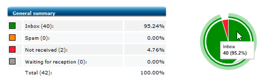

# Rendering della casella in entrata{#inbox-rendering}

## Informazioni sul rendering della casella in entrata {#about-inbox-rendering}

Prima di premere **Invia** , assicurati che il messaggio venga visualizzato ai destinatari in modo ottimale su diversi client web, servizi di posta sul web e dispositivi.

Per ottenere questo risultato, Adobe Campaign sfrutta [Litmus](https://litmus.com/email-testing) soluzione di test e-mail basata su web per acquisire i rendering e renderli disponibili in un rapporto dedicato. Ciò consente di visualizzare in anteprima il messaggio inviato nei diversi contesti in cui può essere ricevuto e di verificare la compatibilità nei desktop e nelle applicazioni principali.

>[!CAUTION]
>Il rendering della casella in entrata non è compatibile con [consegne ricorrenti](communication-channels.md#recurring-delivery).
>

Litmus è un’applicazione di convalida e anteprima delle e-mail ricca di funzioni. Consente ai creatori di contenuti e-mail di visualizzare in anteprima il contenuto dei messaggi in oltre 70 renderer e-mail, ad esempio la casella in entrata Gmail o il client Apple Mail.

I client per dispositivi mobili, di messaggistica e di posta sul Web disponibili per **Rendering casella in entrata** in Adobe Campaign sono elencati nella [Sito web Litmus](https://litmus.com/email-testing) (fare clic **Visualizza tutti i client e-mail**).

>[!NOTE]
>
>Il rendering della casella in entrata non è necessario per testare la personalizzazione nelle consegne. La personalizzazione può essere controllata con strumenti di Adobe Campaign come **[!UICONTROL Preview]** e [Bozze](steps-validating-the-delivery.md#sending-a-proof).

## Attivazione del rendering della casella in entrata {#activating-inbox-rendering}

[!BADGE On-premise e ibrido]{type=Caution url="https://experienceleague.adobe.com/docs/campaign-classic/using/installing-campaign-classic/architecture-and-hosting-models/hosting-models-lp/hosting-models.html?lang=it" tooltip="Applicabile solo alle distribuzioni on-premise e ibride"}

Per i client in hosting e ibridi, il rendering della casella in entrata è configurato nell’istanza da consulenti e supporto tecnico Adobe. Per ulteriori informazioni, contatta il tuo Account Executive Adobe.

Per le installazioni on-premise, segui i passaggi seguenti per configurare il rendering della casella in entrata.

1. Installare **[!UICONTROL Inbox rendering (IR)]** tramite il **[!UICONTROL Tools]** > **[!UICONTROL Advanced]** > **[!UICONTROL Import package]** menu. Per ulteriori informazioni, consulta [Installazione dei pacchetti standard di Campaign Classic](../../installation/using/installing-campaign-standard-packages.md).
1. Configurare un account esterno di tipo HTTP tramite **[!UICONTROL Administration]** > **[!UICONTROL Platform]** > **[!UICONTROL External Accounts]** nodo. Per ulteriori informazioni, consulta [Creazione di un account esterno](../../installation/using/external-accounts.md#creating-an-external-account).
1. Imposta i parametri dell’account esterno come segue:
   * **[!UICONTROL Label]**: informazioni sul server di recapito messaggi
   * **[!UICONTROL Internal name]**: deliverabilityInstance
   * **[!UICONTROL Type]**: HTTP
   * **[!UICONTROL Server]**: https://deliverability-app.neolane.net/deliverability
   * **[!UICONTROL Encryption]**: nessuna
   * Seleziona l’opzione **[!UICONTROL Enabled]**.

   

1. Vai a **[!UICONTROL Administration]** > **[!UICONTROL Platform]** > **[!UICONTROL Options]** nodo. Cerca **[!UICONTROL DmRendering_cuid]** per ottenere l’identificatore dei rapporti di consegna che deve essere copiato nell’elemento **[!UICONTROL Value (text)]** campo.
1. Modifica il **serverConf.xml** per consentire una chiamata al server Litmus. Aggiungi la seguente riga al `<urlPermission>` sezione:

   ```
   <url dnsSuffix="deliverability-app.neolane.net" urlRegEx="https://.*"/>
   ```

1. Ricarica la configurazione utilizzando il comando seguente:

   ```
   nlserver config -reload
   ```

>[!NOTE]
>
>Per poter utilizzare il rendering della casella in entrata, potrebbe essere necessario disconnettersi dalla console ed effettuare nuovamente l’accesso.

## Informazioni sui token Litmus {#about-litmus-tokens}

Poiché Litmus è un servizio di terze parti, funziona su un modello di credito per utilizzo. Ogni volta che un utente chiama la funzionalità Litmus, il credito viene dedotto.

In Adobe Campaign, il merito corrisponde al numero di rendering disponibili (noti come token).

>[!NOTE]
>
>Il numero di token Litmus disponibili dipende dalla licenza Campaign acquistata. Controllare il contratto di licenza.

Ogni volta che utilizza **[!UICONTROL Inbox rendering]** in una consegna, ogni rendering generato diminuisce di un’unità i token disponibili.

>[!IMPORTANT]
>
>I token rappresentano ogni singolo rendering e non l’intero report di rendering della casella in entrata, il che significa che:
>
>* Ogni volta che viene generato il report di rendering della casella in entrata, viene dedotto un token per ogni client di messaggistica: un token per il rendering di Outlook 2000, uno per il rendering di Outlook 2010, uno per il rendering di Apple Mail 9 e così via.
>* Per la stessa consegna, se generi nuovamente il rendering della casella in entrata, il numero di token disponibili viene nuovamente diminuito del numero di rendering generati.
>

Il numero di token rimanenti disponibili viene visualizzato in **[!UICONTROL General summary]** del [Rapporto di rendering della casella in entrata](#inbox-rendering-report).


In genere, la funzione di rendering della casella in entrata viene utilizzata per testare il framework HTML di un messaggio e-mail di nuova progettazione. Ogni rendering richiede circa 70 token (a seconda del numero di ambienti generalmente testati su). Tuttavia, in alcuni casi potresti aver bisogno di più rapporti di rendering della casella in entrata per testare completamente la consegna. Potrebbero quindi essere necessari più token per completare diversi controlli.

## Accesso al report di rendering della casella in entrata {#accessing-the-inbox-rendering-report}

Dopo aver creato la consegna e-mail e averne definito il contenuto e la popolazione target, effettua le seguenti operazioni.

Per ulteriori informazioni sulla creazione, la progettazione e il targeting di una consegna, consulta [questa sezione](about-email-channel.md).

1. Nella barra superiore della consegna, fai clic sul pulsante **[!UICONTROL Inbox rendering]** pulsante.
1. Seleziona **[!UICONTROL Analyze]** per avviare il processo di acquisizione.

   

   Viene inviata una bozza. È possibile accedere alle miniature di rendering nella bozza pochi minuti dopo l’invio delle e-mail. Per ulteriori informazioni sull’invio delle bozze, consulta [questa sezione](steps-validating-the-delivery.md#sending-a-proof).

1. Dopo l’invio, la bozza viene visualizzata nell’elenco delle consegne. Fare doppio clic su di esso.

   

1. Vai a **Rendering casella in entrata** della bozza.

   

   Viene visualizzato il report di rendering della casella in entrata.

## Rapporto di rendering della casella in entrata {#inbox-rendering-report}

Questo report visualizza i rendering della casella in entrata così come vengono visualizzati al destinatario. I rendering possono variare a seconda di come il destinatario apre la consegna e-mail: in un browser, su un dispositivo mobile o tramite un’applicazione e-mail.

Il **[!UICONTROL General summary]** presenta il numero di messaggi ricevuti, indesiderati (spam), non ricevuti o in attesa di ricezione, sotto forma di elenco e tramite una rappresentazione grafica con codice colore.



Passa il puntatore del mouse sul grafico per visualizzare i dettagli di ciascun colore.

Il corpo della relazione si articola in tre parti: **[!UICONTROL Mobile]**, **[!UICONTROL Messaging clients]**, e **[!UICONTROL Webmails]**. Per visualizzare tutti i rendering raggruppati in queste tre categorie, scorri il report verso il basso.


Per ottenere i dettagli di ciascun report, fai clic sulla scheda corrispondente. Viene visualizzato il rendering per il metodo di ricezione selezionato.


