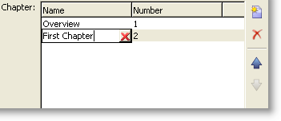

# Moduli di input{#input-forms}

Di seguito sono riportati alcuni principi generali relativi all’utilizzo dei moduli di input in Adobe Campaign.

Forms sono descritti in [questa sezione](../../configuration/using/identifying-a-form.md).

## Struttura di un modulo {#form-structure}

Il documento XML di un modulo di input deve contenere l&#39;elemento principale **`<form>`** con gli attributi **name** e **namespace** per compilare rispettivamente il nome del modulo e il relativo spazio dei nomi.

```xml
<form name="form_name" namespace="name_space">
…
</form>
```

Per impostazione predefinita, un modulo è associato allo schema dati con lo stesso nome e lo stesso spazio dei nomi. Per associare un modulo a un nome diverso, immettere la chiave dello schema nell&#39;attributo **entity-schema** dell&#39;elemento **`<form>`**.

Per illustrare la struttura di un modulo di input, descriviamo un’interfaccia basata sullo schema di esempio &quot;cus:book&quot;:


Questo è il modulo di input corrispondente:

```xml
<form name="book" namespace="cus" type="contentForm">
  <input xpath="@name"/>
  <input xpath="@date"/>
  <input xpath="@language"/>
</form>
```

La descrizione degli elementi di modifica inizia con l&#39;elemento principale **`<form>`**.

È stato immesso un controllo di modifica in un elemento **`<input>`** con l&#39;attributo **xpath** contenente il percorso del campo nel relativo schema.

**Promemoria relativo alla sintassi XPath:**

Il linguaggio XPath viene utilizzato in Adobe Campaign per fare riferimento a un elemento o attributo appartenente a uno schema di dati.

XPath è una sintassi che consente di individuare un nodo nella struttura di un documento XML.

Gli elementi sono designati dal loro nome e gli attributi sono designati dal nome preceduto dal carattere &quot;@&quot;.

Esempi:

* **@date**: seleziona l&#39;attributo denominato &quot;date&quot;
* **chapter/@title**: seleziona l&#39;attributo &quot;title&quot; nell&#39;elemento `<chapter>`
* **../@date**: seleziona la data dall&#39;elemento padre dell&#39;elemento corrente

Il controllo di modifica si adatta automaticamente al tipo di dati corrispondente e utilizza l&#39;etichetta definita nello schema.

Per impostazione predefinita, ogni campo viene visualizzato su una riga e occupa tutto lo spazio disponibile, a seconda del tipo di dati.

>[!CAUTION]
>
>Il modulo di input deve fare riferimento a un attributo **type=&quot;contentForm&quot;** nell&#39;elemento **`<form>`** per aggiungere automaticamente il frame necessario per l&#39;input del contenuto.

## Formattazione {#formatting}

La disposizione dei controlli l&#39;uno rispetto all&#39;altro è simile alla disposizione utilizzata nelle tabelle HTML, con la possibilità di dividere un controllo in più colonne, di elementi interlacciati o di specificare l&#39;occupazione dello spazio disponibile. Tenete presente, tuttavia, che la formattazione autorizza solo la distribuzione delle proporzioni; non potete specificare dimensioni fisse per un oggetto.

Per ulteriori informazioni al riguardo, consulta [questa sezione](../../configuration/using/form-structure.md#formatting).

## Controlli del tipo di elenco {#list-type-controls}

Per modificare un elemento della raccolta, è necessario utilizzare un controllo di tipo elenco.

### Elenco colonne {#column-list}

Questo controllo visualizza un elenco di colonne modificabile con una barra degli strumenti contenente i pulsanti Aggiungi ed Elimina.



```xml
<input xpath="chapter" type="list">
  <input xpath="@name"/>
  <input xpath="@number"/>
</input>
```

Il controllo elenco deve essere compilato con l&#39;attributo **type=&quot;list&quot;** e il percorso dell&#39;elenco deve fare riferimento all&#39;elemento della raccolta.

Le colonne sono dichiarate dagli elementi secondari **`<input>`** dell&#39;elenco.

>[!NOTE]
>
>Le frecce di ordinamento verso l&#39;alto e verso il basso vengono aggiunte automaticamente quando l&#39;attributo **ordered=&quot;true&quot;** viene completato per l&#39;elemento di raccolta nello schema dati.

Per impostazione predefinita, i pulsanti della barra degli strumenti sono allineati verticalmente. Possono anche essere allineati orizzontalmente:


```xml
<input nolabel="true" toolbarCaption="List of chapters" type="list" xpath="chapter">
  <input xpath="@name"/>
  <input xpath="@number"/>
</input>
```

L&#39;attributo **toolbarCaption** forza l&#39;allineamento orizzontale della barra degli strumenti e compila il titolo sopra l&#39;elenco.

>[!NOTE]
>
>Affinché l&#39;etichetta dell&#39;elemento di raccolta non venga visualizzata a sinistra del controllo, aggiungere l&#39;attributo **nolabel=&quot;true&quot;**.

#### Ingrandire un elenco {#zoom-in-a-list}

L&#39;inserimento e la modifica dei dati dell&#39;elenco possono essere eseguiti in un modulo di modifica separato.

I moduli di modifica all’interno di elenchi vengono utilizzati nei casi seguenti:

* Per semplificare l&#39;immissione delle informazioni,
* presenza di un controllo su più righe,
* Le colonne dell&#39;elenco contengono solo i campi principali e nel modulo vengono visualizzati tutti i campi dell&#39;elemento di raccolta.


```xml
<input nolabel="true" toolbarCaption="List of chapters" type="list" xpath="chapter" zoom="true" zoomOnAdd="true">
  <input xpath="@name"/>
  <input xpath="@number"/>

  <form colcount="2" label="Editing a chapter">
    <input xpath="@name"/>
    <input xpath="@number"/>
    <input colspan="2" xpath="page"/>
  </form>
</input>
```

La definizione del modulo di modifica viene specificata tramite l&#39;elemento **`<form>`** sotto l&#39;elemento list. La sua struttura è identica a quella di un modulo di input.

Un pulsante **[!UICONTROL Detail]** viene aggiunto automaticamente quando l&#39;attributo **zoom=&quot;true&quot;** viene inserito nella definizione dell&#39;elenco. In questo modo è possibile aprire il modulo di modifica sulla riga selezionata.

>[!NOTE]
>
>L&#39;aggiunta dell&#39;attributo **zoomOnAdd=&quot;true&quot;** impone la chiamata del modulo di modifica all&#39;inserimento di un elemento dell&#39;elenco.

### Elenco schede {#tab-list}

Questo elenco presenta la modifica degli elementi di raccolta sotto forma di schede.


```xml
<container toolbarCaption="List of chapters" type="notebooklist" xpath="chapter" xpath-label="@name">
  <container colcount="2">
    <input xpath="@name"/>
    <input xpath="@number"/>
    <input colspan="2" xpath="page"/>
  </container>
</container>
```

Il controllo elenco deve essere compilato con l&#39;attributo **type=&quot;notebooklist&quot;** e il percorso dell&#39;elenco deve fare riferimento all&#39;elemento della raccolta.

Il titolo della scheda contiene il valore dei dati immessi tramite l&#39;attributo **xpath-label**.

I controlli di modifica devono essere dichiarati in un elemento **`<container>`** figlio del controllo elenco.

Utilizzare i pulsanti della barra degli strumenti per aggiungere o eliminare elementi dell&#39;elenco.

>[!NOTE]
>
>Le frecce di ordinamento a sinistra e a destra vengono aggiunte automaticamente quando l&#39;attributo **ordered=&quot;true&quot;** viene popolato per l&#39;elemento di raccolta nello schema dati.

## Contenitori {#containers}

I contenitori consentono di raggruppare un insieme di controlli. Esistono tramite l&#39;elemento **`<container>`**. Sono già stati utilizzati per formattare i controlli in diverse colonne e per il controllo dell&#39;elenco di schede.

Per ulteriori informazioni sui contenitori e su come utilizzarli nei moduli di input, consulta [questa sezione](../../configuration/using/form-structure.md#containers).

## Modifica dei moduli {#editing-forms}

L&#39;area di modifica consente di immettere il contenuto XML del modulo di input:


La scheda **[!UICONTROL Preview]** consente di visualizzare il modulo di input:


Ulteriori informazioni sulla [modifica dei moduli](../../configuration/using/editing-forms.md) e sulla [struttura del modulo](../../configuration/using/form-structure.md).
