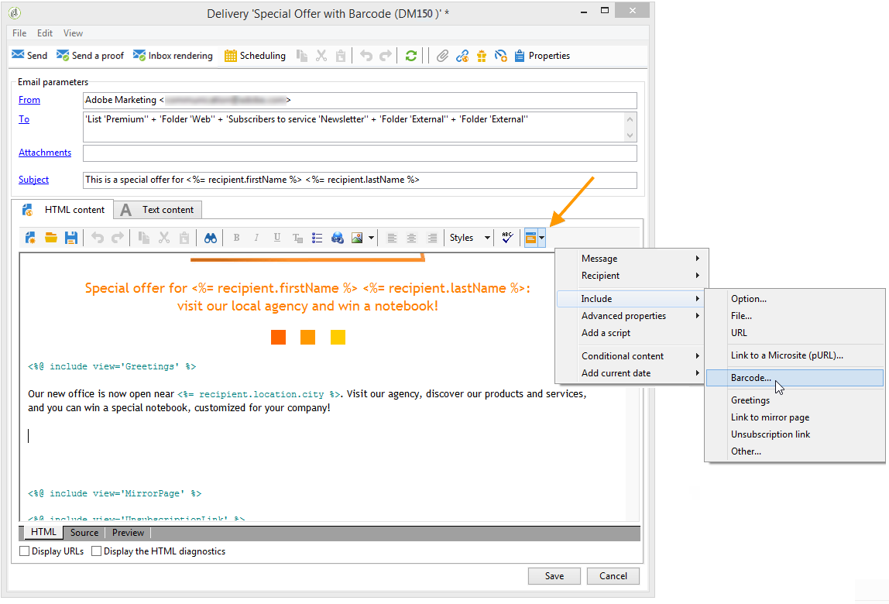
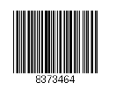
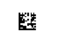
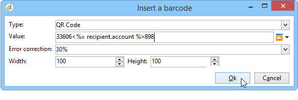
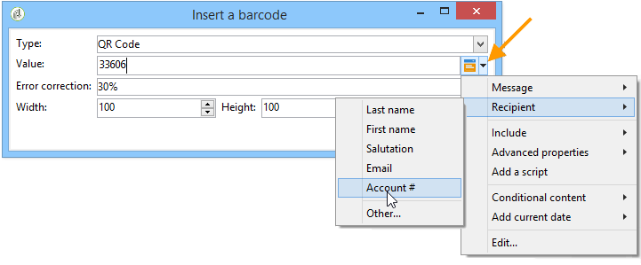
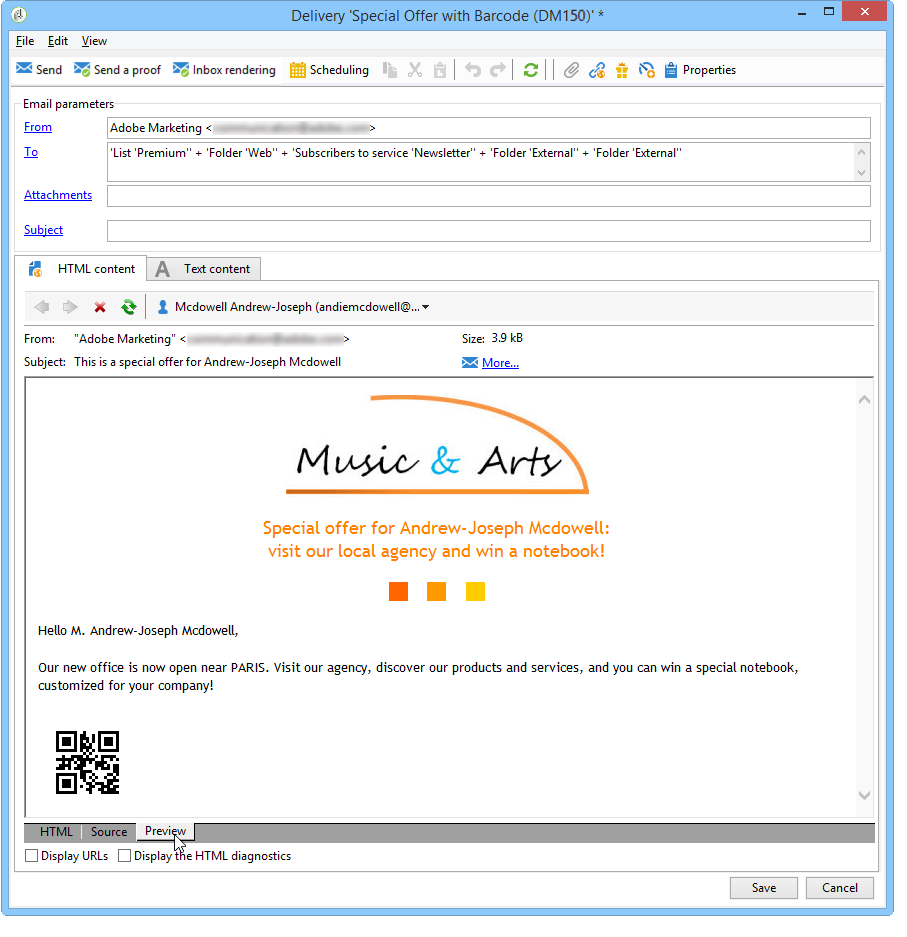
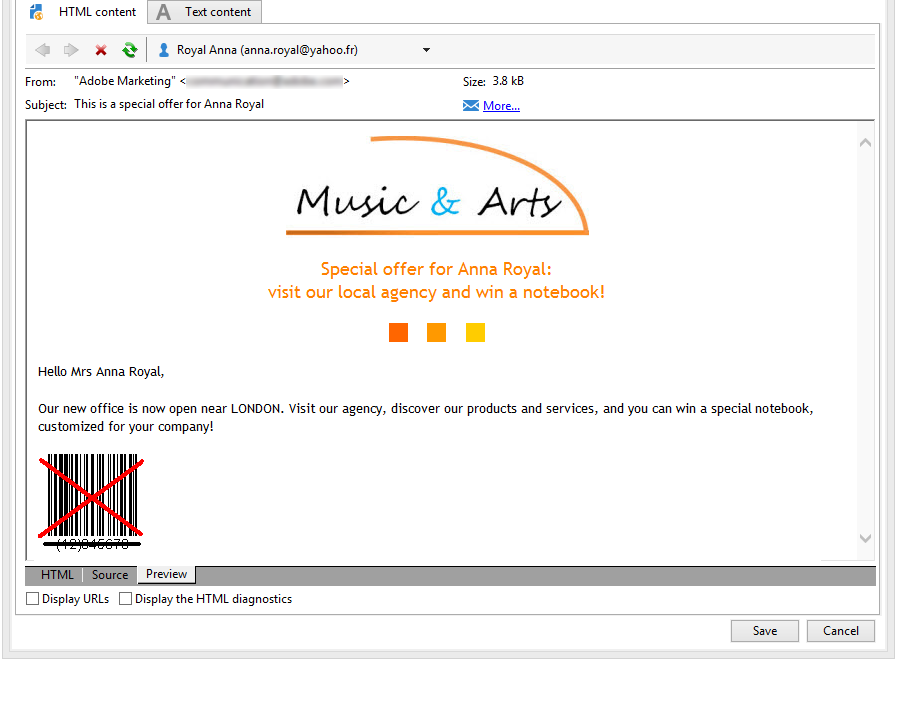

# Inserire un codice a barre in un messaggio e-mail{#insert-a-barcode-in-an-email}

Il modulo di generazione del codice a barre consente di creare diversi tipi di codici a barre conformi a molti standard comuni, inclusi i codici a barre 2D.

È possibile generare dinamicamente un codice a barre come bitmap utilizzando un valore definito utilizzando i criteri del cliente. I codici a barre personalizzati possono essere inclusi nelle campagne e-mail. Il destinatario può stampare il messaggio e mostrarlo alla società emittente per la scansione (ad esempio durante il check-out).

Per inserire un codice a barre in un messaggio e-mail, posiziona il cursore nel contenuto in cui desideri visualizzarlo, quindi fai clic sul pulsante di personalizzazione. Seleziona **[!UICONTROL Include > Barcode...]**.

Quindi configura i seguenti elementi in base alle tue esigenze:

1. Selezionare il tipo di codice a barre.

   * Per il formato 1D, in Adobe Campaign sono disponibili i seguenti tipi: Codabar, Code 128, GS1-128 (precedentemente EAN-128), UPC-A, UPC-E, ISBN, EAN-8, Code39, Interleaved 2 of 5, POSTNET e Royal Mail (RM4SCC).

     Esempio di codice a barre 1D:

     

   * I tipi DataMatrix e PDF417 riguardano il formato 2D.

     Esempio di codice a barre 2D:

     

   * Per inserire un codice QR, selezionare questo tipo e immettere il tasso di correzione dell&#39;errore da applicare. Questo tasso definisce la quantità di informazioni ripetute e la tolleranza al deterioramento.

     

     Esempio di codice QR:

     

1. Immetti la dimensione del codice a barre che desideri inserire nell’e-mail: la configurazione della scala ti consente di aumentare o ridurre la dimensione del codice a barre, da x1 a x10.
1. Il campo **[!UICONTROL Value]** consente di definire il valore del codice a barre. Un valore può corrispondere a un’offerta speciale e può essere la funzione di un criterio, può essere il valore di un campo di database collegato ai clienti.

   In questo esempio viene illustrato un codice a barre di tipo EAN-8 a cui è stato aggiunto il numero di conto di un destinatario. Per aggiungere questo numero di account, fare clic sul pulsante di personalizzazione a destra del campo **[!UICONTROL Value]** e selezionare **[!UICONTROL Recipient > Account number]**.

   

1. Il campo **[!UICONTROL Height]** consente di configurare l&#39;altezza del codice a barre senza modificarne la larghezza, modificando la quantità di spazio tra le barre.

   Non esiste alcun controllo di immissione restrittivo a seconda del tipo di codice a barre. Se un valore di codice a barre non è corretto, sarà visibile solo nella modalità **Anteprima**, dove il codice a barre verrà barrato in rosso.

   >[!NOTE]
   >
   >Il valore assegnato a un codice a barre dipende dal relativo tipo. Ad esempio, un tipo EAN-8 deve avere esattamente 8 numeri.
   >
   >Il pulsante di personalizzazione a destra del campo **[!UICONTROL Value]** consente di aggiungere dati oltre al valore stesso. Questo arricchisce il codice a barre, a condizione che lo standard lo accetti.
   >
   >Se ad esempio si utilizza un codice a barre di tipo GS1-128 e si desidera immettere il numero di conto di un destinatario oltre al valore, fare clic sul pulsante di personalizzazione e selezionare **[!UICONTROL Recipient > Account number]**. Se il numero di conto del destinatario selezionato viene immesso correttamente, il codice a barre ne tiene conto.

Una volta configurati questi elementi, puoi finalizzare l’e-mail e inviarla. Per evitare errori, verificare sempre che il contenuto sia visualizzato correttamente prima di eseguire una consegna facendo clic sulla scheda **[!UICONTROL Preview]**.

>[!NOTE]
>
>Se il valore di un codice a barre non è corretto, la bitmap corrispondente viene visualizzata in rosso.

