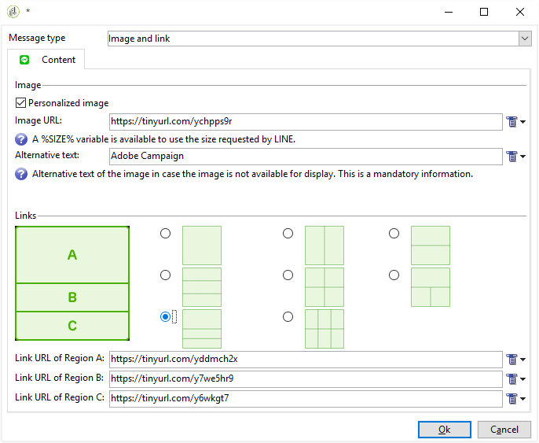

# Creare consegne LINE{#line-channel}

[!DNL LINE] è un’applicazione per la messaggistica istantanea gratuita, chiamate vocali e video, disponibile su ogni sistema operativo mobile e su PC.

[!DNL LINE] può essere combinato anche con il modulo dei messaggi transazionali per inviare messaggi in tempo reale sul [!DNL LINE] app installata in dispositivi mobili di consumo. Per ulteriori informazioni, consulta questa [pagina](../../message-center/using/transactional-messaging-architecture.md#transactional-messaging-and-line).

I passaggi per utilizzare [!DNL LINE] i canali sono:

1. [Configura canale LINE](#setting-up-line-channel)
1. [Creare una consegna](#creating-the-delivery)
1. [Configurare il tipo di contenuto](#defining-the-content)
1. [Monitoraggio della consegna (tracciamento, quarantena, rapporti, ecc.)](#accessing-reports)

## Configura canale LINE {#setting-up-line-channel}

Prima di creare un [!DNL LINE] account e account esterno, è innanzitutto necessario installare il pacchetto LINE nell’istanza. Per ulteriori informazioni, consulta [questa sezione](../../installation/using/installing-campaign-standard-packages.md#line-package).

Devi innanzitutto creare un [!DNL LINE] in modo da poterlo collegare ad Adobe Campaign. Quindi puoi inviare [!DNL LINE] messaggi agli utenti che hanno aggiunto il tuo [!DNL LINE] nella loro app mobile. Account esterni e [!DNL LINE] l’account può essere gestito solo dall’amministratore funzionale della piattaforma.

Per creare e configurare un [!DNL LINE] account, consulta [Documentazione per gli sviluppatori LINE](https://developers.line.me/).

### Creare e configurare il servizio LINE {#configure-line-service}

Per creare [!DNL LINE] servizio:

1. Dalla home page di Adobe Campaign Classic, seleziona la **[!UICONTROL Profiles and Targets]** scheda.

1. Nel menu a sinistra, seleziona **[!UICONTROL Services and Subscriptions]** e fai clic su **[!UICONTROL Create]**.

   

1. Aggiungi un **[!UICONTROL Label]** e **[!UICONTROL Internal name]** al nuovo servizio.

1. Seleziona **[!UICONTROL LINE]** dal **[!UICONTROL Type]** a discesa.

   

1. Fai clic su **[!UICONTROL Save]**.

Per ulteriori informazioni sugli abbonamenti e i servizi, consulta [Gestione delle sottoscrizioni](managing-subscriptions.md).

### Configurare l’account esterno LINE {#configure-line-external}

Dopo aver creato [!DNL LINE] servizio, è necessario configurare il [!DNL LINE] account esterno su Adobe Campaign:

1. In **[!UICONTROL Administration]** > **[!UICONTROL Platform]** struttura ad albero, fare clic su **[!UICONTROL External Accounts]** scheda.

1. Seleziona il predefinito **[!UICONTROL LINE V2 routing]** account esterno.

   

1. Fai clic su **[!UICONTROL LINE]** dall’account esterno per iniziare a configurare l’account esterno. Compila i campi seguenti:

   

   * **[!UICONTROL Channel Alias]**: viene fornito tramite il [!DNL LINE] account in **[!UICONTROL Channels]** > **[!UICONTROL Technical configuration]** scheda.
   * **[!UICONTROL Channel ID]**: viene fornito tramite il [!DNL LINE] account in **[!UICONTROL Channels]** > **[!UICONTROL Basic Information panel]** scheda.
   * **[!UICONTROL Channel secret key]**: viene fornito tramite il [!DNL LINE] account in **[!UICONTROL Channels]** > **[!UICONTROL Basic Information panel]** scheda.
   * **[!UICONTROL Access token]**: viene fornito tramite il [!DNL LINE] account nel portale per sviluppatori o facendo clic sul pulsante **[!UICONTROL Get access token]** pulsante.
   * **[!UICONTROL Access token expiration date]**: consente di specificare la data di scadenza del token di accesso.
   * **[!UICONTROL LINE subscription service]**: ti consente di specificare i servizi a cui gli utenti saranno abbonati.

1. Al termine della configurazione, fai clic su **[!UICONTROL Save]**.

1. Dalla sezione **[!UICONTROL Explorer]**, seleziona **[!UICONTROL Administration]** > **[!UICONTROL Production]** > **[!UICONTROL Technical workflows]** > **[!UICONTROL LINE workflows]** per verificare se **[!UICONTROL LINE V2 access token update (updateLineAccessToken)]** e **[!UICONTROL Delete blocked LINE users (deleteBlockedLineUsers)]** dei flussi di lavoro.

Il [!DNL LINE] è ora configurato in Adobe Campaign, puoi iniziare a creare e inviare consegne LINE agli abbonati.

## Creare una consegna LINE {#creating-the-delivery}

>[!NOTE]
>
>Quando si invia una [!DNL LINE] consegna a un nuovo destinatario per la prima volta, devi aggiungere alla consegna il messaggio LINE ufficiale relativo ai termini di utilizzo e di consenso. Il messaggio ufficiale è disponibile all&#39;indirizzo [collegamento seguente](https://terms.line.me/OA_privacy/).

Per creare un [!DNL LINE] consegna devi seguire questi passaggi:

1. Dalla sezione **[!UICONTROL Campaigns]** , seleziona **[!UICONTROL Deliveries]** quindi fai clic su **[!UICONTROL Create]** pulsante.

   

1. Seleziona **[!UICONTROL LINE V2 delivery]** modello di consegna.

   

1. Identifica la consegna con un **[!UICONTROL Label]**, **[!UICONTROL Delivery code]**, e  **[!UICONTROL Description]**. Per ulteriori informazioni al riguardo, consulta [questa sezione](steps-create-and-identify-the-delivery.md#identifying-the-delivery).

1. Clic **[!UICONTROL Continue]** per creare la consegna.

1. Nell’editor di consegna, seleziona **[!UICONTROL To]** per eseguire il targeting dei destinatari del [!DNL LINE] consegna. Il targeting viene eseguito il **[!UICONTROL Visitor subscriptions (nms:visitorSub)]**.

   Per ulteriori informazioni, consulta [Identificazione delle popolazioni target](steps-defining-the-target-population.md).

   

1. Clic **[!UICONTROL Add]** per selezionare **[!UICONTROL Delivery target population]**.

   

1. Scegli se desideri eseguire il targeting [!DNL LINE] direttamente dagli abbonati o se desideri indirizzare l’attività agli utenti in base alla loro [!DNL LINE] abbonamento e fai clic su **[!UICONTROL Next]**. In questo esempio abbiamo selezionato **[!UICONTROL By LINE V2 subscription]**.

1. Seleziona **[!UICONTROL Line-V2]** nel **[!UICONTROL Folder]** a discesa, quindi [!DNL LINE] servizio. Clic **[!UICONTROL Finish]** allora **[!UICONTROL Ok]** per iniziare a personalizzare la consegna.

   

1. Dall’editor di consegna, fai clic su **[!UICONTROL Add]** per aggiungere uno o più messaggi e selezionare **[!UICONTROL Content type]**.

   Per ulteriori informazioni sulle diverse **[!UICONTROL Content type]** disponibile, fare riferimento a [Definire il tipo di contenuto](#defining-the-content).

   

1. Una volta creata e configurata correttamente la consegna, puoi inviarla al target definito in precedenza.

   Per ulteriori informazioni sull’invio di una consegna, consulta [Inviare messaggi](sending-messages.md).

1. Dopo aver inviato il messaggio, accedi al rapporto per misurare l’efficacia della consegna.

   Per ulteriori informazioni su [!DNL LINE] rapporti, fare riferimento a [Accedere ai rapporti](#accessing-reports).

## Definire il tipo di contenuto {#defining-the-content}

Per definire il contenuto di un [!DNL LINE] consegna, devi innanzitutto aggiungere il tipo di messaggio alla consegna. Ogni [!DNL LINE] la consegna può contenere fino a 5 messaggi.

Puoi scegliere tra tre tipi di messaggi:

* [Messaggio di testo](#configuring-a-text-message-delivery)
* [Immagine e collegamento](#configuring-an-image-and-link-delivery)
* [Messaggio video](#configuring-a-video-message-delivery)

### Configurazione di una consegna di messaggi di testo {#configuring-a-text-message-delivery}

>[!NOTE]
>
>Il `<%@ include option='NmsServer_URL' %>/webApp/APP3?id=<%=escapeUrl(cryptString(visitor.id))%>` La sintassi consente di includere un collegamento a un’app web in un messaggio LINE.

A **[!UICONTROL Text message]** [!DNL LINE] la consegna è un messaggio inviato ai destinatari sotto forma di testo.

La configurazione di questo tipo di messaggio è simile a quella del **[!UICONTROL Text]** in un messaggio e-mail. Per ulteriori informazioni, consulta questa [pagina](defining-the-email-content.md#message-content).

### Configurazione di una consegna di immagini e collegamenti {#configuring-an-image-and-link-delivery}

Un **[!UICONTROL Image and link]** [!DNL LINE] la consegna è un messaggio inviato ai destinatari sotto forma di un’immagine che può contenere uno o più URL.

Puoi utilizzare:

* a **[!UICONTROL Personalized image]**,

  >[!NOTE]
  >
  >È possibile utilizzare **%SIZE%** per ottimizzare la visualizzazione dell’immagine in base alle dimensioni dello schermo del dispositivo mobile del destinatario.

  

* un **[!UICONTROL Image URL]** dimensioni dello schermo per dispositivo,

  

  Il **[!UICONTROL Define images per device screen size]** consente di utilizzare risoluzioni di immagine diverse per ottimizzare la visibilità della consegna sui dispositivi mobili. Sono supportate solo le immagini con la stessa altezza e larghezza.

  Le immagini possono essere definite in base alle dimensioni dello schermo:

   * 1040 px
   * 700 px
   * 460 px
   * 300 px
   * 240 px

  >[!CAUTION]
  >
  >La dimensione di 1040x1040 px è obbligatoria per ogni immagine LINE con collegamento.

  Quindi devi aggiungere testo alternativo che verrà visualizzato sul dispositivo mobile del destinatario.

* e **[!UICONTROL Links]**.

  Il **[!UICONTROL Links]** consente di scegliere tra diversi layout che divideranno l&#39;immagine in più aree selezionabili. È quindi possibile assegnare a ciascuno di essi un **[!UICONTROL Link URL]**.

  

### Configurazione della consegna di un messaggio video {#configuring-a-video-message-delivery}

A **[!UICONTROL Video message]** [!DNL LINE] la consegna è un messaggio inviato ai destinatari sotto forma di video che può contenere un URL.

Il **[!UICONTROL Preview Image URL]** consente di aggiungere l’URL di un’immagine di anteprima con un limite di caratteri di 1000. JPEG e PNG sono supportati con un limite di dimensione file di 1 MB.

Il **[!UICONTROL Video Image URL]** consente di aggiungere l’URL del file video con un limite di caratteri di 1000. È supportato solo il formato mp4 con un limite di dimensione file di 200 MB.

Tieni presente che i video larghi o alti possono essere ritagliati quando vengono riprodotti su alcuni dispositivi.

## Accesso ai rapporti {#accessing-reports}

Dopo aver inviato la consegna, puoi visualizzare [!DNL LINE] rapporti tramite il menu **[!UICONTROL Campaign Management]** > **[!UICONTROL Deliveries]** dal **[!UICONTROL Explorer]**.

>[!NOTE]
>
>I rapporti di tracciamento indicano il tasso di click-through. [!DNL LINE] non tiene conto del tasso di apertura.

Per [!DNL LINE] report di servizio, accedere al menu **[!UICONTROL Profiles and Targets]** > **[!UICONTROL Services and Subscriptions]** > **[!UICONTROL LINE-V2]** dal **[!UICONTROL Explorer]** scheda. Quindi fai clic su **[!UICONTROL Reports]** icona in [!DNL LINE] servizio.

## Esempio: creare e inviare un messaggio LINE personalizzato {#example--create-and-send-a-personalized-line-message}

In questo esempio creeremo e configureremo un messaggio di testo e un’immagine contenenti dati che verranno personalizzati in base al destinatario.

1. Crea [!DNL LINE] consegna facendo clic sul pulsante **[!UICONTROL Create]** dal pulsante **[!UICONTROL Campaign]** scheda.

   

1. Seleziona la **[!UICONTROL LINE V2 delivery]** modello di consegna e assegna un nome alla consegna.

   

1. Nella finestra di configurazione della consegna, seleziona la popolazione target.

   Per ulteriori informazioni, consulta [Identificazione delle popolazioni target](steps-defining-the-target-population.md).

   

1. Clic **[!UICONTROL Add]** per creare il messaggio e selezionare **[!UICONTROL Content type]**.

   In questo caso, prima di tutto si desidera creare un’ **[!UICONTROL Text message]**.

   

1. Posiziona il cursore nel punto in cui desideri inserire il testo personalizzato, fai clic sull’icona a discesa e seleziona **[!UICONTROL Visitor]** > **[!UICONTROL First name]**.

   

1. Per aggiungere un’immagine, seleziona la stessa procedura **[!UICONTROL Image and links]** nel **[!UICONTROL Message type]** a discesa.

   Aggiungi il **[!UICONTROL Image URL]**.

   

1. In **[!UICONTROL Links]** , selezionare il layout che dividerà l&#39;immagine in più aree selezionabili.

1. Assegna un URL a ogni area dell&#39;immagine.

   

1. Salva la consegna e fai clic su **[!UICONTROL Send]** per analizzarlo e inviarlo al target.

   La consegna viene inviata al target.

   

