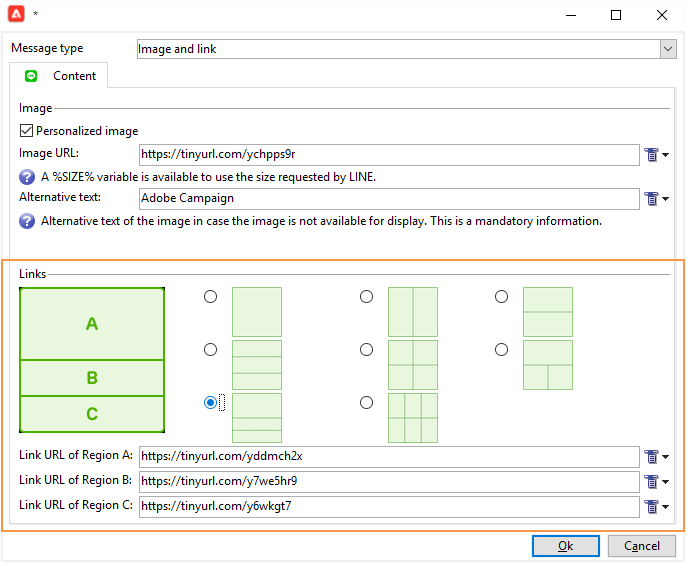

# Creare consegne LINE{#line-channel}

>[!NOTE]
>
>[!DNL LINE] è disponibile solo per installazioni on-premise o di servizi gestiti.

[!DNL LINE] è un&#39;applicazione per la messaggistica istantanea gratuita, chiamate vocali e video, disponibile su ogni sistema operativo mobile e su PC.

[!DNL LINE] può anche essere combinato con il modulo di messaggio transazionale per inviare messaggi in tempo reale sull’ [!DNL LINE] app installata nei dispositivi mobili di consumo. Per ulteriori informazioni, consulta questa [pagina](../../message-center/using/transactional-messaging-architecture.md#transactional-messaging-and-line).

I passaggi per utilizzare il canale [!DNL LINE] sono i seguenti:

1. [Imposta canale LINE](#setting-up-line-channel)
1. [Creare una consegna](#creating-the-delivery)
1. [Configurare il tipo di contenuto](#defining-the-content)
1. [Monitoraggio della consegna (tracciamento, quarantena, rapporti, ecc.)](#accessing-reports)

## Imposta canale LINE {#setting-up-line-channel}

Prima di creare un account [!DNL LINE] e un account esterno, devi prima installare il pacchetto LINE nella tua istanza. Per ulteriori informazioni, consultare la sezione [LINE](../../installation/using/installing-campaign-standard-packages.md#line-package) nella guida all&#39;installazione.

Devi innanzitutto creare un account [!DNL LINE] in modo da poterlo collegare ad Adobe Campaign. Quindi, puoi inviare messaggi [!DNL LINE] agli utenti che hanno aggiunto il tuo account [!DNL LINE] nella loro app mobile. Gli account esterni e l’account [!DNL LINE] possono essere gestiti solo dall’amministratore funzionale della piattaforma.

Per creare e configurare un account [!DNL LINE], consulta la [documentazione per gli sviluppatori LINE](https://developers.line.me/).

### Crea e configura il servizio LINE {#configure-line-service}

Per creare il servizio [!DNL LINE]:

1. Dalla home page di Adobe Campaign Classic, seleziona la scheda **[!UICONTROL Profiles and Targets]** .

1. Nel menu a sinistra, seleziona **[!UICONTROL Services and Subscriptions]** e fai clic su **[!UICONTROL Create]**.

   

1. Aggiungi un **[!UICONTROL Label]** e **[!UICONTROL Internal name]** al nuovo servizio.

1. Seleziona **[!UICONTROL LINE]** dal menu a discesa **[!UICONTROL Type]** .

   

1. Fai clic su **[!UICONTROL Save]**.

Per ulteriori informazioni su abbonamenti e servizi, consulta [Gestione degli abbonamenti](managing-subscriptions.md).

### Configurare l’account esterno LINE {#configure-line-external}

Dopo aver creato il servizio [!DNL LINE], devi configurare l&#39;account esterno [!DNL LINE] su Adobe Campaign:

1. Nella struttura ad albero **[!UICONTROL Administration]** > **[!UICONTROL Platform]**, fare clic sulla scheda **[!UICONTROL External Accounts]**.

1. Seleziona l’account esterno incorporato **[!UICONTROL LINE V2 routing]** .

   

1. Fai clic sulla scheda **[!UICONTROL LINE]** dall’account esterno per iniziare a configurare l’account esterno. Compila i campi seguenti:

   

   * **[!UICONTROL Channel Alias]**: viene fornito tramite il tuo  [!DNL LINE] account nella scheda  **[!UICONTROL Channels]** >  **[!UICONTROL Technical configuration]** .
   * **[!UICONTROL Channel ID]**: viene fornito tramite il tuo  [!DNL LINE] account nella scheda  **[!UICONTROL Channels]** >  **[!UICONTROL Basic Information panel]** .
   * **[!UICONTROL Channel secret key]**: viene fornito tramite il tuo  [!DNL LINE] account nella scheda  **[!UICONTROL Channels]** >  **[!UICONTROL Basic Information panel]** .
   * **[!UICONTROL Access token]**: viene fornito tramite il tuo  [!DNL LINE] account nel portale per sviluppatori o facendo clic sul  **[!UICONTROL Get access token]** pulsante .
   * **[!UICONTROL Access token expiration date]**: consente di specificare la data di scadenza del token di accesso.
   * **[!UICONTROL LINE subscription service]**: consente di specificare i servizi ai quali gli utenti verranno abbonati.

1. Al termine della configurazione, fai clic su **[!UICONTROL Save]**.

1. In **[!UICONTROL Explorer]**, seleziona **[!UICONTROL Administration]** > **[!UICONTROL Production]** > **[!UICONTROL Technical workflows]** > **[!UICONTROL LINE workflows]** per verificare se i flussi di lavoro **[!UICONTROL LINE V2 access token update (updateLineAccessToken)]** e **[!UICONTROL Delete blocked LINE users (deleteBlockedLineUsers)]** sono stati avviati.

Il [!DNL LINE] è ora configurato in Adobe Campaign. Puoi iniziare a creare e inviare consegne LINE agli abbonati.

## Crea consegna LINE {#creating-the-delivery}

>[!NOTE]
>
>Quando invii una consegna [!DNL LINE] a un nuovo destinatario per la prima volta, devi aggiungere nella consegna il messaggio LINE ufficiale relativo ai termini di utilizzo e di consenso. Il messaggio ufficiale è disponibile sul [seguente link](https://terms.line.me/OA_privacy/).

Per creare una consegna [!DNL LINE] devi seguire questi passaggi:

1. Dalla scheda **[!UICONTROL Campaigns]** , seleziona **[!UICONTROL Deliveries]** , quindi fai clic sul pulsante **[!UICONTROL Create]** .

   

1. Seleziona il modello di consegna **[!UICONTROL LINE V2 delivery]**.

   

1. Identifica la consegna con **[!UICONTROL Label]**, **[!UICONTROL Delivery code]** e **[!UICONTROL Description]**. Per ulteriori informazioni al riguardo, consulta [questa sezione](steps-create-and-identify-the-delivery.md#identifying-the-delivery).

1. Fai clic su **[!UICONTROL Continue]** per creare la consegna.

1. Nell’editor delle consegne, seleziona **[!UICONTROL To]** per eseguire il targeting dei destinatari della consegna [!DNL LINE]. Il targeting viene eseguito il **[!UICONTROL Visitor subscriptions (nms:visitorSub)]**.

   Per ulteriori informazioni, consulta [Identificazione delle popolazioni target](steps-defining-the-target-population.md).

   

1. Fai clic su **[!UICONTROL Add]** per selezionare il **[!UICONTROL Delivery target population]**.

   

1. Scegli se eseguire il targeting diretto degli utenti [!DNL LINE] abbonati o se desideri eseguire il targeting degli utenti in base alla loro sottoscrizione [!DNL LINE] e fai clic su **[!UICONTROL Next]**. In questo esempio, abbiamo selezionato **[!UICONTROL By LINE V2 subscription]**.

1. Seleziona **[!UICONTROL Line-V2]** nel menu a discesa **[!UICONTROL Folder]** , quindi dal servizio [!DNL LINE] . Fai clic su **[!UICONTROL Finish]** , quindi **[!UICONTROL Ok]** per iniziare a personalizzare la consegna.

   

1. Nell’editor delle consegne, fai clic su **[!UICONTROL Add]** per aggiungere uno o più messaggi e seleziona il simbolo **[!UICONTROL Content type]**.

   Per ulteriori informazioni sulle diverse **[!UICONTROL Content type]** disponibili, consulta [Definire il tipo di contenuto](#defining-the-content).

   

1. Quando la consegna viene creata e configurata correttamente, puoi inviarla alla destinazione definita in precedenza.

   Per ulteriori informazioni sull’invio di una consegna, consulta [Inviare messaggi](sending-messages.md).

1. Dopo aver inviato il messaggio, accedi al rapporto per misurare l’efficacia della consegna.

   Per ulteriori informazioni sui rapporti [!DNL LINE], consulta [Accesso ai rapporti](#accessing-reports).

## Definire il tipo di contenuto {#defining-the-content}

Per definire il contenuto di una consegna [!DNL LINE], devi prima aggiungere il tipo di messaggio alla consegna. Ogni consegna [!DNL LINE] può contenere fino a 5 messaggi.

Puoi scegliere tra tre tipi di messaggio:

* [Messaggio di testo](#configuring-a-text-message-delivery)
* [Immagine e collegamento](#configuring-an-image-and-link-delivery)
* [Messaggio video](#configuring-a-video-message-delivery)

### Configurazione della consegna di un messaggio di testo {#configuring-a-text-message-delivery}

>[!NOTE]
>
>La sintassi `<%@ include option='NmsServer_URL' %>/webApp/APP3?id=<%=escapeUrl(cryptString(visitor.id))%>` ti consente di includere un collegamento a un’app web in un messaggio LINE.

Una consegna **[!UICONTROL Text message]** [!DNL LINE] è un messaggio inviato ai destinatari in formato testo.

La configurazione di questo tipo di messaggio è simile alla configurazione di **[!UICONTROL Text]** in un messaggio e-mail. Per ulteriori informazioni, consulta questa [pagina](defining-the-email-content.md#message-content).

### Configurazione di un’immagine e della consegna del collegamento {#configuring-an-image-and-link-delivery}

Una consegna **[!UICONTROL Image and link]** [!DNL LINE] è un messaggio inviato ai destinatari sotto forma di immagine che può contenere uno o più URL.

Puoi utilizzare:

* a **[!UICONTROL Personalized image]**,

   >[!NOTE]
   >
   >È possibile utilizzare la variabile **%SIZE%** per ottimizzare la visualizzazione dell&#39;immagine in base alle dimensioni dello schermo del dispositivo mobile del destinatario.

   

* un **[!UICONTROL Image URL]** per dimensioni dello schermo del dispositivo,

   

   L’opzione **[!UICONTROL Define images per device screen size]** ti consente di utilizzare diverse risoluzioni immagine per ottimizzare la visibilità della distribuzione sui dispositivi mobili. Sono supportate solo le immagini con la stessa altezza e larghezza.

   Le immagini possono essere definite in base alle dimensioni dello schermo:

   * 1040 px
   * 700 px
   * 460 px
   * 300 px
   * 240 px

   >[!CAUTION]
   >
   >Le dimensioni 1040x1040 px sono obbligatorie per ogni immagine LINE con collegamento.

   Devi quindi aggiungere del testo alternativo che comparirà sul dispositivo mobile del destinatario.

* e **[!UICONTROL Links]**.

   La sezione **[!UICONTROL Links]** consente di scegliere tra diversi layout che consentono di dividere l’immagine in più aree selezionabili. Puoi quindi assegnare a ciascuno di essi un **[!UICONTROL Link URL]** dedicato.

   

### Configurazione della consegna di un messaggio video {#configuring-a-video-message-delivery}

Una consegna **[!UICONTROL Video message]** [!DNL LINE] è un messaggio inviato ai destinatari sotto forma di video che può contenere un URL.

Il campo **[!UICONTROL Preview Image URL]** ti consente di aggiungere l’URL di un’immagine di anteprima con un limite di caratteri di 1000. JPEG e PNG sono supportati con un limite di dimensione del file di 1 MB.

Il campo **[!UICONTROL Video Image URL]** ti consente di aggiungere l’URL del file video con un limite di caratteri di 1000. È supportato solo il formato mp4 con un limite di dimensione del file di 200 MB.

Tieni presente che i video grandi o alti possono essere ritagliati quando vengono riprodotti su alcuni dispositivi.

## Accesso ai rapporti {#accessing-reports}

Dopo aver inviato la consegna, puoi visualizzare i rapporti [!DNL LINE] tramite il menu **[!UICONTROL Campaign Management]** > **[!UICONTROL Deliveries]** dalla sezione **[!UICONTROL Explorer]**.

>[!NOTE]
>
>I rapporti di tracciamento indicano il tasso di click-through. [!DNL LINE] non tiene conto del tasso aperto.

Per i rapporti di servizio [!DNL LINE] , accedi al menu **[!UICONTROL Profiles and Targets]** > **[!UICONTROL Services and Subscriptions]** > **[!UICONTROL LINE-V2]** dalla scheda **[!UICONTROL Explorer]** . Quindi fai clic sull&#39;icona **[!UICONTROL Reports]** nel servizio [!DNL LINE] .

## Esempio: creare e inviare un messaggio LINE personalizzato {#example--create-and-send-a-personalized-line-message}

In questo esempio, creeremo e configureremo un messaggio di testo e un’immagine contenente dati che verranno personalizzati in base al destinatario.

1. Crea la consegna [!DNL LINE] facendo clic sul pulsante **[!UICONTROL Create]** nella scheda **[!UICONTROL Campaign]** .

   

1. Seleziona il modello di consegna **[!UICONTROL LINE V2 delivery]** e assegna un nome alla consegna.

   

1. Nella finestra di configurazione della consegna, seleziona il gruppo di destinazione.

   Per ulteriori informazioni, consulta [Identificazione delle popolazioni target](steps-defining-the-target-population.md).

   

1. Fai clic su **[!UICONTROL Add]** per creare il messaggio e seleziona il **[!UICONTROL Content type]**.

   In questo caso, vogliamo innanzitutto creare un **[!UICONTROL Text message]**.

   

1. Posiziona il cursore nel punto in cui desideri inserire il testo personalizzato e fai clic sull’icona a discesa, quindi seleziona **[!UICONTROL Visitor]** > **[!UICONTROL First name]**.

   

1. Segui la stessa procedura per aggiungere un’immagine, selezionando **[!UICONTROL Image and links]** nel menu a discesa **[!UICONTROL Message type]** .

   Aggiungi il tuo **[!UICONTROL Image URL]**.

   

1. Nella sezione **[!UICONTROL Links]** , seleziona il layout che consente di dividere l’immagine in più aree selezionabili.

1. Assegna un URL a ogni area dell’immagine.

   

1. Salva la consegna, quindi fai clic su **[!UICONTROL Send]** per analizzarla e inviarla al target.

   La consegna viene inviata al target.

   

