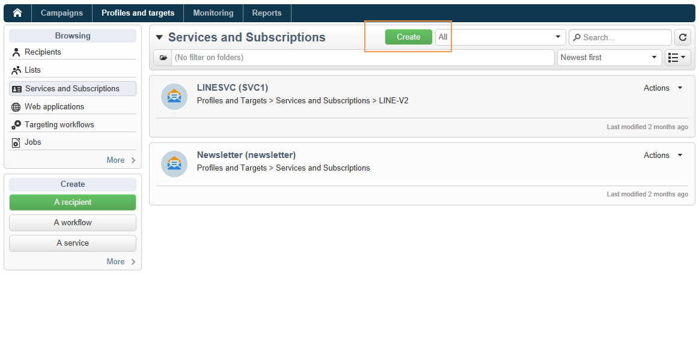

# Creare consegne LINE{#line-channel}

[!DNL LINE] è un&#39;applicazione per la messaggistica istantanea gratuita, chiamate vocali e video, disponibile su ogni sistema operativo mobile e su PC.

[!DNL LINE] può anche essere combinato con il modulo di messaggio transazionale per inviare messaggi in tempo reale sul [!DNL LINE] app installata su dispositivi mobili consumer. Per ulteriori informazioni, consulta questa [pagina](../../message-center/using/transactional-messaging-architecture.md#transactional-messaging-and-line).

I passaggi per l’utilizzo dei [!DNL LINE] i canali sono:

1. [Imposta canale LINE](#setting-up-line-channel)
1. [Creare una consegna](#creating-the-delivery)
1. [Configurare il tipo di contenuto](#defining-the-content)
1. [Monitoraggio della consegna (tracciamento, quarantena, rapporti, ecc.)](#accessing-reports)

## Imposta canale LINE {#setting-up-line-channel}

Prima di creare un [!DNL LINE] account ed account esterno, devi prima installare il pacchetto LINE sulla tua istanza. Per ulteriori informazioni, consulta [questa sezione](../../installation/using/installing-campaign-standard-packages.md#line-package).

È innanzitutto necessario creare un [!DNL LINE] , in modo da poterlo collegare ad Adobe Campaign. Quindi, puoi inviare [!DNL LINE] messaggi agli utenti che hanno aggiunto il tuo [!DNL LINE] nella loro app mobile. Account esterni e [!DNL LINE] l’account può essere gestito solo dall’amministratore funzionale della piattaforma.

Per creare e configurare un [!DNL LINE] conto, vedi [Documentazione per gli sviluppatori LINE](https://developers.line.me/).

### Crea e configura il servizio LINE {#configure-line-service}

Per creare [!DNL LINE] servizio:

1. Nella home page di Adobe Campaign Classic, seleziona la **[!UICONTROL Profiles and Targets]** scheda .

1. Nel menu a sinistra, seleziona **[!UICONTROL Services and Subscriptions]** e fai clic su **[!UICONTROL Create]**.

   

1. Aggiungi un **[!UICONTROL Label]** e **[!UICONTROL Internal name]** al nuovo servizio.

1. Seleziona **[!UICONTROL LINE]** dal **[!UICONTROL Type]** a discesa.

   

1. Fai clic su **[!UICONTROL Save]**.

Per ulteriori informazioni su abbonamenti e servizi, vedi [Gestione degli abbonamenti](managing-subscriptions.md).

### Configurare l’account esterno LINE {#configure-line-external}

Dopo aver creato il [!DNL LINE] , devi configurare il [!DNL LINE] account esterno su Adobe Campaign:

1. In **[!UICONTROL Administration]** > **[!UICONTROL Platform]** struttura ad albero, fai clic su **[!UICONTROL External Accounts]** scheda .

1. Seleziona il predefinito **[!UICONTROL LINE V2 routing]** conto esterno.

   

1. Fai clic sul pulsante **[!UICONTROL LINE]** scheda dal tuo account esterno per iniziare a configurare il tuo account esterno. Compila i campi seguenti:

   

   * **[!UICONTROL Channel Alias]**: è fornito tramite [!DNL LINE] nel **[!UICONTROL Channels]** > **[!UICONTROL Technical configuration]** scheda .
   * **[!UICONTROL Channel ID]**: è fornito tramite [!DNL LINE] nel **[!UICONTROL Channels]** > **[!UICONTROL Basic Information panel]** scheda .
   * **[!UICONTROL Channel secret key]**: è fornito tramite [!DNL LINE] nel **[!UICONTROL Channels]** > **[!UICONTROL Basic Information panel]** scheda .
   * **[!UICONTROL Access token]**: è fornito tramite [!DNL LINE] account nel portale per sviluppatori o facendo clic sul pulsante **[!UICONTROL Get access token]** pulsante .
   * **[!UICONTROL Access token expiration date]**: consente di specificare la data di scadenza del token di accesso.
   * **[!UICONTROL LINE subscription service]**: consente di specificare i servizi ai quali gli utenti verranno abbonati.

1. Al termine della configurazione, fai clic su **[!UICONTROL Save]**.

1. Da **[!UICONTROL Explorer]**, seleziona **[!UICONTROL Administration]** > **[!UICONTROL Production]** > **[!UICONTROL Technical workflows]** > **[!UICONTROL LINE workflows]** per verificare se **[!UICONTROL LINE V2 access token update (updateLineAccessToken)]** e **[!UICONTROL Delete blocked LINE users (deleteBlockedLineUsers)]** i flussi di lavoro sono iniziati.

La [!DNL LINE] è ora configurato in Adobe Campaign e puoi iniziare a creare e inviare consegne LINE agli abbonati.

## Crea consegna LINE {#creating-the-delivery}

>[!NOTE]
>
>Quando si invia un [!DNL LINE] consegna a un nuovo destinatario per la prima volta, devi aggiungere nella consegna il messaggio LINE ufficiale relativo ai termini di utilizzo e di consenso. Il messaggio ufficiale è disponibile all&#39;indirizzo [link successivo](https://terms.line.me/OA_privacy/).

Per creare una [!DNL LINE] la consegna deve seguire questi passaggi:

1. Da **[!UICONTROL Campaigns]** scheda , seleziona **[!UICONTROL Deliveries]** quindi fai clic su **[!UICONTROL Create]** pulsante .

   

1. Seleziona **[!UICONTROL LINE V2 delivery]** modello di consegna.

   

1. Identifica la consegna con un **[!UICONTROL Label]**, **[!UICONTROL Delivery code]** e  **[!UICONTROL Description]**. Per ulteriori informazioni al riguardo, consulta [questa sezione](steps-create-and-identify-the-delivery.md#identifying-the-delivery).

1. Fai clic su **[!UICONTROL Continue]** per creare la consegna.

1. Nell’editor di consegna, seleziona **[!UICONTROL To]** per eseguire il targeting dei destinatari [!DNL LINE] consegna. Il targeting viene eseguito il **[!UICONTROL Visitor subscriptions (nms:visitorSub)]**.

   Per ulteriori informazioni, consulta [Identificazione delle popolazioni target](steps-defining-the-target-population.md).

   

1. Fai clic su **[!UICONTROL Add]** per selezionare il **[!UICONTROL Delivery target population]**.

   

1. Scegli se desideri eseguire il targeting [!DNL LINE] gli abbonati direttamente o se desideri eseguire il targeting degli utenti in base ai loro [!DNL LINE] abbonamento e fai clic su **[!UICONTROL Next]**. In questo esempio abbiamo selezionato **[!UICONTROL By LINE V2 subscription]**.

1. Seleziona **[!UICONTROL Line-V2]** in **[!UICONTROL Folder]** a discesa e quindi il tuo [!DNL LINE] servizio. Fai clic su **[!UICONTROL Finish]** then **[!UICONTROL Ok]** per iniziare a personalizzare la consegna.

   

1. Dall’editor di consegna, fai clic su **[!UICONTROL Add]** per aggiungere uno o più messaggi e selezionare la **[!UICONTROL Content type]**.

   Per ulteriori informazioni sulle diverse **[!UICONTROL Content type]** disponibile, fai riferimento a [Definire il tipo di contenuto](#defining-the-content).

   

1. Quando la consegna viene creata e configurata correttamente, puoi inviarla alla destinazione definita in precedenza.

   Per ulteriori informazioni sull’invio di una consegna, consulta [Inviare messaggi](sending-messages.md).

1. Dopo aver inviato il messaggio, accedi al rapporto per misurare l’efficacia della consegna.

   Per ulteriori informazioni su [!DNL LINE] rapporti, fai riferimento a [Accedere ai rapporti](#accessing-reports).

## Definire il tipo di contenuto {#defining-the-content}

Per definire il contenuto di un [!DNL LINE] consegna, devi prima aggiungere il tipo di messaggio alla consegna. Ogni [!DNL LINE] la consegna può contenere fino a 5 messaggi.

Puoi scegliere tra tre tipi di messaggio:

* [Messaggio di testo](#configuring-a-text-message-delivery)
* [Immagine e collegamento](#configuring-an-image-and-link-delivery)
* [Messaggio video](#configuring-a-video-message-delivery)

### Configurazione della consegna di un messaggio di testo {#configuring-a-text-message-delivery}

>[!NOTE]
>
>La `<%@ include option='NmsServer_URL' %>/webApp/APP3?id=<%=escapeUrl(cryptString(visitor.id))%>` La sintassi ti consente di includere un collegamento a un’app web in un messaggio LINE.

A **[!UICONTROL Text message]** [!DNL LINE] delivery è un messaggio inviato ai destinatari in formato testo.

La configurazione di questo tipo di messaggio è simile alla configurazione del **[!UICONTROL Text]** in un messaggio e-mail. Per ulteriori informazioni, consulta [page](defining-the-email-content.md#message-content).

### Configurazione di un’immagine e della consegna del collegamento {#configuring-an-image-and-link-delivery}

Un **[!UICONTROL Image and link]** [!DNL LINE] delivery è un messaggio inviato ai destinatari sotto forma di immagine che può contenere uno o più URL.

Puoi utilizzare:

* a **[!UICONTROL Personalized image]**,

   >[!NOTE]
   >
   >È possibile utilizzare **%SIZE%** per ottimizzare la visualizzazione dell’immagine in base alle dimensioni dello schermo del dispositivo mobile del destinatario.

   

* un **[!UICONTROL Image URL]** per dimensioni dello schermo del dispositivo,

   

   La **[!UICONTROL Define images per device screen size]** consente di utilizzare diverse risoluzioni immagine per ottimizzare la visibilità della distribuzione sui dispositivi mobili. Sono supportate solo le immagini con la stessa altezza e larghezza.

   Le immagini possono essere definite in base alle dimensioni dello schermo:

   * 1040 px
   * 700 px
   * 460 px
   * 300 px
   * 240 px

   >[!CAUTION]
   >
   >Le dimensioni 1040x1040 px sono obbligatorie per ogni immagine LINE con collegamento.

   Devi quindi aggiungere del testo alternativo che comparirà sul dispositivo mobile del destinatario.

* e **[!UICONTROL Links]**.

   La **[!UICONTROL Links]** consente di scegliere tra diversi layout che consentono di dividere l’immagine in più aree selezionabili. Puoi quindi assegnare a ciascuno di essi un **[!UICONTROL Link URL]**.

   

### Configurazione della consegna di un messaggio video {#configuring-a-video-message-delivery}

A **[!UICONTROL Video message]** [!DNL LINE] delivery è un messaggio inviato ai destinatari sotto forma di video che può contenere un URL.

La **[!UICONTROL Preview Image URL]** consente di aggiungere l’URL di un’immagine di anteprima con un limite di caratteri di 1000. JPEG e PNG sono supportati con un limite di dimensione del file di 1 MB.

La **[!UICONTROL Video Image URL]** consente di aggiungere l’URL del file video con un limite di caratteri di 1000. È supportato solo il formato mp4 con un limite di dimensione del file di 200 MB.

Tieni presente che i video grandi o alti possono essere ritagliati quando vengono riprodotti su alcuni dispositivi.

## Accesso ai rapporti {#accessing-reports}

Dopo aver inviato la consegna, puoi visualizzare il tuo [!DNL LINE] rapporti tramite il menu **[!UICONTROL Campaign Management]** > **[!UICONTROL Deliveries]** dal **[!UICONTROL Explorer]**.

>[!NOTE]
>
>I rapporti di tracciamento indicano il tasso di click-through. [!DNL LINE] non tiene conto del tasso aperto.

Per [!DNL LINE] rapporti di servizio, accedere al menu **[!UICONTROL Profiles and Targets]** > **[!UICONTROL Services and Subscriptions]** > **[!UICONTROL LINE-V2]** dal **[!UICONTROL Explorer]** scheda . Quindi fai clic sul pulsante **[!UICONTROL Reports]** nella [!DNL LINE] servizio.

## Esempio: creare e inviare un messaggio LINE personalizzato {#example--create-and-send-a-personalized-line-message}

In questo esempio, creeremo e configureremo un messaggio di testo e un’immagine contenente dati che verranno personalizzati in base al destinatario.

1. Crea il tuo [!DNL LINE] consegna facendo clic sul pulsante **[!UICONTROL Create]** dal pulsante **[!UICONTROL Campaign]** scheda .

   

1. Seleziona la **[!UICONTROL LINE V2 delivery]** modello di consegna e nome della consegna.

   

1. Nella finestra di configurazione della consegna, seleziona il gruppo di destinazione.

   Per ulteriori informazioni, consulta [Identificazione delle popolazioni target](steps-defining-the-target-population.md).

   

1. Fai clic su **[!UICONTROL Add]** per creare il messaggio e selezionare la **[!UICONTROL Content type]**.

   In questo caso, desideriamo innanzitutto creare un **[!UICONTROL Text message]**.

   

1. Posiziona il cursore nel punto in cui desideri inserire il testo personalizzato, fai clic sull’icona a discesa, quindi seleziona **[!UICONTROL Visitor]** > **[!UICONTROL First name]**.

   

1. Segui la stessa procedura per aggiungere un’immagine, selezionando **[!UICONTROL Image and links]** in **[!UICONTROL Message type]** a discesa.

   Aggiungi il tuo **[!UICONTROL Image URL]**.

   

1. In **[!UICONTROL Links]** selezionate il layout che consente di dividere l&#39;immagine in più aree selezionabili.

1. Assegna un URL a ogni area dell’immagine.

   

1. Salva la consegna, quindi fai clic su **[!UICONTROL Send]** per analizzarlo e inviarlo al target.

   La consegna viene inviata al target.

   

