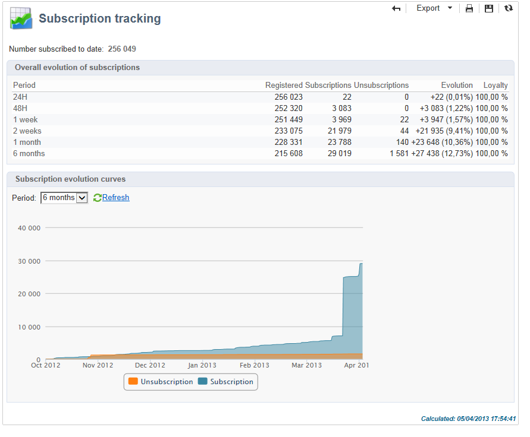

# Gestire le iscrizioni{#managing-subscriptions}

## Informazioni sui servizi di informazione {#about-information-services}

Un servizio di informazione comprende:

* Registrazione e abbonamento (opt-in)
* annullamento della registrazione, annullamento volontario dell’abbonamento (opt out) o annullamento automatico dell’abbonamento (servizio a tempo limitato, ad esempio come offerta di prova),
* meccanismi di conferma dell’abbonamento e del suo annullamento (meccanismi semplici con conferma, doppio consenso, ecc.),
* Tracciamento della cronologia degli abbonati.

Come funzione standard, questi servizi includono rapporti statistici specifici: tracciamento degli abbonati, livello di fedeltà, tendenze di annullamento dell’abbonamento, ecc.

Per le e-mail, i collegamenti di annullamento dell’abbonamento obbligatori vengono generati automaticamente e l’intero processo di consenso/rinuncia viene completamente automatizzato, con tracciamento della cronologia per garantire la piena conformità alle normative in vigore.

Esistono tre modalità di abbonamento/annullamento abbonamento al servizio:

1. manuale
1. importando (solo abbonamento),
1. tramite un modulo web

>[!NOTE]
>
>Un esempio per creare un modulo di abbonamento con doppio consenso è descritto in [questa sezione](../../web/using/use-cases-web-forms.md#create-a-subscription--form-with-double-opt-in).

## Creazione di un servizio informazioni {#creating-an-information-service}

È possibile creare e gestire gli abbonamenti ai servizi di informazione con i messaggi di conferma associati o le consegne automatiche agli abbonati.

Per accedere alla mappa dei servizi di informazioni, aprire **[!UICONTROL Profiles and Targets]** e fai clic sul pulsante **[!UICONTROL Services and Subscriptions]** collegamento.

Per modificare un servizio esistente, fare clic sul relativo nome. Per creare un servizio, fai clic su **[!UICONTROL Create]** sopra l&#39;elenco.

* Inserisci il nome del servizio nel **[!UICONTROL Label]** e seleziona il canale di consegna: e-mail, dispositivi mobili, Facebook, X (precedentemente noto come Twitter) o applicazioni mobili.

  >[!NOTE]
  >
  >Gli abbonamenti a facebook e X sono descritti in dettaglio [questa sezione](../../social/using/about-social-marketing.md). Gli abbonamenti alle app mobili sono descritti in dettaglio in [Informazioni sul canale app mobile](about-mobile-app-channel.md).

* Per un servizio di tipo E-mail, seleziona la **Modalità di consegna**. Le modalità possibili sono: **[!UICONTROL Newsletter]** o **[!UICONTROL Viral]**.
* Puoi inviare **messaggi di conferma** per un abbonamento o per il suo annullamento. A questo scopo, seleziona i modelli di consegna da utilizzare per creare le consegne corrispondenti dal **[!UICONTROL Subscription]** e **[!UICONTROL Unsubscription]** campi. Questi modelli devono essere configurati con **[!UICONTROL Subscription]** tipo mappatura target, senza target definito. Vedere la sezione [Informazioni sul canale e-mail](about-email-channel.md).
* Per impostazione predefinita, le iscrizioni hanno un periodo di validità illimitato. È possibile deselezionare **[!UICONTROL Unlimited]** per definire una durata di validità per il servizio. La durata può essere specificata in giorni (**[!UICONTROL d]** ) o mesi (**[!UICONTROL m]** ).

Una volta salvato, il servizio viene aggiunto all’elenco Servizi e abbonamenti: fai clic sul nome per modificarlo. Sono disponibili diverse schede. Il **[!UICONTROL Subscriptions]** scheda consente di esaminare l&#39;elenco degli abbonati al servizio di informazioni (**[!UICONTROL Active subscriptions]** ) o la cronologia degli abbonamenti/annullamenti (**[!UICONTROL History]** ). Da questa scheda è inoltre possibile aggiungere ed eliminare sottoscrittori. Consulta [Aggiunta ed eliminazione di abbonati](#adding-and-deleting-subscribers).

Il **[!UICONTROL Detail...]** consente di esaminare le proprietà della sottoscrizione per il destinatario selezionato.

Puoi modificare le proprietà di abbonamento di un destinatario.

Nel dashboard, fai clic su **[!UICONTROL Reports]** scheda per tenere traccia degli abbonamenti: modifiche nei livelli di abbonamento, numero totale di abbonati, ecc. Da questa scheda è possibile archiviare i rapporti e esaminare le cronologie.

## Aggiunta ed eliminazione di abbonati {#adding-and-deleting-subscribers}

Dalla sezione **[!UICONTROL Subscriptions]** scheda di un servizio informazioni fare clic su **[!UICONTROL Add]** per aggiungere abbonati. Puoi anche fare clic con il pulsante destro del mouse sull’elenco degli abbonati e selezionare **[!UICONTROL Add]**. Seleziona la cartella in cui sono memorizzati i profili da sottoscrivere, quindi seleziona i profili da sottoscrivere e fai clic su **[!UICONTROL OK]** da convalidare.

Per eliminare gli abbonati, selezionarli e fare clic su **[!UICONTROL Delete]**. Puoi anche fare clic con il pulsante destro del mouse sull’elenco degli abbonati e selezionare **[!UICONTROL Delete]**.

In entrambi i casi, puoi inviare un messaggio di conferma agli utenti interessati se al servizio è stato allegato un modello di consegna per l’annullamento degli abbonamenti (consulta [Creazione di un servizio informazioni](#creating-an-information-service)). Un avviso consente di convalidare o meno questa consegna:

Consulta [Meccanismi di abbonamento e di annullamento dell’abbonamento](#subscription-and-unsubscription-mechanisms).

## Fornitura agli abbonati di un servizio {#delivering-to-the-subscribers-of-a-service}

Per fornire agli abbonati a un servizio di informazioni, è possibile rivolgersi agli abbonati al servizio di informazioni interessato, come nell’esempio seguente:

>[!CAUTION]
>
>La mappatura di destinazione deve essere **[!UICONTROL Subscriptions]**.

Seleziona **[!UICONTROL Subscribers of an information service]** e fai clic su **[!UICONTROL Next]**.

Seleziona il servizio di informazioni di destinazione e fai clic su **[!UICONTROL Finish]**.

Il **[!UICONTROL Preview]** Questa scheda ti consente di visualizzare l’elenco degli abbonati al servizio di informazioni selezionato.

## Meccanismi di abbonamento e di annullamento dell’abbonamento {#subscription-and-unsubscription-mechanisms}

Puoi impostare meccanismi di abbonamento e annullamento dell’abbonamento per automatizzare i processi e la gestione degli abbonati.

>[!NOTE]
>
>Puoi inviare un messaggio di conferma ai nuovi abbonati.\
>Il contenuto di questo messaggio è definito nella configurazione del servizio informazioni tramite **[!UICONTROL Subscription]** o **[!UICONTROL Unsubscription]** campi.
>
>I messaggi di conferma vengono creati tramite i modelli di consegna specificati in questi campi. Queste mappature di destinazione devono essere **[!UICONTROL Subscriptions]**.

### Iscrizione di un destinatario a un servizio {#subscribing-a-recipient-to-a-service}

Per registrare i destinatari di un servizio informazioni, è possibile:

* Aggiungi manualmente il servizio: a questo scopo, dal **[!UICONTROL Subscriptions]** del loro profilo, fai clic su **[!UICONTROL Add]** e selezionare il servizio di informazione interessato.

  Per ulteriori informazioni, consulta la sezione sulla modifica del profilo in [questa sezione](../../platform/using/editing-a-profile.md).

* Iscrivi automaticamente un set di destinatari a questo servizio. L’elenco dei destinatari può provenire da un’operazione di filtro, un gruppo, una cartella, un’importazione o una selezione diretta effettuata con il mouse. Per sottoscrivere questi destinatari, seleziona i profili e fai clic con il pulsante destro del mouse. Seleziona **[!UICONTROL Actions > Subscribe selection to a service...]**, selezionare il servizio interessato e avviare l&#39;operazione.
* Importa i destinatari e abbonali automaticamente a un servizio di informazioni. A questo scopo, seleziona il servizio interessato nell’ultimo passaggio della procedura guidata di importazione.

  Per ulteriori informazioni al riguardo, consulta [questa sezione](../../platform/using/executing-import-jobs.md).

* Utilizza un modulo web in modo che i destinatari possano abbonarsi a un servizio.

  Per ulteriori informazioni al riguardo, consulta [questa sezione](../../web/using/about-web-applications.md).

* Creazione di un flusso di lavoro di targeting e utilizzo di un **[!UICONTROL Subscription service]** casella.

  

  I flussi di lavoro e le relative modalità di utilizzo sono descritti in [questa sezione](../../workflow/using/about-workflows.md).

### Annullamento dell’abbonamento di un destinatario da un servizio {#unsubscribing-a-recipient-from-a-service}

#### Annullamento manuale dell’abbonamento {#manual-unsubscribing}

le consegne e-mail devono contenere per legge un collegamento che consenta di annullare l’abbonamento. I destinatari possono fare clic su questo collegamento per aggiornare il loro profilo ed essere esclusi dai target delle consegne future.

Il collegamento predefinito di annullamento dell’abbonamento viene inserito tramite l’ultimo pulsante nella barra degli strumenti dell’editor di contenuto fornito nella procedura guidata di consegna (consulta [Informazioni sulla personalizzazione](about-personalization.md)). Quando il destinatario fa clic su questo collegamento, il profilo viene aggiunto al inserisco nell&#39;elenco Bloccati di consegna (rinuncia), il che significa che il destinatario non sarà più interessato da alcuna azione di consegna.

I destinatari possono tuttavia scegliere di annullare l’abbonamento a un servizio senza annullare l’abbonamento a tutti i servizi. Per consentire questa operazione, puoi utilizzare un modulo web (consulta [questa sezione](../../web/using/adding-fields-to-a-web-form.md#subscription-checkboxes)) o inserire un collegamento personalizzato per l’annullamento dell’abbonamento (consulta [Blocchi di personalizzazione](personalization-blocks.md)).

Puoi anche annullare manualmente l’abbonamento di un destinatario dal profilo del destinatario. A questo scopo, fai clic su **[!UICONTROL Subscriptions]** scheda del destinatario interessato, selezionare i servizi di informazione interessati e fare clic su **[!UICONTROL Delete]**.

È infine possibile annullare l’abbonamento di uno o più destinatari tramite il servizio di informazioni interessato. A questo scopo, fai clic su **[!UICONTROL Subscriptions]** del servizio, seleziona i destinatari interessati e fai clic su **[!UICONTROL Delete]**.

#### Annullamento automatico dell’iscrizione {#automatic-unsubscription}

Un servizio di informazione può avere una durata limitata. L’abbonamento dei destinatari verrà annullato automaticamente alla scadenza del periodo di validità. Questo periodo è specificato nel **[!UICONTROL Edit]** delle proprietà del servizio. È espresso in giorni.

Puoi anche impostare un flusso di lavoro di annullamento dell’abbonamento per una popolazione. A questo scopo, segui la stessa procedura applicata a un flusso di lavoro di abbonamento, ma seleziona la **[!UICONTROL Unsubscription]** opzione. Consulta [Iscrizione di un destinatario a un servizio](#subscribing-a-recipient-to-a-service).

### Tracciamento degli abbonati {#subscriber-tracking}

È possibile tenere traccia delle modifiche apportate agli abbonamenti ai servizi di informazione utilizzando **[!UICONTROL Reports]** nel dashboard.

