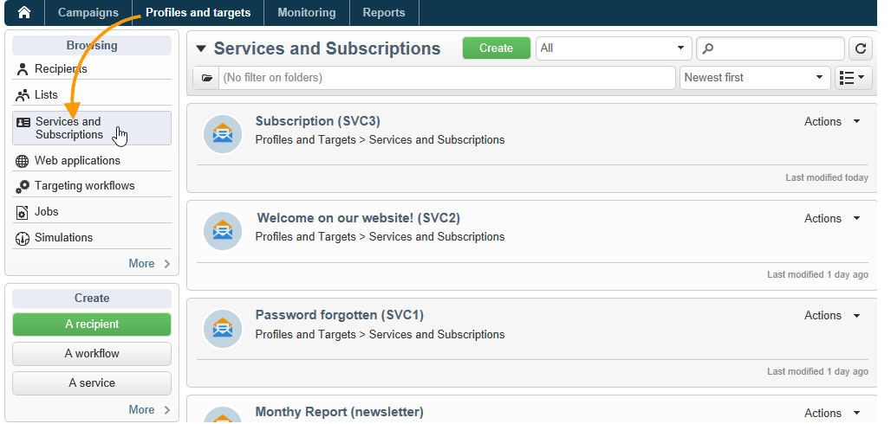
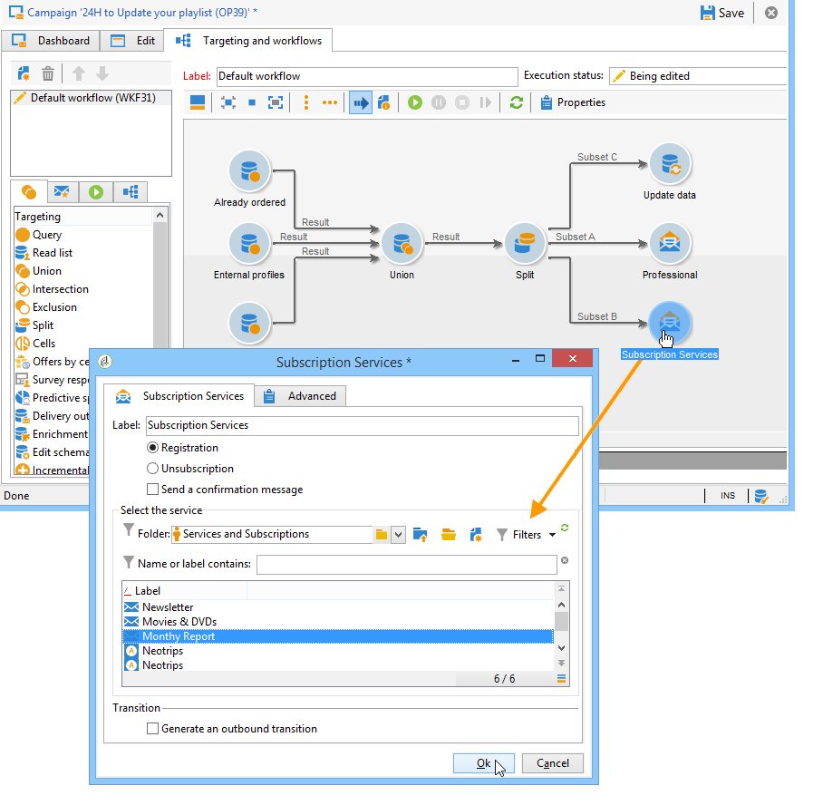

# Gestione degli abbonamenti{#managing-subscriptions}

## Informazioni sui servizi di informazione {#about-information-services}

Un servizio di informazione comprende:

* Registrazione e iscrizione (opt-in),
* Cancellazione, annullamento dell&#39;iscrizione volontaria (opt out) o annullamento dell&#39;iscrizione automatica (servizio a tempo limitato, ad esempio come offerta di prova),
* meccanismi di conferma dell’iscrizione e dell’annullamento della sottoscrizione (semplici meccanismi con conferma, doppio consenso, ecc.),
* Tracciamento della cronologia degli abbonati.

In linea di massima, questi servizi includono specifici rapporti statistici: tracciamento sottoscrizione, livello fedeltà, tendenze annullamento sottoscrizione ecc.

Per le e-mail, i collegamenti di annullamento dell&#39;iscrizione obbligatori vengono generati automaticamente e l&#39;intero processo di opt in/opt out è completamente automatizzato, con il monitoraggio della cronologia per garantire la piena conformità con le normative in vigore.

Sono disponibili tre modalità di iscrizione/annullamento dell’iscrizione al servizio:

1. manual
1. importando (solo abbonamento),
1. tramite un modulo Web

>[!NOTE]
>
>Un esempio per creare un modulo di iscrizione con doppio consenso è illustrato in [questa sezione](../../web/using/use-cases--web-forms.md#create-a-subscription--form-with-double-opt-in).

## Creazione di un servizio di informazione {#creating-an-information-service}

Potete creare e gestire le iscrizioni ai servizi di informazione con i messaggi di conferma associati o le consegne automatiche agli abbonati.

Per accedere alla mappa dei servizi di informazione, vai all&#39; **[!UICONTROL Profiles and Targets]** universo e fai clic sul **[!UICONTROL Services and Subscriptions]** collegamento.

Per modificare un servizio esistente, fate clic sul suo nome. Per creare un servizio, fate clic sul **[!UICONTROL Create]** pulsante situato sopra l&#39;elenco.

* Immettete il nome del servizio nel **[!UICONTROL Label]** campo e selezionate il canale di consegna: e-mail, dispositivi mobili, Facebook, Twitter o applicazioni per dispositivi mobili.

   >[!NOTE]
   >
   >Le iscrizioni a Facebook e Twitter sono descritte in [questa sezione](../../social/using/about-social-marketing.md). Le iscrizioni alle applicazioni mobili sono dettagliate in [Informazioni sul canale](../../delivery/using/about-mobile-app-channel.md)delle app mobili.

* Per un servizio tipo e-mail, selezionate la modalità **** Consegna. Le modalità possibili sono: **[!UICONTROL Newsletter]** o **[!UICONTROL Viral]**.
* Potete inviare messaggi **di** conferma per un&#39;iscrizione o per annullarne l&#39;iscrizione. A tal fine, selezionate i modelli di consegna da utilizzare per creare le consegne corrispondenti dai **[!UICONTROL Subscription]** campi e **[!UICONTROL Unsubscription]** . Questi modelli devono essere configurati con una mappatura di destinazione del **[!UICONTROL Subscription]** tipo, senza una destinazione definita. Vedere la sezione [Informazioni sul canale](../../delivery/using/about-email-channel.md)e-mail.
* Per impostazione predefinita, le iscrizioni sono illimitate. Potete deselezionare l&#39; **[!UICONTROL Unlimited]** opzione per definire una durata di validità per il servizio. La durata può essere specificata in giorni (**[!UICONTROL d]** ) o mesi (**[!UICONTROL m]** ).

Una volta salvato, il servizio viene aggiunto all&#39;elenco Servizi e iscrizioni: Fate clic sul suo nome per modificarlo. Sono disponibili diverse schede. La **[!UICONTROL Subscriptions]** scheda consente di visualizzare l&#39;elenco degli utenti iscritti al servizio informazioni (**[!UICONTROL Active subscriptions]** scheda) o la cronologia di iscrizione/annullamento dell&#39;iscrizione (**[!UICONTROL History]** scheda). È inoltre possibile aggiungere ed eliminare sottoscrittori da questa scheda. Consultate [Aggiunta ed eliminazione di sottoscrittori](#adding-and-deleting-subscribers).

Il **[!UICONTROL Detail...]** pulsante consente di visualizzare le proprietà dell&#39;iscrizione per il destinatario selezionato.

Potete modificare le proprietà di iscrizione per un destinatario.

Nel dashboard, fate clic sulla **[!UICONTROL Reports]** scheda per tenere traccia delle sottoscrizioni: modifiche nei livelli di iscrizione, numero totale di abbonati, ecc. È possibile archiviare i rapporti e consultare le cronologia da questa scheda.

## Aggiunta ed eliminazione di abbonati {#adding-and-deleting-subscribers}

Dalla **[!UICONTROL Subscriptions]** scheda di un servizio di informazione fate clic **[!UICONTROL Add]** per aggiungere utenti iscritti. Potete anche fare clic con il pulsante destro del mouse sull’elenco degli utenti iscritti e selezionarlo **[!UICONTROL Add]**. Selezionate la cartella in cui sono memorizzati i profili da sottoscrivere, quindi selezionate i profili da sottoscrivere e fate clic **[!UICONTROL OK]** per convalidarli.

Per eliminare i sottoscrittori, selezionateli e fate clic su **[!UICONTROL Delete]**. Potete anche fare clic con il pulsante destro del mouse sull’elenco degli utenti iscritti e selezionarlo **[!UICONTROL Delete]**.

In entrambi i casi, potete inviare un messaggio di conferma agli utenti interessati se al servizio è stato allegato un modello di consegna per le sottoscrizioni (consultate [Creazione di un servizio](#creating-an-information-service)informazioni). Un avviso consente di convalidare o non convalidare la consegna:

Consultate Meccanismi [di](#subscription-and-unsubscription-mechanisms)iscrizione e annullamento della sottoscrizione.

## Consegna agli abbonati di un servizio {#delivering-to-the-subscribers-of-a-service}

Per fornire agli abbonati di un servizio di informazione, potete indirizzare gli abbonati al servizio di informazione interessato, come nell’esempio seguente:

>[!CAUTION]
>
>Il mapping di destinazione deve essere **[!UICONTROL Subscriptions]**.

Seleziona **[!UICONTROL Subscribers of an information service]** e fai clic su **[!UICONTROL Next]**.

Selezionate il servizio di informazioni di destinazione e fate clic su **[!UICONTROL Finish]**.

La **[!UICONTROL Preview]** scheda consente di visualizzare l&#39;elenco degli abbonati al servizio informazioni selezionato.

## Meccanismi di iscrizione e annullamento della sottoscrizione {#subscription-and-unsubscription-mechanisms}

Potete configurare meccanismi di iscrizione e annullamento dell’iscrizione per automatizzare i processi e la gestione degli abbonati.

>[!NOTE]
>
>Potete inviare un messaggio di conferma ai nuovi sottoscrittori.\
>Il contenuto di questo messaggio viene definito nella configurazione del servizio informazioni tramite i **[!UICONTROL Subscription]** campi o **[!UICONTROL Unsubscription]** .
>
>I messaggi di conferma vengono creati tramite i modelli di consegna specificati in questi campi. Questi mapping di destinazione devono essere **[!UICONTROL Subscriptions]**.

### Iscrizione di un destinatario a un servizio {#subscribing-a-recipient-to-a-service}

Per registrare i destinatari per un servizio di informazione, potete:

* Aggiungete manualmente il servizio: a tal fine, dalla **[!UICONTROL Subscriptions]** scheda del profilo, fare clic su **[!UICONTROL Add]** e selezionare il servizio di informazione interessato.

   Per ulteriori informazioni, consulta la sezione sulla modifica del profilo in [questa sezione](../../platform/using/editing-a-profile.md).

* Iscriviti automaticamente a questo servizio un set di destinatari. L&#39;elenco dei destinatari può provenire da un&#39;operazione di filtro, un gruppo, una cartella, un&#39;importazione o una selezione diretta utilizzando il mouse. Per iscriverti a questi destinatari, seleziona i profili e fai clic con il pulsante destro del mouse. Selezionare **[!UICONTROL Actions > Subscribe selection to a service...]**, selezionare il servizio interessato e avviare l&#39;operazione.
* Importa i destinatari e li iscrivi automaticamente a un servizio di informazione. A questo scopo, selezionate il servizio interessato nell’ultimo passaggio della procedura guidata di importazione.

   Per ulteriori informazioni al riguardo, consulta [questa sezione](../../platform/using/importing-data.md#import-wizard).

* Utilizzare un modulo Web per consentire ai destinatari di iscriversi a un servizio.

   Per ulteriori informazioni al riguardo, consulta [questa sezione](../../web/using/about-web-applications.md).

* Creazione di un flusso di lavoro di targeting e utilizzo di una **[!UICONTROL Subscription service]** casella.

   

   I flussi di lavoro e come utilizzarli sono descritti in [questa sezione](../../workflow/using/about-workflows.md).

### Annullamento dell&#39;iscrizione di un destinatario da un servizio {#unsubscribing-a-recipient-from-a-service}

#### Annullamento manuale dell&#39;iscrizione {#manual-unsubscribing}

per legge, le consegne e-mail devono contenere un collegamento per annullare l&#39;iscrizione. I destinatari possono fare clic su questo collegamento per aggiornare il proprio profilo ed essere esclusi dagli obiettivi delle consegne future.

Il collegamento predefinito per l’annullamento dell’iscrizione viene inserito tramite l’ultimo pulsante nella barra degli strumenti dell’editor di contenuti disponibile nella procedura guidata di distribuzione (consultate [Informazioni sulla personalizzazione](../../delivery/using/about-personalization.md)). Quando il destinatario fa clic su questo collegamento, il profilo viene aggiunto al elenco Bloccati  (rinuncia), il che significa che il destinatario non sarà più preso di mira da alcuna azione di consegna.

I destinatari possono tuttavia scegliere di annullare l’iscrizione a un servizio senza annullare l’iscrizione a tutti i servizi. A tal fine, è possibile utilizzare un modulo Web (fare riferimento a [questa sezione](../../web/using/adding-fields-to-a-web-form.md#subscription-checkboxes)) o inserire un collegamento personalizzato senza iscrizione (vedere Blocchi [di](../../delivery/using/personalization-blocks.md)personalizzazione).

Puoi anche annullare l’iscrizione di un destinatario manualmente dal profilo del destinatario. A tal fine, fare clic sulla **[!UICONTROL Subscriptions]** scheda del destinatario interessato, selezionare i servizi di informazione interessati e fare clic su **[!UICONTROL Delete]**.

È infine possibile annullare l’iscrizione di uno o più destinatari tramite il servizio di informazione interessato. A tale scopo, fare clic sulla **[!UICONTROL Subscriptions]** scheda del servizio, selezionare i destinatari interessati e fare clic su **[!UICONTROL Delete]**.

#### Annullamento automatico sottoscrizione {#automatic-unsubscription}

Un servizio di informazione può avere una durata limitata. I destinatari verranno annullati automaticamente alla scadenza del periodo di validità. Questo periodo è specificato nella **[!UICONTROL Edit]** scheda delle proprietà del servizio. Viene espresso in giorni.

Potete anche impostare un flusso di lavoro di annullamento della sottoscrizione per una popolazione. A questo scopo, seguite la stessa procedura utilizzata per un flusso di lavoro di iscrizione, ma selezionate l’ **[!UICONTROL Unsubscription]** opzione. Consultate [Iscrizione di un destinatario a un servizio](#subscribing-a-recipient-to-a-service).

### Tracciamento sottoscrittore {#subscriber-tracking}

Potete tenere traccia delle modifiche apportate alle iscrizioni ai servizi di informazione mediante il **[!UICONTROL Reports]** collegamento presente nel dashboard.

