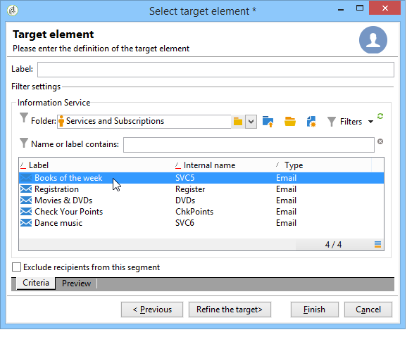

# Gestire gli abbonamenti{#managing-subscriptions}

## Informazioni sui servizi di informazione {#about-information-services}

Un servizio d&#39;informazione comprende:

* Registrazione e abbonamento (opt-in),
* Cancellazione, annullamento volontario dell’abbonamento (opt-out) o annullamento automatico dell’abbonamento (servizio a tempo limitato, ad esempio un’offerta di prova),
* Meccanismi di conferma dell’abbonamento e del suo annullamento (meccanismi semplici con conferma, doppio consenso, ecc.),
* Tracciamento della cronologia degli abbonati.

In linea di massima, questi servizi comprendono rapporti statistici specifici: tracciamento degli abbonati, livello di fedeltà, tendenze di annullamento dell’abbonamento, ecc.

Per le e-mail, i collegamenti di annullamento dell’abbonamento obbligatori vengono generati automaticamente e l’intero processo di consenso/rinuncia è completamente automatizzato, con tracciamento della cronologia per garantire la piena conformità alle normative in vigore.

Sono disponibili tre modalità di abbonamento/annullamento dell’abbonamento al servizio:

1. manuale
1. importando (solo abbonamento),
1. tramite un modulo web

>[!NOTE]
>
>Un esempio per creare un modulo di abbonamento con doppio consenso è descritto in [questa sezione](../../web/using/use-cases--web-forms.md#create-a-subscription--form-with-double-opt-in).

## Creazione di un servizio informazioni {#creating-an-information-service}

Puoi creare e gestire abbonamenti a servizi di informazione con messaggi di conferma associati o consegne automatiche agli abbonati.

Per accedere alla mappa dei servizi di informazione, apri la **[!UICONTROL Profiles and Targets]** e fai clic su **[!UICONTROL Services and Subscriptions]** link.

Per modificare un servizio esistente, fai clic sul suo nome. Per creare un servizio, fai clic sul pulsante **[!UICONTROL Create]** pulsante situato sopra l’elenco.

* Immetti il nome del servizio nel **[!UICONTROL Label]** e seleziona il canale di consegna: e-mail, dispositivi mobili, Facebook, Twitter o applicazioni mobili.

   >[!NOTE]
   >
   >Gli abbonamenti a facebook e Twitter sono descritti in [questa sezione](../../social/using/about-social-marketing.md). Gli abbonamenti alle applicazioni mobili sono descritti in [Informazioni sul canale app mobile](about-mobile-app-channel.md).

* Per un servizio di tipo E-mail, seleziona la **Modalità di consegna**. Le modalità possibili sono: **[!UICONTROL Newsletter]** o **[!UICONTROL Viral]**.
* Puoi inviare **messaggi di conferma** per un abbonamento o per un suo annullamento. A questo scopo, seleziona i modelli di consegna da utilizzare per creare le consegne corrispondenti dalla **[!UICONTROL Subscription]** e **[!UICONTROL Unsubscription]** campi. Questi modelli devono essere configurati con un **[!UICONTROL Subscription]** mappatura del tipo di target, senza un target definito. Vedere la sezione [Informazioni sul canale e-mail](about-email-channel.md).
* Per impostazione predefinita, gli abbonamenti sono illimitati. Puoi deselezionare la **[!UICONTROL Unlimited]** per definire una durata di validità per il servizio. La durata può essere specificata in giorni (**[!UICONTROL d]** ) o mesi (**[!UICONTROL m]** ).

Una volta salvato, il servizio viene aggiunto all’elenco Servizi e iscrizioni: Fare clic sul nome per modificarlo. Sono disponibili diverse schede. La **[!UICONTROL Subscriptions]** consente di consultare l’elenco degli abbonati al servizio informazioni (**[!UICONTROL Active subscriptions]** o la cronologia dell&#39;abbonamento o del suo annullamento (**[!UICONTROL History]** ). Puoi anche aggiungere ed eliminare gli abbonati da questa scheda. Vedi [Aggiunta ed eliminazione di abbonati](#adding-and-deleting-subscribers).

La **[!UICONTROL Detail...]** ti consente di esaminare le proprietà dell’abbonamento per il destinatario selezionato.

Puoi modificare le proprietà dell’abbonamento per un destinatario.

Nel dashboard, fai clic sul pulsante **[!UICONTROL Reports]** scheda per tenere traccia delle sottoscrizioni: modifiche dei livelli di abbonamento, numero totale di abbonati, ecc. È possibile archiviare i rapporti e esaminare la cronologia da questa scheda.

## Aggiunta ed eliminazione di abbonati {#adding-and-deleting-subscribers}

Da **[!UICONTROL Subscriptions]** scheda di un clic del servizio informazioni **[!UICONTROL Add]** per aggiungere abbonati. Puoi anche fare clic con il pulsante destro del mouse sull’elenco degli abbonati e selezionare **[!UICONTROL Add]**. Seleziona la cartella in cui sono memorizzati i profili da sottoscrivere, quindi seleziona i profili da sottoscrivere e fai clic su **[!UICONTROL OK]** da convalidare.

Per eliminare gli abbonati, selezionali e fai clic su **[!UICONTROL Delete]**. È inoltre possibile fare clic con il pulsante destro del mouse sull’elenco degli abbonati e selezionare **[!UICONTROL Delete]**.

In entrambi i casi, puoi inviare un messaggio di conferma agli utenti interessati se al servizio è stato allegato un modello di consegna per gli annullamenti di abbonamenti (vedi [Creazione di un servizio informazioni](#creating-an-information-service)). Un avviso consente di convalidare o meno questa consegna:

Vedi [Meccanismi di abbonamento e di annullamento dell’abbonamento](#subscription-and-unsubscription-mechanisms).

## Consegna agli abbonati di un servizio {#delivering-to-the-subscribers-of-a-service}

Per fornire agli abbonati di un servizio di informazione, è possibile indirizzare gli abbonati al servizio di informazione interessato, come nell&#39;esempio seguente:

>[!CAUTION]
>
>La mappatura di destinazione deve essere **[!UICONTROL Subscriptions]**.

Seleziona **[!UICONTROL Subscribers of an information service]** e fai clic su **[!UICONTROL Next]**.

Seleziona il servizio di informazioni di destinazione e fai clic su **[!UICONTROL Finish]**.

La **[!UICONTROL Preview]** consente di visualizzare l’elenco dei sottoscrittori del servizio informazioni selezionato.

## Meccanismi di abbonamento e di annullamento dell’abbonamento {#subscription-and-unsubscription-mechanisms}

Puoi impostare meccanismi di abbonamento e annullamento dell’abbonamento per automatizzare i processi e la gestione degli abbonati.

>[!NOTE]
>
>Puoi inviare un messaggio di conferma ai nuovi abbonati.\
>Il contenuto di questo messaggio viene definito nella configurazione del servizio informazioni tramite il **[!UICONTROL Subscription]** o **[!UICONTROL Unsubscription]** campi.
>
>I messaggi di conferma vengono creati tramite i modelli di consegna specificati in questi campi. Queste mappature di destinazione devono essere **[!UICONTROL Subscriptions]**.

### Iscrizione di un destinatario a un servizio {#subscribing-a-recipient-to-a-service}

Per registrare i destinatari per un servizio di informazione, puoi:

* Aggiungi manualmente il servizio: a tal fine, dal **[!UICONTROL Subscriptions]** scheda del profilo, fai clic su **[!UICONTROL Add]** e selezionare il servizio di informazione interessato.

   Per ulteriori informazioni, consulta la sezione sulla modifica dei profili in [questa sezione](../../platform/using/editing-a-profile.md).

* Iscriviti automaticamente un set di destinatari a questo servizio. L’elenco dei destinatari può provenire da un’operazione di filtro, un gruppo, una cartella, un’importazione o una selezione diretta tramite il mouse. Per sottoscrivere questi destinatari, seleziona i profili e fai clic con il pulsante destro del mouse su di essi. Seleziona **[!UICONTROL Actions > Subscribe selection to a service...]**, seleziona il servizio interessato e avvia l’operazione.
* Importa i destinatari e abbonali automaticamente a un servizio di informazioni. A questo scopo, seleziona il servizio interessato nell’ultimo passaggio della procedura guidata di importazione.

   Per ulteriori informazioni al riguardo, consulta [questa sezione](../../platform/using/executing-import-jobs.md).

* Utilizza un modulo web per consentire ai destinatari di iscriversi a un servizio.

   Per ulteriori informazioni al riguardo, consulta [questa sezione](../../web/using/about-web-applications.md).

* Creazione di un flusso di lavoro di targeting e utilizzo di un **[!UICONTROL Subscription service]** scatola.

   

   I flussi di lavoro e le relative modalità di utilizzo sono descritti in [questa sezione](../../workflow/using/about-workflows.md).

### Annullamento dell’iscrizione di un destinatario da un servizio {#unsubscribing-a-recipient-from-a-service}

#### Annullamento manuale dell’abbonamento {#manual-unsubscribing}

Le consegne e-mail devono contenere un collegamento di annullamento dell’abbonamento, per legge. I destinatari possono fare clic su questo collegamento per aggiornare il proprio profilo ed essere esclusi dagli obiettivi delle consegne future.

Il collegamento di annullamento dell’abbonamento predefinito viene inserito tramite l’ultimo pulsante nella barra degli strumenti dell’editor di contenuti fornito nella procedura guidata di consegna (consulta [Informazioni sulla personalizzazione](about-personalization.md)). Quando il destinatario fa clic su questo collegamento, il profilo viene aggiunto al  di elenco Bloccati (rinuncia), il che significa che il destinatario non sarà più oggetto di targeting da parte di alcuna azione di consegna.

Tuttavia, i destinatari possono scegliere di annullare l’iscrizione a un servizio senza annullare l’iscrizione a tutti i servizi. Per consentire questa operazione, è possibile utilizzare un modulo web (fare riferimento a [questa sezione](../../web/using/adding-fields-to-a-web-form.md#subscription-checkboxes)) o inserisci un collegamento di annullamento all’abbonamento personalizzato (vedi [Blocchi di personalizzazione](personalization-blocks.md)).

Puoi anche annullare manualmente l’iscrizione di un destinatario dal profilo del destinatario. A questo scopo, fai clic sul pulsante **[!UICONTROL Subscriptions]** scheda del destinatario interessato, selezionare i servizi di informazione interessati e fare clic su **[!UICONTROL Delete]**.

È infine possibile annullare l’iscrizione di uno o più destinatari tramite il servizio di informazione interessato. A questo scopo, fai clic sul pulsante **[!UICONTROL Subscriptions]** scheda del servizio, seleziona i destinatari interessati e fai clic su **[!UICONTROL Delete]**.

#### Annullamento automatico della sottoscrizione {#automatic-unsubscription}

Un servizio di informazione può avere una durata limitata. I destinatari verranno automaticamente annullati alla scadenza del periodo di validità. Questo periodo è specificato nel **[!UICONTROL Edit]** scheda delle proprietà del servizio. Viene espresso in giorni.

Puoi anche impostare un flusso di lavoro di annullamento dell’abbonamento per una popolazione. A questo scopo, segui la stessa procedura utilizzata per un flusso di lavoro di abbonamento, ma seleziona la **[!UICONTROL Unsubscription]** opzione . Vedi [Iscrizione di un destinatario a un servizio](#subscribing-a-recipient-to-a-service).

### Tracciamento dei sottoscrittori {#subscriber-tracking}

Puoi tenere traccia delle modifiche apportate agli abbonamenti ai servizi di informazione utilizzando la variabile **[!UICONTROL Reports]** sul dashboard.

