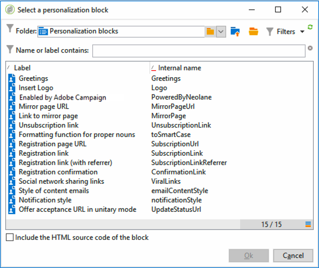

# Blocchi di personalizzazione{#personalization-blocks}

I blocchi di personalizzazione sono dinamici, personalizzati e contengono un rendering specifico che puoi inserire nelle consegne. Ad esempio, puoi aggiungere un logo, un messaggio di auguri o un collegamento a una pagina speculare. Vedi [Inserire blocchi di personalizzazione](#inserting-personalization-blocks).

[ Scopri questa funzione nel video](#personalization-blocks-video)

I blocchi di personalizzazione sono accessibili tramite il **[!UICONTROL Resources > Campaign Management > Personalization blocks]** nodo di Adobe Campaign explorer. Per impostazione predefinita sono disponibili diversi blocchi (vedi [Blocchi di personalizzazione preconfigurati](#out-of-the-box-personalization-blocks)).

Puoi definire nuovi blocchi che ti consentono di ottimizzare la personalizzazione delle consegne. Per ulteriori informazioni, consulta [Definire blocchi di personalizzazione personalizzati](#defining-custom-personalization-blocks).

>[!NOTE]
>
>I blocchi di personalizzazione sono disponibili anche dalla pagina **[!UICONTROL Digital Content Editor (DCE)]** . Per ulteriori informazioni, consulta [questa pagina](../../web/using/editing-content.md#inserting-a-personalization-block).

## Inserire blocchi di personalizzazione {#inserting-personalization-blocks}

Per inserire un blocco di personalizzazione in un messaggio, segui i passaggi seguenti:

1. Nell’editor dei contenuti della procedura guidata di consegna, fai clic sull’icona del campo personalizzato e seleziona la **[!UICONTROL Include]** menu.
1. Seleziona un blocco di personalizzazione dall’elenco (l’elenco visualizza gli ultimi 10 blocchi utilizzati) oppure fai clic sul pulsante **[!UICONTROL Other...]** per accedere all’elenco completo.

   

1. La **[!UICONTROL Other...]** consente di accedere a tutti i blocchi predefiniti e di personalizzazione personalizzata (consulta [Blocchi di personalizzazione preconfigurati](#out-of-the-box-personalization-blocks) e [Definire blocchi di personalizzazione personalizzati](#defining-custom-personalization-blocks)).

   

1. Il blocco di personalizzazione viene quindi inserito come script. Viene automaticamente adattato al profilo del destinatario quando viene generata la personalizzazione.

   

1. Fai clic sul pulsante **[!UICONTROL Preview]** e seleziona un destinatario per visualizzare la personalizzazione.

   

Puoi includere il codice sorgente di un blocco di personalizzazione nel contenuto della consegna. A questo scopo, seleziona **[!UICONTROL Include the HTML source code of the block]** quando lo selezioni.

Il codice sorgente HTML viene inserito nel contenuto della consegna. Ad esempio, il **[!UICONTROL Greetings]** il blocco di personalizzazione viene visualizzato come segue:

## Esempio di blocchi di personalizzazione {#personalization-blocks-example}

In questo esempio, creiamo un’e-mail in cui utilizziamo blocchi di personalizzazione per consentire al destinatario di visualizzare la pagina speculare, condividere la newsletter sui social network e annullare l’iscrizione alle consegne future.

A questo scopo, è necessario inserire i seguenti blocchi di personalizzazione:

* **[!UICONTROL Link to mirror page]** .
* **[!UICONTROL Social network sharing links]** .
* **[!UICONTROL Unsubscription link]** .

>[!NOTE]
>
>Per ulteriori informazioni sulla generazione della pagina speculare, consulta [Genera la pagina speculare](sending-messages.md#generating-the-mirror-page).

1. Crea una nuova consegna o apri una consegna di tipo e-mail esistente.
1. Nella procedura guidata di consegna, fai clic su **[!UICONTROL Subject]** per modificare l’oggetto del messaggio e inserire un oggetto.
1. Inserisci i blocchi di personalizzazione nel corpo del messaggio. A questo scopo, fai clic sul contenuto del messaggio, fai clic sull’icona del campo personalizzato e seleziona il **[!UICONTROL Include]** menu.
1. Selezionare il primo blocco da inserire. Rinnova la procedura per includere gli altri due blocchi.

   

1. Fai clic sul pulsante **[!UICONTROL Preview]** per visualizzare il risultato della personalizzazione. Devi selezionare un destinatario per visualizzare il messaggio del destinatario.

   

1. Conferma che il contenuto del blocco sia visualizzato correttamente.

## Blocchi di personalizzazione preconfigurati {#out-of-the-box-personalization-blocks}

Per impostazione predefinita, è disponibile un elenco di blocchi di personalizzazione per consentirti di personalizzare il contenuto del messaggio.

>[!NOTE]
>
>L’elenco dei blocchi di personalizzazione dipende dai moduli e dalle opzioni installati nell’istanza.

* **[!UICONTROL Greetings]** : inserisce i saluti con il nome del destinatario. Esempio: “Ciao John Doe,”
* **[!UICONTROL Insert logo]** : inserisce un logo predefinito definito durante la configurazione dell’istanza.
* **[!UICONTROL Powered by Adobe Campaign]** : inserisce il logo &quot;Powered by Adobe Campaign&quot; (Alimentato da).
* **[!UICONTROL Mirror page URL]** : inserisce l’URL della pagina speculare, consentendo a Progettazione consegne di controllare il collegamento.

   >[!NOTE]
   >
   >Per ulteriori informazioni sulla generazione della pagina speculare, consulta [Genera la pagina speculare](sending-messages.md#generating-the-mirror-page).

* **[!UICONTROL Link to mirror page]** : inserisce un collegamento alla pagina speculare: &quot;Se non riesci a visualizzare correttamente questo messaggio, fai clic qui&quot;.
* **[!UICONTROL Unsubscription link]** : inserisce un collegamento che consente di annullare l’iscrizione a tutte le consegne (elenco Bloccati).
* **[!UICONTROL Formatting function for proper nouns]** : genera **[!UICONTROL toSmartCase]** Funzione Javascript, che cambia in maiuscolo la prima lettera di ogni parola.
* **[!UICONTROL Registration page URL]** : inserisce un URL di abbonamento (consulta [Informazioni su servizi e abbonamenti](about-services-and-subscriptions.md)).
* **[!UICONTROL Registration link]** : inserisce un collegamento di abbonamento. che è stato definito durante la configurazione dell’istanza.
* **[!UICONTROL Registration link (with referrer)]** : inserisce un collegamento di abbonamento, che consente di identificare il visitatore e la consegna. Il collegamento è stato definito durante la configurazione dell’istanza.

   >[!NOTE]
   >
   >Questo blocco può essere utilizzato solo nelle consegne che hanno come target i visitatori.

* **[!UICONTROL Registration confirmation]** : inserisce un collegamento che consente di confermare l’abbonamento.
* **[!UICONTROL Social network sharing links]** : inserisce pulsanti che consentono al destinatario di condividere un collegamento al contenuto della pagina speculare con il client e-mail, Facebook, Twitter e LinkedIn (vedi [Marketing virale: inoltrare a un amico](viral-and-social-marketing.md#viral-marketing--forward-to-a-friend)).
* **[!UICONTROL Style of content emails]** e **[!UICONTROL Notification style]** : genera codice che formatta un’e-mail con stili di HTML predefiniti. Questi blocchi devono essere inseriti nel codice sorgente della consegna, nel **[!UICONTROL ...]** sezione **``** tag.
* **[!UICONTROL Offer acceptance URL in unitary mode]** : inserisce un URL che consente di impostare un’offerta di interazione su **[!UICONTROL Accepted]** (vedi [questa sezione](../../interaction/using/offer-analysis-report.md)).

## Definire blocchi di personalizzazione personalizzati {#defining-custom-personalization-blocks}

Puoi definire nuovi campi di personalizzazione da inserire dall’icona del campo personalizzato tramite l’ **[!UICONTROL Include...]** menu. Questi campi sono definiti nei blocchi di personalizzazione.

Per creare un blocco di personalizzazione, passa a explorer e applica i seguenti passaggi:

1. Fai clic sul pulsante **[!UICONTROL Resources > Campaign Management > Personalization blocks]** nodo.
1. Fai clic con il pulsante destro del mouse sull’elenco dei blocchi e seleziona **[!UICONTROL New]** .
1. Compila le impostazioni del blocco di personalizzazione:

   

   * Inserisci l’etichetta del blocco. Questa etichetta verrà visualizzata nella finestra di inserimento del campo di personalizzazione.
   * Seleziona **[!UICONTROL Visible in the customization menus]** per rendere questo blocco accessibile dall’icona di inserimento del campo di personalizzazione.
   * Se necessario, seleziona **[!UICONTROL The content of the personalization block depends upon the format]** definire due blocchi separati per le e-mail in formato HTML e per quelle in formato testo.

      Nella sezione inferiore di questo editor (contenuto di HTML e contenuto di testo) vengono quindi visualizzate due schede per definire il contenuto corrispondente.

      

   * Immetti il contenuto (in HTML, testo, JavaScript, ecc.) dei blocchi di personalizzazione e fai clic su **[!UICONTROL Save]**.

## Video tutorial {#personalization-blocks-video}

Scopri come creare blocchi di contenuto dinamici e come utilizzarli per personalizzare il contenuto della consegna e-mail.

>[!VIDEO](https://video.tv.adobe.com/v/24924?quality=12)

Sono disponibili ulteriori video dimostrativi su Campaign Classic [qui](https://experienceleague.adobe.com/docs/campaign-classic-learn/tutorials/overview.html?lang=it).
