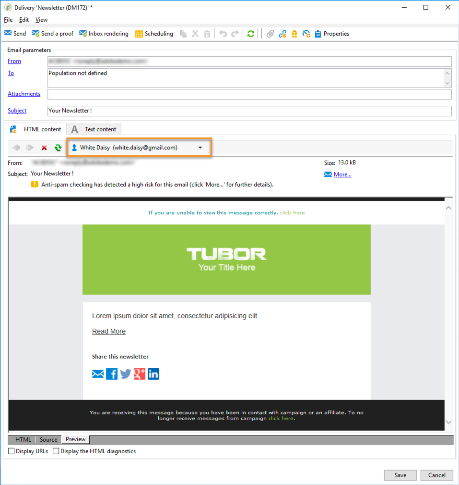

# Blocchi di personalizzazione{#personalization-blocks}

I blocchi di personalizzazione sono dinamici, personalizzati e contengono un rendering specifico che potete inserire nelle consegne. Ad esempio, potete aggiungere un logo, un messaggio di saluto o un collegamento a una pagina mirror. Consultate [Inserimento di blocchi](#inserting-personalization-blocks)di personalizzazione.

 Scopri questa funzione [nel video](#personalization-blocks-video)

I blocchi di personalizzazione sono accessibili tramite il **[!UICONTROL Resources > Campaign Management > Personalization blocks]** nodo di Adobe Campaign Explorer . Per impostazione predefinita sono disponibili diversi blocchi (consultate Blocchi [di personalizzazione](#out-of-the-box-personalization-blocks)predefiniti).

Puoi definire nuovi blocchi che ti consentiranno di ottimizzare la personalizzazione delle consegne. Per ulteriori informazioni, consulta [Definizione di blocchi](#defining-custom-personalization-blocks)personalizzati.

>[!NOTE]
>
>I blocchi di personalizzazione sono disponibili anche da **[!UICONTROL Digital Content Editor (DCE)]** . Per ulteriori informazioni, consulta [questa pagina](../../web/using/editing-content.md#inserting-a-personalization-block).

## Inserimento di blocchi di personalizzazione {#inserting-personalization-blocks}

Per inserire un blocco di personalizzazione in un messaggio, effettua le operazioni seguenti:

1. Nell’editor contenuti della procedura guidata di distribuzione, fate clic sull’icona del campo personalizzato e selezionate il **[!UICONTROL Include]** menu.
1. Selezionate un blocco di personalizzazione dall’elenco (l’elenco visualizza gli ultimi 10 blocchi utilizzati) oppure fate clic sul **[!UICONTROL Other...]** menu per accedere all’elenco completo.

   

1. Il **[!UICONTROL Other...]** menu consente di accedere a tutti i blocchi predefiniti e personalizzati di personalizzazione (consultate Blocchi [di personalizzazione](#out-of-the-box-personalization-blocks) predefiniti e [Definizione di blocchi](#defining-custom-personalization-blocks)personalizzati).

   

1. Il blocco di personalizzazione viene quindi inserito come script. Viene adattata automaticamente al profilo del destinatario quando viene generata la personalizzazione.

   

1. Fai clic sulla **[!UICONTROL Preview]** scheda e seleziona un destinatario per visualizzare la personalizzazione.

   

Puoi includere il codice sorgente di un blocco di personalizzazione nel contenuto della distribuzione. A questo scopo, selezionatelo **[!UICONTROL Include the HTML source code of the block]** al momento della selezione.


Il codice sorgente HTML viene inserito nel contenuto di consegna. Ad esempio, il blocco della **[!UICONTROL Greetings]** personalizzazione viene visualizzato come segue:


## Esempio di blocchi di personalizzazione {#personalization-blocks-example}

In questo esempio, creiamo un&#39;e-mail in cui utilizziamo blocchi di personalizzazione per consentire al destinatario di visualizzare la pagina mirror, condividere la newsletter sui social network e annullare l&#39;iscrizione alle consegne future.

A tal fine, è necessario inserire i seguenti blocchi di personalizzazione:

* **[!UICONTROL Link to mirror page]** .
* **[!UICONTROL Social network sharing links]** .
* **[!UICONTROL Unsubscription link]** .

>[!NOTE]
>
>Per ulteriori informazioni sulla generazione della pagina mirror, vedere [Generazione della pagina](../../delivery/using/sending-messages.md#generating-the-mirror-page)mirror.

1. Create una nuova consegna o aprite una consegna di tipo e-mail esistente.
1. Nella procedura guidata di consegna, fai clic **[!UICONTROL Subject]** per modificare l’oggetto del messaggio e immettere un oggetto.
1. Inserisci i blocchi di personalizzazione nel corpo del messaggio. A tal fine, fai clic sul contenuto del messaggio, fai clic sull&#39;icona del campo personalizzato e seleziona il **[!UICONTROL Include]** menu.
1. Selezionare il primo blocco da inserire. Rinnovare la procedura per includere gli altri due blocchi.

   

1. Fate clic sulla **[!UICONTROL Preview]** scheda per visualizzare il risultato della personalizzazione. È necessario selezionare un destinatario per visualizzare il messaggio del destinatario.

   

1. Verificare che il contenuto del blocco sia visualizzato correttamente.

## Blocchi di personalizzazione standard {#out-of-the-box-personalization-blocks}

Per impostazione predefinita è disponibile un elenco di blocchi di personalizzazione per personalizzare il contenuto del messaggio.

>[!NOTE]
>
>L’elenco dei blocchi di personalizzazione dipende dai moduli e dalle opzioni installati nell’istanza.


* **[!UICONTROL Greetings]** : inserisce i saluti con il nome del destinatario. Esempio: &quot;Ciao John Doe,&quot;
* **[!UICONTROL Insert logo]** : inserisce un logo out-of-the-box definito durante la configurazione dell’istanza.
* **[!UICONTROL Powered by Adobe Campaign]** : inserisce il logo &quot;Powered by  Adobe Campaign&quot;.
* **[!UICONTROL Mirror page URL]** : inserisce l&#39;URL della pagina speculare, consentendo agli sviluppatori di distribuzione di controllare il collegamento.

   >[!NOTE]
   >
   >Per ulteriori informazioni sulla generazione della pagina mirror, vedere [Generazione della pagina](../../delivery/using/sending-messages.md#generating-the-mirror-page)mirror.

* **[!UICONTROL Link to mirror page]** : inserisce un collegamento alla pagina mirror: &quot;Se non riesci a visualizzare correttamente questo messaggio, fai clic qui&quot;.
* **[!UICONTROL Unsubscription link]** : inserisce un collegamento che consente di annullare l&#39;iscrizione a tutte le consegne ( elenco Bloccati).
* **[!UICONTROL Formatting function for proper nouns]** : genera la funzione **[!UICONTROL toSmartCase]** Javascript, che modifica la prima lettera di ogni parola in maiuscolo. Questo blocco deve essere inserito nel codice sorgente del recapito, nei **`<script>...</script>`** tag.

   Nell&#39;esempio seguente, la funzione viene utilizzata per sostituire l&#39;elemento &quot;Intestazione personale&quot; con &quot;Nuova intestazione&quot; con lettere maiuscole a ogni parola:

   ```
   <h1 id="sample">My header</h1>
   <script><%@ include view='toSmartCase'%>;
   document.getElementById("sample").innerHTML = toSmartCase("My new header");
   </script>
   ```

   

* **[!UICONTROL Registration page URL]** : inserisce un URL di iscrizione (consultate [Informazioni su servizi e iscrizioni](../../delivery/using/about-services-and-subscriptions.md)).
* **[!UICONTROL Registration link]** : inserisce un collegamento di iscrizione. che è stato definito durante la configurazione dell&#39;istanza.
* **[!UICONTROL Registration link (with referrer)]** : inserisce un collegamento di iscrizione che consente di identificare il visitatore e la consegna. Il collegamento è stato definito durante la configurazione dell&#39;istanza.

   >[!NOTE]
   >
   >Questo blocco può essere utilizzato solo per i visitatori di destinazione delle consegne.

* **[!UICONTROL Registration confirmation]** : inserisce un collegamento che consente di confermare l’iscrizione.
* **[!UICONTROL Social network sharing links]** : inserisce pulsanti che consentono al destinatario di condividere un collegamento al contenuto della pagina mirror con il client e-mail, Facebook, Twitter, Google + e LinkedIn (consultate [Viral marketing: inoltrare a un amico](../../delivery/using/viral-and-social-marketing.md#viral-marketing--forward-to-a-friend)).
* **[!UICONTROL Style of content emails]** e **[!UICONTROL Notification style]** : generate codice che formatta un&#39;e-mail con stili HTML predefiniti. Questi blocchi devono essere inseriti nel codice sorgente della consegna, nella **[!UICONTROL ...]** sezione, nei **`<style>...</style>`** tag.
* **[!UICONTROL Offer acceptance URL in unitary mode]** : inserisce un URL che consente di impostare un&#39;offerta di interazione su **[!UICONTROL Accepted]** (consultate [questa sezione](../../interaction/using/offer-analysis-report.md)).

## Definizione di blocchi personalizzati {#defining-custom-personalization-blocks}

Puoi definire nuovi campi di personalizzazione da inserire dall’icona del campo personalizzato tramite il **[!UICONTROL Include...]** menu. Questi campi sono definiti in blocchi di personalizzazione.

Per creare un blocco di personalizzazione, accedete a Esplora risorse e eseguite i seguenti passaggi:

1. Fare clic sul **[!UICONTROL Resources > Campaign Management > Personalization blocks]** nodo.
1. Fare clic con il pulsante destro del mouse sull&#39;elenco dei blocchi e selezionare **[!UICONTROL New]** .
1. Compila le impostazioni del blocco di personalizzazione:

   

   * Immettere l&#39;etichetta del blocco. Questa etichetta verrà visualizzata nella finestra di inserimento del campo di personalizzazione.
   * Selezionate questa opzione **[!UICONTROL Visible in the customization menus]** per rendere accessibile il blocco dall’icona di inserimento del campo di personalizzazione.
   * Se necessario, selezionate **[!UICONTROL The content of the personalization block depends upon the format]** per definire due blocchi separati per le e-mail in formato HTML e per quelle in formato testo.

      Nella sezione inferiore di questo editor (contenuto HTML e contenuto di testo) vengono quindi visualizzate due schede per definire il contenuto corrispondente.

      

   * Immettete il contenuto (in HTML, testo, JavaScript, ecc.) dei blocchi di personalizzazione e fai clic su **[!UICONTROL Save]**.

## Personalizzare le e-mail utilizzando blocchi di contenuto dinamici {#personalization-blocks-video}

Scoprite come creare blocchi di contenuto dinamici e come utilizzarli per personalizzare il contenuto della distribuzione delle e-mail.

>[!VIDEO](https://video.tv.adobe.com/v/24924?quality=12)
