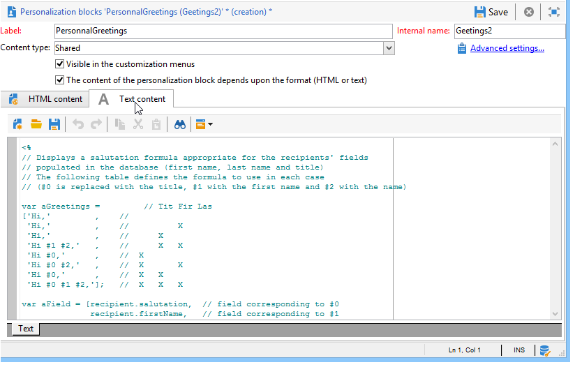

# Blocchi di personalizzazione{#personalization-blocks}

I blocchi di personalizzazione sono dinamici, personalizzati e contengono un rendering specifico che puoi inserire nelle consegne. Ad esempio, puoi aggiungere un logo, un messaggio di saluto o un collegamento a una pagina speculare. Consulta [Inserire blocchi di personalizzazione](#inserting-personalization-blocks).

 Scopri questa funzione [nel video](#personalization-blocks-video)

I blocchi di personalizzazione sono accessibili tramite il nodo **[!UICONTROL Resources > Campaign Management > Personalization blocks]** di Adobe Campaign Explorer. Per impostazione predefinita sono disponibili diversi blocchi (vedi [Blocchi di personalizzazione predefiniti](#out-of-the-box-personalization-blocks)).

Puoi definire nuovi blocchi per ottimizzare la personalizzazione delle consegne. Per ulteriori informazioni, consulta [Definire blocchi di personalizzazione personalizzati](#defining-custom-personalization-blocks).

>[!NOTE]
>
>I blocchi di personalizzazione sono disponibili anche da **[!UICONTROL Digital Content Editor (DCE)]**. Per ulteriori informazioni, consulta [questa pagina](../../web/using/editing-content.md#inserting-a-personalization-block).

## Inserire blocchi di personalizzazione {#inserting-personalization-blocks}

Per inserire un blocco di personalizzazione in un messaggio, effettua le seguenti operazioni:

1. Nell&#39;editor dei contenuti dell&#39;assistente alla consegna, fai clic sull&#39;icona del campo personalizzato e seleziona il menu **[!UICONTROL Include]**.
1. Selezionare un blocco di personalizzazione dall&#39;elenco (nell&#39;elenco vengono visualizzati gli ultimi 10 blocchi utilizzati) oppure fare clic sul menu **[!UICONTROL Other...]** per accedere all&#39;elenco completo.

   

1. Il menu **[!UICONTROL Other...]** consente di accedere a tutti i blocchi di personalizzazione predefiniti e personalizzati (vedi [Blocchi di personalizzazione predefiniti](#out-of-the-box-personalization-blocks) e [Definisci blocchi di personalizzazione personalizzati](#defining-custom-personalization-blocks)).

   

1. Il blocco di personalizzazione viene quindi inserito come script. Viene adattato automaticamente al profilo del destinatario quando viene generata la personalizzazione.

   

1. Fare clic sulla scheda **[!UICONTROL Preview]** e selezionare un destinatario per visualizzare la personalizzazione.

   

Puoi includere il codice sorgente di un blocco di personalizzazione nel contenuto della consegna. Per eseguire questa operazione, selezionare **[!UICONTROL Include the HTML source code of the block]** durante la selezione.

Il codice sorgente HTML viene inserito nel contenuto della consegna. Ad esempio, il blocco di personalizzazione **[!UICONTROL Greetings]** viene visualizzato come segue:

## Esempio di blocchi di personalizzazione {#personalization-blocks-example}

In questo esempio, creiamo un’e-mail in cui utilizziamo blocchi di personalizzazione per consentire al destinatario di visualizzare la pagina speculare, condividere la newsletter sui social network e annullare l’abbonamento a consegne future.

A questo scopo, è necessario inserire i seguenti blocchi di personalizzazione:

* **[!UICONTROL Link to mirror page]**.
* **[!UICONTROL Social network sharing links]**.
* **[!UICONTROL Unsubscription link]**.

>[!NOTE]
>
>Per ulteriori informazioni sulla generazione della pagina mirror, fare riferimento a [Generare la pagina mirror](sending-messages.md#generating-the-mirror-page).

1. Crea una nuova consegna o apri una consegna di tipo e-mail esistente.
1. Nell&#39;assistente alla consegna, fare clic su **[!UICONTROL Subject]** per modificare l&#39;oggetto del messaggio e immettere un oggetto.
1. Inserisci i blocchi di personalizzazione nel corpo del messaggio. A questo scopo, fai clic sul contenuto del messaggio, fai clic sull&#39;icona del campo personalizzato e seleziona il menu **[!UICONTROL Include]**.
1. Selezionare il primo blocco da inserire. Rinnovare la procedura per includere gli altri due blocchi.

   

1. Fare clic sulla scheda **[!UICONTROL Preview]** per visualizzare il risultato della personalizzazione. È necessario selezionare un destinatario per visualizzarne il messaggio.

   

1. Verifica che il contenuto del blocco sia visualizzato correttamente.

## Blocchi di personalizzazione predefiniti {#out-of-the-box-personalization-blocks}

Per impostazione predefinita, è disponibile un elenco di blocchi di personalizzazione che consentono di personalizzare il contenuto del messaggio.

>[!NOTE]
>
>L’elenco dei blocchi di personalizzazione dipende dai moduli e dalle opzioni installati nell’istanza.

* **[!UICONTROL Greetings]** : inserisce i saluti con il nome del destinatario. Esempio: “Ciao John Doe,” 
* **[!UICONTROL Insert logo]** : inserisce un logo predefinito definito durante la configurazione dell&#39;istanza.
* **[!UICONTROL Powered by Adobe Campaign]** : inserisce il logo &quot;Powered by Adobe Campaign&quot;.
* **[!UICONTROL Mirror page URL]** : inserisce l&#39;URL della pagina speculare, consentendo ai designer della consegna di controllare il collegamento.

  >[!NOTE]
  >
  >Per ulteriori informazioni sulla generazione della pagina mirror, fare riferimento a [Generare la pagina mirror](sending-messages.md#generating-the-mirror-page).

* **[!UICONTROL Link to mirror page]** : inserisce un collegamento alla pagina speculare: &quot;Se non riesci a visualizzare correttamente questo messaggio, fai clic qui&quot;.
* **[!UICONTROL Unsubscription link]** : inserisce un collegamento che consente di annullare l&#39;abbonamento a tutte le consegne (inserisco nell&#39;elenco Bloccati di).
* **[!UICONTROL Formatting function for proper nouns]** : genera la funzione JavaScript **[!UICONTROL toSmartCase]**, che modifica la prima lettera di ogni parola in maiuscolo.
* **[!UICONTROL Registration page URL]** : inserisce un URL di abbonamento (vedere [Informazioni su servizi e abbonamenti](about-services-and-subscriptions.md)).
* **[!UICONTROL Registration link]** : inserisce un collegamento di sottoscrizione. che è stato definito durante la configurazione dell’istanza.
* **[!UICONTROL Registration link (with referrer)]** : inserisce un collegamento di abbonamento che consente di identificare il visitatore e la consegna. Il collegamento è stato definito durante la configurazione dell’istanza.

  >[!NOTE]
  >
  >Questo blocco può essere utilizzato nelle consegne indirizzate solo ai visitatori.

* **[!UICONTROL Registration confirmation]** : inserisce un collegamento che consente di confermare la sottoscrizione.
* **[!UICONTROL Social network sharing links]** : inserisce pulsanti che consentono al destinatario di condividere un collegamento al contenuto della pagina speculare con il client di posta elettronica, Facebook, X (precedentemente noto come Twitter) e LinkedIn (vedere [Marketing virale: inoltro a un amico](viral-and-social-marketing.md#viral-marketing--forward-to-a-friend)).
* **[!UICONTROL Style of content emails]** e **[!UICONTROL Notification style]** : genera codice che formatta un messaggio e-mail con stili HTML predefiniti. Questi blocchi devono essere inseriti nel codice sorgente della consegna, nella sezione **[!UICONTROL ...]**, in **``** tag.
* **[!UICONTROL Offer acceptance URL in unitary mode]** : inserisce un URL che consente di impostare un&#39;offerta di interazione su **[!UICONTROL Accepted]** (vedere [questa sezione](../../interaction/using/offer-analysis-report.md)).

## Definire i blocchi di personalizzazione personalizzati {#defining-custom-personalization-blocks}

Puoi definire nuovi campi di personalizzazione da inserire dall&#39;icona del campo personalizzato tramite il menu **[!UICONTROL Include...]**. Questi campi sono definiti in blocchi di personalizzazione.

Per creare un blocco di personalizzazione, passa a Esplora e applica i seguenti passaggi:

1. Fare clic sul nodo **[!UICONTROL Resources > Campaign Management > Personalization blocks]**.
1. Fare clic con il pulsante destro del mouse sull&#39;elenco dei blocchi e selezionare **[!UICONTROL New]**.
1. Compila le impostazioni del blocco di personalizzazione:

   

   * Inserisci l’etichetta del blocco. Questa etichetta verrà visualizzata nella finestra di inserimento del campo di personalizzazione.
   * Seleziona **[!UICONTROL Visible in the customization menus]** per rendere accessibile questo blocco dall&#39;icona di inserimento del campo di personalizzazione.
   * Se necessario, selezionare **[!UICONTROL The content of the personalization block depends upon the format]** per definire due blocchi separati per le e-mail in formato HTML e quelli in formato testo.

     Nella sezione inferiore di questo editor (Contenuto HTML e Contenuto testo) vengono quindi visualizzate due schede per definire il contenuto corrispondente.

     

   * Immetti il contenuto (in HTML, testo, JavaScript, ecc.) dei blocchi di personalizzazione e fai clic su **[!UICONTROL Save]**.

## Video tutorial {#personalization-blocks-video}

Scopri come creare blocchi di contenuto dinamici e come utilizzarli per personalizzare il contenuto della consegna e-mail.

>[!VIDEO](https://video.tv.adobe.com/v/340471?quality=12&captions=ita)

Ulteriori video dimostrativi di Campaign Classic sono disponibili [qui](https://experienceleague.adobe.com/docs/campaign-classic-learn/tutorials/overview.html?lang=it).
