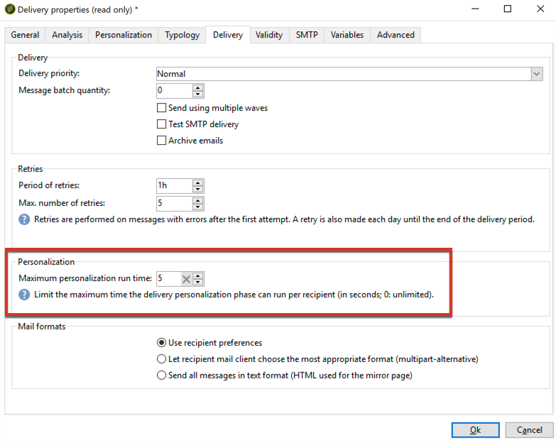
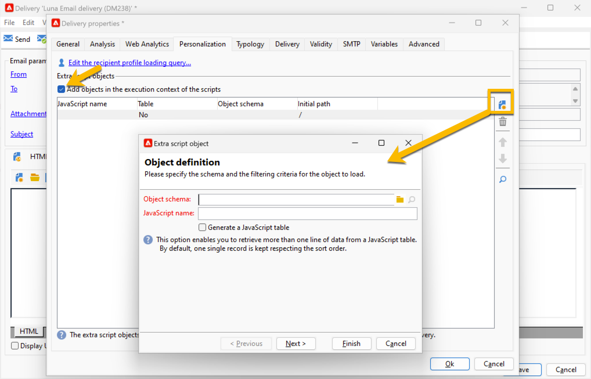
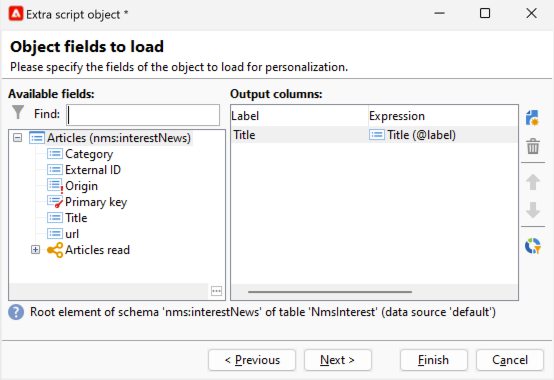

# Campi di personalizzazione{#personalization-fields}

I campi di personalizzazione sono utilizzati per la personalizzazione di primo livello del contenuto dei messaggi inviati. I campi inseriti in un contenuto principale mostrano la posizione in cui inserire i dati dall’origine dati selezionata.

Ad esempio, il campo di personalizzazione con sintassi **&lt;%= recipient.LastName %>** indica ad Adobe Campaign di inserire il nome del destinatario nel database (tabella dei destinatari).

 [Guarda il video su questa funzione](#personalization-fields-video)

>[!CAUTION]
>
>Il contenuto dei campi di personalizzazione non può superare i 1024 caratteri.

## Origini dati {#data-sources}

I campi di personalizzazione possono provenire da due tipi di origine dati, a seconda della modalità di consegna selezionata:

* Il database di Adobe Campaign è l’origine dei dati. Questo è il caso più comune, ad esempio con &quot;campi di personalizzazione dei destinatari&quot;. Questi sono tutti i campi definiti nella tabella dei destinatari, siano essi campi standard (in genere: cognome, nome, indirizzo, città, data di nascita, ecc.) o campi definiti dall’utente.
* L&#39;origine dati è un file esterno. Questi sono tutti i campi definiti nelle colonne del file presentato come input durante una consegna utilizzando i dati trovati in un file esterno.

>[!NOTE]
>
>Un tag di personalizzazione Adobe Campaign ha sempre il seguente formato: **&lt;%=table.field%>**.

## Inserimento di un campo di personalizzazione {#inserting-a-personalization-field}

Per inserire campi di personalizzazione, fai clic sull’icona a discesa accessibile da qualsiasi campo di modifica di intestazione, oggetto o corpo del messaggio.

Dopo la selezione di un’origine dati (campi destinatario o campo file), questo inserimento assume la forma di un comando che verrà interpretato da Adobe Campaign e sostituito dal valore del campo per un determinato destinatario. Il sostituto fisico può quindi essere visualizzato nella scheda **[!UICONTROL Preview]**.

## Esempio di campi di personalizzazione {#personalization-fields-example}

Creiamo un’e-mail in cui inseriremo prima il nome del destinatario e quindi aggiungeremo la data di creazione del profilo nel corpo del messaggio. Per eseguire questa operazione:

1. Crea una nuova consegna o apri una consegna di tipo e-mail esistente.
1. Nell&#39;assistente alla consegna, fare clic su **[!UICONTROL Subject]** per modificare l&#39;oggetto del messaggio e immettere un oggetto.
1. Immetti &quot; **[!UICONTROL Special offer for]**&quot; e utilizza il pulsante nella barra degli strumenti per inserire un campo di personalizzazione. Seleziona **[!UICONTROL Recipients>Title]**.

   

1. Ripetere l&#39;operazione per inserire il nome del destinatario. Inserisci spazi tra tutti i campi di personalizzazione.
1. Fai clic su **[!UICONTROL OK]** per confermare.
1. Inserisci la personalizzazione nel corpo del messaggio. A questo scopo, fai clic sul contenuto del messaggio e fai clic sul pulsante di inserimento del campo.
1. Seleziona **[!UICONTROL Recipient>Other...]**.

   

1. Selezionare il campo con le informazioni da visualizzare e fare clic su **[!UICONTROL OK]**.

   

1. Fare clic sulla scheda **[!UICONTROL Preview]** per visualizzare il risultato della personalizzazione. È necessario selezionare un destinatario per visualizzarne il messaggio.

   

   >[!NOTE]
   >
   >Quando una consegna fa parte di un flusso di lavoro, puoi utilizzare i dati della tabella del flusso di lavoro temporaneo. Questi dati sono raggruppati nel menu **[!UICONTROL Target extension]**. Per ulteriori informazioni al riguardo, consulta [questa sezione](../../workflow/using/data-life-cycle.md#target-data).

## Ottimizzazione della personalizzazione {#optimizing-personalization}

Puoi ottimizzare la personalizzazione utilizzando un&#39;opzione dedicata: **[!UICONTROL Prepare the personalization data with a workflow]**, disponibile nella scheda **[!UICONTROL Analysis]** delle proprietà di consegna. Per ulteriori informazioni sull&#39;analisi della consegna, consulta [questa sezione](steps-validating-the-delivery.md#analyzing-the-delivery).

Durante l’analisi della consegna, questa opzione crea ed esegue automaticamente un flusso di lavoro che memorizza tutti i dati collegati al target in una tabella temporanea, inclusi i dati di tabelle collegate in FDA.

Selezionando questa opzione è possibile migliorare notevolmente le prestazioni dell’analisi della consegna quando molti dati vengono elaborati, soprattutto se i dati di personalizzazione provengono da una tabella esterna tramite FDA. Per ulteriori informazioni, vedere [Accesso a un database esterno (FDA)](../../installation/using/about-fda.md).

Ad esempio, se riscontri problemi di prestazioni durante la consegna a un numero elevato di destinatari mentre utilizzi molti campi di personalizzazione e/o blocchi di personalizzazione nel contenuto dei messaggi, questa opzione può accelerare la gestione della personalizzazione e quindi la consegna dei messaggi.

Per utilizzare questa opzione, effettua le seguenti operazioni:

1. Creare una campagna. Per ulteriori informazioni, consulta la [documentazione di Campaign v8](https://experienceleague.adobe.com/docs/campaign/automation/campaign-orchestration/set-up-campaigns.html?lang=it){target=_blank}.
1. Nella scheda **[!UICONTROL Targeting and workflows]** della campagna, aggiungi un&#39;attività **Query** al flusso di lavoro. Per ulteriori informazioni sull&#39;utilizzo di questa attività, consulta [questa sezione](../../workflow/using/query.md).
1. Aggiungere un&#39;attività **[!UICONTROL Email delivery]** al flusso di lavoro e aprirla. Per ulteriori informazioni sull&#39;utilizzo di questa attività, consulta [questa sezione](../../workflow/using/delivery.md).
1. Passare alla scheda **[!UICONTROL Analysis]** di **[!UICONTROL Delivery properties]** e selezionare l&#39;opzione **[!UICONTROL Prepare the personalization data with a workflow]**.

   

1. Configura la consegna e avvia il flusso di lavoro per avviare l’analisi.

Al termine dell’analisi, i dati di personalizzazione vengono memorizzati in una tabella temporanea tramite un flusso di lavoro tecnico temporaneo creato al volo durante l’analisi.

Questo flusso di lavoro non è visibile nell’interfaccia di Adobe Campaign. Deve solo essere un mezzo tecnico per archiviare e gestire rapidamente i dati di personalizzazione.

Al termine dell&#39;analisi, passare al flusso di lavoro **[!UICONTROL Properties]** e selezionare la scheda **[!UICONTROL Variables]**. Qui è possibile visualizzare il nome della tabella temporanea che è possibile utilizzare per effettuare una chiamata SQL per visualizzare gli ID in essa contenuti.

## Timeout della fase di personalizzazione {#timing-out-personalization}

Per migliorare la protezione della consegna, puoi impostare un periodo di timeout per la fase di personalizzazione.

Nella scheda **[!UICONTROL Delivery]** di **[!UICONTROL Delivery properties]**, selezionare un valore massimo in secondi per l&#39;opzione **[!UICONTROL Maximum personalization run time]**.

Durante l’anteprima o l’invio, se la fase di personalizzazione supera il tempo massimo impostato in questo campo, il processo viene interrotto con un messaggio di errore e la consegna non riesce.

Il valore predefinito è 5 secondi.

Se imposti questa opzione su 0, non ci sarà alcun limite di tempo per la fase di personalizzazione.

## Scheda Personalization {#personalization-tab}

Nelle Proprietà di consegna, hai una scheda Personalization.

È possibile aggiungere dati alla query del profilo della dimensione di targeting facendo clic su **&quot;Modifica la query di caricamento del profilo del destinatario&quot;**. Puoi utilizzare i dati estratti direttamente all’interno di un’espressione per estrarre ciò di cui hai realmente bisogno. Tali dati verranno aggiunti al contesto.

{zoomable="yes"}

Se i dati che si desidera aggiungere non si trovano nella dimensione di targeting, è possibile fare clic su **&quot;Aggiungere oggetti nel contesto di esecuzione degli script&quot;**.

{zoomable="yes"}

Puoi selezionare lì lo schema di oggetti necessario, quindi utilizzare tali dati all’interno del codice JavaScript, che verrà eseguito durante la preparazione della consegna.

{zoomable="yes"}

Aggiungendo lo schema di oggetti, è possibile selezionare i campi che si desidera aggiungere al contesto:

{zoomable="yes"}

## Video tutorial {#personalization-fields-video}

Scopri come aggiungere un campo di personalizzazione alla riga dell’oggetto e il contenuto di una consegna e-mail.

>[!VIDEO](https://video.tv.adobe.com/v/24925?quality=12)

Ulteriori video dimostrativi di Campaign Classic sono disponibili [qui](https://experienceleague.adobe.com/docs/campaign-classic-learn/tutorials/overview.html?lang=it).
